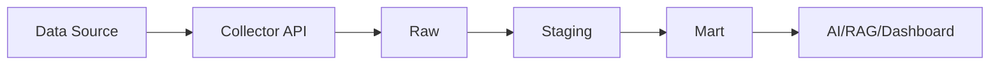

> 대상: 수업자료, README, 실습 기록을 작성해야 하는 초보 주니어  
> 목적: GitHub와 Obsidian에서 읽기 좋은 Markdown 문서를 작성할 수 있게 한다.

---

## 1. Markdown이란?

Markdown은 문서를 쉽게 작성하기 위한 가벼운 문법이다.

이 과정에서는 다음 자료를 Markdown으로 작성한다.
```text
README.md
수업 노트
프로젝트 개요
데이터 소스 맵
데이터 계약 문서
시스템 경계 문서
Git 브랜치 전략 문서
실습 회고
```

Markdown 파일의 확장자는 보통 `.md`이다.
```text
README.md
data-source-map.md
domain-event-map.md
data-contract.md
```

---

## 2. 제목 작성

제목은 `#`으로 작성한다.

```markdown
# 1단계. AI 서비스와 데이터 플랫폼 아키텍처
## 1.1 수업 목표
### 1.1.1 핵심 질문
```

화면에서는 다음처럼 보인다.

# 1단계. AI 서비스와 데이터 플랫폼 아키텍처
## 1.1 수업 목표
### 1.1.1 핵심 질문

규칙:
```text
# 은 문서의 큰 제목
## 은 중간 제목
### 은 작은 제목
제목 단계는 너무 많이 깊어지지 않게 한다.
```

---

## 3. 문단 작성

그냥 글을 쓰면 문단이 된다.
```markdown
이 문서는 AI 네이티브 데이터 플랫폼 엔지니어 과정의 수업자료입니다.

이 과정에서는 데이터 수집, 저장, 검증, AI/RAG 연결, 피드백 운영을 학습합니다.
```

문단을 나누려면 한 줄을 비운다.

---

## 4. 줄바꿈

Markdown에서는 줄 끝에서 Enter 한 번만 치면 화면에서 줄바꿈이 안 될 수 있다.  
확실하게 문단을 나누려면 한 줄을 비운다.
```markdown
첫 번째 문장입니다.

두 번째 문장입니다.
```

---

## 5. 강조

굵게:
```markdown
**중요한 내용**
```

결과:

**중요한 내용**

기울임:
```markdown
*강조 내용*
```

결과:

*강조 내용*

취소선:
```markdown
~~삭제된 내용~~
```

결과:

~~삭제된 내용~~

---

## 6. 목록

순서 없는 목록:
```markdown
- 데이터 수집
- 데이터 저장
- 데이터 검증
- AI 추론
```

결과:

- 데이터 수집
- 데이터 저장
- 데이터 검증
- AI 추론

순서 있는 목록:
```markdown
1. 프로젝트 목적 정의
2. 데이터 소스 정리
3. 이벤트 후보 작성
4. 데이터 흐름도 작성
```

결과:

1. 프로젝트 목적 정의
2. 데이터 소스 정리
3. 이벤트 후보 작성
4. 데이터 흐름도 작성

---

## 7. 체크리스트
```markdown
- [ ] Git 설치 확인
- [ ] GitHub 계정 준비
- [ ] WSL2 실행 확인
- [ ] VSCode 연결 확인
- [x] Obsidian 설치
```

결과:

- [ ] Git 설치 확인
- [ ] GitHub 계정 준비
- [ ] WSL2 실행 확인
- [ ] VSCode 연결 확인
- [x] Obsidian 설치

수업 과제 완료 여부를 표시할 때 유용하다.

---

## 8. 코드 한 줄 표시

문장 안에서 명령어, 파일명, 변수명을 강조할 때는 백틱을 사용한다.
```markdown
`git status` 명령어로 현재 상태를 확인한다.
```

결과:

`git status` 명령어로 현재 상태를 확인한다.

예시:
```markdown
`README.md`
`data_lake/raw/`
`gas_sensor_measured`
`python manage.py runserver`
```

---

## 9. 코드 블록

여러 줄 코드는 백틱 3개로 감싼다.
````markdown
```bash
git status
git add .
git commit -m "Add README"
git push
```
````

결과:
```bash
git status
git add .
git commit -m "Add README"
git push
```

Python 코드:
````markdown
```python
def hello():
    print("Hello Markdown")
```
````

JSON 코드:
````markdown
```json
{
  "event_type": "gas_sensor_measured",
  "schema_version": "1.0.0"
}
```
````

---

## 10. 인용문

인용문은 `>`를 사용한다.
```markdown
> AI는 모델만으로 움직이지 않는다.
> AI를 움직이게 하는 것은 신뢰 가능한 데이터 흐름이다.
```

결과:

> AI는 모델만으로 움직이지 않는다.
> AI를 움직이게 하는 것은 신뢰 가능한 데이터 흐름이다.

---

## 11. 구분선

문서를 구분할 때 `---`를 사용한다.
```markdown
---
```

결과:

---

## 12. 링크

일반 링크:
```markdown
[GitHub](https://github.com)
```

결과:

[GitHub](https://github.com)

README에서 자주 사용한다.

---

## 13. 이미지

Markdown 이미지 문법:
```markdown

```

Obsidian에서는 다음 형식도 자주 사용한다.
```markdown
![[data-flow.png]]
```

수업자료를 GitHub에서도 볼 계획이라면 일반 Markdown 이미지 문법을 권장한다.
```markdown

```

---

## 14. 표

표는 데이터를 정리할 때 많이 사용한다.

```markdown
| 구분 | 설명 | 예시 |
|---|---|---|
| Raw | 원본 데이터 | raw_gas_events |
| Staging | 검증된 데이터 | stg_gas_measurements |
| Mart | 목적별 데이터 | mart_alarm_summary |
```

결과:

| 구분 | 설명 | 예시 |
|---|---|---|
| Raw | 원본 데이터 | raw_gas_events |
| Staging | 검증된 데이터 | stg_gas_measurements |
| Mart | 목적별 데이터 | mart_alarm_summary |

표 작성 팁:
```text
열이 너무 많으면 읽기 어렵다.
초보자 자료에서는 3~4열 정도가 적당하다.
긴 문장은 표 밖에서 설명하는 것이 좋다.
```

---

## 15. Obsidian 내부 링크

Obsidian에서는 문서끼리 연결할 때 다음 문법을 사용한다.
```markdown
[[문서명]]
```

예시:
```markdown
[[1단계. AI 서비스와 데이터 플랫폼 아키텍처]]
[[데이터 계약]]
[[Raw Staging Mart]]
```

특정 제목으로 이동하고 싶을 때:
```markdown
[[문서명#제목]]
```

예시:
```markdown
[[1단계. AI 서비스와 데이터 플랫폼 아키텍처#1.3 핵심 질문]]
```

---

## 16. GitHub와 Obsidian 링크 차이

| 구분 | Obsidian | GitHub |
|---|---|---|
| 내부 링크 | `[[문서명]]` | 일부는 제대로 동작하지 않을 수 있음 |
| 이미지 | `![[image.png]]` | 깨질 수 있음 |
| 일반 Markdown 링크 | `[텍스트](경로)` | 잘 동작 |
| 추천 용도 | 개인 노트, 수업자료 연결 | README, 제출용 문서 |

둘 다 사용해야 한다면 다음 기준을 권장한다.
```text
Obsidian 전용 수업 노트 → [[문서명]]
GitHub 제출용 README/docs → [문서명](파일경로.md)
```

---

## 17. Mermaid 다이어그램 기본

Mermaid는 Markdown 안에서 다이어그램을 그리는 문법이다.
````markdown

````

수업에서는 다음을 표현할 때 사용한다.
```text
데이터 흐름
시스템 아키텍처
Airflow DAG 흐름
Kafka 이벤트 흐름
RAG 파이프라인
```

---

## 18. 좋은 Markdown 문서 구조

추천 구조:
```markdown
# 문서 제목

## 1. 목적

## 2. 핵심 개념

## 3. 실습 순서

## 4. 산출물

## 5. 체크리스트

## 6. 한 문장 정리
```

수업자료에서는 다음처럼 작성하면 좋다.
```markdown
# 데이터 소스 맵

## 1. 목적

이 문서는 프로젝트에서 발생하는 데이터 소스를 정리한다.

## 2. 데이터 소스 목록

| 데이터 소스 | 발생 데이터 | 사용 목적 |
|---|---|---|

## 3. 완료 기준

- [ ] 데이터 소스 5개 이상 정리
- [ ] 각 데이터의 사용 목적 작성
```

---

## 19. README.md 기본 구성

프로젝트 README는 다음 정도만 있어도 충분하다.
```markdown
# 프로젝트명

## 1. 프로젝트 소개

## 2. 실행 방법

## 3. 폴더 구조

## 4. 주요 기능

## 5. 사용 기술

## 6. 수업 산출물

## 7. 참고 문서
```

주니어 README에서 가장 중요한 것은 다음이다.
```text
이 프로젝트가 무엇인지
어떻게 실행하는지
어떤 폴더에 무엇이 있는지
```

---

## 20. 자주 하는 실수

### 20.1 제목 기호 뒤에 공백을 안 넣음

나쁜 예:
```markdown
#제목
```

좋은 예:
```markdown
# 제목
```

---

### 20.2 코드 블록을 닫지 않음

나쁜 예:
````markdown
```bash
git status
````

좋은 예:
````markdown
```bash
git status
```
````

---

### 20.3 표 정렬이 깨짐

표는 열 개수가 맞아야 한다.

좋은 예:
```markdown
| 구분 | 설명 |
|---|---|
| Raw | 원본 데이터 |
| Mart | 목적별 데이터 |
```

---

### 20.4 파일명에 공백과 특수문자를 많이 사용함

권장:
```text
data-source-map.md
domain-event-map.md
data-contract.md
```

비권장:
```text
데이터 소스 맵 최종 진짜.md
data source map!!.md
```

---

## 21. 수업 시작 전 최소 체크리스트

```text
.md 파일이 무엇인지 안다.
# 으로 제목을 쓸 수 있다.
- 로 목록을 쓸 수 있다.
``` 코드 블록을 쓸 수 있다.
`명령어`를 문장 안에 표시할 수 있다.
표를 작성할 수 있다.
README.md 기본 구조를 안다.
Obsidian 내부 링크를 사용할 수 있다.
GitHub용 링크와 Obsidian 링크 차이를 안다.
Mermaid 코드 블록이 무엇인지 안다.
```

---

## 22. 한 문장 정리

```text
Markdown은 수업 노트, README, 설계 문서, 체크리스트, 데이터 흐름도를 가볍게 작성하고 GitHub와 Obsidian에서 관리하기 위한 기본 문서 문법이다.
```
