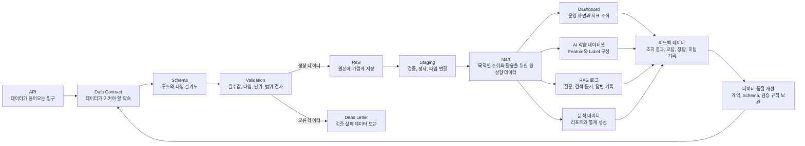

##### 8 데이터 계약: 데이터 계약은 어떤 데이터가 어떤 구조로 들어와야 하는지 정하는 약속이다.

데이터 계약은 영어로 **Data Contract**라고 부른다.  
쉽게 말하면 다음과 같다.
```text
데이터를 보내는 쪽과 데이터를 받는 쪽이 미리 정해두는 데이터 약속
```

예를 들어 센서 장비가 우리 플랫폼으로 가스 측정값을 보낸다고 생각해보자.  
센서 장비는 데이터를 보내는 쪽이고, Collector API와 데이터 파이프라인은 데이터를 받는 쪽이다.

이때 다음과 같은 약속이 없다면 데이터 파이프라인은 안정적으로 동작하기 어렵다.
```text
가스값 필드 이름은 gas_value인가, value인가?
가스 종류는 gas_type인가, gas_name인가?
단위는 ppm인가, %인가?
측정 시각은 timestamp인가, event_time인가?
센서 ID는 반드시 있어야 하는가?
위험도 값은 normal, warning, danger 중 하나인가?
schema_version이 바뀌면 기존 데이터는 어떻게 처리할 것인가?
```

따라서 데이터 계약은 단순한 문서가 아니라, 이후 API, Schema, Raw 저장, Staging 검증, Mart 생성, AI 학습 데이터셋, RAG 로그, 피드백 데이터까지 연결되는 **데이터 설계의 기준선**이다.

용어설명:
```
API = 외부 또는 내부 시스템이 데이터를 주고받는 입구
Data Contract = API로 들어오는 데이터가 지켜야 할 구조, 타입, 단위, 필수값, 오류 처리 기준을 정한 약속
Schema = 데이터가 어떤 구조와 타입으로 와야 하는지 정한 설계도
Validation = 들어온 데이터가 Schema와 Data Contract 기준에 맞는지 검사하는 과정
Raw = API로 수집된 데이터를 원본에 가깝게 그대로 저장한 영역
Staging = Raw 데이터를 검증, 정제, 타입 변환하여 분석 가능한 형태로 정리한 중간 처리 영역
Mart = Staging 데이터를 대시보드, AI, 분석 등 특정 목적에 맞게 조회하고 활용할 수 있도록 만든 완성형 데이터
AI 학습 데이터셋 = AI 모델이 학습할 수 있도록 Mart 또는 Staging 데이터를 feature와 label 형태로 정리한 데이터 묶음
RAG 로그 = 사용자의 질문, 검색된 문서, 참조 근거, 생성된 답변, 응답 결과를 기록한 데이터
피드백 데이터 = 사용자의 평가, 운영자의 조치 결과, 오탐/정탐/미탐 판단을 기록한 개선용 데이터
데이터 설계 기준선 = API부터 Raw, Staging, Mart, AI, RAG, 피드백까지 데이터 구조를 일관되게 연결하는 기준
```

전체 처리 흐름
```
API → Data Contract → Schema → Validation → Raw → Staging → Mart 
→ AI 학습 데이터셋 / RAG 로그 / 대시보드 / 분석 → 피드백 데이터 → 데이터 품질 개선 및 재학습
```

Mermaid code
```
flowchart LR
    A[API<br/>데이터가 들어오는 입구] --> B[Data Contract<br/>데이터가 지켜야 할 약속]

    B --> C[Schema<br/>구조와 타입 설계도]
    C --> D[Validation<br/>필수값, 타입, 단위, 범위 검사]

    D -->|정상 데이터| E[Raw<br/>원본에 가깝게 저장]
    D -->|오류 데이터| X[Dead Letter<br/>검증 실패 데이터 보관]

    E --> F[Staging<br/>검증, 정제, 타입 변환]
    F --> G[Mart<br/>목적별 조회와 활용을 위한 완성형 데이터]

    G --> H[Dashboard<br/>운영 화면과 지표 조회]
    G --> I[AI 학습 데이터셋<br/>Feature와 Label 구성]
    G --> J[RAG 로그<br/>질문, 검색 문서, 답변 기록]
    G --> K[분석 데이터<br/>리포트와 통계 생성]

    H --> L[피드백 데이터<br/>조치 결과, 오탐, 정탐, 미탐 기록]
    I --> L
    J --> L
    K --> L

    L --> M[데이터 품질 개선<br/>계약, Schema, 검증 규칙 보완]
    M --> B
```


Mermaid diagram


![[Pasted image 20260708114236.png]]

쉽게 정리하면
```
API는 데이터가 들어오는 문이다. 
Data Contract는 그 문으로 들어올 데이터가 지켜야 할 약속이다. 
Schema는 그 약속을 구조와 타입으로 표현한 설계도이다. 
Validation은 실제 데이터가 약속을 지켰는지 검사하는 과정이다. 
Raw는 들어온 원본 데이터를 보관하는 곳이다. 
Staging은 원본 데이터를 믿고 쓸 수 있게 정리하는 곳이다. 
Mart는 화면, AI, 분석에서 바로 조회하고 활용할 수 있게 만든 결과 데이터이다. 
피드백 데이터는 실제 사용 결과를 다시 데이터 품질과 AI 개선에 반영하는 데이터이다.
```

---

###### 8.1 데이터 계약을 먼저 정해야 하는 이유

주니어는 프로젝트를 시작하면 보통 API, models.py, DB 테이블, 대시보드, AI 모델부터 만들려고 한다.  
하지만 AI 네이티브 데이터 플랫폼에서는 기능보다 먼저 **데이터 계약**을 정해야 한다.

데이터 계약은 API로 들어오는 데이터가 어떤 구조, 타입, 단위, 필수값, 허용값을 가져야 하는지 정한 약속이다.
```text
AI는 신뢰할 수 있는 데이터가 있어야 동작한다. 
신뢰할 수 있는 데이터는 일관된 구조가 있어야 만들어진다. 
일관된 구조는 데이터 계약에서 시작된다.
```

데이터 계약이 없으면 다음 문제가 생긴다
```text
필수값이 빠져도 알 수 없다. 
문자열과 숫자가 섞여 들어올 수 있다. 
단위가 ppm인지 %인지 구분되지 않는다. 
중복 데이터인지 판단하기 어렵다. 
늦게 도착한 데이터인지 알 수 없다. 
오류 데이터를 어디에 보관할지 기준이 없다. 
AI 학습 데이터셋을 신뢰하기 어렵다.
```

반대로 데이터 계약이 있으면 다음이 가능하다.
```text
API에서 입력 데이터를 검증할 수 있다.
Raw에는 원본 데이터를 그대로 남길 수 있다.
Staging에서는 정상 데이터와 오류 데이터를 구분할 수 있다.
Mart에서는 대시보드와 AI가 바로 사용할 수 있는 데이터를 만들 수 있다.
schema_version으로 구조 변경을 관리할 수 있다.
event_id로 중복 이벤트를 구분할 수 있다.
오류 데이터는 Dead Letter에 따로 보관할 수 있다.
```

따라서 데이터 계약은 단순한 문서가 아니라, API부터 Raw, Staging, Mart, AI 학습 데이터셋, RAG 로그, 피드백 데이터까지 연결하는 **데이터 설계의 기준선**이다.

#### `[중간문제]` 

문제 1. 다음 중 데이터 계약에 포함되어야 할 항목을 모두 고르시오.
```
1. event_id
2. gas_value의 타입
3. gas_value의 단위
4. 대시보드 배경색
5. schema_version
6. 오류 데이터 처리 기준
```

정답
```
1, 2, 3, 5, 6
```

데이터 계약은 데이터의 구조, 타입, 단위, 버전, 오류 처리 기준을 정하는 약속이다.  
대시보드 배경색은 화면 디자인 요소이므로 데이터 계약에 포함되지 않는다.


문제 2. 다음 데이터에서 문제가 될 수 있는 부분을 찾아보자.
```json
{
  "event_id": "evt-001",
  "event_type": "gas_sensor_measured",
  "sensor_id": "GAS-01",
  "gas_value": "30ppm",
  "unit": "ppm",
  "event_time": "2026-07-08T10:00:00"
}
```

답안 예시
```
gas_value가 숫자가 아니라 "30ppm"이라는 문자열로 들어왔다.
unit 필드가 따로 있으므로 gas_value는 30 같은 숫자로 들어오는 것이 좋다.
```


문제 3. 다음 중 Raw, Staging, Mart의 설명으로 맞는 것을 연결하시오.
```
1. Raw
2. Staging
3. Mart
```

```
A. 검증하고 정리한 중간 처리 데이터
B. 원본에 가깝게 그대로 저장한 데이터
C. 대시보드, AI, 분석에서 바로 활용할 수 있도록 만든 목적별 데이터
```

정답
```
1 - B
2 - A
3 - C
```


문제 4. event_id가 데이터 계약에 필요한 이유는 무엇인가?

답안 예시
```
event_id는 이벤트를 구분하는 고유값이다.
같은 데이터가 두 번 들어왔을 때 중복 이벤트인지 판단하는 기준으로 사용할 수 있다.
```


문제 5. schema_version이 필요한 이유는 무엇인가?

답안 예시
```
데이터 구조가 바뀌었을 때 어떤 버전의 구조로 들어온 데이터인지 구분하기 위해 필요하다.
schema_version이 있으면 파이프라인과 검증 규칙을 버전별로 관리할 수 있다.
```

---

###### 8.2 데이터 계약에 포함되는 항목

데이터 계약은 보통 `md` 문서로 먼저 작성한다.  
이유는 주니어가 코드를 작성하기 전에 데이터 구조와 규칙을 먼저 이해해야 하기 때문이다.

다만 실제 프로젝트에서는 데이터 계약이 문서로만 끝나지 않는다.  
문서로 정리한 데이터 계약은 이후 코드와 파일로 연결된다.
```text
문서 기준:
docs/data-contract.md

코드 기준:
Pydantic Model
DRF Serializer
Django Model
JSON Schema

저장 기준:
Raw 저장 구조
Staging 테이블
Mart 테이블
Dead Letter 저장소
```

즉, 0단계에서는 `md` 문서로 사람이 이해할 수 있게 정리하고,  
2단계 이후에는 그 내용을 Schema, Serializer, Model, Validation 코드로 구현한다.

쉽게 말하면 다음과 같다.
```
md 문서 = 사람이 이해하는 데이터 계약
Schema / Serializer / Model = 코드가 이해하는 데이터 계약
Validation = 실제 데이터가 계약을 지켰는지 검사하는 과정
```

###### 데이터 계약에는 무엇을 작성해야 하는가?
데이터 계약에는 보통 다음 항목이 포함된다.
```
event_id
event_type
schema_version
source_system
event_time
ingestion_time
필수 필드
선택 필드
필드 타입
단위
허용값
값 범위
중복 판단 기준
지연 데이터 판단 기준
오류 처리 기준
스키마 변경 기준
```

하지만 항목 이름만 나열하면 실제로 무엇을 써야 하는지 이해하기 어렵다.  
따라서 데이터 계약은 다음처럼 **이벤트 단위로 작성**하는 것이 좋다.
```
이벤트명: 
이 이벤트가 의미하는 업무 사건: 
데이터가 발생하는 소스: 
필수 필드: 
선택 필드: 
필드별 타입: 
단위: 허용값: 
값 범위: 
중복 판단 기준: 
지연 데이터 판단 기준: 
오류 처리 기준: 
스키마 변경 기준:
```

즉, 데이터 계약은 “필드 목록표”가 아니라  
**하나의 이벤트 데이터가 어떤 구조와 규칙을 지켜야 하는지 정리한 약속 문서**이다.

| 항목 | 의미 | 예시 |
|---|---|---|
| `event_id` | 이벤트 하나를 구분하는 고유 ID | `evt_20260708_000001` |
| `event_type` | 어떤 사건인지 나타내는 이름 | `gas_sensor_measured` |
| `schema_version` | 데이터 구조의 버전 | `1.0.0` |
| `source_system` | 데이터를 보낸 시스템 또는 장비 | `gas-simulator`, `collector-api` |
| `event_time` | 실제 사건이 발생한 시각 | 센서가 값을 측정한 시간 |
| `ingestion_time` | 플랫폼이 데이터를 받은 시각 | Collector가 수신한 시간 |
| 필수 필드 | 반드시 있어야 하는 값 | `sensor_id`, `gas_type`, `gas_value` |
| 선택 필드 | 없어도 처리는 가능한 값 | `battery_level`, `firmware_version` |
| 필드 타입 | 값의 자료형 | string, number, integer, boolean |
| 단위 | 숫자값의 측정 단위 | ppm, %, kW, meter |
| 허용값 | 정해진 값 목록 | `normal`, `warning`, `danger` |
| 값 범위 | 숫자가 가질 수 있는 최소/최대 범위 | CO 농도 0 이상 |
| 중복 판단 기준 | 같은 데이터인지 판단하는 기준 | `event_id` 또는 `sensor_id + event_time` |
| 지연 데이터 판단 기준 | 늦게 도착했는지 판단하는 기준 | `ingestion_time - event_time` |
| 오류 처리 기준 | 잘못된 데이터 처리 방식 | reject, dead_letter, warning 저장 |
| 스키마 변경 기준 | 구조가 바뀔 때의 규칙 | 하위 호환, 신규 버전, 마이그레이션 |

###### 데이터 계약 작성 샘플
아래는 산업안전 관제플랫폼에서 `gas_sensor_measured` 이벤트를 기준으로 작성한 데이터 계약 예시이다.

````markdown
### 이벤트명: gas_sensor_measured

#### 1. 이벤트 의미

가스 센서가 특정 시점에 가스 농도를 측정했을 때 발생하는 이벤트이다.

#### 2. 데이터 발생 소스

| 항목 | 내용 |
|---|---|
| 발생 주체 | 가스 센서 장비 |
| 전송 방식 | Collector API로 JSON 전송 |
| 발생 주기 | 1초 또는 5초마다 |
| 저장 위치 | Raw → Staging → Mart |

#### 3. 공통 필드

| 필드명 | 필수 여부 | 타입 | 설명 | 예시 |
|---|---|---|---|---|
| event_id | 필수 | string | 이벤트 고유 ID | evt_20260708_000001 |
| event_type | 필수 | string | 이벤트 유형 | gas_sensor_measured |
| schema_version | 필수 | string | 스키마 버전 | 1.0.0 |
| source_system | 필수 | string | 데이터를 보낸 시스템 | gas-simulator |
| event_time | 필수 | datetime | 실제 센서 측정 시각 | 2026-07-08T10:00:00 |
| ingestion_time | 필수 | datetime | 플랫폼 수신 시각 | 2026-07-08T10:00:01 |

#### 4. Payload 필드

| 필드명 | 필수 여부 | 타입 | 단위 | 허용값 / 범위 | 설명 |
|---|---|---|---|---|---|
| sensor_id | 필수 | string | 없음 | 등록된 센서 ID | 센서 식별자 |
| zone_id | 필수 | string | 없음 | 등록된 구역 ID | 센서가 설치된 구역 |
| gas_type | 필수 | string | 없음 | CO, H2S, O2, CH4 | 가스 종류 |
| gas_value | 필수 | number | ppm 또는 % | 0 이상 | 측정된 가스 농도 |
| unit | 필수 | string | 없음 | ppm, % | 측정 단위 |
| battery_level | 선택 | number | % | 0~100 | 센서 배터리 잔량 |
| firmware_version | 선택 | string | 없음 | 자유 문자열 | 센서 펌웨어 버전 |

#### 5. 중복 판단 기준

같은 `event_id`가 이미 저장되어 있으면 중복 이벤트로 판단한다.

단, `event_id`가 없는 경우에는 다음 조합을 임시 중복 판단 기준으로 사용할 수 있다.

빽틱 3개시작 text
sensor_id + gas_type + event_time
빽틱 3개 끝

#### 6. 지연 데이터 판단 기준

`event_time`은 실제 센서가 측정한 시간이고,  
`ingestion_time`은 플랫폼이 데이터를 받은 시간이다.

다음 기준을 초과하면 지연 데이터로 판단한다.

빽틱 3개시작 text
ingestion_time - event_time > 60초
빽틱 3개 끝

#### 7. 오류 처리 기준

| 오류 유형   | 예시                 | 처리 방식               |
| ------- | ------------------ | ------------------- |
| 필수값 누락  | sensor_id 없음       | Dead Letter 저장      |
| 타입 오류   | gas_value가 문자열     | Dead Letter 저장      |
| 단위 오류   | unit이 ppm 또는 %가 아님 | Dead Letter 저장      |
| 값 범위 오류 | gas_value가 음수      | Dead Letter 저장      |
| 지연 데이터  | 60초 초과 지연          | Staging에 지연 표시 후 저장 |
| 중복 데이터  | 같은 event_id 재수신    | 저장하지 않고 중복 로그 기록    |

#### 8. 스키마 변경 기준

현재 스키마 버전은 `1.0.0`이다.

스키마가 변경될 경우 다음 기준을 따른다.

|변경 내용|처리 방식|
|---|---|
|선택 필드 추가|기존 버전 유지 가능|
|필수 필드 추가|schema_version 증가 필요|
|필드 타입 변경|schema_version 증가 필요|
|필드명 변경|기존 필드와 신규 필드 병행 기간 필요|
|필드 삭제|하위 호환성 검토 필요|

#### 9. 정상 데이터 예시

빽틱 3개시작 json
{
  "event_id": "evt_20260708_000001",
  "event_type": "gas_sensor_measured",
  "schema_version": "1.0.0",
  "source_system": "gas-simulator",
  "event_time": "2026-07-08T10:00:00",
  "ingestion_time": "2026-07-08T10:00:01",
  "payload": {
    "sensor_id": "GAS-001",
    "zone_id": "ZONE-A",
    "gas_type": "CO",
    "gas_value": 32.5,
    "unit": "ppm",
    "battery_level": 87,
    "firmware_version": "v1.2.0"
  }
}
빽틱 3개 끝

#### 10. 오류 데이터 예시

빽틱 3개시작 json
{
  "event_id": "evt_20260708_000002",
  "event_type": "gas_sensor_measured",
  "schema_version": "1.0.0",
  "source_system": "gas-simulator",
  "event_time": "2026-07-08T10:00:00",
  "ingestion_time": "2026-07-08T10:00:01",
  "payload": {
    "sensor_id": "GAS-001",
    "zone_id": "ZONE-A",
    "gas_type": "CO",
    "gas_value": "32.5ppm",
    "unit": "ppm"
  }
}
빽틱 3개 끝
````

위 데이터는 `gas_value`가 숫자가 아니라 문자열이므로 오류 데이터로 판단한다.  
따라서 Staging으로 보내지 않고 Dead Letter에 저장한다.

##### 데이터 계약을 작성할 때 중요한 기준
데이터 계약을 작성할 때는 단순히 필드를 많이 적는 것이 중요한 게 아니다.  
다음 질문에 답할 수 있어야 한다.
```
이 데이터는 어떤 사건을 표현하는가?
이 데이터는 어디서 발생하는가?
반드시 있어야 하는 값은 무엇인가?
값의 타입과 단위는 무엇인가?
정상 데이터와 오류 데이터를 어떻게 구분하는가?
중복 데이터는 어떻게 판단하는가?
늦게 도착한 데이터는 어떻게 판단하는가?
스키마가 바뀌면 어떻게 관리하는가?
이 데이터는 이후 Raw, Staging, Mart, AI, RAG, 피드백 중 어디로 연결되는가?
```

주니어는 처음부터 완벽한 데이터 계약을 작성하려고 할 필요는 없다.  
처음에는 다음 5가지만 정확히 작성해도 충분하다.
```
1. 이벤트명
2. 필수 필드
3. 필드 타입
4. 단위와 허용값
5. 오류 처리 기준
```

그 다음 단계에서 중복 판단 기준, 지연 데이터 판단 기준, schema_version 관리 기준을 추가하면 된다.

---
###### 8.3 데이터 계약, Schema, Validation의 차이

데이터 계약, Schema, Validation은 서로 연결되어 있지만 같은 뜻은 아니다.

|구분|의미|예시|
|---|---|---|
|데이터 계약|데이터가 지켜야 할 전체 약속|필수 필드, 타입, 단위, 허용값, 오류 처리 기준|
|Schema|데이터 계약을 구조와 타입으로 표현한 설계도|JSON Schema, Pydantic Model, DRF Serializer|
|Validation|실제 들어온 데이터가 계약과 Schema를 지켰는지 검사하는 과정|필수값 검사, 타입 검사, 범위 검사|

쉽게 정리하면 다음과 같다.
```text
데이터 계약 = 사람이 이해하는 데이터 약속
Schema = 그 약속을 코드나 문서로 표현한 설계도
Validation = 실제 데이터가 약속을 지켰는지 검사하는 과정
```

예를 들어 `gas_value`는 숫자로 들어와야 한다고 데이터 계약에 정했다면,  
Schema에서는 `gas_value`의 타입을 `number` 또는 `float`로 정의한다.  
Validation에서는 실제 들어온 값이 숫자인지 검사한다.
```text
데이터 계약: gas_value는 필수이며 숫자여야 한다.
Schema: gas_value: number
Validation: "30ppm"처럼 문자열로 들어오면 오류 처리한다.
```

---

###### 8.4 데이터 계약을 이벤트 기준으로 작성하는 이유

AI 네이티브 데이터 플랫폼에서는 데이터 계약을 보통 **이벤트 기준**으로 작성한다.
이벤트는 업무에서 발생한 중요한 사건이다.

예를 들어 산업안전 관제플랫폼에서는 다음과 같은 이벤트가 있을 수 있다.
```text
gas_sensor_measured
power_usage_measured
worker_location_updated
alarm_created
feedback_submitted
```

각 이벤트는 필요한 데이터가 다르다.

`gas_sensor_measured`는 가스 측정값이 중요하다.
```text
sensor_id
zone_id
gas_type
gas_value
unit
event_time
```

반면 `feedback_submitted`는 운영자의 판단과 조치 결과가 중요하다.
```text
feedback_id
alarm_id
operator_id
feedback_type
action_taken
comment
created_at
```

따라서 모든 데이터를 하나의 큰 Schema로 만들면 안 된다.  
이벤트마다 필요한 필드가 다르기 때문에 데이터 계약도 이벤트별로 나누어 작성해야 한다.
```text
이벤트명 하나
→ 데이터 계약 하나
→ Schema 하나
→ 샘플 JSON 하나
→ Raw 저장 기준 하나
→ Staging 검증 기준 하나
```

---

###### 8.5 공통 필드와 Payload 필드 구분

이벤트 데이터는 보통 두 부분으로 나눈다.
```text
공통 필드
payload 필드
```

공통 필드는 모든 이벤트에 반복해서 들어가는 기본 정보이다.  
payload 필드는 이벤트마다 달라지는 상세 데이터이다.

예시는 다음과 같다.
```json
{
  "event_id": "evt_gas_000001",
  "event_type": "gas_sensor_measured",
  "schema_version": "1.0.0",
  "source_system": "gas-simulator",
  "event_time": "2026-07-08T10:00:00+09:00",
  "ingestion_time": "2026-07-08T10:00:01+09:00",
  "payload": {
    "sensor_id": "gas_001",
    "zone_id": "zone_a",
    "gas_type": "CO",
    "gas_value": 35.5,
    "unit": "ppm"
  }
}
```

위 예시에서 공통 필드는 다음이다.
```text
event_id
event_type
schema_version
source_system
event_time
ingestion_time
```

payload 필드는 다음이다.
```text
sensor_id
zone_id
gas_type
gas_value
unit
```

공통 필드를 따로 두면 모든 이벤트를 같은 방식으로 추적할 수 있다.  
payload를 따로 두면 이벤트별 상세 데이터를 유연하게 관리할 수 있다.

---

###### 8.6 데이터 계약과 Raw, Staging, Mart의 관계

데이터 계약은 Raw, Staging, Mart 구조와 직접 연결된다.
```text
Raw = 들어온 원본 데이터를 최대한 그대로 저장하는 영역
Staging = 데이터 계약 기준으로 검증하고 정리한 영역
Mart = 검증된 데이터를 목적별로 조회하고 활용할 수 있게 만든 결과 데이터
```

각 단계와 데이터 계약의 관계는 다음과 같다.

|단계|데이터 계약과의 관계|예시|
|---|---|---|
|Raw|원본 이벤트 구조를 보존한다|API로 들어온 JSON을 그대로 저장|
|Staging|계약 기준으로 정상/오류 데이터를 구분한다|필수값, 타입, 단위, 범위 검사|
|Dead Letter|계약을 지키지 못한 데이터를 보관한다|필수값 누락, 타입 오류, 단위 오류|
|Mart|검증된 데이터를 목적별로 가공한다|대시보드용 위험도 요약, AI 학습 데이터셋|

정리하면 다음과 같다.
```text
데이터 계약이 있어야 Staging에서 검증할 수 있다.
Staging이 정확해야 Mart를 믿을 수 있다.
Mart를 믿을 수 있어야 대시보드와 AI 결과를 신뢰할 수 있다.
```

---

###### 8.7 데이터 계약 확인 문제

문제 1. 다음 설명 중 맞는 것을 고르시오.
```text
1. 데이터 계약은 화면 디자인을 정하는 문서이다.
2. Schema는 데이터 계약을 구조와 타입으로 표현한 것이다.
3. Validation은 실제 데이터가 계약을 지켰는지 검사하는 과정이다.
4. Raw는 검증된 데이터만 저장하는 영역이다.
```

정답:
```text
2, 3
```

설명:
```text
Schema는 데이터 구조와 타입을 표현한다.
Validation은 실제 데이터가 그 기준에 맞는지 검사한다.
Raw는 검증 여부와 상관없이 원본에 가깝게 저장하는 영역이다.
```

---

문제 2. 다음 데이터에서 데이터 계약 위반으로 볼 수 있는 부분을 찾아보시오.
```json
{
  "event_id": "evt_001",
  "event_type": "gas_sensor_measured",
  "schema_version": "1.0.0",
  "source_system": "gas-simulator",
  "event_time": "2026-07-08T10:00:00+09:00",
  "payload": {
    "sensor_id": "gas_001",
    "gas_type": "CO",
    "gas_value": "35.5ppm",
    "unit": "ppm"
  }
}
```

답안 예시:
```text
gas_value가 숫자가 아니라 문자열이다.
unit 필드가 따로 있으므로 gas_value는 35.5처럼 숫자로 들어와야 한다.
```

---

문제 3. 다음 중 공통 필드에 가까운 것을 고르시오.
```text
1. event_id
2. schema_version
3. source_system
4. gas_value
5. unit
```

정답:
```text
1, 2, 3
```

설명:
```text
event_id, schema_version, source_system은 여러 이벤트에 공통으로 들어갈 수 있는 추적 정보이다.
gas_value와 unit은 gas_sensor_measured 이벤트의 payload 필드에 가깝다.
```

---

문제 4. 다음 중 payload 필드에 가까운 것을 고르시오.
```text
1. event_type
2. event_time
3. sensor_id
4. gas_type
5. gas_value
```

정답:
```text
3, 4, 5
```

설명:
```text
sensor_id, gas_type, gas_value는 가스 센서 측정 이벤트의 상세 데이터이다.
```

---

문제 5. 데이터 계약을 이벤트 기준으로 나누어 작성해야 하는 이유를 한 문장으로 쓰시오.

답안 예시:
```text
이벤트마다 의미와 필요한 필드가 다르기 때문에, 이벤트별로 데이터 계약을 나누어야 한다.
```

---

문제 6. Raw, Staging, Mart를 알맞게 연결하시오.
```text
1. Raw
2. Staging
3. Mart
```

```text
A. 데이터 계약 기준으로 검증하고 정리한 데이터
B. API로 들어온 원본에 가까운 데이터
C. 대시보드, AI, 분석에서 바로 활용할 수 있게 만든 결과 데이터
```

정답:
```text
1 - B
2 - A
3 - C
```

---

문제 7. 다음 문장을 완성하시오.
```text
데이터 계약이 있어야 __________ 단계에서 정상 데이터와 오류 데이터를 구분할 수 있다.
```

정답:
```text
Staging
```

---

문제 8. 데이터 계약이 AI 학습 데이터셋과 연결되는 이유를 한 문장으로 쓰시오.

답안 예시:
```text
AI는 검증된 데이터를 학습해야 하므로, 데이터 계약을 기준으로 믿을 수 있는 데이터와 제외해야 할 데이터를 구분해야 한다.
```

---

###### 8.8 한 문장 정리

데이터 계약은 다음 한 문장으로 정리할 수 있다.
```text
데이터 계약은 데이터가 들어오는 순간부터 Raw, Staging, Mart, AI 학습 데이터셋, RAG 로그, 피드백 데이터까지 일관되게 연결되도록 만드는 데이터 설계의 기준선이다.
```

### 🔗 [[AI 네이티브 데이터 플랫폼 엔지니어 과정/0 커리큐럼/4 단계별 수업/C. 이론수업/0단계/0단계_프로젝트_기준선_정리#8 데이터 계약 데이터 계약은 어떤 데이터가 어떤 구조로 들어와야 하는지 정하는 약속이다.]]