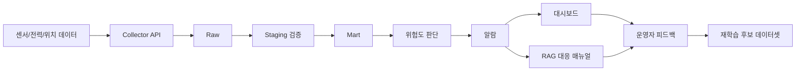

> 목적: 0단계 학습자료를 학습한 주니어가 산업안전 관제 플랫폼 도메인 문서를 보고 GitHub `lesson/00_project_baseline` 브랜치의 기준선 문서를 작성할 수 있도록 돕는 실습 지시서  
> 대상: AI 네이티브 데이터 플랫폼 엔지니어 과정 주니어  
> 작성 방식: 참고 문서 확인 → 핵심 내용 추출 → GitHub 파일에 반영 → 체크리스트로 검토

---

## 1. 이 지시서의 결론

산업안전 관제 플랫폼의 0단계 기준선은 **실제 기능을 구현하는 문서가 아니다.**

0단계 기준선은 다음을 정리하는 문서이다.
```text
이 프로젝트는 무엇을 해결하려는가?
어떤 데이터가 발생하는가?
데이터는 어디서 들어오는가?
Raw, Staging, Mart로 어떻게 나눌 것인가?
AI, RAG, 대시보드, 피드백은 어떤 데이터를 사용할 것인가?
이번 수업에서는 무엇을 만들고 무엇은 만들지 않을 것인가?
GitHub에는 어떤 문서와 샘플 데이터를 남길 것인가?
```

따라서 주니어는 도메인 문서를 처음부터 끝까지 모두 외우려고 하면 안 된다.  
대신 아래 질문에 답할 수 있는 정보만 먼저 뽑아야 한다.
```text
목적
사용자
데이터 소스
센서 데이터 구조
임계치
이벤트
데이터 흐름
시스템 경계
샘플 데이터
최종 시연 기준
```

---

## 2. 관련 문서를 받았을때

도메인 문서를 받았을때 주니어는 무엇을 순서대로 파악해야 하나?
```text
1단계: 이 프로젝트가 왜 필요한지 파악한다.
2단계: 어떤 장비와 데이터가 등장하는지 찾는다.
3단계: 어떤 필드와 단위가 있는지 찾는다.
4단계: 위험도 판단 기준을 찾는다.
5단계: 요구사항을 0단계 산출물 파일에 배치한다.
6단계: GitHub 기준선 파일과 일치하는지 확인한다.
```

---

## 3. 참고 자료와 추출해야 할 내용
| 참고 자료                | 주니어가 봐야 할 대목                                         | 0단계에서 뽑아야 할 내용                     | 반영 파일                                                                         |
| -------------------- | ---------------------------------------------------- | ---------------------------------- | ----------------------------------------------------------------------------- |
| 중소기업 R&D 연구개발계획서     | 기술개발 목표, 배경 및 필요성, 기술개발 영역 및 범위                      | 프로젝트 목적, 문제 정의, 시스템 구성 방향          | `docs/project-overview.md`                                                    |
| 디코나이 요구사항정의서         | SFR-002, SFR-003, SFR-004, SFR-005, SFR-006          | 기능 요구, 데이터 소스, 대시보드, AI 분석, 관리자 기능 | `docs/data-source-map.md`, `docs/platform-scope.md`                           |
| 센서별 데이터 구조 및 임계치 정의서 | 센서별 데이터 구조, 가스별 임계치                                  | 유해가스 필드, 스마트 파워 필드, 전송 주기, 임계치     | `docs/threshold-definition.md`, `seed/thresholds.seed.json`, `sample_events/` |
| 가스별 임계치 정의서          | CO, H2S, CO2, O2, NO2, SO2, O3, NH3, VOC 정상/주의/위험 기준 | 가스 위험도 판단 기준                       | `docs/threshold-definition.md`, `seed/thresholds.seed.json`                   |
| 스마트 파워 시스템 카탈로그      | 측정항목, 전압/전류/전력, 통신방식, 웹 모니터링 화면                      | 전력 데이터 소스, 전력 시각화, 원격 제어 제외/축소 기준  | `docs/data-source-map.md`, `docs/platform-scope.md`                           |
| 유독가스 감지 시스템 제안서      | 필요성, 시스템 개요, 제품 소개                                   | 유해가스 감지 필요성, 데이터 취합 구조, 통합관제 개념    | `docs/project-overview.md`, `docs/baseline-data-flow.md`                      |

---

## 4. 작성 순서

0단계 기준선은 아래 순서로 작성하면 가장 쉽다.
```text
1. README.md 확인
2. docs/project-overview.md 작성
3. docs/data-source-map.md 작성
4. docs/ai-service-data-map.md 작성
5. docs/baseline-data-flow.md 작성
6. docs/platform-scope.md 작성
7. docs/threshold-definition.md 작성
8. seed/thresholds.seed.json 작성
9. sample_events/*.sample.json 작성
10. docs/final-demo-scenario.md 작성
11. docs/baseline-completion-checklist.md로 검토
```

이 순서를 지키는 이유는 다음과 같다.
```text
목적을 알아야 데이터 소스를 정할 수 있다.
데이터 소스를 알아야 이벤트를 정할 수 있다.
이벤트를 알아야 샘플 JSON을 만들 수 있다.
샘플 JSON을 알아야 Raw, Staging, Mart 흐름을 설계할 수 있다.
흐름을 알아야 최종 시연 시나리오를 작성할 수 있다.
```

---

## 5. 파일별 작성 지시서

### 5.1 `README.md`

#### 작성 목적
저장소를 처음 보는 사람이 이 프로젝트가 무엇인지 이해하도록 한다.

#### 참고 자료
| 참고 문서            | 참고 대목                              |
| ---------------- | ---------------------------------- |
| 중소기업 R&D 연구개발계획서 | IoT·AI·RTLS를 융합한 통합 안전관리 플랫폼 개발 목표 |
| GitHub README    | 현재 단계, 0단계 목표, 현재 없는 기능, 0단계 산출물   |

작성해야 할 내용
```text
프로젝트명
현재 단계
0단계 목표
앞으로 구현할 기능
현재 없는 기능
0단계 산출물
실행 방법
```

작성 예시
```text
현재 단계는 0단계 프로젝트 기준선 정리이다.
이 단계에서는 실제 기능 구현 전에 프로젝트 목적, 데이터 소스, 기준 데이터 흐름, 
위험도 판단 기준, 샘플 이벤트, 최종 시연 시나리오를 정리한다.
```

완료 기준
```text
현재 단계가 0단계임을 알 수 있다.
아직 구현하지 않는 기능이 명확하다.
docs, sample_events, seed 폴더의 역할이 보인다.
```

---

### 5.2 `docs/project-overview.md`

#### 작성 목적
산업안전 관제 플랫폼이 왜 필요한지와 무엇을 만들려는지 설명한다.

#### 참고 자료
| 참고 문서                | 참고 대목                             | 반영 내용                          |
| -------------------- | --------------------------------- | ------------------------------ |
| 중소기업 R&D <br>연구개발계획서 | 기술개발 목표                           | IoT, AI, RTLS를 융합한 안전관리 플랫폼 방향 |
| 중소기업 R&D <br>연구개발계획서 | 배경 및 필요성                          | 유해가스, 전력 과부하, 작업자 안전사고 위험      |
| 유독가스 감지 <br>시스템 제안서  | 유독가스 감지 시스템 필요성                   | 유독가스 조기 감지와 통합관제 필요성           |
| 디코나이 <br>요구사항정의서     | 실시간 대시보드, AI 분석, <br>관리자 인터페이스 요구 | 플랫폼 핵심 기능 범위                   |


#### 주니어 작성 방법

문서를 읽고 아래 문장을 채운다.
```text
이 프로젝트는 ______ 현장에서 발생하는 ______ 데이터를 수집하여,
______ 상태를 판단하고,
______와 ______에 활용하기 위한 데이터 플랫폼이다.
```

작성 예시
```text
이 프로젝트는 산업안전 현장에서 발생하는 유해가스, 전력 사용량, 작업자 위치 데이터를 수집하여 위험 상태를 판단하고, 대시보드와 AI 학습 데이터셋에 활용하기 위한 데이터 플랫폼이다.
```

완료 기준
```text
프로젝트 목적이 한 문단으로 설명된다.
센서, 전력, 작업자 위치, 알람, AI, RAG, 피드백이 자연스럽게 연결된다.
단순 대시보드가 아니라 데이터 플랫폼임을 설명한다.
```

---

### 5.3 `docs/data-source-map.md`

#### 작성 목적
데이터가 어디서 발생하고 어떤 목적으로 사용되는지 정리한다.

#### 참고 자료
| 참고 문서                | 참고 대목                      | 반영 내용                 |
| -------------------- | -------------------------- | --------------------- |
| 센서별 데이터 구조 및 임계치 정의서 | 유해가스 센서 필드                 | 가스 센서 데이터 소스          |
| 센서별 데이터 구조 및 임계치 정의서 | 스마트 파워 시스템 필드              | 전력 데이터 소스             |
| 디코나이 요구사항정의서         | 작업자 위치 측위, 메시맵, 대시보드       | 작업자 위치 데이터, 위험구역 데이터  |
| 디코나이 요구사항정의서         | AI 학습 데이터 구성, 경보 이력, 로그 관리 | AI 데이터, 알람 데이터, 운영 로그 |
| 스마트 파워 시스템 카탈로그      | 전압, 전류, 전력 측정항목            | 전력 모니터링 데이터           |

#### 작성해야 할 표
| 데이터 소스      | 발생 주체                     | 예시 이벤트                     | 주요 사용처           | 참고 문서                      |
| ----------- | ------------------------- | -------------------------- | ---------------- | -------------------------- |
| 유해가스 센서 데이터 | 가스 센서/시뮬레이터               | `gas_sensor_measured`      | 위험도 판단, AI 이상탐지  | 센서별 데이터 구조 문서              |
| 전력 사용량 데이터  | 스마트 파워 시스템/시뮬레이터          | `power_sensor_measured`    | 과부하 판단, 전력 패턴 분석 | 센서별 데이터 구조 문서, 스마트 파워 카탈로그 |
| 작업자 위치 데이터  | 위치 센서/시뮬레이터               | `worker_location_measured` | 지오펜스 판단          | 요구사항정의서                    |
| 위험구역 데이터    | 관리자/Seed                  | `geofence_defined`         | 위치 위험 판단         | 요구사항정의서                    |
| 알람 데이터      | Risk Engine/Alarm Service | `alarm_created`            | 대시보드, 운영 이력      | 요구사항정의서                    |
| RAG 질의 로그   | RAG API                   | `rag_query_created`        | 대응 매뉴얼 검색 품질 평가  | 0단계 수업 기준                  |
| 운영자 피드백     | 운영자/관리자                   | `feedback_submitted`       | 재학습 후보, 운영 개선    | 요구사항정의서                    |

완료 기준
```text
최소 5개 이상의 데이터 소스가 있다.
각 데이터 소스가 어떤 이벤트로 표현되는지 보인다.
각 데이터가 대시보드, AI, RAG, 피드백 중 어디에 쓰이는지 보인다.
```

---

### 5.4 `docs/ai-service-data-map.md`

#### 작성 목적
AI가 사용하는 데이터와 AI 서비스 운영 중 발생하는 로그를 구분한다.

#### 참고 자료
| 참고 문서        | 참고 대목                                   | 반영 내용               |
| ------------ | --------------------------------------- | ------------------- |
| 디코나이 요구사항정의서 | AI 기반 유해가스 분석 및 예측, 데이터 전처리 및 학습 데이터 구성 | 유해가스 학습 데이터         |
| 디코나이 요구사항정의서 | 전력 사용 패턴 분석, 과부하 예측                     | 전력 학습 데이터           |
| 디코나이 요구사항정의서 | 경보 이력 관리, 로그 및 이력 관리                    | AI 결과, 알람 이력, 운영 로그 |

작성해야 할 구분
```text
AI 학습 데이터 = 모델이 학습할 데이터
AI 추론 데이터 = 모델이 판단할 때 입력되는 데이터
AI 결과 데이터 = 위험도, 이상탐지 결과
AI 서비스 로그 = 모델 호출, 실패, 응답 시간 등 운영 로그
피드백 데이터 = 운영자가 판단한 오탐/정탐/미탐, 조치 결과
```

완료 기준
```text
학습 데이터와 서비스 로그가 섞이지 않는다.
AI 판단 결과와 운영자 피드백이 구분된다.
재학습 후보 데이터가 무엇인지 설명된다.
```

---

### 5.5 `docs/baseline-data-flow.md`

#### 작성 목적
데이터가 발생해서 최종 활용까지 이동하는 흐름을 정리한다.

#### 참고 자료
| 참고 문서                | 참고 대목                             | 반영 내용          |
| -------------------- | --------------------------------- | -------------- |
| 유독가스 감지 시스템 제안서      | 데이터 취합, 서버, 통합관제 센터, 경고 데이터 흐름    | 유해가스 데이터 수집 흐름 |
| 디코나이 요구사항정의서         | 실시간 대시보드, 데이터 시각화, AI 분석, 경보 연계   | 데이터 활용 흐름      |
| 센서별 데이터 구조 및 임계치 정의서 | 유해가스/스마트 파워 데이터 전송 기준             | 수집 데이터 흐름      |
| 0단계 학습자료             | Raw, Staging, Mart, AI/RAG/피드백 흐름 | 수업용 데이터 플랫폼 흐름 |

작성해야 할 흐름
```text
센서/전력/위치 데이터 발생
→ Collector API 수집
→ Raw 저장
→ Staging 검증
→ Mart 생성
→ 위험도 판단
→ 알람 생성
→ 대시보드 표시
→ RAG 대응 매뉴얼 검색
→ 운영자 피드백 저장
→ AI 재학습 후보 데이터셋 반영
```

#### Mermaid 예시



![[Pasted image 20260708164235.png]]

완료 기준
```text
Raw, Staging, Mart가 구분되어 있다.
AI, RAG, 대시보드, 피드백이 연결되어 있다.
실제 구현이 아니라 기준 흐름이라는 점이 보인다.
```

---

### 5.6 `docs/platform-scope.md`

#### 작성 목적
이번 수업에서 만들 것과 만들지 않을 것을 구분한다.

#### 참고 자료
| 참고 문서           | 참고 대목                        | 반영 내용                  |
| --------------- | ---------------------------- | ---------------------- |
| 디코나이 요구사항정의서    | 센서 연계, 폐쇄망, 대시보드, AI, 관리자 기능 | 전체 요구사항 중 수업에서 다룰 범위   |
| 스마트 파워 시스템 카탈로그 | 원격 제어, 실시간 데이터, 통신 방식        | 실제 장비 제어는 축소 또는 시연형 처리 |
| 유독가스 감지 시스템 제안서 | 관리자 문자 전송, 경광등               | 실제 문자 발송/경광등 연동은 제외    |


만드는 것
```text
센서 데이터 샘플 JSON
전력 데이터 샘플 JSON
작업자 위치 샘플 JSON
Raw/Staging/Mart 기준 흐름
가스 임계치 기준
위험도 판단 기준
알람 데이터 구조
대시보드 조회 데이터 기준
AI 학습 후보 데이터셋 기준
RAG 로그와 피드백 데이터 기준
```

만들지 않는 것
```text
실제 센서 하드웨어 연동
실제 폐쇄망 운영
실제 스마트 파워 원격 제어
실제 문자 발송
실제 119 신고 연동
정밀 실내 측위 알고리즘 전체 구현
상용 수준 보안 인증
AI 재학습 완전 자동화
```

완료 기준
```text
수업용 구현 범위가 명확하다.
외부 시스템으로 가정할 부분이 명확하다.
샘플 데이터나 시뮬레이터로 대체할 부분이 설명되어 있다.
```

---

### 5.7 `docs/threshold-definition.md`

#### 작성 목적
위험도 판단 기준을 문서로 정리한다.

#### 참고 자료
| 참고 문서                | 참고 대목                                                | 반영 내용             |
| -------------------- | ---------------------------------------------------- | ----------------- |
| 가스별 임계치 정의서          | CO, H2S, CO2, O2, NO2, SO2, O3, NH3, VOC 정상/주의/위험 기준 | 가스 임계치            |
| 센서별 데이터 구조 및 임계치 정의서 | 가스별 임계치, 전력 판단 설명                                    | 가스 위험도와 전력 판단 기준  |
| 디코나이 요구사항정의서         | AI 분석 및 예측 관리, 임계치 관리                                | 관리자가 조정 가능한 위험 기준 |

작성해야 할 내용
```text
normal
warning
danger
sensor_error
review
```

가스별 기준은 표로 작성한다.

| 가스 | 단위 | normal | warning | danger |
|---|---|---|---|---|
| CO | ppm | 25 미만 | 25 이상 200 미만 | 200 이상 |
| H2S | ppm | 10 미만 | 10 이상 15 미만 | 15 이상 |
| CO2 | ppm | 1000 미만 | 1000 이상 5000 미만 | 5000 이상 |
| O2 | % | 18 이상 23.5 이하 | 16 이상 18 미만 | 16 미만 |
| NO2 | ppm | 3 미만 | 3 이상 5 미만 | 5 이상 |
| SO2 | ppm | 2 미만 | 2 이상 5 미만 | 5 이상 |
| O3 | ppm | 0.06 미만 | 0.06 이상 0.12 미만 | 0.12 이상 |
| NH3 | ppm | 25 미만 | 25 이상 35 미만 | 35 이상 |
| VOC | ppm | 0.5 미만 | 0.5 이상 1.0 미만 | 1.0 이상 |

#### 전력 기준 작성 방법

전력 데이터는 가스처럼 고정 임계치만으로 판단하지 않는다.  
초기 수업에서는 단순 규칙으로 작성하고, 후반에는 AI 이상탐지로 확장한다.
```text
최근 평균보다 일정 비율 이상 높음 → warning
급격한 증가 또는 비정상 패턴 → danger 또는 review
통신불능 값 또는 누락 값 → sensor_error
```

완료 기준
```text
가스별 normal/warning/danger 기준이 있다.
전력은 시간대별 평균 또는 패턴 비교 기준으로 작성되어 있다.
seed/thresholds.seed.json과 값이 일치한다.
```

---

### 5.8 `seed/thresholds.seed.json`

#### 작성 목적
문서에 작성한 임계치를 JSON 기준 데이터로 남긴다.

#### 참고 자료
| 참고 문서                | 참고 대목           |
| -------------------- | --------------- |
| 가스별 임계치 정의서          | 가스별 정상/주의/위험 기준 |
| 센서별 데이터 구조 및 임계치 정의서 | 가스별 임계치 표       |

작성 기준
```text
문서의 임계치 값과 JSON 값이 일치해야 한다.
gas_type은 소문자로 통일한다.
unit은 ppm 또는 %를 사용한다.
정상, 주의, 위험의 최소/최대값을 분리한다.
```

완료 기준
```text
9개 가스가 모두 들어 있다.
CO, H2S, CO2, O2, NO2, SO2, O3, NH3, VOC 기준이 문서와 일치한다.
```

---

### 5.9 `sample_events/*.sample.json`

#### 작성 목적
0단계에서 사용할 정상 샘플 이벤트를 만든다.

#### 참고 자료
| 샘플 파일                               | 참고 문서                             | 참고 대목               |
| ----------------------------------- | --------------------------------- | ------------------- |
| `gas_sensor_event.sample.json`      | 센서별 데이터 구조 및 임계치 정의서              | 유해가스 센서 필드          |
| `power_sensor_event.sample.json`    | 센서별 데이터 구조 및 임계치 정의서, 스마트 파워 카탈로그 | 전류, 전압, 전력, 전원 상태   |
| `worker_location_event.sample.json` | 디코나이 요구사항정의서                      | 위치 측위, 메시맵, 위험구역    |
| `ai_service_log.sample.json`        | 디코나이 요구사항정의서                      | AI 분석, 예측, 경보 연계    |
| `rag_query_log.sample.json`         | 수업 기준                             | 대응 매뉴얼 검색 로그        |
| `feedback_event.sample.json`        | 디코나이 요구사항정의서                      | 경보 처리, 조치 결과, 로그 관리 |

공통 필드
```text
event_id
event_type
schema_version
source_system
trace_id
correlation_id
event_time
ingestion_time
payload
quality_status
```

작성 시 주의
```text
event_type은 문서와 샘플 파일에서 동일해야 한다.
schema_version은 가능하면 1.0.0 형식으로 통일한다.
가스 값은 임계치 기준과 비교 가능한 숫자여야 한다.
전력 값은 단위가 명확해야 한다.
작업자 위치는 실제 개인정보 대신 가명 ID를 사용한다.
```

---

### 5.10 `docs/final-demo-scenario.md`

#### 작성 목적
0단계가 끝났을 때 무엇을 보여줄지 정리한다.

작성 예시
```text
1. 프로젝트 목적을 설명한다.
2. 데이터 소스 맵을 보여준다.
3. 가스 센서 샘플 JSON을 설명한다.
4. 임계치 기준으로 위험도 판단이 가능함을 설명한다.
5. Raw → Staging → Mart → 대시보드/AI/RAG/피드백 흐름을 설명한다.
6. 이번 단계에서 만들지 않는 범위를 설명한다.
```

완료 기준
```text
시연 순서가 있다.
입력 데이터와 확인 결과가 연결되어 있다.
0단계가 기능 구현이 아니라 기준선 작성 단계임을 설명한다.
```
---

## 6. GitHub `lesson/00_project_baseline` 자료를 활용하는 방법

GitHub에 올라가 있는 `lesson/00_project_baseline` 자료는 **정답지**가 아니다.  
이 자료는 0단계 기준선을 작성할 때 참고할 수 있는 **초안이자 예시 자료**이다.

따라서 주니어는 GitHub 자료를 그대로 베끼는 것이 아니라, 다음 관점으로 검토해야 한다.
```text
이미 작성된 내용은 무엇인가?
현재 내용이 도메인 문서와 일치하는가?
빠진 문서는 무엇인가?
추가하면 이후 단계 학습에 도움이 되는 산출물은 무엇인가?
어떤 파일을 새로 작성하거나 보완해야 하는가?
```

즉, GitHub 자료는 다음처럼 사용한다.
```text
GitHub 자료 = 기준선 작성 참고 예시
도메인 문서 = 실제 근거 자료
학생 산출물 = 참고 예시와 근거 자료를 바탕으로 직접 보완한 결과물
```

주니어는 이 단계에서 “GitHub에 있으니까 맞다”라고 생각하면 안 된다.  
현업에서도 기존 문서가 항상 완벽하지 않기 때문에, 요구사항·도메인 문서·데이터 구조 문서를 보면서 부족한 부분을 보완한다.

---

## 7. GitHub 자료에서 이미 참고할 수 있는 것

현재 GitHub `lesson/00_project_baseline`에는 다음과 같은 기준선 구조가 준비되어 있다.
```text
README.md
docs/
sample_events/
seed/
```

이 구조는 0단계 기준선 작성 방향과 잘 맞는다.  
다만 완성본이라기보다, 학생이 기준선을 작성하기 위해 참고하고 보완해야 하는 시작점으로 본다.

---

### 7.1 `docs/` 폴더에서 참고할 수 있는 문서

GitHub `docs/` 폴더에는 다음과 같은 문서들이 있다.
```text
ai-service-data-map.md
baseline-completion-checklist.md
baseline-data-flow.md
branch-roadmap.md
current-state.md
data-source-map.md
final-demo-scenario.md
platform-scope.md
project-overview.md
threshold-definition.md
```

이 문서들은 0단계에서 필요한 주요 기준선 항목과 연결된다.

| GitHub 문서 | 해당 학습 개념 | 학생이 확인할 것 |
|---|---|---|
| `project-overview.md` | 프로젝트 목적, 문제 정의, 도메인 정의 | 산업안전 관제 플랫폼의 목적이 명확한가? |
| `data-source-map.md` | 데이터 소스 | 유해가스, 전력, 위치, 알람, 피드백 데이터가 정리되어 있는가? |
| `ai-service-data-map.md` | AI 서비스 데이터 유형 | 학습 데이터, 추론 데이터, 로그, 피드백이 구분되어 있는가? |
| `baseline-data-flow.md` | 데이터 흐름 | Raw → Staging → Mart → AI/RAG/피드백 흐름이 보이는가? |
| `platform-scope.md` | 시스템 경계 | 만들 것과 만들지 않을 것이 명확한가? |
| `threshold-definition.md` | 위험도 판단 기준 | 가스별 임계치와 전력 판단 기준이 들어 있는가? |
| `branch-roadmap.md` | 브랜치 전략 | 이후 단계 브랜치 흐름이 보이는가? |
| `final-demo-scenario.md` | 최종 시연 기준 | 0단계 종료 시 무엇을 설명할지 정리되어 있는가? |
| `baseline-completion-checklist.md` | 완료 체크리스트 | 학생이 스스로 완료 여부를 확인할 수 있는가? |

이 문서들은 기본 방향은 맞지만, 아래의 보완 문서를 추가하면 이후 단계와 더 잘 연결된다.

---

## 8. 학생이 추가 작성해야 하는 보완 문서

현재 GitHub 자료는 참고용 초안으로 충분하지만, 0단계 실습을 더 현업답게 만들기 위해서는 아래 문서를 추가 작성하는 것이 좋다.

추가 작성이 필요한 핵심 문서는 다음 두 가지이다.
```text
docs/domain-event-map.md
docs/data-contract-candidate.md
```

선택적으로 추가하면 좋은 문서는 다음과 같다.
```text
sample_events 오류 샘플 JSON
전력 정상/주의/위험 샘플 JSON
schema_version 통일 작업
```

---

## 8.1 `docs/domain-event-map.md` 추가 작성

### 왜 추가해야 하는가?

현재 GitHub에는 데이터 소스와 샘플 이벤트 파일은 있지만,  
“어떤 업무 사건이 어떤 이벤트명으로 정의되고, 그 이벤트가 어떤 파일·데이터 흐름·이후 단계와 연결되는지”를 한눈에 보여주는 문서가 부족하다.

주니어는 이벤트명을 단순한 파일명으로 생각하기 쉽다.  
하지만 데이터 플랫폼에서 이벤트명은 API, Schema, Raw 저장, Staging 검증, Mart 생성, 알람, 피드백까지 연결되는 기준 이름이다.

따라서 `domain-event-map.md`를 추가하면 다음이 명확해진다.
```text
업무 사건
→ 이벤트명
→ 샘플 JSON
→ Raw 저장
→ Staging 검증
→ Mart 활용
→ AI/RAG/피드백 연결
```

### 이 문서는 어디에 해당되는가?

| 구분 | 내용 |
|---|---|
| 작성 위치 | `docs/domain-event-map.md` |
| 관련 학습 개념 | 도메인 이벤트, 컨벤션, 데이터 흐름 |
| 참고 GitHub 파일 | `sample_events/*.sample.json`, `docs/data-source-map.md`, `docs/baseline-data-flow.md` |
| 참고 도메인 문서 | 요구사항정의서, 센서별 데이터 구조 문서 |
| 이후 연결 단계 | 1단계 이벤트 설계, 2단계 데이터 계약/Schema, 3단계 Staging/Mart |

### 학생 작성 지시

아래 표를 기준으로 `docs/domain-event-map.md`를 작성한다.
```md
# 도메인 이벤트 맵

## 1. 목적

이 문서는 산업안전 관제 플랫폼에서 발생하는 주요 업무 사건을 이벤트명으로 정리하고,
각 이벤트가 샘플 JSON, Raw, Staging, Mart, AI/RAG/피드백으로 어떻게 연결되는지 정리한다.

## 2. 이벤트 맵

| 업무 사건 | 이벤트명 | 데이터 소스 | 샘플 파일 | 이후 연결 |
|---|---|---|---|---|
| 가스 센서값이 측정되었다 | `gas_sensor_measured` | 유해가스 센서 | `gas_sensor_event.sample.json` | Raw 가스 이벤트 → Staging 가스 측정 → 위험도 Mart |
| 전력 사용량이 측정되었다 | `power_sensor_measured` | 스마트 파워 시스템 | `power_sensor_event.sample.json` | Raw 전력 이벤트 → Staging 전력 측정 → 전력 이상탐지 |
| 작업자 위치가 측정되었다 | `worker_location_measured` | 위치 센서/시뮬레이터 | `worker_location_event.sample.json` | Raw 위치 이벤트 → 지오펜스 판단 → 위험구역 Mart |
| 알람이 생성되었다 | `alarm_created` | Risk Engine | 추후 추가 | 알람 Mart → 대시보드 → 운영자 피드백 |
| RAG 질문이 제출되었다 | `rag_query_submitted` | RAG API | `rag_query_log.sample.json` | RAG 로그 → 검색 품질 분석 |
| 운영자 피드백이 제출되었다 | `feedback_submitted` | 운영자 | `feedback_event.sample.json` | 피드백 Mart → 재학습 후보 데이터셋 |
```

완료 기준
```text
최소 6개 이상의 이벤트가 정리되어 있다.
각 이벤트가 샘플 파일과 연결되어 있다.
각 이벤트가 Raw, Staging, Mart, AI/RAG/피드백 중 어디로 연결되는지 보인다.
이벤트명이 snake_case로 통일되어 있다.
```

---

## 8.2 `docs/data-contract-candidate.md` 추가 작성

### 왜 추가해야 하는가?

현재 GitHub에는 샘플 JSON과 임계치 문서는 있지만,  
“이 데이터가 어떤 필드, 타입, 단위, 필수값, 오류 처리 기준을 지켜야 하는가”를 정리한 데이터 계약 후보 문서가 부족하다.

데이터 계약 후보 문서가 없으면 2단계에서 Schema, Pydantic, DRF Serializer, Validation 코드를 만들 때 기준이 흔들릴 수 있다.

따라서 0단계에서 완성형 데이터 계약까지 만들 필요는 없지만,  
최소한 **데이터 계약 후보 문서**는 작성하는 것이 좋다.

### 이 문서는 어디에 해당되는가?

| 구분 | 내용 |
|---|---|
| 작성 위치 | `docs/data-contract-candidate.md` |
| 관련 학습 개념 | 데이터 계약, Schema, Validation |
| 참고 GitHub 파일 | `sample_events/*.sample.json`, `docs/threshold-definition.md`, `seed/thresholds.seed.json` |
| 참고 도메인 문서 | 센서별 데이터 구조 및 임계치 정의서, 가스별 임계치 정의서 |
| 이후 연결 단계 | 2단계 JSON Schema, Pydantic Model, DRF Serializer, Staging 검증 |

### 학생 작성 지시

아래 구조로 `docs/data-contract-candidate.md`를 작성한다.
```md
# 데이터 계약 후보 문서

## 1. 목적

이 문서는 0단계에서 정의한 샘플 이벤트가 어떤 구조와 타입, 단위, 필수값, 오류 처리 기준을 가져야 하는지 정리한다.
2단계에서는 이 문서를 기준으로 JSON Schema, Pydantic Model, DRF Serializer, Validation 로직을 작성한다.

## 2. 공통 필드

| 필드명 | 필수 여부 | 타입 | 설명 | 예시 |
|---|---|---|---|---|
| event_id | 필수 | string | 이벤트 고유 ID | `evt_gas_000001` |
| event_type | 필수 | string | 이벤트 유형 | `gas_sensor_measured` |
| schema_version | 필수 | string | 스키마 버전 | `1.0.0` |
| source_system | 필수 | string | 데이터를 보낸 시스템 | `gas-simulator` |
| event_time | 필수 | datetime | 실제 데이터 발생 시각 | `2026-07-08T10:00:00+09:00` |
| ingestion_time | 선택 | datetime | 플랫폼 수신 시각 | `2026-07-08T10:00:01+09:00` |
| quality_status | 선택 | string | 데이터 품질 상태 | `raw` |

## 3. 가스 센서 이벤트 Payload

| 필드명 | 필수 여부 | 타입 | 단위 | 허용값/범위 | 설명 |
|---|---|---|---|---|---|
| device_id | 필수 | string | 없음 | 등록된 장비 ID | 가스 센서 식별자 |
| co | 필수 | number | ppm | 0 이상 | 일산화탄소 농도 |
| h2s | 필수 | number | ppm | 0 이상 | 황화수소 농도 |
| co2 | 필수 | number | ppm | 0 이상 | 이산화탄소 농도 |
| o2 | 필수 | number | % | 0 이상 25 이하 | 산소 농도 |
| no2 | 필수 | number | ppm | 0 이상 | 이산화질소 농도 |
| so2 | 필수 | number | ppm | 0 이상 | 이산화황 농도 |
| o3 | 필수 | number | ppm | 0 이상 | 오존 농도 |
| nh3 | 필수 | number | ppm | 0 이상 | 암모니아 농도 |
| voc | 필수 | number | ppm | 0 이상 | 휘발성유기화합물 농도 |

## 4. 오류 처리 기준

| 오류 유형 | 예시 | 처리 방식 |
|---|---|---|
| 필수값 누락 | device_id 없음 | Dead Letter 저장 |
| 타입 오류 | co가 문자열 | Dead Letter 저장 |
| 단위 오류 | unit 불일치 | Dead Letter 저장 |
| 범위 오류 | o2가 음수 | Dead Letter 저장 |
| 지원하지 않는 schema_version | 0.9 | Dead Letter 저장 |
```

완료 기준
```text
공통 필드가 정리되어 있다.
가스 센서 payload 필드가 정리되어 있다.
전력, 위치, RAG, 피드백 중 최소 2개 이상 payload가 추가되어 있다.
필수 여부, 타입, 단위, 허용값, 오류 처리 기준이 있다.
```

---

## 8.3 `schema_version` 형식 통일

### 왜 보완해야 하는가?

샘플 JSON의 `schema_version`이 `1.0`처럼 작성되어 있으면 간단히 이해하기는 쉽지만,  
이후 스키마 변경을 설명하기에는 부족할 수 있다.

현업에서는 보통 다음처럼 버전을 더 명확하게 표현한다.
```text
1.0.0
```

이 형식은 다음 의미로 설명하기 쉽다.
```text
major.minor.patch
```

예시는 다음과 같다.
```text
1.0.0 = 최초 버전
1.1.0 = 선택 필드 추가
2.0.0 = 필수 필드 변경 또는 구조 변경
```

### 이 작업은 어디에 해당되는가?

| 구분 | 내용 |
|---|---|
| 수정 대상 | `sample_events/*.sample.json` |
| 관련 학습 개념 | 데이터 계약, 스키마 변경 기준, 컨벤션 |
| 이후 연결 단계 | 2단계 Schema, Validation, 스키마 호환성 관리 |

### 학생 작업 지시

`sample_events/`의 모든 JSON 파일을 열어 `schema_version`을 확인한다.
```text
1.0 → 1.0.0
```

단, 이미 `1.0.0`이면 수정하지 않는다.

완료 기준
```text
모든 샘플 JSON의 schema_version 형식이 동일하다.
데이터 계약 후보 문서에도 같은 버전이 사용된다.
```

---

## 8.4 전력 샘플 데이터 보완

### 왜 보완해야 하는가?

스마트 파워 시스템은 전압, 전류, 전력 데이터를 수집한다.  
하지만 전력 데이터는 가스처럼 단순 임계치만으로 판단하기 어렵다.

도메인 문서에서는 전력 사용량, 전류, 전압, 전력 측정이 중요하며, 전력 사용 패턴 분석과 과부하 판단이 요구된다.  
따라서 전력 샘플은 단순 정상 데이터 하나만 두기보다, 정상/주의/위험 상황을 구분해두는 것이 좋다.

### 이 작업은 어디에 해당되는가?

| 구분 | 내용 |
|---|---|
| 보완 대상 | `sample_events/power_sensor_event.sample.json` |
| 추가 권장 파일 | `power_sensor_event.normal.sample.json`, `power_sensor_event.warning.sample.json`, `power_sensor_event.danger.sample.json` |
| 관련 학습 개념 | 데이터 소스, 샘플 이벤트, 위험도 판단 기준 |
| 이후 연결 단계 | 2단계 데이터 검증, 3단계 Mart, 4단계 AI 이상탐지 |

### 학생 작업 지시

기존 `power_sensor_event.sample.json`을 참고하여 아래 3개 파일을 추가한다.
```text
sample_events/power_sensor_event.normal.sample.json
sample_events/power_sensor_event.warning.sample.json
sample_events/power_sensor_event.danger.sample.json
```

각 파일은 다음 차이를 가져야 한다.

```text
normal = 일반적인 사용량
warning = 평균보다 높은 사용량
danger = 급격한 증가 또는 비정상 패턴
```

완료 기준
```text
전력 정상/주의/위험 샘플이 구분되어 있다.
전류, 전압, 전력 단위가 명확하다.
나중에 AI 이상탐지나 전력 Mart로 확장할 수 있다.
```

---

## 8.5 오류 샘플 JSON 추가

### 왜 보완해야 하는가?

0단계에서 정상 샘플만 만들면 2단계 검증 실습으로 이어질 때 기준이 부족하다.  
검증을 배우려면 “정상 데이터”뿐 아니라 “오류 데이터”도 있어야 한다.

오류 샘플은 다음을 확인하는 데 필요하다.
```text
필수값이 빠졌을 때 어떻게 처리할 것인가?
타입이 잘못되었을 때 어떻게 처리할 것인가?
단위가 잘못되었을 때 어떻게 처리할 것인가?
값 범위가 이상할 때 어떻게 처리할 것인가?
```

### 이 작업은 어디에 해당되는가?

| 구분 | 내용 |
|---|---|
| 보완 대상 | `sample_events/` |
| 관련 학습 개념 | 데이터 계약, Validation, Dead Letter |
| 이후 연결 단계 | 2단계 데이터 계약, 2단계 Validation, Dead Letter 처리 |

### 학생 작업 지시

아래 오류 샘플 파일을 추가한다.
```text
sample_events/gas_sensor_event.invalid_missing_required.sample.json
sample_events/gas_sensor_event.invalid_type.sample.json
sample_events/gas_sensor_event.invalid_unit.sample.json
sample_events/power_sensor_event.invalid_communication.sample.json
sample_events/worker_location_event.invalid_missing_zone.sample.json
```

각 파일은 오류 목적이 분명해야 한다.

| 파일명 | 오류 목적 |
|---|---|
| `gas_sensor_event.invalid_missing_required.sample.json` | 필수 필드 누락 |
| `gas_sensor_event.invalid_type.sample.json` | 타입 오류 |
| `gas_sensor_event.invalid_unit.sample.json` | 단위 오류 |
| `power_sensor_event.invalid_communication.sample.json` | 통신불능 값 |
| `worker_location_event.invalid_missing_zone.sample.json` | 위치/구역 정보 누락 |

완료 기준
```text
오류 샘플이 최소 3개 이상 있다.
각 오류 샘플의 목적이 파일명에서 드러난다.
2단계 Validation 실습에서 그대로 사용할 수 있다.
```

---

## 9. 최종 작업 지시 순서

GitHub 자료를 참고하되, 완성본으로 보지 말고 아래 순서대로 직접 확인하고 보완한다.
```text
1. README.md를 읽고 현재 단계가 0단계임을 확인한다.
2. docs/project-overview.md에서 프로젝트 목적을 한 문장으로 요약한다.
3. 센서별 데이터 구조 문서에서 유해가스와 전력 필드를 찾는다.
4. 가스별 임계치 정의서에서 9개 가스의 normal/warning/danger 기준을 찾는다.
5. docs/data-source-map.md에 데이터 소스와 사용 목적이 충분한지 확인한다.
6. sample_events/에서 샘플 JSON이 데이터 구조 문서와 맞는지 확인한다.
7. docs/baseline-data-flow.md에 Raw → Staging → Mart → AI/RAG/피드백 흐름이 있는지 확인한다.
8. docs/platform-scope.md에 만들 것과 만들지 않을 것이 구분되어 있는지 확인한다.
9. seed/thresholds.seed.json이 임계치 문서와 맞는지 확인한다.
10. docs/domain-event-map.md를 새로 작성한다.
11. docs/data-contract-candidate.md를 새로 작성한다.
12. sample_events/에 오류 샘플 JSON을 추가한다.
13. docs/baseline-completion-checklist.md로 완료 여부를 점검한다.
```

---

## 10. 추가 작성 완료 체크리스트

| 확인 항목                                     | 완료 <br>여부 |
| ----------------------------------------- | --------- |
| GitHub 자료가 참고용 초안이라는 점을 이해했는가?            | [   ]     |
| `docs/domain-event-map.md`를 작성했는가?        | [   ]     |
| 이벤트명과 샘플 JSON 파일이 연결되어 있는가?               | [   ]     |
| `docs/data-contract-candidate.md`를 작성했는가? | [   ]     |
| 공통 필드와 payload 필드를 구분했는가?                 | [   ]     |
| 필수값, 타입, 단위, 오류 처리 기준을 작성했는가?             | [   ]     |
| 모든 샘플 JSON의 `schema_version` 형식을 확인했는가?   | [   ]     |
| 전력 정상/주의/위험 샘플을 추가했는가?                    | [   ]     |
| 오류 샘플 JSON을 최소 3개 이상 추가했는가?               | [   ]     |
| 보완한 내용이 README 또는 체크리스트에서 확인 가능한가?        | [   ]     |

---

## 11. 한 문장 정리

```text
GitHub의 lesson/00_project_baseline 자료는 0단계 기준선의 참고 초안이며,
주니어분들은 도메인 문서와 학습자료를 근거로 이벤트 맵, 데이터 계약 후보, 오류 샘플 등을 추가 보완하여 자신의 0단계 산업안전 관제 플랫폼 기준선을 완성해야 한다.
```

중요한 것은 GitHub 자료를 그대로 따라 쓰는 것이 아니다.  
현업처럼 기존 자료를 검토하고, 근거 문서를 확인하고, 부족한 산출물을 추가하여 기준선을 더 명확하게 만드는 것이다.
