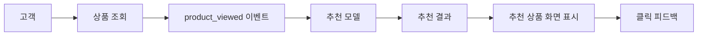
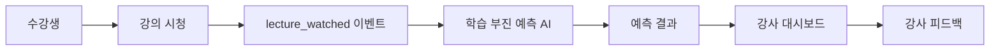
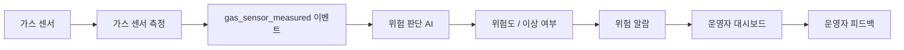
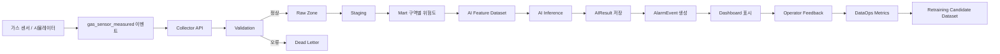
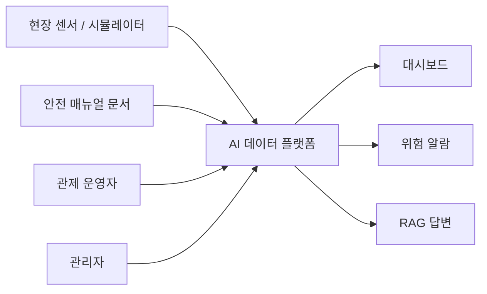
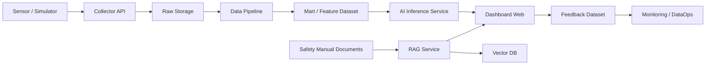

> 과정명: AI 네이티브 데이터 플랫폼 엔지니어 과정  
> 단계명: 1단계. AI 서비스와 데이터 플랫폼 아키텍처  
> 문서 목적: AI 서비스가 동작하기 위해 필요한 데이터 구조와 데이터 플랫폼 아키텍처를 이해하고, 이후 2~7단계 구현의 기준이 되는 설계 산출물을 작성하기 위한 이론 및 실습 자료  
> 적용 방식: 범용 이론 설명 → 범용 데이터 예제 실습 → 산업안전 관제 플랫폼 적용 → 산출물 작성  
> 실습 도메인: 산업안전 관제 플랫폼  
> 주의: 이 문서는 산업안전 관제 플랫폼의 상세 구현 문서가 아니다. 산업안전 관제 플랫폼을 풀기 전에 필요한 **AI 서비스와 데이터 플랫폼 아키텍처 사고방식**을 배우기 위한 문서이다.

---

## 0. 이 문서의 결론
1단계는 AI 서비스와 데이터 플랫폼의 **전체 구조를 설계하는 단계**이다.

0단계에서 프로젝트 기준선을 정리했다면, 1단계에서는 그 기준선을 바탕으로 다음 질문에 답한다.
```text
AI 서비스는 어떤 데이터를 필요로 하는가?
데이터는 어디서 발생하는가?
어떤 API 또는 시스템이 데이터를 받는가?
원본 데이터는 어디에 저장되는가?
검증과 가공은 어디에서 이루어지는가?
AI 추론은 어떤 데이터를 사용하는가?
RAG는 어떤 문서를 검색하는가?
대시보드는 어떤 데이터를 보여주는가?
피드백은 어떻게 다시 개선 데이터가 되는가?
```

1단계의 핵심은 코드를 많이 작성하는 것이 아니다.  
이후 2~7단계에서 구현할 모든 기능이 따라갈 구조와 기준을 먼저 잡는 것이다.

1단계의 핵심 문장은 다음과 같다.
```text
1단계는 AI 서비스가 사용할 데이터와 시스템 구성요소가
어떤 흐름으로 연결되는지 설계하는 단계이다.
```

---

## 0.1 반복 설명에 대한 안내

전체 학습내용에서는 학습자가 주요 용어와 데이터 흐름에 익숙해질 수 있도록 같은 개념이 여러 번 반복해서 등장할 수 있다.

이는 불필요한 중복이 아니라, Raw, Staging, Mart, Feature Dataset, RAG, Feedback, DataOps와 같은 핵심 개념을 자연스럽게 익히도록 하기 위한 의도적인 반복이다.

처음에는 낯설게 느껴질 수 있지만, 여러 단계에서 같은 용어와 흐름을 반복해서 접하다 보면 데이터가 어떻게 발생하고, 저장되고, 검증되고, AI 서비스와 운영 개선으로 연결되는지 점차 익숙해질 수 있다.

---

## 0.2 이 문서에서 배우는 것

이 문서에서는 다음을 배운다.
```text
아키텍처란 무엇인가?
AI 서비스 아키텍처란 무엇인가?
데이터 플랫폼 아키텍처란 무엇인가?
AI 서비스는 어떤 데이터를 필요로 하는가?
데이터 소스와 도메인 이벤트는 어떻게 연결되는가?
Raw, Staging, Mart는 왜 나누는가?
Feature Dataset, Training Dataset, Vector DB, Feedback Dataset은 무엇인가?
C4 Context와 C4 Container는 왜 작성하는가?
Markdown 문서는 어떤 패턴으로 작성해야 하는가?
1단계 산출물은 무엇이며 왜 필요한가?
```

---

## 0.3 이 문서의 학습 순서

1단계 이론 수업은 다음 순서로 진행한다.
```text
1. 0단계 기준선 다시 확인
2. 아키텍처의 의미 이해
3. AI 서비스와 데이터 플랫폼의 차이 이해
4. AI 서비스가 필요한 데이터 유형 구분
5. 전체 데이터 흐름 이해
6. C4 Context와 C4 Container 이해
7. 도메인 이벤트와 데이터 흐름 연결
8. 1단계 산출물 작성 패턴 이해
9. 작은 미니실습으로 직접 작성
10. 산업안전 관제 플랫폼에 적용
```

---

# 1. 1단계의 위치

1단계는 전체 과정에서 다음 위치에 있다.
```text
0단계: 프로젝트 기준선 정리
→ 1단계: AI 서비스와 데이터 플랫폼 아키텍처
→ 2단계: AI 데이터 수집과 레이크하우스 설계
→ 3단계: AI 워크로드를 위한 데이터 파이프라인 자동화
→ 4단계: 대용량 로그와 실시간 이벤트 스트리밍
→ 5단계: AI 데이터 품질, 계보, 거버넌스
→ 6단계: RAG와 벡터 데이터 파이프라인
→ 7단계: AI 서비스 피드백 데이터와 DataOps 운영
```

0단계가 “무엇을 만들 것인가”를 정하는 단계라면,  
1단계는 “어떤 구조로 만들 것인가”를 정하는 단계이다.

0단계에서 정리한 것은 다음과 같다.
```text
프로젝트 목적
도메인
사용자 역할
데이터 소스
데이터 유형
도메인 이벤트 후보
시스템 경계
컨벤션
산출물 기준
```

1단계에서는 이것을 다음으로 확장한다.
```text
AI 서비스 데이터 유형 맵
도메인 이벤트 맵
C4 Context 다이어그램
C4 Container 다이어그램
전체 데이터 흐름도
Raw / Staging / Mart 역할 정의
기술 선택표
최종 시연 시나리오
```

즉, 1단계는 0단계 문서를 실제 시스템 구조로 바꾸는 단계이다.

---

### ==`1단계가 끝나면 설명할 수 있어야 하는 것`==

1단계가 끝나면 다음을 설명할 수 있어야 한다.
```text
AI 서비스는 왜 모델만으로 동작하지 않는가?
데이터 플랫폼은 AI 서비스에서 어떤 역할을 하는가?
데이터 소스는 무엇이고, 어떤 방식으로 데이터가 들어오는가?
도메인 이벤트는 왜 API, Schema, Raw 저장, Mart 생성의 기준이 되는가?
Raw, Staging, Mart는 왜 분리해야 하는가?
Feature Dataset은 AI 모델과 어떻게 연결되는가?
Vector DB는 RAG에서 어떤 역할을 하는가?
Feedback Dataset은 왜 운영 개선과 재학습 후보 데이터가 되는가?
C4 Context와 C4 Container는 무엇이 다른가?
1단계 산출물을 왜 Markdown으로 정리해야 하는가?
```

---

# 2. 아키텍처란 무엇인가?

### ==`아키텍처의 쉬운 정의`==
아키텍처는 시스템의 전체 설계도이다.

조금 더 풀어서 말하면 다음과 같다.
```text
아키텍처 = 시스템이 어떤 구성요소로 이루어지고,
각 구성요소가 어떤 역할을 하며,
데이터가 어떤 순서로 이동하는지 정리한 구조
```

아키텍처는 단순히 예쁜 그림이 아니다.  
아키텍처는 이후 개발자가 코드를 작성할 때 따라야 하는 기준이다.

예를 들어 시스템을 만들 때 다음을 미리 정해야 한다.
```text
사용자는 어디로 들어오는가?
API는 어디에 있는가?
DB는 무엇을 저장하는가?
데이터는 어떤 순서로 처리되는가?
AI 모델은 어디에 연결되는가?
RAG 문서는 어디에 저장되는가?
대시보드는 어떤 데이터를 조회하는가?
피드백은 어디에 저장되는가?
```

이 질문에 답하는 것이 아키텍처 설계이다.

---

### ==`집 짓기에 비유하기`==
집을 지을 때 바로 벽돌부터 쌓지 않는다.

먼저 다음을 정한다.
```text
몇 층짜리 건물인가?
방은 몇 개인가?
거실, 주방, 화장실은 어디에 둘 것인가?
전기와 수도는 어디로 지나가는가?
사람은 어디로 들어오고 나가는가?
```

이것이 건축 설계도이다.

소프트웨어도 마찬가지이다.
```text
어떤 사용자가 들어오는가?
어떤 데이터가 들어오는가?
어떤 API가 데이터를 받는가?
어떤 저장소에 데이터가 저장되는가?
어떤 데이터가 AI 모델로 들어가는가?
어떤 결과가 대시보드에 보여지는가?
```
이것을 정리한 것이 소프트웨어 아키텍처이다.

주니어가 기억해야 할 한 줄 정의
```text
아키텍처는 시스템을 구성하는 부품들과 그 부품 사이의 데이터 흐름을 정리한 전체 설계도이다.
```

---

### ==`왜 1단계에서 아키텍처를 먼저 그리는가?`==

아키텍처 없이 바로 코드를 작성하면 다음 문제가 생긴다.
```text
API는 만들었지만 그 데이터가 어디에 저장되어야 하는지 모른다.
DB 테이블은 만들었지만 AI 학습 데이터셋과 연결되지 않는다.
대시보드는 만들었지만 원본 데이터와 집계 데이터가 섞인다.
AI 결과는 생성했지만 나중에 검증할 수 없다.
RAG 답변은 나오지만 어떤 문서를 근거로 했는지 추적할 수 없다.
피드백은 받았지만 재학습 후보 데이터로 연결되지 않는다.
```

그래서 1단계에서는 기능 구현보다 구조 이해가 먼저이다.

### 🔗 [[아키텍처란 무엇인가]] 실습

---

#### `[중간문제 1]` 아키텍처 이해 확인

문제 1. 다음 중 아키텍처가 설명해야 하는 내용으로 맞는 것을 모두 고르시오.
```text
1. 시스템을 구성하는 주요 부품
2. 데이터가 이동하는 흐름
3. 각 구성요소의 책임
4. 사용자의 생년월일
5. 외부 시스템과의 연결 관계
```

정답:
```text
1, 2, 3, 5
```

설명:
```text
아키텍처는 시스템 구성요소, 책임, 데이터 흐름, 외부 연결 관계를 설명한다.
사용자의 생년월일은 특정 도메인 데이터일 수는 있지만 아키텍처 자체의 핵심 설명 항목은 아니다.
```

문제 2. 다음 문장을 완성하시오.
```text
아키텍처는 단순히 예쁜 그림이 아니라,
개발자가 코드를 작성할 때 따라야 하는 __________ 이다.
```

정답 예시:
```text
구조적 기준
설계 기준
전체 기준
```

문제 3. 다음 중 아키텍처 없이 개발했을 때 생길 수 있는 문제를 하나 작성하시오.

답안 예시:
```text
Raw와 Staging이 섞여 데이터 흐름이 불명확해질 수 있다.
AI 결과를 저장하지 않아 나중에 오탐 여부를 확인하기 어려울 수 있다.
대시보드가 원본 데이터를 직접 조회해 지표가 불안정해질 수 있다.
```

---

| 구분           | 한 문장 정의                                                  |
| ------------ | -------------------------------------------------------- |
| AI 서비스 아키텍처  | AI 기능이 사용자, 화면, 업무 흐름, 판단 결과, 피드백과 어떻게 <br>연결되는지 설계하는 구조 |
| 데이터 플랫폼 아키텍처 | AI 서비스가 사용할 데이터를 수집, 저장, 검증, 가공, 제공, 모니터링, <br>재처리하는 구조  |
# 3. AI 서비스 아키텍처란 무엇인가?
AI 서비스 아키텍처는 **AI가 서비스 안에서 어떤 역할을 하는지 설계하는 구조**이다.

조금 더 풀어서 말하면 다음과 같다.
```text
AI 서비스 아키텍처
= 사용자가 어떤 문제를 겪고,
AI가 어떤 판단이나 추천을 하고,
그 결과가 어떤 화면이나 기능으로 제공되고,
사용자의 반응이 어떻게 다시 개선 데이터가 되는지 설계하는 것
```

여기서 핵심은 **서비스 목적**이다.

AI 서비스 아키텍처에서는 먼저 이런 질문을 한다.
```text
이 서비스는 누구를 위한 것인가?
사용자는 어떤 문제를 해결하고 싶은가?
AI는 어떤 판단, 추천, 분류, 검색, 요약을 해야 하는가?
AI 결과는 어느 화면이나 기능에서 사용되는가?
사용자는 결과에 대해 어떤 피드백을 줄 수 있는가?
AI가 틀렸을 때 서비스는 어떻게 대응해야 하는가?
```

현업에서 AI 서비스 아키텍처를 설계할 때는 보통 다음 순서로 생각한다.
```
1. 사용자와 업무 문제를 정의한다.
2. AI가 개입할 지점을 찾는다.
3. AI가 해야 할 판단 또는 결과를 정의한다.
4. AI가 필요한 입력 데이터를 식별한다.
5. AI 결과를 어디에 보여줄지 정한다.
6. 사용자 또는 운영자의 피드백 흐름을 정한다.
7. 실패했을 때의 대응 방식을 생각한다.
```
이것은 데이터 파이프라인을 먼저 그리는 것이 아니라, 서비스가 제공할 AI 기능을 먼저 정리하는 과정이다.

---
==`AI 서비스 아키텍처에서 신경 써야 하는 것`==
AI 서비스 아키텍처에서는 다음을 신경 써야 한다.

| 질문                 | 설명                             |
| ------------------ | ------------------------------ |
| 누가 사용하는가?          | 고객, 운영자, 관리자, 강사, 작업자 등        |
| 어떤 문제를 해결하는가?      | 추천, 위험 탐지, 학습 부진 예측, 문서 검색 등   |
| AI는 어디에 개입하는가?     | 추천 버튼, 알람 판단, 검색 답변, 대시보드 분석 등 |
| AI가 내는 결과는 무엇인가?   | 추천 상품, 위험 점수, 이상 여부, RAG 답변 등  |
| 결과는 어디에 보여지는가?     | 화면, 대시보드, 알람, 리포트, API 응답 등    |
| 사용자는 어떤 피드백을 남기는가? | 클릭, 구매, 오탐/정탐, 도움됨/도움 안 됨 등    |
| 실패하면 어떻게 할 것인가?    | 기본 규칙 사용, 운영자 확인, 알람 보류, 재시도 등 |

---
==`AI 서비스 아키텍처의 주요 구성요소`==
AI 서비스 아키텍처에서는 다음 구성요소를 본다.

| 구성요소           | 의미                  | 예시                                  |
| -------------- | ------------------- | ----------------------------------- |
| 사용자 / Actor    | 서비스를 사용하는 사람 또는 시스템 | 고객, 운영자, 강사, 관리자                    |
| 서비스 기능         | 사용자가 실제로 사용하는 기능    | 상품 조회, 강의 시청, 알람 확인                 |
| 업무 사건          | 기능으로 인해 의미 있게 발생한 일 | 상품을 조회했다, 강의를 시청했다                  |
| 도메인 이벤트        | 업무 사건을 데이터로 표현한 이름  | `product_viewed`, `lecture_watched` |
| AI 기능          | AI가 수행하는 판단 또는 생성   | 추천, 이상탐지, 예측, RAG 답변                |
| AI Result      | AI가 만든 결과           | 추천 목록, 위험 점수, 이상 여부                 |
| 화면 / Dashboard | 결과가 표시되는 곳          | 추천 영역, 강사 대시보드, 관제 화면               |
| Feedback       | 결과에 대한 반응           | 클릭, 구매, 오탐, 정탐, 도움됨                 |

---
### ==`범용 도메인`==

`AI 서비스 아키텍처 예시: 쇼핑몰 추천 서비스`

서비스 목적
```text
고객의 행동 데이터를 바탕으로 관심 있을 만한 상품을 추천한다.
```

사용자
```text
고객
관리자
```

AI가 하는 일
```text
고객에게 추천할 상품 목록을 생성한다.
```

서비스 흐름
```text
고객이 상품을 조회한다.
→ 상품 조회 이벤트가 발생한다.
→ 추천 모델이 고객의 관심 상품을 판단한다.
→ 추천 결과를 상품 상세 화면이나 메인 화면에 보여준다.
→ 고객이 추천 상품을 클릭하거나 무시한다.
→ 클릭 여부를 피드백으로 저장한다.
```

Mermaid 예시
```
flowchart LR
    U[고객] --> A[상품 조회]
    A --> E[product_viewed 이벤트]
    E --> AI[추천 모델]
    AI --> R[추천 결과]
    R --> UI[추천 상품 화면 표시]
    UI --> F[클릭 피드백]
```

이 그림은 데이터 저장소 구조를 자세히 보여주기 위한 것이 아니다.

이 그림은 다음을 보여주기 위한 것이다.
```
사용자가 무엇을 하는가?
그 행동이 어떤 이벤트가 되는가?
AI가 어디에서 개입하는가?
AI 결과가 어디에 보여지는가?
피드백은 어떻게 발생하는가?
```
즉, 이것은 **AI 서비스 아키텍처 관점의 흐름**이다

---
`AI 서비스 아키텍처 예시: 교육 플랫폼`

서비스 목적
```text
수강생의 학습 행동을 바탕으로 학습 부진 가능성을 예측하고,
강사가 빠르게 확인할 수 있도록 돕는다.
```

AI가 하는 일
```text
수강생의 학습 참여도를 보고 학습 부진 가능성을 예측한다.
```

서비스 흐름
```text
수강생이 강의를 시청한다.
→ lecture_watched 이벤트가 발생한다.
→ AI가 학습 부진 가능성을 예측한다.
→ 강사 대시보드에 주의 필요 수강생을 표시한다.
→ 강사가 상담 필요, 정상 학습, 추가 지도 필요 등의 피드백을 남긴다.
```

Mermaid 예시
```
flowchart LR
    S[수강생] --> A[강의 시청]
    A --> E[lecture_watched 이벤트]
    E --> AI[학습 부진 예측 AI]
    AI --> R[예측 결과]
    R --> D[강사 대시보드]
    D --> F[강사 피드백]
```



---
`AI 서비스 아키텍처 예시: 산업안전 관제 플랫폼`

`서비스 목적`
```text
센서 데이터와 작업자 위치 데이터를 바탕으로 위험 상황을 빠르게 감지하고,
운영자가 대응할 수 있도록 알람과 근거 정보를 제공한다.
```

`AI가 하는 일`
```text
가스 센서값, 전력 사용량, 작업자 위치 등을 바탕으로 위험 가능성을 판단한다.
```

`서비스 흐름`
```text
가스 센서값이 측정된다.
→ gas_sensor_measured 이벤트가 발생한다.
→ AI가 위험도를 판단한다.
→ 위험 알람이 생성된다.
→ 운영자 대시보드에 알람이 표시된다.
→ 운영자가 오탐, 정탐, 조치 완료 피드백을 남긴다.
```

`Mermaid 예시`
```
flowchart LR
    S[가스 센서] --> A[가스 센서 측정]
    A --> E[gas_sensor_measured 이벤트]
    E --> AI[위험 판단 AI]
    AI --> R[위험도 / 이상 여부]
    R --> AL[위험 알람]
    AL --> D[운영자 대시보드]
    D --> F[운영자 피드백]
```



`AI 서비스 아키텍처에서해야 할 일`
1단계 수준에서 다음을 작성할 수 있어야 한다.
```
1. 이 AI 서비스의 목적은 무엇인가?
2. 사용자는 누구인가?
3. 사용자가 하는 주요 기능은 무엇인가?
4. 그 기능으로 인해 어떤 업무 사건이 발생하는가?
5. 그 사건의 이벤트명은 무엇인가?
6. AI는 어떤 판단, 추천, 예측, 검색을 하는가?
7. AI 결과는 어디에 보여지는가?
8. 사용자는 어떤 피드백을 남기는가?
9. Mermaid로 서비스 흐름을 그릴 수 있는가?
10. 각 단계가 어떤 의미인지 설명할 수 있는가?
```

아직 이 단계에서는 다음을 하지 않는다.
```
API 구현
DB 테이블 생성
Raw/Staging/Mart 실제 파일 생성
AI 모델 학습
RAG 임베딩 생성
운영 모니터링 도구 설정
```

---

# 4. 데이터 플랫폼 아키텍처란 무엇인가?

데이터 플랫폼 아키텍처는 **AI 서비스가 사용할 데이터를 신뢰 가능하게 준비하고 운영하는 구조**이다.

조금 더 풀어서 말하면 다음과 같다.
```text
데이터 플랫폼 아키텍처
= 데이터가 어디서 발생하고,
어떻게 수집되고,
어디에 원본으로 저장되고,
어떻게 검증되고,
어떻게 목적별 데이터셋으로 만들어지고,
AI/RAG/대시보드/피드백/운영 지표로 어떻게 연결되는지 설계하는 것
```
여기서 핵심은 **데이터 흐름**이다.

`현업에서는 어떻게 생각하는가?`

현업에서 데이터 플랫폼 아키텍처를 설계할 때는 보통 다음 순서로 생각한다.
```text
1. 데이터 소스를 식별한다.
2. 수집 방식을 정한다.
3. 원본 저장 구조를 정한다.
4. 데이터 계약과 검증 기준을 정한다.
5. 오류 데이터를 분리하는 방식을 정한다.
6. Staging 정리 기준을 정한다.
7. Mart와 Feature Dataset을 설계한다.
8. RAG 문서 흐름이 필요한지 확인한다.
9. Feedback Dataset을 설계한다.
10. 데이터 품질과 운영 지표를 정의한다.
11. 재처리 가능한 구조인지 확인한다.
```
이것은 AI 기능 자체를 정하는 것이 아니라,  
**AI 기능이 신뢰할 수 있는 데이터를 사용할 수 있도록 데이터 기반을 설계하는 과정**이다.

###### `데이터 플랫폼 아키텍처에서 신경 써야 하는 것`
| 질문                   | 설명                                         |
| -------------------- | ------------------------------------------ |
| 데이터는 어디서 발생하는가?      | 화면, API, 센서, 로그, 문서, 피드백 등                 |
| 어떻게 수집하는가?           | Collector API, 파일 업로드, 배치, 스트리밍 등          |
| 원본은 어디에 저장하는가?       | Raw Zone, Raw Table, Raw JSONL 등           |
| 오류 데이터는 어떻게 처리하는가?   | Dead Letter, 오류 로그, 재처리 대상                 |
| 무엇을 검증하는가?           | 필수값, 타입, 단위, 범위, 시간, 중복                    |
| 어떻게 정리하는가?           | Staging에서 표준화, 타입 변환, 단위 통일                |
| 어떤 Mart를 만드는가?       | 대시보드, 분석, 운영 판단용 목적별 데이터셋                  |
| 어떤 Feature를 만드는가?    | AI 모델 입력값                                  |
| 문서는 어떻게 검색 가능하게 하는가? | Chunking, Embedding, Vector DB, RAG Search |
| 피드백은 어디에 저장하는가?      | Feedback Dataset                           |
| 운영 상태는 어떻게 보는가?      | DataOps Metrics, 품질 리포트                    |
| 다시 처리할 수 있는가?        | Raw 보존, Backfill, 재처리 구조                   |
###### `데이터 플랫폼 아키텍처의 주요 구성요소`
| 구성요소                         | 의미             | 예시                         |
| ---------------------------- | -------------- | -------------------------- |
| Data Source                  | 데이터가 처음 발생하는 곳 | 센서, 상품 조회 화면, 강의 시청 화면     |
| Collector API                | 데이터를 받는 입구     | `/collect/events`, 수집 API  |
| Data Contract                | 데이터가 지켜야 할 약속  | 필수 필드, 타입, 단위, 범위          |
| Validation                   | 데이터 검증         | user_id 존재 여부, value 숫자 여부 |
| Raw Zone                     | 원본 데이터 저장소     | 원본 JSON, 원본 로그             |
| Dead Letter                  | 오류 데이터 저장소     | 검증 실패 데이터                  |
| Staging                      | 검증하고 정리한 데이터   | 타입 변환, 단위 통일               |
| Mart                         | 목적별 데이터셋       | 일별 주문 수, 구역별 위험도           |
| Feature Dataset              | AI 입력 데이터셋     | 최근 5분 평균, 최근 7일 조회 수       |
| AIResult Store               | AI 결과 저장       | 위험 점수, 추천 결과               |
| Vector DB                    | 문서 벡터 저장소      | 안전 매뉴얼 임베딩                 |
| Feedback Dataset             | 사용자/운영자 반응 저장  | 클릭, 구매, 오탐, 정탐             |
| DataOps Metrics              | 운영 상태 지표       | 수집 성공률, 검증 실패율, 처리 지연      |
| Retraining Candidate Dataset | 재학습 후보 데이터     | 오탐/미탐 사례, 품질 낮은 답변 사례      |
`데이터 플랫폼 아키텍처 예시: 쇼핑몰 추천 서비스`
AI 서비스 아키텍처에서는 “고객에게 상품을 추천한다”가 핵심이었다.
데이터 플랫폼 아키텍처에서는 그 추천을 위해 데이터가 어떻게 준비되는지를 본다.

`데이터 흐름`
```
상품 조회 화면
→ product_viewed 이벤트 발생
→ Collector API가 이벤트 수집
→ Raw 로그 저장
→ Staging에서 user_id, product_id, event_time 검증
→ Mart에서 고객별 관심 상품 집계
→ 추천 Feature Dataset 생성
→ 추천 모델에 제공
→ 추천 결과 저장
→ 클릭 피드백 저장
→ 추천 성과 지표 확인
```

`Mermaid 예시`
```
flowchart LR
    A[상품 조회 화면] --> B[product_viewed 이벤트]
    B --> C[Collector API]
    C --> D[Raw 로그 저장]
    D --> E[Staging 검증]
    E --> F[Mart 고객별 관심 상품]
    F --> G[추천 Feature Dataset]
    G --> H[추천 모델]
    H --> I[추천 결과 저장]
    I --> J[클릭 피드백 저장]
    J --> K[DataOps Metrics / 추천 성과]
```


이 그림은 사용자 경험보다 데이터 처리 흐름을 보여준다.

중요한 질문은 다음이다.
```
원본은 어디에 저장되는가?
어떤 필드를 검증하는가?
어떤 Mart를 만드는가?
Feature Dataset은 무엇인가?
피드백은 어떤 데이터셋으로 저장되는가?
추천 성과는 어떻게 확인하는가?
```

`데이터 플랫폼 아키텍처 예시: 교육 플랫폼`

`데이터 흐름`
```
강의 시청 화면
→ lecture_watched 이벤트 발생
→ Collector API가 학습 로그 수집
→ Raw 학습 로그 저장
→ Staging에서 student_id, lecture_id, watch_time, event_time 검증
→ Mart에서 수강생별 학습 참여도 집계
→ 학습 부진 예측 Feature Dataset 생성
→ 예측 결과 저장
→ 강사 피드백 저장
→ 학습 품질 / 예측 품질 지표 확인
```

`Mermaid 예시`
```
flowchart LR
    A[강의 시청 화면] --> B[lecture_watched 이벤트]
    B --> C[Collector API]
    C --> D[Raw 학습 로그 저장]
    D --> E[Staging 검증]
    E --> F[Mart 학습 참여도]
    F --> G[학습 부진 Feature Dataset]
    G --> H[학습 부진 예측 모델]
    H --> I[예측 결과 저장]
    I --> J[강사 피드백 저장]
    J --> K[DataOps Metrics / 예측 품질]
```


```mermaid
flowchart LR
    A[강의 시청 화면] --> B[lecture_watched 이벤트]
    B --> C[Collector API]
    C --> D[Raw 학습 로그 저장]
    D --> E[Staging 검증]
    E --> F[Mart 학습 참여도]
    F --> G[학습 부진 Feature Dataset]
    G --> H[학습 부진 예측 모델]
    H --> I[예측 결과 저장]
    I --> J[강사 피드백 저장]
    J --> K[DataOps Metrics / 예측 품질]
```

`데이터 플랫폼 아키텍처 예시: 산업안전 관제 플랫폼`

`데이터 흐름`
```
가스 센서 / 시뮬레이터
→ gas_sensor_measured 이벤트 발생
→ Collector API가 센서 이벤트 수집
→ Validation에서 필수값, 타입, 단위, 시간 검증
→ 정상 데이터는 Raw Zone에 저장
→ 오류 데이터는 Dead Letter에 저장
→ Staging에서 sensor_id, value, unit, event_time 정리
→ Mart에서 구역별 위험도 요약 생성
→ AI Feature Dataset 생성
→ AI Inference가 위험도 판단
→ AIResult 저장
→ AlarmEvent 생성
→ Dashboard 표시
→ Operator Feedback 저장
→ DataOps Metrics 확인
→ Retraining Candidate Dataset으로 연결
```

`Mermaid 예시`
```
flowchart LR
    S[가스 센서 / 시뮬레이터] --> E[gas_sensor_measured 이벤트]
    E --> C[Collector API]
    C --> V[Validation]
    V -->|정상| R[Raw Zone]
    V -->|오류| DL[Dead Letter]
    R --> ST[Staging]
    ST --> M[Mart 구역별 위험도]
    M --> F[AI Feature Dataset]
    F --> AI[AI Inference]
    AI --> AR[AIResult 저장]
    AR --> AL[AlarmEvent 생성]
    AL --> D[Dashboard 표시]
    D --> FB[Operator Feedback]
    FB --> OPS[DataOps Metrics]
    OPS --> RT[Retraining Candidate Dataset]
```


이 그림은 AI 서비스가 아니라 데이터 플랫폼 관점의 그림이다.

중요한 질문은 다음이다.
```
센서 데이터는 어디서 들어오는가?
정상 데이터와 오류 데이터는 어떻게 나누는가?
Raw와 Staging은 어떻게 다른가?
Mart는 어떤 목적별 데이터셋인가?
AI Feature Dataset은 무엇을 포함하는가?
AI 결과는 어디에 저장되는가?
피드백은 어떻게 DataOps와 재학습 후보 데이터로 이어지는가?
```
---
### ==`AI서비스아키텍처 데이터플랫폼아키텍처 비교하기`==

이 두개를 비교하는 이유는 초보자 주니어는 보통 이렇게 섞어서 생각합니다.
```
AI 서비스 만든다 
= 모델 붙인다 
= 데이터도 알아서 쓰겠지 
= 대시보드에 보여주면 끝
```

그런데 현업에서는 이렇게 나눠서 봅니다.
```
1. 이 AI 서비스가 사용자에게 무엇을 해줄 것인가?
2. 그 AI가 판단하려면 어떤 데이터가 필요하고,
   그 데이터는 어디서 오고, 어떻게 검증되고, 어떻게 저장되는가?
```
1번이 **AI 서비스 아키텍처**이고,  
2번이 **데이터 플랫폼 아키텍처**입니다.

`비교가 필요한 이유` : 예를 들어 산업안전 관제 플랫폼에서 이렇게 말할 수 있다.
```
AI가 위험 상황을 판단해서 운영자에게 알람을 보여준다.
```
이건 **AI 서비스 아키텍처 관점**이다.

여기서 보는 것은 다음이다
```
누가 쓰는가? → 운영자
AI가 무엇을 하는가? → 위험 판단
결과는 어디에 보이는가? → 대시보드 / 알람
운영자는 무엇을 하는가? → 오탐, 정탐, 조치 완료 피드백
```

그런데 이 서비스가 실제로 동작하려면 이런 질문이 필요하다.
```
센서 데이터는 어디서 들어오는가?
원본은 어디에 저장하는가?
sensor_id, value, unit, event_time은 검증하는가?
오류 데이터는 어디에 보관하는가?
AI가 쓸 Feature Dataset은 어떻게 만드는가?
AI 결과는 저장하는가?
운영자 피드백은 재학습 후보 데이터로 남기는가?
```
이건 **데이터 플랫폼 아키텍처 관점**이다.

비교하지 않으면 생기는 문제
이 둘을 구분하지 않으면 주니어는 이런 식으로 섞는다.
```
대시보드 만들면 AI 서비스가 된다고 생각한다.
AI 모델 붙이면 데이터 플랫폼이 된다고 생각한다.
이벤트명을 정했는데 Raw, Staging, Mart로 어떻게 이어지는지 모른다.
AI 결과는 만들었는데 AIResult를 저장하지 않는다.
피드백은 받았는데 재학습 후보 데이터로 연결하지 않는다.
Raw와 Mart를 구분하지 않고 대시보드가 원본 데이터를 바로 본다.
```
이러면 나중에 2단계, 3단계, 7단계에서 계속 흔들린다

| 구분           | 쉽게 말하면                     | 질문                              |
| ------------ | -------------------------- | ------------------------------- |
| AI 서비스 아키텍처  | AI 기능이 서비스에서 어떻게 쓰이는지 보는 것 | AI가 무엇을 판단하고 어디에 보여주는가?         |
| 데이터 플랫폼 아키텍처 | AI가 쓸 데이터를 어떻게 준비하는지 보는 것  | 데이터는 어디서 와서 어떻게 AI가 쓸 수 있게 되는가? |
위의 표처럼 쉽게 생각하면 된다

---
###### `쇼핑몰 추천 서비스 비교`
| 관점           | 흐름                                                                                        |
| ------------ | ----------------------------------------------------------------------------------------- |
| AI 서비스 아키텍처  | 고객이 상품을 본다 → AI가 추천한다 → 추천 결과를 보여준다 → 고객 반응을 받는다                                          |
| 데이터 플랫폼 아키텍처 | product_viewed 이벤트를 수집한다 → Raw 저장 → Staging 검증 → Mart 집계 → Feature 생성 → 피드백 저장 → 성과 지표 확인 |

같은 사건을 다르게 보는 예
```text
사건:
고객이 상품을 조회했다.
```

AI 서비스 아키텍처에서는 이렇게 본다.
```text
이 행동을 바탕으로 고객에게 어떤 추천 경험을 제공할 것인가?
```

데이터 플랫폼 아키텍처에서는 이렇게 본다.
```text
이 행동 데이터를 어떻게 수집, 저장, 검증, 가공해서 추천 모델이 쓸 수 있게 만들 것인가?
```

---
###### `산업안전 관제 플랫폼 비교`
| 관점           | 흐름                                                                                                                            |
| ------------ | ----------------------------------------------------------------------------------------------------------------------------- |
| AI 서비스 아키텍처  | 센서값이 측정된다 → AI가 위험을 판단한다 → 알람을 보여준다 → 운영자가 피드백을 남긴다                                                                           |
| 데이터 플랫폼 아키텍처 | 센서 이벤트 수집 → Validation → Raw / Dead Letter → Staging → Mart → Feature Dataset → AIResult → Feedback Dataset → DataOps Metrics |

같은 사건을 다르게 보는 예
```text
사건:
가스 센서값이 측정되었다.
```

AI 서비스 아키텍처에서는 이렇게 본다.
```text
이 센서값을 보고 운영자에게 어떤 위험 판단 서비스를 제공할 것인가?
```

데이터 플랫폼 아키텍처에서는 이렇게 본다.
```text
이 센서 이벤트를 어떻게 수집, 저장, 검증, 가공, 모니터링해서 AI 판단에 사용할 수 있게 만들 것인가?
```
---
#### ==`기억해야 할 가장 쉬운 구분`==

`1. AI 서비스 아키텍처는 “앞쪽 화면과 기능”을 더 많이 본다`
AI 서비스 아키텍처는 사용자와 서비스 경험을 중심으로 본다.
1단계에서는 아래 요소는 AI 서비스 아키텍처를 설계하기 위한 문서 항목이다.
```
사용자
기능
업무 사건
AI 판단
결과 표시
피드백
```

예를 들어 다음 질문을 한다.
```text
누가 이 서비스를 쓰는가?
그 사람이 어떤 기능을 사용하는가?
그 기능을 사용하면 어떤 업무 사건이 발생하는가?
AI는 그 사건이나 데이터를 보고 무엇을 판단하는가?
AI 결과는 어디에 보여지는가?
사용자나 운영자는 어떤 반응을 남기는가?
```
###### 위의 정의한 것들은 앞으로 이렇게 이어진다.
| 항목    | 지금 단계에서는 무엇인가?      | 나중에 무엇으로 이어지는가?          |
| ----- | ------------------- | ------------------------ |
| 사용자   | 서비스를 쓰는 사람 정의       | 권한, 화면, 역할               |
| 기능    | 사용자가 할 수 있는 동작      | 화면 버튼, API, View         |
| 업무 사건 | 기능으로 인해 의미 있게 발생한 일 | 이벤트명, 로그, 데이터            |
| AI 판단 | AI가 해야 하는 판단/추천/예측  | AI 모델, 추론 API            |
| 결과 표시 | AI 결과를 보여주는 위치      | 대시보드, 알람, 추천 영역          |
| 피드백   | 결과에 대한 사용자/운영자 반응   | Feedback Dataset, 재학습 후보 |

---
`2. 데이터 플랫폼 아키텍처는 “뒤쪽 데이터 처리”를 더 많이 본다`
데이터 플랫폼 아키텍처는 데이터의 생성부터 활용까지의 흐름을 본다. 기본 흐름은 다음과 같다.
```
Data Source
→ Collector API
→ Data Contract
→ Validation
→ Raw
→ Staging
→ Mart
→ Feature Dataset
→ AI Inference
→ AIResult
→ Dashboard
→ Feedback Dataset
→ DataOps Metrics
→ Retraining Candidate Dataset
```

예를 들어 다음 질문을 한다.
```
데이터는 어디서 발생하는가?
데이터는 어떤 API로 들어오는가?
데이터가 지켜야 할 약속은 무엇인가?
검증은 어디에서 하는가?
정상 데이터와 오류 데이터는 어떻게 나누는가?
원본 데이터는 어디에 저장하는가?
검증된 데이터는 어떻게 정리하는가?
대시보드나 AI가 사용할 Mart는 무엇인가?
AI가 사용할 Feature Dataset은 어떻게 만드는가?
AI 판단 결과는 어디에 저장하는가?
RAG 문서는 Vector DB에 어떻게 연결되는가?
피드백은 어디에 쌓이는가?
운영 상태는 어떤 지표로 확인하는가?
재학습 후보 데이터는 어떻게 만들어지는가?
```
데이터 플랫폼 아키텍처는 
데이터가 들어와서 검증되고, 저장되고, 가공되고, 
AI/RAG/대시보드/피드백/운영 개선으로 연결되는 전체 흐름을 설계하는 것이다.

---
`AI 서비스 아키텍처 실습 산출물`
```
1. 서비스 목적
2. 사용자
3. 주요 기능
4. 업무 사건
5. 이벤트명
6. AI가 하는 판단
7. AI 결과
8. 결과가 표시되는 화면
9. 피드백
10. Mermaid 서비스 흐름도
```

![[Pasted image 20260709184950.png|350]]

---
`데이터 플랫폼 아키텍처 실습 산출물`
```
1. 데이터 소스
2. 이벤트 데이터
3. 수집 방식
4. Raw 저장 대상
5. 검증 기준
6. Dead Letter 처리 기준
7. Staging 정리 기준
8. Mart 목적별 데이터셋
9. Feature Dataset
10. Feedback Dataset
11. DataOps Metrics
12. Mermaid 데이터 흐름도
```

![[Pasted image 20260709185132.png|377]]

---
`[중간문제]`

문제 1. 다음 중 AI 서비스 아키텍처에 더 가까운 질문을 고르시오.
```text
1. 이 데이터의 event_time은 올바른 시간 형식인가?
2. 이 서비스는 사용자에게 어떤 AI 결과를 보여주는가?
3. Raw 데이터는 어디에 저장되는가?
4. 검증 실패 데이터는 Dead Letter로 보낼 것인가?
```

정답:
```text
2
```

설명:
```text
AI 서비스 아키텍처는 AI 결과가 사용자와 서비스 기능에 어떻게 연결되는지를 본다.
```

---

문제 2. 다음 중 데이터 플랫폼 아키텍처에 더 가까운 질문을 고르시오.
```text
1. 운영자는 알람 화면에서 어떤 버튼을 누르는가?
2. 추천 결과는 상품 상세 화면에 보여줄 것인가?
3. product_viewed 이벤트는 Raw에 어떤 필드로 저장되는가?
4. 고객은 추천 상품을 클릭할 수 있는가?
```

정답:
```text
3
```

설명:
```text
데이터 플랫폼 아키텍처는 이벤트 데이터가 어떤 구조로 저장, 검증, 가공되는지를 본다.
```

---

문제 3. 다음 문장을 완성하시오.
```text
AI 서비스 아키텍처는 AI가 서비스 안에서 ________를 설명하고,
데이터 플랫폼 아키텍처는 그 AI가 사용할 데이터를 ________를 설명한다.
```

정답 예시:
```text
무엇을 하는지 / 어떻게 준비하고 운영하는지
```

---

문제 4. 다음 흐름은 어느 관점에 더 가까운가?
```text
고객이 상품을 본다
→ AI가 추천 상품을 선택한다
→ 추천 결과를 화면에 보여준다
→ 고객이 클릭 여부를 남긴다
```

정답:
```text
AI 서비스 아키텍처
```

---

문제 5. 다음 흐름은 어느 관점에 더 가까운가?
```text
product_viewed 이벤트
→ Collector API
→ Raw 저장
→ Staging 검증
→ Mart 집계
→ Feature Dataset 생성
→ Feedback Dataset 저장
```

정답:
```text
데이터 플랫폼 아키텍처
```
---

문제 6. 다음 중 Raw 데이터에 대한 설명으로 가장 적절한 것을 고르시오.
```text
1. 대시보드에 바로 보여주기 위해 집계한 데이터
2. 수집한 데이터를 원본에 가깝게 저장한 데이터
3. AI 모델이 판단할 때 쓰는 입력값만 모은 데이터
4. 사용자가 남긴 피드백 데이터
```

정답:
```text
2
```

문제 7. 다음 중 Feature에 가까운 것을 모두 고르시오.
```text
1. 현재 센서값
2. 최근 5분 평균 센서값
3. 직전 값 대비 변화율
4. 프로젝트 로고 이미지
5. 임계치 대비 현재값 비율
```

정답:
```text
1, 2, 3, 5
```

문제 8. 다음 흐름의 빈칸을 채우시오.
```text
Data Source
→ Collector API
→ Raw
→ ________
→ Mart
→ AI / RAG / Dashboard
→ Feedback
```

정답:
```text
Staging
```

---

# 5. 도메인 이벤트와 데이터 흐름

### ==`도메인 이벤트란 무엇인가?`==
도메인 이벤트는 업무에서 의미 있는 사건을 데이터로 표현한 것이다.
이벤트명은 단순히 코딩하기 편하려고 지어놓은 이름이 아니라, 업무에서 실제로 발생한 사건을 기준으로 정한 표준 이름이다.

그리고 그 이벤트명을 기준으로 이후 코드, 파일, DB, API 이름을 일관되게 연결하는 것이다.

예를 들어 쇼핑몰에서는 다음이 이벤트가 될 수 있다.
```text
제품을 보았다 → product_viewed
장바구니에 상품을 담았다 → cart_item_added
주문이 생성되었다 → order_created
결제가 완료되었다 → payment_completed
리뷰가 작성되었다 → review_submitted
```

쇼핑몰에서 고객이 상품을 봤다면 업무 사건은 이것이다
```
고객이 상품을 조회했다.
```
이 사건을 데이터로 남기기 위해 표준 이름을 붙이면
```
product_viewed
```
이 `product_viewed`가 바로 **도메인 이벤트명**이다.

산업안전 관제 플랫폼에서는 다음이 이벤트가 될 수 있다.
```text
가스 센서값이 측정되었다 → gas_sensor_measured
전력 사용량이 측정되었다 → power_usage_measured
작업자 위치가 갱신되었다 → worker_location_updated
위험이 감지되었다 → risk_detected
알람이 생성되었다 → alarm_created
운영자 피드백이 제출되었다 → operator_feedback_submitted
```
---
### ==`이벤트명은 왜 중요한가?`==
이벤트명은 단순한 이름이 아니다.  
프로젝트 전체의 연결 기준이다.

`왜 이벤트명을 먼저 정하나?`
이벤트명을 먼저 정하면 이후 구현 이름들이 흔들리지 않는다

| 구분              | 예시                                |
| --------------- | --------------------------------- |
| 업무 사건           | 고객이 상품을 조회했다                      |
| 이벤트명            | `product_viewed`                  |
| 의미              | 주문이 생성되었다                         |
| API 경로          | `POST /api/events/product-viewed` |
| 이벤트 생성 함수       | `create_order_created_event()`    |
| 이벤트 처리 함수       | `handle_order_created()`          |
| 이벤트 클래스         | `ProductViewedEvent`              |
| Pydantic Schema | `ProductViewedEventSchema`        |
| JSON Schema 파일  | `product_viewed.schema.json`      |
| 샘플 데이터 파일       | `product_viewed.sample.json`      |
| Raw 저장 경로       | `data_lake/raw/product_viewed/`   |
| Raw 테이블         | `raw_product_viewed_events`       |
| Staging 테이블     | `stg_product_views`               |
| Mart 데이터셋       | `mart_customer_product_interest`  |
| 처리 함수           | `handle_product_viewed()`         |
| Kafka Topic     | `product.viewed`                  |
즉, 이벤트명은 API, Schema, Raw 저장, Staging 검증, Mart 생성, AI 학습 데이터셋까지 이어지는 기준이다.

---
### ==`좋은 이벤트명과 좋지 않은 이벤트명`==

좋은 이벤트명은 기술 동작이 아니라 업무 사건을 표현한다.
```text
save_data (나쁜사례)
= 데이터를 저장했다는 기술적 동작

order_created (좋은사례)
= 주문이 생성되었다는 업무적 사건
```

```text
insert_sensor (나쁜사례)
= 센서 데이터를 DB에 넣었다는 기술적 동작

gas_sensor_measured (좋은사례)
= 가스 센서값이 측정되었다는 업무적 사건
```

###### 예시 표는 다음과 같다.
| 좋지 않은 이름          | 이유                | 좋은 이름                 | 뜻             |
| ----------------- | ----------------- | --------------------- | ------------- |
| `save_data`       | 무엇을 저장했는지 알기 어렵다  | `order_created`       | 주문이 생성되었다     |
| `insert_sensor`   | DB에 넣는 동작만 보인다    | `gas_sensor_measured` | 가스 센서값이 측정되었다 |
| `update_status`   | 어떤 상태가 바뀌었는지 모호하다 | `alarm_resolved`      | 알람이 해결 처리되었다  |
| `send_message`    | 어떤 메시지인지 알기 어렵다   | `notification_sent`   | 알림이 발송되었다     |
| `process_payment` | 처리 중인지 완료인지 모호하다  | `payment_completed`   | 결제가 완료되었다     |

한 줄로 정리하면 다음과 같다.
```text
도메인 이벤트 이름은 개발자가 DB에 무엇을 했는지가 아니라,
업무에서 어떤 의미 있는 일이 발생했는지를 표현해야 한다.
```

---

### ==`기능 개수만큼 이벤트를 만드는가?`==
도메인 이벤트는 기능 개수만큼 무조건 만드는 것이 아니다.

중요한 기준은 다음이다.
```text
이 사건을 나중에 저장, 분석, 알림, AI 학습, 대시보드, 감사 로그, 피드백에 
사용할 필요가 있는가?
```

필요하면 이벤트로 만든다.  
필요하지 않으면 단순 기능이나 일반 로그로만 처리할 수 있다.

예를 들어 `주문하기` 기능 하나 안에서도 여러 이벤트가 발생할 수 있다.
```text
주문하기 기능 실행
→ order_created
→ payment_requested
→ payment_completed
→ inventory_reserved
→ delivery_requested
```

즉, 기능과 이벤트는 1:1 관계가 아닐 수 있다.

다음 문장을 기억하면 된다.
```text
기능은 사용자가 할 수 있는 동작이고,
도메인 이벤트는 그 동작으로 인해 업무적으로 의미 있는 일이 실제로 발생했다는 기록이다.
```

---

# 6. C4 Context와 C4 Container

### ==`C4 모델을 사용하는 이유`==
아키텍처를 설명할 때 처음부터 모든 세부 코드를 그리면 복잡해진다.

그래서 C4 모델은 시스템을 여러 수준으로 나누어 설명한다.

1단계에서는 특히 다음 두 가지를 사용한다.
```text
C4 Context
C4 Container
```
---

### ==`C4 Context란 무엇인가?`==
C4 Context는 시스템을 외부에서 바라보는 그림이다.
```
C4 Context = 이 시스템이 누구와 연결되는지 보여주는 바깥 그림
```

즉, 시스템 내부를 자세히 그리는 것이 아니라,
```
이 시스템은 누가 사용하는가?
외부 시스템은 무엇인가?
어떤 데이터가 외부에서 들어오는가?
사용자는 시스템으로부터 어떤 결과를 받는가?
```
를 보여주는 그림이다

산업안전 관제 플랫폼 예시
```text
현장 센서
운영자
관리자
문서 저장소
외부 AI 모델
→ AI 데이터 플랫폼
→ 대시보드, 알람, RAG 답변, 리포트
```

Context는 내부 구현보다 “관계”를 보여준다.
```
flowchart LR
    Sensor[현장 센서 / 시뮬레이터] --> Platform[AI 데이터 플랫폼]
    Manual[안전 매뉴얼 문서] --> Platform
    Operator[관제 운영자] --> Platform
    Admin[관리자] --> Platform

    Platform --> Dashboard[대시보드]
    Platform --> Alarm[위험 알람]
    Platform --> RagAnswer[RAG 답변]
```

이 그림에서 중요한 것은 **플랫폼 내부 구조**가 아니다

중요한 것은 이것이다
```
누가 사용하나?
어떤 외부 데이터가 들어오나?
시스템은 어떤 결과를 제공하나?
```
그래서 C4 Context는 **시스템의 바깥 관계도**라고 이해하면 됩니다.

---

### ==`C4 Container란 무엇인가?`==
C4 Container는 시스템 내부를 큰 실행 단위로 나누어 보는 그림이다.
```
C4 Container = 시스템 안에 어떤 큰 부품들이 있는지 보여주는 안쪽 그림
```

여기서 Container는 Docker Container만 의미하지 않는다.  
C4에서 Container는 다음처럼 **독립적인 실행 단위 또는 큰 책임 단위**를 말합니다.
```
웹 애플리케이션
API 서버
데이터베이스
데이터 파이프라인
AI 추론 서비스
RAG 서비스
Vector DB
모니터링 시스템
```

산업안전 관제 플랫폼 예시
```
flowchart LR
    Sensor[Sensor / Simulator] --> Collector[Collector API]
    Collector --> Raw[Raw Storage]
    Raw --> Pipeline[Data Pipeline]
    Pipeline --> Mart[Mart / Feature Dataset]
    Mart --> AI[AI Inference Service]
    AI --> Dashboard[Dashboard Web]

    Manual[Safety Manual Documents] --> RAG[RAG Service]
    RAG --> VDB[Vector DB]
    RAG --> Dashboard

    Dashboard --> Feedback[Feedback Dataset]
    Feedback --> Monitoring[Monitoring / DataOps]
```

이 그림은 시스템 안쪽을 본다.

즉, 이런 질문에 답한다
```
Collector API는 무엇을 담당하는가?
Raw Storage는 무엇을 저장하는가?
Pipeline은 어떤 데이터를 처리하는가?
AI Inference Service는 어디에 위치하는가?
RAG Service와 Vector DB는 어떤 역할인가?
Dashboard는 어떤 데이터를 보여주는가?
Feedback은 어디로 저장되는가?
```
그래서 C4 Container는 **시스템 내부 구성도**라고 이해하면 됩니다.

---
### ==`Context와 Container의 차이`==
| 구분      | C4 Context           | C4 Container                           |
| ------- | -------------------- | -------------------------------------- |
| 보는 위치   | 시스템 바깥               | 시스템 안쪽                                 |
| 핵심 질문   | 누가 이 시스템과 연결되는가?     | 시스템 내부는 어떤 부품으로 나뉘는가?                  |
| 관심 대상   | 사용자, 외부 시스템, 외부 데이터  | API, DB, Pipeline, AI, RAG, Dashboard  |
| 초보자 기억법 | 바깥 그림                | 안쪽 그림                                  |
| 예시      | 운영자, 센서, 매뉴얼, 플랫폼 관계 | Collector API, Raw Storage, AI Service |
쉽게 비유하면 : 집으로 비유
```
C4 Context
= 이 집이 어디에 있고, 누가 드나들고, 도로와 어떤 관계인지 보는 지도

C4 Container
= 집 안에 거실, 주방, 방, 화장실, 전기실이 어떻게 나뉘어 있는지 보는 평면도
```

소프트웨어로 바꾸면 다음과 같다
```
C4 Context
= 우리 시스템이 사용자, 센서, 외부 문서, 관리자와 어떻게 연결되는가?

C4 Container
= 우리 시스템 내부에 API, DB, 파이프라인, AI 서비스, 대시보드가 어떻게 나뉘는가?
```

---

#### `[중간문제 3]` C4 이해 확인

문제 1. C4 Context가 주로 설명하는 것은 무엇인가?
```text
1. 시스템 내부 함수 호출 순서
2. 사용자, 외부 시스템, 플랫폼의 관계
3. DB 인덱스 튜닝 방식
4. Python 클래스 상속 구조
```

정답:
```text
2
```

문제 2. C4 Container에 포함될 수 있는 것을 모두 고르시오.
```text
1. Collector API
2. Raw Storage
3. Vector DB
4. 운영자
5. Dashboard Web
```

정답:
```text
1, 2, 3, 5
```

설명:
```text
운영자는 시스템을 사용하는 외부 주체이므로 Context에 더 가깝다.
Collector API, Raw Storage, Vector DB, Dashboard Web은 시스템 내부 구성요소이므로 Container에 해당한다.
```

문제 3. 다음 문장을 완성하시오.
```text
C4 Context는 시스템의 ________ 관계를 보여주고,
C4 Container는 시스템의 ________ 구성요소를 보여준다.
```

정답 예시:
```text
외부 / 내부
```

---

# 7. Markdown 문서 작성 패턴

### ==`왜 Markdown으로 작성하는가?`==
이 과정에서는 많은 산출물을 Markdown으로 작성한다.

Markdown은 다음 장점이 있다.
```text
문법이 간단하다.
GitHub에서 바로 볼 수 있다.
코드와 함께 버전 관리하기 쉽다.
표, 코드블록, 체크리스트, 다이어그램을 함께 작성할 수 있다.
README, 설계 문서, 데이터 계약 문서에 적합하다.
```

AI 네이티브 데이터 플랫폼 과정에서는 문서가 단순 제출물이 아니다.  
문서는 코드가 왜 필요한지 설명하는 기준이다.

---

### ==`Markdown 제목 작성 패턴`==
문서 제목은 계층 구조를 가져야 한다.

추천 패턴은 다음과 같다.
```markdown
# 문서 전체 제목

## 큰 주제

### 세부 주제

##### 아주 작은 설명 단위
```

예를 들어 1단계 문서는 다음처럼 작성할 수 있다.
```markdown
# 1단계. AI 서비스와 데이터 플랫폼 아키텍처

## 0. 이 문서의 결론

## 1. 1단계의 위치

## 2. 아키텍처란 무엇인가?

### 2.1 아키텍처의 쉬운 정의

### 2.2 아키텍처가 필요한 이유
```

제목을 이렇게 나누는 이유는 다음과 같다.
```text
문서의 구조를 빠르게 볼 수 있다.
GitHub와 Obsidian에서 목차처럼 활용할 수 있다.
나중에 필요한 부분을 검색하기 쉽다.
```

---

### ==`문단과 줄바꿈 패턴`==
초보자용 이론 문서는 한 문단을 너무 길게 쓰면 이해하기 어렵다.

좋은 문단 패턴은 다음과 같다.
```text
1~3문장으로 하나의 의미를 설명한다.
중요한 문장 뒤에는 줄바꿈을 한다.
개념 설명 후 바로 예시를 보여준다.
긴 설명은 표나 코드블록으로 나눈다.
```

예시:
```markdown
아키텍처는 시스템의 전체 설계도이다.

조금 더 풀어서 말하면, 시스템이 어떤 구성요소로 이루어지고,
각 구성요소가 어떤 역할을 하며,
데이터가 어떤 순서로 이동하는지 정리한 구조이다.
```

이렇게 작성하면 한 번에 읽어야 하는 부담이 줄어든다.

---

### ==`코드블록을 사용하는 이유`==
이 과정에서는 설명 중간에 `text`, `json`, `mermaid` 코드블록을 자주 사용한다.

`text 코드블록`
흐름이나 핵심 문장을 강조할 때 사용한다.
```text
Data Source
→ Collector API
→ Raw
→ Staging
→ Mart
→ AI / RAG / Dashboard
```

`json 코드블록`
샘플 데이터 구조를 보여줄 때 사용한다.
```json
{
  "event_id": "evt-001",
  "event_type": "gas_sensor_measured",
  "sensor_id": "GAS-01",
  "value": 85,
  "unit": "ppm"
}
```

`python 코드블록`
```python
from dataclasses import dataclass

@dataclass
class GasSensorEvent:
    sensor_id: str
    value: float
    unit: str

def is_danger(event: GasSensorEvent) -> bool:
    return event.value >= 100
```

이렇게 정확한 코드블록을 사용하면 Syntax Highlighting기능에 의해 문법 강조가 적용되어 코드 읽기 쉽게 표시된다.

---

### ==`권장 작성 패턴`==

이 문서와 이후 단계 문서는 가능한 다음 패턴을 따른다.
```text
1. 개념을 먼저 정의한다.
2. 쉬운 말로 다시 설명한다.
3. 범용 예시를 보여준다.
4. 산업안전 실습 예시로 연결한다.
5. 왜 필요한지 설명한다.
6. 작성할 산출물로 연결한다.
```

이 패턴을 따르면 단순히 용어를 외우는 것이 아니라,  
개념이 실제 산출물과 어떻게 연결되는지 이해할 수 있다.

---

# 8. 1단계 산출물

### ==`산출물이란 무엇인가?`==
산출물은 프로젝트가 끝났을 때 남기는 결과물이다.

쉽게 말하면 다음과 같다.
```text
산출물 = 내가 무엇을 설계했고, 무엇을 만들었고, 무엇을 검증했는지 보여주는 증거
```

1단계 산출물은 이후 2~7단계 구현의 기준이 된다.

---

### ==`1단계에서 만드는 산출물 목록`==

| 산출물                                 | 작성 위치 예시                      | 역할                                  |
| ----------------------------------- | ----------------------------- | ----------------------------------- |
| 플랫폼 범위 <br>문서                       | `docs/platform_scope.md`      | 이번 프로젝트에서 다루는 범위를 정리한다.             |
| AI 서비스 <br>데이터 맵                    | `docs/ai_service_data_map.md` | AI 학습, 추론, RAG, 피드백, 로그 데이터를 구분한다.  |
| 도메인 <br>이벤트 맵                       | `docs/domain_event_map.md`    | 이벤트 이름, 의미, 발생 위치, 사용 위치를 정리한다.     |
| C4 Context <br>문서                   | `docs/c4_context.md`          | 사용자, 외부 시스템, 플랫폼의 관계를 표현한다.         |
| C4 Container <br>문서               . | `docs/c4_container.md`        | 시스템 내부 구성요소와 책임을 표현한다.              |
| 데이터 <br>흐름도                         | `docs/data_flow_diagram.md`   | 데이터가 AI/RAG/DataOps로 연결되는 흐름을 정리한다. |
| 기술 선택표                              | `docs/tech_decision_table.md` | 기술을 왜 사용하는지, 어느 단계에서 쓰는지 정리한다.      |
| 최종 시연 <br>시나리오                      | `docs/final_demo_scenario.md` | 마지막에 보여줄 데이터 흐름을 구체화한다.             |

---

### ==`산출물 작성 시 공통 패턴`==

각 산출물은 다음 패턴으로 작성하면 좋다.
```markdown
# 문서 제목

## 1. 문서 목적

이 문서가 왜 필요한지 설명한다.

## 2. 작성 기준

무엇을 기준으로 작성했는지 설명한다.

## 3. 핵심 내용

표, 코드블록, 흐름도를 사용하여 핵심 내용을 작성한다.

## 4. 이후 단계와 연결

이 문서가 2~7단계 중 어디에 사용되는지 설명한다.

## 5. 완료 기준

이 문서가 완성되었다고 볼 수 있는 기준을 체크리스트로 작성한다.
```

이 패턴을 쓰는 이유는 다음과 같다.
```text
문서마다 구조가 같아져 읽기 쉽다.
팀원이 문서를 추가로 작성해도 기준이 유지된다.
나중에 포트폴리오로 정리하기 쉽다.
각 문서가 다음 개발 단계와 어떻게 연결되는지 명확해진다.
```

---

# 9. 산출물별 작성 방법

![[Pasted image 20260709210044.png]]

### 🔗 [[범용_도메인_1단계_산출물별_작성_가이드]] 상세설명클릭


---
# 작은 실습 1: 범용 도메인으로 아키텍처 생각하기

### ==`실습 목표`==
이 실습의 목표는 산업안전 도메인에 들어가기 전에,  
범용 도메인에서 데이터 플랫폼 사고방식을 연습하는 것이다.

여기서는 쇼핑몰 예시를 사용한다.

---

`실습 주제`
```text
쇼핑몰 주문 데이터 기반 추천 및 운영 분석 플랫폼
```

이 플랫폼은 다음 데이터를 사용한다고 가정한다.
```text
상품 조회
장바구니 추가
주문 생성
결제 완료
리뷰 작성
고객 피드백
```

---

`작성할 내용`

아래 항목을 Markdown으로 작성한다.
```text
1. 데이터 소스 3개
2. 도메인 이벤트 3개
3. Raw / Staging / Mart 흐름
4. AI가 사용할 Feature 3개
5. 대시보드에서 볼 지표 3개
```

---

`작성 예시`

##### 데이터 소스
| 데이터 소스   | 설명                        |
| -------- | ------------------------- |
| 상품 조회 화면 | 사용자가 어떤 상품을 보았는지 로그를 남긴다. |
| 주문 API   | 주문이 생성되었을 때 주문 데이터를 생성한다. |
| 리뷰 작성 화면 | 사용자가 상품 리뷰를 작성한다.         |

##### 도메인 이벤트
| 이벤트명               | 의미        |
| ------------------ | --------- |
| `product_viewed`   | 상품이 조회되었다 |
| `order_created`    | 주문이 생성되었다 |
| `review_submitted` | 리뷰가 제출되었다 |

##### 데이터 흐름
```text
상품 조회 / 주문 / 리뷰
→ Collector API
→ Raw 이벤트 저장
→ Staging 검증
→ 고객별 행동 Mart 생성
→ 추천 Feature Dataset 생성
→ 추천 결과 제공
→ 사용자 피드백 저장
```

##### Feature 예시
| Feature            | 의미            |
| ------------------ | ------------- |
| `view_count_7d`    | 최근 7일 상품 조회 수 |
| `order_count_30d`  | 최근 30일 주문 수   |
| `avg_review_score` | 평균 리뷰 점수      |
##### 대시보드 지표
| 지표           | 의미             |
| ------------ | -------------- |
| 일별 주문 수      | 하루 동안 생성된 주문 수 |
| 인기 상품 TOP 10 | 조회와 주문이 많은 상품  |
| 리뷰 평균 점수     | 상품별 평균 리뷰 점수   |

---

# 작은 실습 2: 산업안전 관제 플랫폼에 적용하기

`실습 목표`
이 실습의 목표는 1단계 아키텍처 개념을 산업안전 관제 플랫폼에 적용하는 것이다.

`실습 주제`
```text
산업안전 관제 플랫폼 기반 AI 데이터 플랫폼
```

이 플랫폼은 다음 데이터를 다룬다.
```text
가스 센서 데이터
전력 사용량 데이터
작업자 위치 데이터
알람 데이터
안전 매뉴얼 문서
AI 추론 결과
운영자 피드백
서비스 로그
```

`작성할 내용`

다음 표를 작성한다.
```text
1. 데이터 소스 맵
2. 도메인 이벤트 맵
3. AI 서비스 데이터 맵
4. C4 Context 초안
5. C4 Container 초안
6. 데이터 흐름도 초안
```

###### 데이터 소스 맵 예시
| 데이터 소스 | 발생 데이터 | 수집 방식           | 사용 목적         |
| ------ | ------ | --------------- | ------------- |
| 가스 센서  | 가스 농도  | API / Simulator | 위험 판단         |
| 전력 장비  | 전력 사용량 | API / Simulator | 전력 이상탐지       |
| 위치 장비  | 작업자 위치 | API / Simulator | 위험구역 진입 판단    |
| 안전 매뉴얼 | 대응 문서  | 파일 업로드          | RAG 검색        |
| 운영자 화면 | 피드백    | Form / API      | 오탐 개선, 재학습 후보 |

###### 도메인 이벤트 맵 예시
| 이벤트명                          | 의미             | 이후 연결                     |
| ----------------------------- | -------------- | ------------------------- |
| `gas_sensor_measured`         | 가스 센서값이 측정되었다  | Raw, Staging, Feature, AI |
| `power_usage_measured`        | 전력 사용량이 측정되었다  | Raw, Mart, AI             |
| `worker_location_updated`     | 작업자 위치가 갱신되었다  | Raw, 지오펜스 판단, 알람          |
| `alarm_created`               | 알람이 생성되었다      | Dashboard, Feedback       |
| `operator_feedback_submitted` | 운영자 피드백이 제출되었다 | Feedback Dataset, DataOps |

######  AI 서비스 데이터 맵 예시
| 데이터 유형          | 산업안전 예시                  | 사용 목적      |
| --------------- | ------------------------ | ---------- |
| 학습 데이터          | 과거 센서값, 알람 이력, 피드백       | 이상탐지 모델 학습 |
| 추론 데이터          | 현재 센서값, 현재 작업자 위치        | 실시간 위험 판단  |
| Feature Dataset | 최근 5분 평균, 변화율, 임계치 대비 비율 | AI 입력      |
| RAG 데이터         | 안전 매뉴얼, 임계치 정의서          | 대응 방법 검색   |
| Feedback Data   | 오탐, 정탐, 조치 완료            | 개선 데이터     |
| DataOps Metric  | 수집 지연, 검증 실패율, 알람 중복률    | 운영 모니터링    |

---

# 작은 실습 3: 1단계 산출물 미니 작성

`실습 목표`
이 실습의 목표는 실제 1단계 산출물의 작은 버전을 작성해보는 것이다.

`작성 파일`
다음 파일 중 3개를 선택하여 짧게 작성한다.
```text
docs/platform_scope.md
docs/ai_service_data_map.md
docs/domain_event_map.md
docs/c4_context.md
docs/c4_container.md
docs/data_flow_diagram.md
docs/tech_decision_table.md
```

`작성 규칙`

각 파일은 다음 구조를 따른다.
```markdown
# 문서 제목

## 1. 문서 목적

## 2. 핵심 내용

## 3. 이후 단계와 연결

## 4. 완료 체크리스트
```


예시: `docs/domain_event_map.md`
```markdown
# 도메인 이벤트 맵

## 1. 문서 목적

이 문서는 산업안전 관제 플랫폼에서 발생하는 주요 업무 사건을 이벤트로 정의하기 위한 문서이다.

## 2. 핵심 내용

| 이벤트명 | 의미 | 사용 위치 |
|---|---|---|
| `gas_sensor_measured` | 가스 센서값이 측정되었다 | Raw, Staging, AI |
| `worker_location_updated` | 작업자 위치가 갱신되었다 | Raw, 지오펜스 판단 |
| `alarm_created` | 알람이 생성되었다 | Dashboard, Feedback |

## 3. 이후 단계와 연결

이 이벤트명은 2단계에서 JSON Schema, Pydantic 모델, Raw 저장 경로의 기준으로 사용된다.

## 4. 완료 체크리스트

- [ ] 이벤트명이 snake_case로 작성되었다.
- [ ] 이벤트 의미가 업무 사건으로 표현되었다.
- [ ] 이후 사용 위치가 작성되었다.
```

---

# 1단계 완료 기준

1단계가 끝났을 때 다음을 설명할 수 있어야 한다.
```text
AI 서비스가 왜 모델만으로 동작하지 않는지 설명할 수 있다.
데이터 플랫폼이 AI 서비스에서 어떤 역할을 하는지 설명할 수 있다.
Data Source → Collector API → Raw → Staging → Mart → AI/RAG/Dashboard → Feedback 흐름을 설명할 수 있다.
도메인 이벤트가 API, Schema, Raw 저장, Mart 생성의 기준이 되는 이유를 설명할 수 있다.
Raw, Staging, Mart, Feature Dataset의 차이를 설명할 수 있다.
C4 Context와 C4 Container의 차이를 설명할 수 있다.
1단계 산출물이 2~7단계 구현과 어떻게 연결되는지 설명할 수 있다.
Markdown 문서를 일정한 패턴으로 작성할 수 있다.
```


`완료 체크리스트`
```text
platform_scope.md 문서가 있다.
ai_service_data_map.md 문서가 있다.
domain_event_map.md 문서가 있다.
c4_context.md 문서가 있다.
c4_container.md 문서가 있다.
data_flow_diagram.md 문서가 있다.
tech_decision_table.md 문서가 있다.
final_demo_scenario.md 초안이 있다.
각 문서가 Markdown 제목, 표, 코드블록, 체크리스트를 사용해 정리되어 있다.
각 문서가 이후 단계와 어떻게 연결되는지 설명한다.
```

---

# 1단계와 이후 단계의 연결

1단계 산출물은 이후 단계에서 계속 사용된다.

| 1단계 산출물 | 이후 연결 |
|---|---|
| 도메인 이벤트 맵 | 2단계 Schema, Pydantic, Raw 저장 경로 |
| AI 서비스 데이터 맵 | 3단계 Feature Dataset, 6단계 RAG, 7단계 Feedback |
| 데이터 흐름도 | 2~7단계 전체 구현 순서 |
| C4 Context | 사용자, 외부 시스템, 시스템 경계 설명 |
| C4 Container | API, DB, Pipeline, AI/RAG, Monitoring 책임 분리 |
| 기술 선택표 | 포트폴리오와 면접에서 기술 선택 이유 설명 |
| 최종 시연 시나리오 | 프로젝트 완성 기준과 발표 흐름 |

즉, 1단계 문서는 작성하고 끝나는 문서가 아니다.  
이후 모든 구현이 따라가는 기준 문서이다.

---
# 마지막 정리

1단계는 코드를 많이 작성하는 단계가 아니다.  
하지만 가장 중요한 구조를 정하는 단계이다.

AI 서비스는 모델만으로 움직이지 않는다.  
AI가 움직이려면 데이터가 필요하고, 그 데이터가 신뢰 가능하게 흐르는 구조가 필요하다.
```text
Data Source
→ Collector API
→ Raw
→ Staging
→ Mart / Feature Dataset
→ AI Inference / RAG / Dashboard
→ Feedback / DataOps
```

이 흐름을 이해하고 문서로 설명할 수 있어야 이후 단계의 코드가 흔들리지 않는다.

1단계의 핵심 문장은 다음과 같다.
```text
AI 서비스와 데이터 플랫폼 아키텍처는
AI가 사용할 데이터가 어디서 발생하고,
어떻게 저장되고,
어떻게 검증되고,
어떻게 AI/RAG/대시보드/피드백으로 연결되는지 설계하는 것이다.
```


