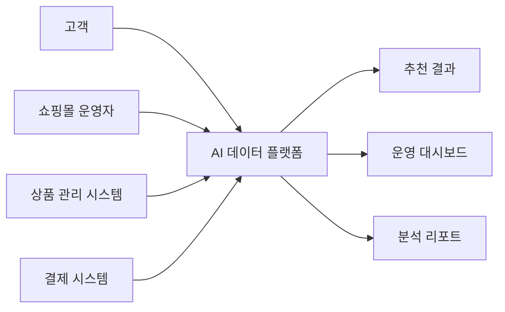
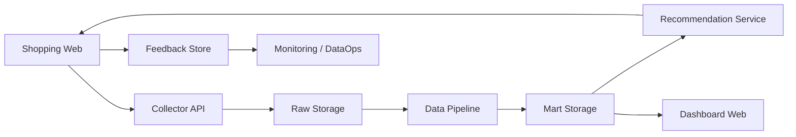
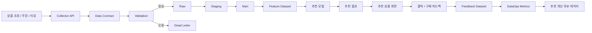

> 과정명: AI 네이티브 데이터 플랫폼 엔지니어 과정  
> 단계명: 1단계. AI 서비스와 데이터 플랫폼 아키텍처  
> 문서 목적: 산업안전 관제 플랫폼에 한정하지 않고, 쇼핑몰·교육 플랫폼·헬스케어·제조·산업안전 등 다양한 도메인에 적용할 수 있는 1단계 산출물 작성 기준을 정리한다.  
> 대표 예시 도메인: 쇼핑몰 추천 및 운영 분석 플랫폼  
> 활용 방식: 범용 작성 기준 → 대표 도메인 상세 예시 → 다른 도메인 확장 예시

---

# 0. 이 문서를 왜 만드는가?

1단계 산출물은 특정 도메인에만 묶이는 문서가 아니다.  
문서명과 작성 구조는 같게 유지하되, 안에 들어가는 내용은 도메인에 따라 바꿀 수 있다.

예를 들어 `domain-event-map.md`라는 문서명은 그대로 사용할 수 있다.

다만 산업안전에서는 다음 이벤트를 쓴다.
```text
gas_sensor_measured
worker_location_updated
alarm_created
```

쇼핑몰에서는 다음 이벤트를 쓴다.
```text
product_viewed
cart_item_added
order_created
payment_completed
review_submitted
```

즉, 산출물의 구조는 공통이고, 도메인별 내용이 달라지는 것이다.

---

# 1. 산출물 작성의 공통 원칙

1단계 산출물은 코드를 많이 작성하기 전, 프로젝트의 구조와 기준을 먼저 정리하는 문서이다.

공통 원칙은 다음과 같다.
```text
1. 문서명은 가능하면 공통으로 유지한다.
2. 문서 목적은 도메인이 달라도 거의 동일하다.
3. 핵심 내용은 선택한 도메인에 맞게 바꾼다.
4. 도메인 이벤트명은 업무 사건을 기준으로 작성한다.
5. Raw, Staging, Mart, Feature, Feedback 흐름은 모든 도메인에 적용한다.
6. 각 문서는 이후 2~7단계 구현과 어떻게 연결되는지 적는다.
```

---

# 2. 대표 예시 도메인

이 문서에서는 대표 예시 도메인으로 다음을 사용한다.
```text
쇼핑몰 추천 및 운영 분석 플랫폼
```

서비스 목적
```text
고객의 상품 조회, 장바구니, 주문, 리뷰 데이터를 바탕으로
개인화 추천, 인기 상품 분석, 주문 현황 대시보드, 추천 피드백 개선을 제공한다.
```

###### `주요 사용자`
| 사용자     | 설명                                  |
| ------- | ----------------------------------- |
| 고객      | 상품을 조회하고 주문하며 추천 상품을 클릭하거나 구매하는 사용자 |
| 쇼핑몰 운영자 | 상품, 주문, 리뷰, 추천 성과를 확인하는 관리자         |
| 마케팅 담당자 | 고객 행동과 인기 상품을 분석해 캠페인에 활용하는 사용자     |
###### `주요 데이터 소스`
| 데이터 소스   | 발생 데이터            |
| -------- | ----------------- |
| 상품 상세 화면 | 상품 조회 로그          |
| 장바구니 화면  | 장바구니 추가/삭제 이벤트    |
| 주문 API   | 주문 생성, 결제 완료 이벤트  |
| 리뷰 작성 화면 | 리뷰 작성 이벤트         |
| 추천 영역    | 추천 노출, 클릭, 무시 피드백 |
###### `주요 도메인 이벤트`
| 업무 사건             | 이벤트명                     |
| ----------------- | ------------------------ |
| 고객이 상품을 조회했다      | `product_viewed`         |
| 고객이 상품을 장바구니에 담았다 | `cart_item_added`        |
| 고객이 주문을 생성했다      | `order_created`          |
| 고객이 결제를 완료했다      | `payment_completed`      |
| 고객이 리뷰를 작성했다      | `review_submitted`       |
| 고객이 추천 상품을 클릭했다   | `recommendation_clicked` |

---

# 3. 1단계 주요 산출물 목록

| 문서명 | 역할 |
|---|---|
| `platform-scope.md` | 프로젝트에서 만들 것과 만들지 않을 것을 정리한다. |
| `ai-service-data-map.md` | AI 서비스에서 사용하는 데이터 유형을 구분한다. |
| `domain-event-map.md` | 업무 사건과 이벤트명을 정리한다. |
| `c4-context.md` | 사용자, 외부 시스템, 플랫폼의 관계를 정리한다. |
| `c4-container.md` | 시스템 내부의 큰 구성요소와 책임을 정리한다. |
| `data-flow-diagram.md` | 데이터가 발생해서 AI/RAG/대시보드/피드백으로 연결되는 흐름을 정리한다. |
| `tech-decision-table.md` | 사용할 기술과 선택 이유를 정리한다. |
| `final-demo-scenario.md` | 최종 시연에서 보여줄 흐름을 정리한다. |

---
==`platform-scope.md`==

`문서 목적`
플랫폼 범위 문서는 이번 프로젝트에서 **만드는 것과 만들지 않는 것**을 정리하는 문서이다.

이 문서는 프로젝트가 수업 시간 안에 완성 가능한 범위를 유지하도록 돕는다.

`필요한 이유`
```text
기능이 계속 늘어나는 것을 막기 위해서
팀원마다 생각하는 완성 기준을 맞추기 위해서
AI, 데이터, 대시보드, 운영 범위가 섞이지 않게 하기 위해서
포트폴리오에서 내가 구현한 범위를 명확히 설명하기 위해서
```

`작성 패턴`
```markdown
# 플랫폼 범위 문서

## 1. 문서 목적

## 2. 프로젝트 한 줄 설명

## 3. 이번 프로젝트에서 만드는 것

| 구분 | 내용 | 이유 |
|---|---|---|

## 4. 이번 프로젝트에서 만들지 않는 것

| 구분 | 내용 | 제외 이유 |
|---|---|---|

## 5. 외부 시스템으로 가정하는 것

| 외부 시스템 | 가정 |
|---|---|

## 6. 이후 단계와 연결

## 7. 완료 체크리스트
```

---
#### 대표 도메인 상세 예시: 쇼핑몰 추천 및 운영 분석 플랫폼

`프로젝트 한 줄 설명`
```text
고객 행동 데이터를 수집하고,
추천과 운영 분석에 사용할 수 있도록
Raw, Staging, Mart, Feature, Feedback 흐름을 설계한다.
```

###### `이번 프로젝트에서 만드는 것`
| 구분       | 내용                      | 이유                              |
| -------- | ----------------------- | ------------------------------- |
| 만드는 것  . | 상품 조회 이벤트 수집 구조   .     | 고객 관심 상품 분석의 출발점이기 때문           |
| 만드는 것    | 주문 생성 이벤트 수집 구조         | 구매 행동 분석과 매출 대시보드에 필요하기 때문      |
| 만드는 것    | Raw / Staging / Mart 흐름 | AI와 대시보드가 사용할 데이터셋을 만들기 위해 필요   |
| 만드는 것    | 추천 Feature Dataset 초안   | 추천 모델이 사용할 입력값을 정의하기 위해 필요      |
| 만드는 것    | 클릭 피드백 저장 구조            | 추천 성과 개선과 재학습 후보 데이터에 필요        |
| 만드는 것    | 운영 대시보드 지표 초안           | 주문 수, 인기 상품, 추천 클릭률을 확인하기 위해 필요 |
###### `이번 프로젝트에서 만들지 않는 것`
| 구분       | 내용                     | 제외 이유                              |
| -------- | ---------------------- | ---------------------------------- |
| 만들지 않는 것 | 실제 결제 PG 연동            | 수업의 핵심은 결제 연동이 아니라 데이터 흐름 설계이기 때문  |
| 만들지 않는 것 | 실제 배송사 API 연동          | 외부 물류 시스템은 범위 밖으로 둔다.              |
| 만들지 않는 것 | 고도화 추천 알고리즘            | 1단계에서는 AI 모델 구현보다 데이터 구조 설계가 우선이다. |
| 만들지 않는 것 | 실제 운영 관리자 권한 시스템 전체 구현 | 1단계에서는 사용자 역할과 화면 흐름만 정의한다.        |
###### `외부 시스템으로 가정하는 것`
| 외부 시스템    | 가정                                  |
| --------- | ----------------------------------- |
| 결제 시스템    | 결제 완료 이벤트만 들어온다고 가정                 |
| 배송 시스템    | 배송 상태 데이터는 이후 단계에서 확장 가능            |
| 추천 모델     | 1단계에서는 모델이 있다고 가정하고 필요한 Feature만 정의 |
| 로그 수집 시스템 | 상품 조회와 클릭 로그를 이벤트로 받을 수 있다고 가정      |
###### `다른 도메인 적용 예시`
| 도메인        | 만드는 것                            | 만들지 않는 것                    |
| ---------- | -------------------------------- | --------------------------- |
| 교육 플랫폼     | 강의 시청 로그, 퀴즈 제출 이벤트, 학습 참여도 Mart | 실제 화상 강의 시스템, 실시간 채팅 전체 기능  |
| 헬스케어 활동 기록 | 걸음 수, 심박수, 운동 기록 이벤트, 건강 지표 Mart | 의료 진단, 병원 EMR 직접 연동         |
| 제조 설비 이상탐지 | 설비 센서 이벤트, 이상탐지 Feature, 알람 로그   | 실제 PLC 장비 제어, 공장 자동화 전체 시스템 |
| 산업안전 관제    | 가스/전력/위치 이벤트, 위험도 Mart, 알람 피드백   | 실제 하드웨어 센서 연동, 119 신고 연동    |

---
==`ai-service-data-map.md`==

`문서 목적`
AI 서비스 데이터 맵은 AI 서비스에서 사용하는 데이터를 목적별로 구분하는 문서이다.

`필요한 이유`
```text
학습 데이터와 추론 데이터를 구분하기 위해서
AI 결과가 어디에 저장되어야 하는지 정하기 위해서
RAG 문서 데이터와 이벤트 데이터를 구분하기 위해서
피드백 데이터가 재학습 후보 데이터로 이어지게 하기 위해서
서비스 로그와 데이터 품질 지표를 놓치지 않기 위해서
```

`작성 패턴`
```markdown
# AI 서비스 데이터 맵

## 1. 문서 목적

## 2. AI 서비스 목적

## 3. 데이터 유형 정의

| 데이터 유형 | 의미 | 이 프로젝트의 예시 | 사용 위치 |
|---|---|---|---|

## 4. AI 결과와 피드백 흐름

## 5. 이후 단계와 연결

## 6. 완료 체크리스트
```

#### 대표 도메인 상세 예시: 쇼핑몰 추천 및 운영 분석 플랫폼
| 데이터 유형          | 의미                   | 쇼핑몰 예시                       | 사용 위치     |
| --------------- | -------------------- | ---------------------------- | --------- |
| 학습 데이터          | 모델을 학습시키는 과거 데이터     | 과거 상품 조회, 주문, 리뷰, 클릭 이력      | 추천 모델 학습  |
| 추론 데이터          | 지금 추천할 때 사용하는 현재 데이터 | 현재 고객의 최근 조회 상품, 장바구니 상품     | 추천 요청 시점  |
| Feature Dataset | AI 입력값으로 정리한 데이터     | 최근 7일 조회 수, 카테고리 관심도, 구매 전환율 | 추천 모델 입력  |
| AI Result       | AI가 만든 결과            | 추천 상품 목록, 추천 점수              | 추천 영역 표시  |
| RAG 데이터         | 검색 기반 답변에 사용할 문서     | 상품 FAQ, 배송/반품 정책             | 고객 상담 RAG |
| Feedback Data   | 추천 결과에 대한 사용자 반응     | 추천 클릭, 장바구니 추가, 구매, 관심 없음    | 추천 개선     |
| Service Log     | 서비스 동작 로그            | 추천 API 호출, 응답 시간, 오류 로그      | 운영 분석     |
| DataOps Metric  | 데이터 흐름 상태 지표         | 수집 성공률, 검증 실패율, 추천 클릭률       | 운영 모니터링   |

` AI 결과와 피드백 흐름`
```text
고객 행동 데이터
→ Feature Dataset
→ 추천 모델
→ 추천 결과
→ 추천 상품 화면 표시
→ 클릭 / 구매 / 무시 피드백
→ 추천 성과 분석
→ 재학습 후보 데이터
```

###### `다른 도메인 적용 예시`
| 도메인        | 학습 데이터              | 추론 데이터            | AI Result        | Feedback         |
| ---------- | ------------------- | ----------------- | ---------------- | ---------------- |
| 교육 플랫폼     | 과거 강의 시청, 퀴즈, 과제 이력 | 현재 수강생 학습 로그      | 학습 부진 가능성        | 강사 판단, 상담 필요 여부  |
| 헬스케어 활동 기록 | 과거 걸음 수, 심박수, 수면 기록 | 현재 활동량, 심박수       | 건강 이상 가능성, 활동 추천 | 사용자 확인, 목표 달성 여부 |
| 제조 설비 이상탐지 | 과거 설비 센서값, 고장 이력    | 현재 온도, 진동, 전류     | 이상 여부, 위험 점수     | 정비 결과, 실제 고장 여부  |
| 산업안전 관제    | 과거 센서값, 알람, 피드백     | 현재 가스, 전력, 위치 데이터 | 위험도, 알람          | 오탐, 정탐, 조치 완료    |

---
==`domain-event-map.md`==

`문서 목적`
도메인 이벤트 맵은 프로젝트에서 발생하는 중요한 업무 사건을 이벤트명으로 정리하는 문서이다.
이벤트명은 API, Schema, Raw 저장 경로, Staging, Mart, Feature Dataset까지 이어지는 기준이다.

`필요한 이유`
```text
기능명과 이벤트명이 섞이지 않게 하기 위해서
이벤트 이름을 팀 전체에서 일관되게 쓰기 위해서
API, Schema, 파일명, 테이블명 기준을 만들기 위해서
Raw 저장 경로와 처리 함수 이름을 정하기 위해서
```

`작성 패턴`
```markdown
# 도메인 이벤트 맵

## 1. 문서 목적

## 2. 이벤트 이름 규칙

## 3. 도메인 요소

| 도메인 요소 | 설명 |
|---|---|

## 4. 도메인 이벤트 목록

| 업무 사건 | 이벤트명 | 발생 위치 | 주요 필드 | 사용 위치 | 이후 연결 |
|---|---|---|---|---|---|

## 5. 좋은 이벤트명과 좋지 않은 이벤트명

## 6. 이후 단계와 연결

## 7. 완료 체크리스트
```

#### 대표 도메인 상세 예시: 쇼핑몰 추천 및 운영 분석 플랫폼

`이벤트 이름 규칙`
```text
snake_case를 사용한다.
기술 동작이 아니라 업무 사건을 표현한다.
가능하면 과거형 또는 완료된 사건처럼 읽히게 작성한다.
```

###### `도메인 요소`
| 도메인 요소 | 설명                  |
| ------ | ------------------- |
| 고객     | 상품을 조회하고 주문하는 사용자   |
| 상품     | 판매되는 대상             |
| 장바구니   | 구매 전 상품을 담는 공간      |
| 주문     | 고객이 구매를 요청한 기록      |
| 결제     | 주문 금액을 지불하는 과정      |
| 리뷰     | 고객이 상품에 대해 남긴 평가    |
| 추천     | AI가 고객에게 제안하는 상품 목록 |
###### `도메인 이벤트 목록`
| 업무 <br>사건         | 이벤트명                     | 발생 위치     | 주요 필드                                              | 사용 위치        | 이후 연결                       |
| ----------------- | ------------------------ | --------- | -------------------------------------------------- | ------------ | --------------------------- |
| 고객이 상품을 조회했다      | `product_viewed`         | 상품 상세 화면  | `user_id`, `product_id`, `event_time`              | 추천, 관심 상품 분석 | Raw, Staging, Mart, Feature |
| 고객이 상품을 장바구니에 담았다 | `cart_item_added`        | 장바구니 버튼   | `user_id`, `product_id`, `quantity`, `event_time`  | 구매 의도 분석     | Raw, Mart, Feature          |
| 고객이 주문을 생성했다      | `order_created`          | 주문 API    | `order_id`, `user_id`, `total_price`, `event_time` | 주문 분석        | Raw, Staging, Mart          |
| 고객이 결제를 완료했다      | `payment_completed`      | 결제 완료 API | `payment_id`, `order_id`, `amount`, `event_time`   | 매출 분석        | Raw, Mart, Dashboard        |
| 고객이 리뷰를 작성했다      | `review_submitted`       | 리뷰 작성 화면  | `review_id`, `user_id`, `product_id`, `rating`     | 상품 품질 분석     | Raw, Mart, RAG/분석           |
| 고객이 추천 상품을 클릭했다   | `recommendation_clicked` | 추천 영역     | `user_id`, `product_id`, `recommendation_id`       | 추천 성과 분석     | Feedback, DataOps           |
###### `다른 도메인 적용 예시`
| 도메인    | 업무 사건           | 이벤트명                           |
| ------ | --------------- | ------------------------------ |
| 교육 플랫폼 | 수강생이 강의를 시청했다   | `lecture_watched`              |
| 교육 플랫폼 | 수강생이 퀴즈를 제출했다   | `quiz_submitted`               |
| 헬스케어   | 사용자의 심박수가 측정되었다 | `heart_rate_measured`          |
| 헬스케어   | 사용자가 운동을 완료했다   | `workout_completed`            |
| 제조 설비  | 설비 온도가 측정되었다    | `machine_temperature_measured` |
| 제조 설비  | 설비 이상이 감지되었다    | `machine_anomaly_detected`     |
| 산업안전   | 가스 센서값이 측정되었다   | `gas_sensor_measured`          |
| 산업안전   | 알람이 생성되었다       | `alarm_created`                |

---
==`c4-context.md`==

`문서 목적`
C4 Context 문서는 시스템을 외부에서 바라보는 관계를 정리한다.

즉, 이 시스템이 누구와 연결되는지, 어떤 외부 데이터가 들어오는지, 어떤 결과를 제공하는지 보여준다.

`필요한 이유`
```text
시스템의 경계를 명확히 하기 위해서
누가 사용하는 시스템인지 설명하기 위해서
외부 시스템과 내부 시스템을 구분하기 위해서
데이터가 어디서 들어오는지 설명하기 위해서
```

`작성 패턴`
```markdown
# C4 Context 문서

## 1. 문서 목적

## 2. 시스템 한 줄 설명

## 3. 사용자와 외부 시스템

| 대상 | 유형 | 설명 | 플랫폼과의 관계 |
|---|---|---|---|

## 4. Context Mermaid 다이어그램

## 5. 이후 단계와 연결

## 6. 완료 체크리스트
```

#### 대표 도메인 상세 예시: 쇼핑몰 추천 및 운영 분석 플랫폼

`시스템 한 줄 설명`
```text
고객 행동 데이터를 기반으로 상품 추천과 운영 분석을 제공하는 AI 데이터 플랫폼
```

###### `사용자와 외부 시스템`
| 대상         | 유형              | 설명                             | 플랫폼과의 관계                    |
| ---------- | --------------- | ------------------------------ | --------------------------- |
| 고객         | 사용자             | 상품을 조회하고 주문하며 추천 결과를 클릭한다.     | 행동 이벤트와 피드백을 발생시킨다.         |
| 쇼핑몰 운영자    | 사용자             | 주문, 상품, 추천 성과를 확인한다.           | 대시보드와 리포트를 조회한다.            |
| 상품 관리 시스템  | 외부 시스템          | 상품명, 가격, 카테고리 정보를 관리한다.        | 상품 기준정보를 제공한다.              |
| 결제 시스템     | 외부 시스템          | 결제 완료 결과를 제공한다.                | 결제 이벤트를 제공한다.               |
| AI 추천 모델   | 외부 또는 내부 AI 서비스 | 고객별 추천 상품을 생성한다.               | Feature Dataset을 입력으로 사용한다. |
| AI 데이터 플랫폼 | 대상 시스템          | 행동 데이터를 수집하고 추천/분석용 데이터셋을 만든다. | 중심 시스템이다.                   |


###### `Context Mermaid 다이어그램`



###### `다른 도메인 적용 예시`
| 도메인    | 사용자                 | 외부 시스템              | 플랫폼이 제공하는 결과      |
| ------ | ------------------- | ------------------- | ----------------- |
| 교육 플랫폼 | 수강생, 강사, 운영자        | LMS, 과제 시스템, 퀴즈 시스템 | 학습 부진 예측, 학습 대시보드 |
| 헬스케어   | 사용자, 코치, 관리자        | 웨어러블 기기, 건강 기록 앱    | 활동 분석, 건강 이상 알림   |
| 제조 설비  | 설비 운영자, 정비 담당자      | 설비 센서, MES, 정비 시스템  | 이상탐지 알람, 정비 우선순위  |
| 산업안전   | 현장 작업자, 관제 운영자, 관리자 | 가스 센서, 전력 장비, 위치 장비 | 위험 알람, RAG 대응 가이드 |

---
==`c4-container.md`==

`문서 목적`
C4 Container 문서는 시스템 내부의 큰 구성요소와 책임을 정리한다.

여기서 Container는 Docker Container만 의미하지 않는다.  
C4에서 Container는 독립적으로 실행되거나 책임이 분리된 큰 단위를 의미한다.

`필요한 이유`
```text
API, DB, Pipeline, AI 서비스, Dashboard의 책임이 섞이지 않게 하기 위해서
어떤 시스템이 어떤 데이터를 담당하는지 설명하기 위해서
이후 구현 단계에서 폴더, 앱, 서비스 분리 기준을 만들기 위해서
```

`작성 패턴`
```markdown
# C4 Container 문서

## 1. 문서 목적

## 2. 시스템 내부 구성요소

| Container | 역할 | 주요 데이터 | 이후 연결 |
|---|---|---|---|

## 3. Container Mermaid 다이어그램

## 4. 책임 분리 기준

## 5. 이후 단계와 연결

## 6. 완료 체크리스트
```

#### `대표 도메인 상세 예시: 쇼핑몰 추천 및 운영 분석 플랫폼`
| Container              | 역할         | 주요 데이터                  | 이후 연결        |
| ---------------------- | ---------- | ----------------------- | ------------ |
| Shopping Web           | 고객 화면 제공   | 상품, 추천 결과, 클릭 피드백       | 화면/프론트 기능    |
| Collector API          | 행동 이벤트 수집  | 상품 조회, 장바구니, 주문, 리뷰 이벤트 | 2단계 수집 API   |
| Raw Storage            | 원본 이벤트 저장  | 원본 JSON, 원본 로그          | Raw Zone     |
| Data Pipeline          | 검증과 가공     | Staging, Mart, Feature  | 3단계 파이프라인    |
| Mart Storage           | 목적별 데이터 저장 | 고객별 관심 상품, 일별 주문 수      | 대시보드/AI      |
| Recommendation Service | 추천 결과 생성   | Feature Dataset, 추천 결과  | AI 추론        |
| Feedback Store         | 추천 반응 저장   | 클릭, 구매, 무시 피드백          | 7단계 Feedback |
| Dashboard Web          | 운영 화면 제공   | 주문 현황, 인기 상품, 추천 성과     | 운영 대시보드      |
| Monitoring             | 운영 상태 관찰   | 수집 성공률, 검증 실패율, 추천 클릭률  | DataOps      |

###### `Container Mermaid 다이어그램`



###### `다른 도메인 적용 예시`
| 도메인    | 주요 Container                                                                                                     |
| ------ | ---------------------------------------------------------------------------------------------------------------- |
| 교육 플랫폼 | Learning Web, Collector API, Raw Storage, Learning Pipeline, Prediction Service, Instructor Dashboard            |
| 헬스케어   | Activity App, Device Collector, Raw Storage, Health Pipeline, Risk Scoring Service, Health Dashboard             |
| 제조 설비  | Sensor Gateway, Collector API, Raw Storage, Anomaly Pipeline, AI Inference Service, Maintenance Dashboard        |
| 산업안전   | Sensor Simulator, Collector API, Raw Storage, Pipeline, AI Inference Service, RAG Service, Dashboard, Monitoring |

---
==`data-flow-diagram.md`==

`문서 목적`

데이터 흐름도는 데이터가 발생해서 AI/RAG/대시보드/피드백/운영 개선으로 연결되는 순서를 정리하는 문서이다.

`필요한 이유`
```text
데이터가 어디서 시작해서 어디로 가는지 설명하기 위해서
Raw, Staging, Mart의 차이를 명확히 하기 위해서
AI가 어떤 데이터를 사용하는지 설명하기 위해서
피드백이 다시 개선 데이터로 연결되게 하기 위해서
```

`작성 패턴`
```markdown
# 데이터 흐름도

## 1. 문서 목적

## 2. 전체 데이터 흐름 요약

## 3. Mermaid 데이터 흐름도

## 4. 단계별 설명

| 단계 | 설명 |
|---|---|

## 5. 이후 단계와 연결

## 6. 완료 체크리스트
```

#### 대표 도메인 상세 예시: 쇼핑몰 추천 및 운영 분석 플랫폼

`전체 데이터 흐름 요약`
```text
상품 조회 / 장바구니 / 주문 / 리뷰
→ Collector API
→ Data Contract
→ Validation
→ Raw
→ Staging
→ Mart
→ Feature Dataset
→ 추천 모델
→ 추천 결과
→ 클릭 피드백
→ DataOps Metrics
→ 추천 개선 후보 데이터
```

`Mermaid 데이터 흐름도`


###### `단계별 설명`
| 단계               | 설명                              |
| ---------------- | ------------------------------- |
| 상품 조회 / 주문 / 리뷰  | 고객 행동 데이터가 발생하는 지점              |
| Collector API    | 이벤트 데이터를 받는 입구                  |
| Data Contract    | 이벤트가 지켜야 할 필드와 타입 기준            |
| Validation       | 필수값, 타입, 시간, 중복 여부를 검증          |
| Raw              | 원본 이벤트를 보존                      |
| Dead Letter      | 검증 실패 데이터를 따로 보관                |
| Staging          | 검증된 데이터를 표준화                    |
| Mart             | 고객별 관심 상품, 상품별 조회 수, 일별 주문 수 생성 |
| Feature Dataset  | 추천 모델이 사용할 입력값 생성               |
| 추천 모델            | 고객별 추천 결과 생성                    |
| 추천 결과            | 추천 상품 목록과 추천 점수                 |
| Feedback Dataset | 클릭, 구매, 무시 반응 저장                |
| DataOps Metrics  | 수집 성공률, 검증 실패율, 추천 클릭률 확인       |
###### `다른 도메인 적용 예시`
| 도메인    | 핵심 데이터 흐름                                                                                  |
| ------ | ------------------------------------------------------------------------------------------ |
| 교육 플랫폼 | 강의 시청 → Collector API → Raw → Staging → 학습 참여도 Mart → 학습 부진 Feature → 예측 결과 → 강사 피드백       |
| 헬스케어   | 활동 기록 → Collector API → Raw → Staging → 건강 지표 Mart → 이상 가능성 Feature → 알림 → 사용자 피드백         |
| 제조 설비  | 설비 센서 → Collector API → Raw → Staging → 설비 상태 Mart → 이상탐지 Feature → 정비 알람 → 정비 결과 피드백      |
| 산업안전   | 센서/위치 이벤트 → Collector API → Raw/Dead Letter → Staging → 위험도 Mart → AIResult → 알람 → 운영자 피드백 |

---
==`tech-decision-table.md`==

`문서 목적`
기술 선택표는 프로젝트에서 사용하는 기술과 그 이유를 정리하는 문서이다.

포트폴리오에서 중요한 것은 기술명을 많이 나열하는 것이 아니라, 왜 그 기술을 선택했는지 설명하는 것이다.

`필요한 이유`
```text
기술을 왜 썼는지 설명하기 위해서
각 기술이 어느 단계에서 쓰이는지 정리하기 위해서
대체 가능 기술과 선택 기준을 말하기 위해서
```

`작성 패턴`
```markdown
# 기술 선택표

## 1. 문서 목적

## 2. 기술 선택 기준

## 3. 기술별 역할

| 기술 | 사용하는 단계 | 역할 | 선택 이유 | 대체 가능 기술 |
|---|---|---|---|---|

## 4. 이후 단계와 연결

## 5. 완료 체크리스트
```

#### 대표 도메인 상세 예시: 쇼핑몰 추천 및 운영 분석 플랫폼
| 기술                 | 사용하는 단계 | 역할                  | 선택 이유                          | 대체 가능 기술               |
| ------------------ | ------- | ------------------- | ------------------------------ | ---------------------- |
| Python             | 전체      | 데이터 처리와 실습 코드 작성    | 문법이 쉽고 데이터 처리 생태계가 좋다.         | Java, Kotlin           |
| FastAPI            | 2단계     | 이벤트 수집 API          | Pydantic 기반 검증과 API 작성이 쉽다.    | Django REST Framework  |
| PostgreSQL         | 1~7단계   | 운영 데이터와 기준정보 저장     | 주문, 상품, 고객 등 관계형 데이터 관리에 적합하다. | MySQL                  |
| Parquet            | 2~3단계   | Staging/Mart 파일 저장  | 분석용 컬럼 기반 저장에 적합하다.            | CSV, Delta Lake        |
| Airflow            | 3단계     | 파이프라인 자동화           | 반복 처리, 스케줄링, 재처리에 적합하다.        | Prefect, Dagster       |
| Kafka              | 4단계     | 실시간 이벤트 스트리밍        | 상품 조회와 주문 이벤트를 안정적으로 전달할 수 있다. | RabbitMQ, Redis Stream |
| dbt                | 5단계     | Mart SQL 변환과 품질 테스트 | SQL 기반 데이터 모델링과 테스트에 적합하다.     | SQL script             |
| Vector DB          | 6단계     | FAQ/정책 문서 검색        | RAG 검색에 필요한 임베딩 검색을 제공한다.      | FAISS, Chroma          |
| Prometheus/Grafana | 7단계     | 운영 모니터링             | 수집 지연, 오류율, 처리량 확인에 적합하다.      | CloudWatch, Datadog    |

##### `다른 도메인 적용 예시`
| 도메인    | 기술 선택에서 강조할 점                      |
| ------ | ---------------------------------- |
| 교육 플랫폼 | 학습 로그 수집, 배치 집계, 강사 대시보드           |
| 헬스케어   | 개인정보 보호, 시계열 활동 데이터, 알림            |
| 제조 설비  | 실시간 센서 이벤트, 이상탐지, 정비 피드백           |
| 산업안전   | 센서/위치 이벤트, 알람, RAG 안전 매뉴얼, 운영 모니터링 |

---
==`final-demo-scenario.md`==

`문서 목적`
최종 시연 시나리오 문서는 프로젝트 마지막에 어떤 흐름을 보여줄지 정리하는 문서이다.

학생은 이 문서를 통해 “내가 만든 플랫폼이 어떤 문제를 어떻게 해결하는지” 설명할 수 있어야 한다.

`필요한 이유`
```text
완성 기준을 명확히 하기 위해서
데모 때 무엇을 보여줄지 정리하기 위해서
데이터 수집부터 피드백까지의 흐름을 설명하기 위해서
포트폴리오 발표가 기능 나열로 끝나지 않게 하기 위해서
```

`작성 패턴`
```markdown
# 최종 시연 시나리오

## 1. 문서 목적

## 2. 시연 목표

## 3. 시연 사용자

## 4. 시연 데이터

## 5. 시연 흐름

| 순서 | 장면 | 설명 | 관련 데이터 |
|---|---|---|---|

## 6. 성공 기준

## 7. 이후 단계와 연결

## 8. 완료 체크리스트
```

#### 대표 도메인 상세 예시: 쇼핑몰 추천 및 운영 분석 플랫폼

`시연 목표`
```text
고객의 상품 조회 이벤트가 수집되고,
Raw/Staging/Mart/Feature를 거쳐 추천 결과와 피드백으로 연결되는 흐름을 보여준다.
```

###### `시연 사용자`
| 사용자     | 역할                         |
| ------- | -------------------------- |
| 고객      | 상품을 조회하고 추천 상품을 클릭한다.      |
| 쇼핑몰 운영자 | 대시보드에서 추천 성과와 인기 상품을 확인한다. |
###### `시연 흐름`
| 순서  | 장면                    | 설명                                       | 관련 데이터           |
| --- | --------------------- | ---------------------------------------- | ---------------- |
| 1   | 고객이 상품 상세 페이지 조회      | `product_viewed` 이벤트 발생                  | 상품 조회 로그         |
| 2   | Collector API가 이벤트 수집 | 이벤트 원본 수집                                | Raw              |
| 3   | Staging 검증            | `user_id`, `product_id`, `event_time` 검증 | Staging          |
| 4   | Mart 생성               | 고객별 관심 상품 집계                             | Mart             |
| 5   | 추천 Feature 생성         | 최근 조회 수, 카테고리 관심도 계산                     | Feature Dataset  |
| 6   | 추천 결과 표시              | 고객에게 추천 상품 노출                            | AI Result        |
| 7   | 고객이 추천 상품 클릭          | `recommendation_clicked` 피드백 발생          | Feedback Dataset |
| 8   | 운영자 대시보드 확인           | 추천 클릭률과 인기 상품 확인                         | DataOps Metrics  |

###### `성공 기준`
```text
상품 조회 이벤트가 수집된다.
Raw/Staging/Mart 흐름을 설명할 수 있다.
추천 Feature와 추천 결과의 관계를 설명할 수 있다.
클릭 피드백이 개선 데이터로 저장되는 흐름을 설명할 수 있다.
```

###### `다른 도메인 적용 예시`
| 도메인    | 최종 시연 흐름                                     |
| ------ | -------------------------------------------- |
| 교육 플랫폼 | 강의 시청 → 학습 참여도 집계 → 학습 부진 예측 → 강사 피드백        |
| 헬스케어   | 심박수/활동 기록 → 건강 지표 생성 → 이상 가능성 알림 → 사용자 피드백   |
| 제조 설비  | 설비 센서값 수집 → 이상탐지 Feature → 정비 알람 → 정비 결과 피드백 |
| 산업안전   | 가스/전력/위치 이벤트 → 위험 판단 → 알람 → 운영자 피드백 → 재학습 후보 |

---

# 12. 보조 산출물 작성 기준
저장소나 수업 운영 방식에 따라 다음 보조 문서가 함께 사용될 수 있다.

==`project-overview.md`==

| 항목     | 내용                                        |
| ------ | ----------------------------------------- |
| 문서 목적  | 프로젝트 전체 개요를 한눈에 설명한다.                     |
| 필요한 이유 | 프로젝트 목적, 사용자, 데이터, 결과물을 빠르게 공유하기 위해 필요하다. |
| 작성 내용  | 프로젝트 목적, 도메인, 사용자, 주요 기능, 주요 데이터, 최종 결과물  |
###### `도메인별 예시`
| 도메인  | 프로젝트 한 줄 설명                                |
| ---- | ------------------------------------------ |
| 쇼핑몰  | 고객 행동 데이터를 기반으로 추천과 운영 분석을 제공하는 AI 데이터 플랫폼 |
| 교육   | 학습 로그를 기반으로 학습 부진 예측과 강사 대시보드를 제공하는 플랫폼    |
| 제조   | 설비 센서 데이터를 기반으로 이상탐지와 정비 알림을 제공하는 플랫폼      |
| 산업안전 | 센서와 위치 데이터를 기반으로 위험 알람과 대응 가이드를 제공하는 플랫폼   |

---
==`data-source-map.md`==

| 항목 | 내용 |
|---|---|
| 문서 목적 | 데이터가 어디서 발생하는지 정리한다. |
| 필요한 이유 | Collector API, Raw 저장소, 이벤트 설계의 출발점이 된다. |
| 작성 내용 | 데이터 소스, 발생 데이터, 수집 방식, 사용 목적 |

##### 대표 예시: 쇼핑몰
| 데이터 소스   | 발생 데이터      | 수집 방식         | 사용 목적      |
| -------- | ----------- | ------------- | ---------- |
| 상품 상세 화면 | 상품 조회 이벤트   | Web Log / API | 추천 Feature |
| 장바구니 화면  | 장바구니 추가 이벤트 | API           | 구매 의도 분석   |
| 주문 API   | 주문 생성 이벤트   | API           | 매출/주문 Mart |
| 리뷰 작성 화면 | 리뷰 이벤트      | API           | 상품 품질 분석   |
| 추천 영역    | 추천 클릭 피드백   | API           | 추천 성과 개선   |

---
==`threshold-definition.md`==

| 항목 | 내용 |
|---|---|
| 문서 목적 | 위험, 이상, 우선순위, 알림 기준을 정의한다. |
| 필요한 이유 | AI 판단 전후의 규칙 기반 기준을 명확히 하기 위해 필요하다. |
| 작성 내용 | 기준명, 조건, 수준, 사용 위치 |

###### `도메인별 예시`
| 도메인  | 기준 예시                              |
| ---- | ---------------------------------- |
| 쇼핑몰  | 재고 부족 기준, 이탈 위험 고객 기준, 인기 상품 기준    |
| 교육   | 학습 부진 기준, 미제출 위험 기준, 낮은 참여도 기준     |
| 헬스케어 | 심박수 이상 기준, 활동 부족 기준                |
| 제조   | 온도 이상 기준, 진동 이상 기준, 고장 위험 기준       |
| 산업안전 | 가스 농도 위험 기준, 전력 과부하 기준, 위험구역 진입 기준 |

---
==`baseline-data-flow.md`==

| 항목 | 내용 |
|---|---|
| 문서 목적 | 프로젝트 기준선 단계에서 예상 데이터 흐름을 간단히 정리한다. |
| 필요한 이유 | 1단계 아키텍처 문서로 확장하기 전, 큰 흐름을 잡기 위해 필요하다. |
| 작성 내용 | 데이터 소스 → 수집 → 저장 → 처리 → 활용 흐름 |

---
==`current-state.md`==

| 항목 | 내용 |
|---|---|
| 문서 목적 | 현재 프로젝트의 준비 상태와 제약을 정리한다. |
| 필요한 이유 | 실습 시작 전 어떤 상태에서 출발하는지 공유하기 위해 필요하다. |
| 작성 내용 | 현재 완료된 것, 아직 없는 것, 가정하는 것, 다음 단계에서 할 것 |

---
==`branch-roadmap.md`==

| 항목 | 내용 |
|---|---|
| 문서 목적 | 단계별 브랜치 전략과 작업 순서를 정리한다. |
| 필요한 이유 | 학생들이 어떤 브랜치에서 어떤 산출물을 작성해야 하는지 혼란을 줄이기 위해 필요하다. |
| 작성 내용 | 단계명, 브랜치명, 주요 작업, 산출물, 완료 기준 |

---
==`baseline-completion-checklist.md`==

| 항목 | 내용 |
|---|---|
| 문서 목적 | 기준선 단계가 완료되었는지 확인한다. |
| 필요한 이유 | 다음 단계로 넘어가기 전에 누락된 문서나 설정을 점검하기 위해 필요하다. |
| 작성 내용 | 체크리스트, 확인 방법, 비고 |

---

# 13. 도메인별 산출물 작성 요약표

| 산출물 | 쇼핑몰 | 교육 플랫폼 | 헬스케어 | 제조 설비 | 산업안전 |
|---|---|---|---|---|---|
| `platform-scope.md` | 추천/주문 분석 범위 | 학습 분석 범위 | 활동/건강 지표 범위 | 설비 이상탐지 범위 | 위험 관제 범위 |
| `ai-service-data-map.md` | 추천 데이터 유형 | 학습 예측 데이터 유형 | 건강 지표 데이터 유형 | 설비 센서 데이터 유형 | 위험 판단 데이터 유형 |
| `domain-event-map.md` | `product_viewed` 등 | `lecture_watched` 등 | `heart_rate_measured` 등 | `machine_anomaly_detected` 등 | `gas_sensor_measured` 등 |
| `c4-context.md` | 고객/운영자/결제 시스템 | 수강생/강사/LMS | 사용자/웨어러블/코치 | 설비/운영자/MES | 센서/운영자/매뉴얼 |
| `c4-container.md` | Shopping Web, Collector API | Learning Web, Pipeline | Activity App, Health Pipeline | Sensor Gateway, AI Service | Collector, RAG, Dashboard |
| `data-flow-diagram.md` | 행동 이벤트 → 추천 Feature | 학습 로그 → 부진 예측 | 활동 기록 → 건강 알림 | 센서값 → 이상 알람 | 센서/위치 → 위험 알람 |
| `tech-decision-table.md` | 추천/분석 중심 기술 | 학습 로그/대시보드 기술 | 시계열/보안 중심 기술 | 실시간/센서 중심 기술 | 이벤트/RAG/모니터링 기술 |
| `final-demo-scenario.md` | 상품 조회 → 추천 → 클릭 피드백 | 강의 시청 → 예측 → 강사 피드백 | 심박수 측정 → 알림 → 피드백 | 센서 이상 → 정비 알림 | 가스 감지 → 알람 → 조치 피드백 |

---

# 14. 실습 지시문

아래 도메인 중 하나를 선택한다.
```text
쇼핑몰 추천 및 운영 분석 플랫폼
교육 플랫폼 학습 분석 시스템
헬스케어 활동 기록 분석 시스템
제조 설비 이상탐지 시스템
산업안전 관제 플랫폼
```

선택한 도메인에 대해 다음 산출물을 작성한다.
```text
1. platform-scope.md
2. ai-service-data-map.md
3. domain-event-map.md
4. c4-context.md
5. c4-container.md
6. data-flow-diagram.md
7. tech-decision-table.md
8. final-demo-scenario.md
```

각 문서는 다음 공통 구조를 따른다.
```markdown
# 문서 제목

## 1. 문서 목적

## 2. 작성 기준

## 3. 핵심 내용

## 4. 이후 단계와 연결

## 5. 완료 체크리스트
```

1단계에서 중요한 것은 완성된 코드를 만드는 것이 아니다.

해야 할 일은 다음을 설명할 수 있게 만드는 것이다.
```text
이 도메인에서 데이터는 어디서 발생하는가?
어떤 업무 사건이 이벤트가 되는가?
이벤트명은 무엇인가?
데이터는 어떤 흐름으로 Raw, Staging, Mart, Feature로 이동하는가?
AI는 어떤 판단을 하는가?
대시보드는 어떤 결과를 보여주는가?
피드백은 어떻게 개선 데이터가 되는가?
```

---

# 15. 마지막 정리
산업안전 관제 플랫폼은 하나의 실습 도메인일 뿐이다.
1단계 산출물은 쇼핑몰, 교육, 헬스케어, 제조, 산업안전 등 다양한 도메인에 적용할 수 있다.

핵심은 문서명을 바꾸는 것이 아니다.
```text
문서명과 작성 구조는 공통으로 유지하고,
도메인 요소, 이벤트명, 데이터 소스, Mart, Feature, Dashboard, Feedback 내용을
선택한 도메인에 맞게 바꾸는 것이다.
```

따라서 다음을 기억하면 된다.
```text
산출물은 산업안전 전용 문서가 아니다.
산출물은 어떤 도메인을 선택해도 AI 데이터 플랫폼 구조를 설명하기 위한 공통 문서이다.
```

### 🔗 [[1단계_AI서비스와_데이터플랫폼_아키텍처_이론수업#9. 산출물별 작성 방법]]