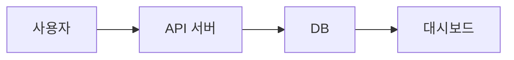
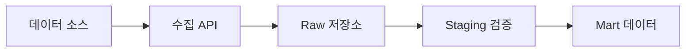
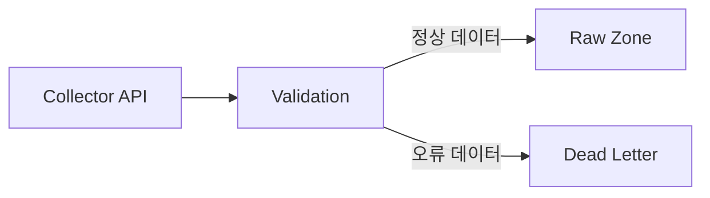
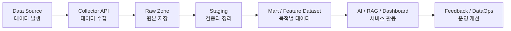
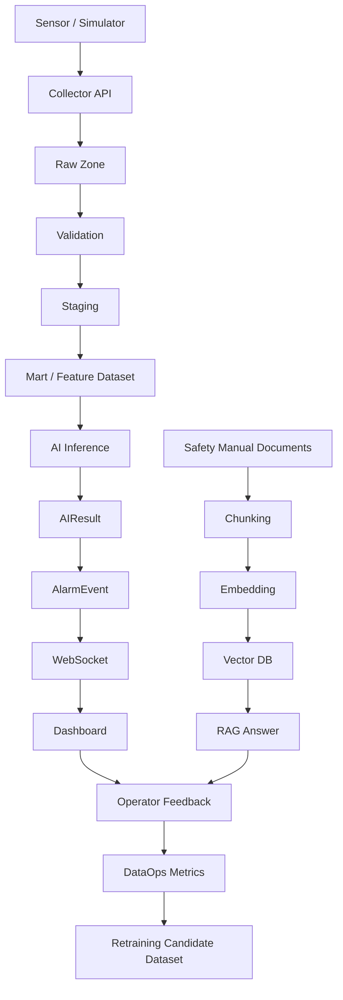
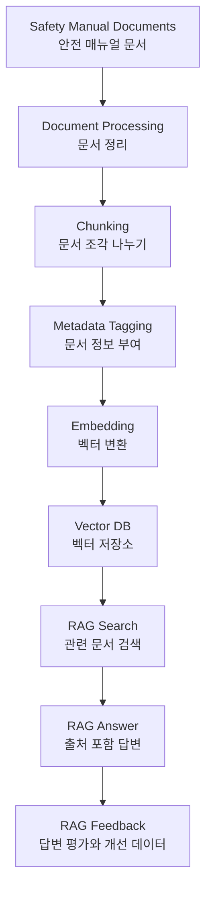
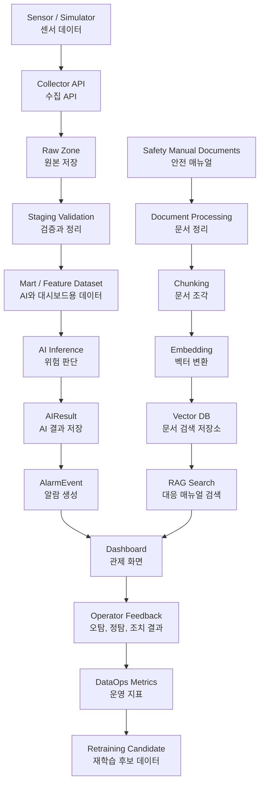
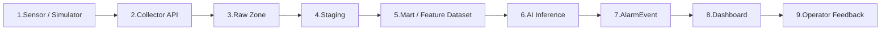
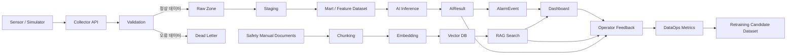

### ==`아키텍처를 직접 그려보는 방법`==
아키텍처를 이해했다면, 이제 그것을 그림으로 표현할 수 있어야 한다.

처음부터 복잡한 전문 설계 도구를 사용할 필요는 없다.  
주니어 단계에서는 먼저 **Mermaid 코드**로 데이터 흐름과 시스템 구조를 표현하는 것부터 시작하면 좋다.

Mermaid는 Markdown 문서 안에서 다이어그램을 그릴 수 있게 해주는 문법이다.

쉽게 말하면 다음과 같다.
```text
Mermaid = 글로 작성하는 다이어그램 도구
```

예를 들어 다음처럼 코드를 작성하면 데이터 흐름도를 만들 수 있다.
```
flowchart LR
    A[사용자] --> B[API 서버]
    B --> C[DB]
    C --> D[대시보드]
```



이 다이어그램은 다음 의미를 가진다.
```text
사용자가 API 서버로 요청한다.
API 서버는 DB에 데이터를 저장하거나 조회한다.
DB의 데이터는 대시보드에서 조회된다.
```

즉, Mermaid는 복잡한 디자인 도구 없이도  
**시스템 구성요소와 데이터 흐름을 빠르게 표현하는 방법**이다.

---

### ==`Mermaid를 사용하는 이유`==
1단계에서는 코드를 많이 작성하기보다 시스템의 전체 구조를 이해하는 것이 중요하다.

Mermaid를 사용하면 다음 장점이 있다.
```text
Markdown 문서 안에 바로 작성할 수 있다.
GitHub나 Obsidian에서 확인하기 쉽다.
텍스트 기반이라 Git으로 변경 이력을 관리할 수 있다.
그림을 수정할 때 코드만 고치면 된다.
데이터 흐름과 시스템 구조를 빠르게 표현할 수 있다.
```

처음에는 예쁜 그림보다 **구조가 맞는 그림**이 더 중요하다.

즉, 1단계에서 Mermaid를 사용하는 목적은 디자인이 아니라 다음을 확인하기 위한 것이다.
```text
데이터가 어디서 시작되는가?
어떤 시스템을 거쳐 이동하는가?
어디에 저장되는가?
AI와 RAG는 어느 위치에 있는가?
대시보드는 어떤 데이터를 보는가?
피드백은 어디로 다시 연결되는가?
```

---

### ==`Mermaid 기본 문법`==

Mermaid에서 가장 많이 사용하는 것은 `flowchart`이다.
```text
flowchart LR
```

여기서 `LR`은 Left to Right의 약자이다.
```text
LR = 왼쪽에서 오른쪽으로 흐름
TD = 위에서 아래로 흐름
```

예시는 다음과 같다.
```
flowchart LR
    A[데이터 소스] --> B[수집 API]
    B --> C[Raw 저장소]
    C --> D[Staging 검증]
    D --> E[Mart 데이터]
```


위 코드는 다음 흐름을 의미한다.
```text
데이터 소스
→ 수집 API
→ Raw 저장소
→ Staging 검증
→ Mart 데이터
```

---

### ==`Mermaid에서 자주 쓰는 기호`==

|문법|의미|예시|
|---|---|---|
|`A[이름]`|사각형 노드|`A[Collector API]`|
|`A --> B`|A에서 B로 이동|`Raw --> Staging`|
|`A -->|설명|B`|
|`flowchart LR`|왼쪽에서 오른쪽 흐름|전체 데이터 흐름|
|`flowchart TD`|위에서 아래 흐름|계층형 구조|
|`subgraph 이름`|영역 묶기|API 영역, 저장소 영역|

예를 들어 정상 데이터와 오류 데이터를 나누고 싶다면 다음처럼 작성할 수 있다.
```
flowchart LR
    A[Collector API] --> B[Validation]
    B -->|정상 데이터| C[Raw Zone]
    B -->|오류 데이터| D[Dead Letter]
```


이 구조는 다음을 의미한다.
```text
Collector API가 데이터를 받는다.
Validation에서 데이터가 정상인지 검사한다.
정상 데이터는 Raw Zone에 저장한다.
오류 데이터는 Dead Letter에 따로 보관한다.
```

---

### ==`Mermaid 작성 순서`==

처음 아키텍처를 그릴 때는 다음 순서로 작성하면 좋다.
```text
1. 데이터가 처음 발생하는 곳을 적는다.
2. 데이터를 받는 시스템을 적는다.
3. 원본 데이터가 저장되는 위치를 적는다.
4. 검증과 가공 단계를 적는다.
5. AI, RAG, 대시보드가 사용하는 데이터를 적는다.
6. 피드백과 운영 모니터링이 다시 연결되는 흐름을 적는다.
```

이 순서를 코드로 바꾸면 다음과 같다.
```text
Data Source
→ Collector API
→ Raw
→ Staging
→ Mart / Feature Dataset
→ AI / RAG / Dashboard
→ Feedback / DataOps
```

Mermaid로 작성하면 다음과 같다.
```
flowchart LR
    A[Data Source<br/>데이터 발생] --> B[Collector API<br/>데이터 수집]
    B --> C[Raw Zone<br/>원본 저장]
    C --> D[Staging<br/>검증과 정리]
    D --> E[Mart / Feature Dataset<br/>목적별 데이터]
    E --> F[AI / RAG / Dashboard<br/>서비스 활용]
    F --> G[Feedback / DataOps<br/>운영 개선]
```


---

### ==`산업안전 관제 플랫폼 아키텍처 예시`==

산업안전 관제 플랫폼에서는 다음 데이터가 발생한다.
```text
가스 센서 데이터
전력 사용량 데이터
작업자 위치 데이터
안전 매뉴얼 문서
운영자 피드백
서비스 로그
```

이 데이터를 AI 네이티브 데이터 플랫폼 구조로 보면 다음 흐름이 된다.
```text
Sensor / Simulator
→ Collector API
→ Raw Zone
→ Staging Validation
→ Mart / Feature Dataset
→ AI Inference
→ Alarm Event
→ Dashboard
→ Operator Feedback
→ DataOps / Retraining Candidate
```

Mermaid 코드로 작성하면 다음과 같다.
==Mermaid에서 앞에 붙은 `S`, `C`, `R`, `V`, `ST` 같은 것은 노드를 구분하기 위한 내부 ID이다.==
```
flowchart TD
    S[Sensor / Simulator] --> C[Collector API]
    C --> R[Raw Zone]
    R --> V[Validation]
    V --> ST[Staging]
    ST --> M[Mart / Feature Dataset]
    M --> AI[AI Inference]
    AI --> AR[AIResult]
    AR --> AL[AlarmEvent]
    AL --> WS[WebSocket]
    WS --> DB[Dashboard]

    DOC[Safety Manual Documents] --> CH[Chunking]
    CH --> EMB[Embedding]
    EMB --> VDB[Vector DB]
    VDB --> RAG[RAG Answer]

    DB --> FB[Operator Feedback]
    RAG --> FB
    FB --> OPS[DataOps Metrics]
    OPS --> RETRAIN[Retraining Candidate Dataset]
```


GPT로 시각화한 이미지
![[Pasted image 20260709153135.png]]

Notebook LM으로 시각화 한 이미지
![[Pasted image 20260709154304.png]]

![[Pasted image 20260709155443.png]]

이 그림은 산업안전 관제 플랫폼의 전체 흐름을 단순하게 보여준다.

중요한 것은 다음이다.
```text
센서 데이터가 들어온다.
원본은 Raw에 저장한다.
Staging에서 검증한다.
Mart와 Feature Dataset으로 가공한다.
AI가 위험도를 판단한다.
알람이 생성된다.
대시보드에 표시된다.
운영자 피드백이 다시 개선 데이터가 된다.
```

---

### ==`RAG 흐름까지 포함한 아키텍처 예시`==
산업안전 관제 플랫폼에서는 센서 데이터뿐 아니라 안전 매뉴얼 문서도 중요하다.

안전 매뉴얼은 RAG 검색을 위해 다음 흐름으로 처리된다.
```text
안전 매뉴얼 문서
→ 문서 정리
→ Chunking
→ Metadata 부여
→ Embedding
→ Vector DB 저장
→ RAG 검색
→ 답변과 출처 제공
→ 피드백 저장
```

Mermaid로 작성하면 다음과 같다.
```
flowchart TD
    A[Safety Manual Documents<br/>안전 매뉴얼 문서] --> B[Document Processing<br/>문서 정리]
    B --> C[Chunking<br/>문서 조각 나누기]
    C --> D[Metadata Tagging<br/>문서 정보 부여]
    D --> E[Embedding<br/>벡터 변환]
    E --> F[Vector DB<br/>벡터 저장소]
    F --> G[RAG Search<br/>관련 문서 검색]
    G --> H[RAG Answer<br/>출처 포함 답변]
    H --> I[RAG Feedback<br/>답변 평가와 개선 데이터]
```


이 그림은 RAG가 단순히 질문에 답하는 기능이 아니라,  
문서 데이터를 검색 가능한 데이터로 바꾸는 파이프라인이라는 것을 보여준다.

---

### ==`전체 아키텍처 통합 예시`==

센서 데이터 흐름과 RAG 문서 흐름을 함께 보면 다음과 같다.
```
flowchart TD
    S[Sensor / Simulator<br/>센서 데이터] --> C[Collector API<br/>수집 API]
    C --> R[Raw Zone<br/>원본 저장]
    R --> V[Staging Validation<br/>검증과 정리]
    V --> M[Mart / Feature Dataset<br/>AI와 대시보드용 데이터]
    M --> AI[AI Inference<br/>위험 판단]
    AI --> AR[AIResult<br/>AI 결과 저장]
    AR --> AL[AlarmEvent<br/>알람 생성]
    AL --> DB[Dashboard<br/>관제 화면]

    DOC[Safety Manual Documents<br/>안전 매뉴얼] --> DP[Document Processing<br/>문서 정리]
    DP --> CH[Chunking<br/>문서 조각]
    CH --> EMB[Embedding<br/>벡터 변환]
    EMB --> VDB[Vector DB<br/>문서 검색 저장소]
    VDB --> RAG[RAG Search<br/>대응 매뉴얼 검색]
    RAG --> DB

    DB --> FB[Operator Feedback<br/>오탐, 정탐, 조치 결과]
    FB --> OPS[DataOps Metrics<br/>운영 지표]
    OPS --> RT[Retraining Candidate<br/>재학습 후보 데이터]
```


이 통합 그림에서 확인해야 할 것은 다음이다.
```text
센서 데이터 흐름과 문서 데이터 흐름은 다르다.
센서 데이터는 Raw, Staging, Mart, Feature Dataset으로 이동한다.
문서 데이터는 Chunking, Embedding, Vector DB로 이동한다.
두 흐름은 대시보드와 운영 피드백에서 만난다.
피드백은 다시 DataOps와 재학습 후보 데이터로 연결된다.
```

---

### ==`Mermaid 다이어그램을 시각화하는 방법`==
Mermaid 코드는 Markdown 문서 안에 작성할 수 있다.

시각화는 수업 환경에 따라 다음 방법 중 하나를 사용하면 된다.
```text
Obsidian에서 Mermaid 미리보기로 확인하기
GitHub README 또는 Markdown 파일에서 확인하기
VSCode의 Markdown Preview 또는 Mermaid 확장 기능으로 확인하기
Mermaid Live Editor 같은 웹 도구에서 확인하기
```

노트북LM 같은 AI 도구는 문서 내용을 이해하고 설명받는 용도로 사용할 수 있다.  
다만 수업에서는 특정 유료 AI 도구에 의존하지 않고, 가능한 한 **Markdown과 Mermaid 코드만으로 산출물을 남기는 방식**을 권장한다.

이렇게 해야 무료 사용자도 같은 방식으로 실습할 수 있고, GitHub 포트폴리오에도 그대로 남길 수 있다.

---

### ==`작은 실습: 아키텍처를 Mermaid로 그려보기`==

아래 조건을 보고 Mermaid 다이어그램을 작성해보자.

실습 조건:
```text
1. 센서 또는 시뮬레이터에서 데이터가 발생한다.
2. Collector API가 데이터를 받는다.
3. 정상 데이터는 Raw Zone에 저장된다.
4. Staging에서 데이터가 검증된다.
5. Mart 또는 Feature Dataset으로 가공된다.
6. AI가 위험도를 판단한다.
7. 알람이 생성된다.
8. 대시보드에 표시된다.
9. 운영자 피드백이 저장된다.
```

작성해야 할 Mermaid 기본 구조:



이 기본 구조에 다음을 추가해본다.
```text
Dead Letter
AIResult
Vector DB
RAG Search
DataOps Metrics
Retraining Candidate
```

Dead Letter
```
Dead Letter = 검증에 실패한 데이터를 따로 보관하는 저장소
```

정상 데이터만 저장하는 것이 아니라, 오류가 있는 데이터도 나중에 원인을 분석하거나 다시 처리할 수 있도록 보관하는 공간이다.

왜 필요한가?
```
필수값이 없는 데이터
잘못된 타입의 데이터
허용되지 않은 단위
잘못된 날짜 형식
```
이런 데이터를 그냥 버리면 원인을 찾을 수 없다.

따라서
```
Validation
→ 정상 → Raw Zone
→ 오류 → Dead Letter
```
위치에 들어가는 것이 자연스럽다.

---
AIResult
```
AIResult = AI가 판단한 결과를 저장하는 데이터
```

AI는 판단만 하고 끝나면 안 된다.

나중에
```
AI가 왜 이렇게 판단했는가?
오탐이었는가?
정탐이었는가?
```
를 확인하기 위해 결과를 반드시 저장한다.

예를 들면
```
위험 점수
이상 여부
모델 버전
판단 시간
```
같은 정보가 저장된다.

따라서
```
AI Inference
→ AIResult
→ AlarmEvent
```
위치에 들어가는 것이 자연스럽다.

---
Vector DB
```
Vector DB = 문서를 검색하기 위해 벡터 형태로 저장하는 데이터베이스
```
센서 데이터는 Raw → Staging → Mart로 이동하지만,

문서는
```
문서
→ Chunking
→ Embedding
→ Vector DB
```
순서로 처리된다.

Vector DB에는
```
안전 매뉴얼
FAQ
작업 절차
정책 문서
```
같은 문서의 벡터가 저장된다.

---
RAG Search
```
RAG Search = Vector DB에서 관련 문서를 찾아오는 과정
```

AI가 질문에 답할 때
```
"관련 문서가 무엇인가?"
```
를 먼저 찾는다.

즉,
```
Vector DB
→ RAG Search
→ RAG Answer
```
순서가 된다.

RAG Search는 문서를 찾는 과정이고,
RAG Answer는 사용자에게 보여주는 답변이다.

---
DataOps Metrics
```
DataOps Metrics = 데이터 플랫폼이 정상적으로 운영되는지 확인하는 운영 지표
```

AI 서비스에서는 데이터도 운영해야 한다.

대표적인 운영 지표는
```
수집 성공률
검증 실패율
데이터 지연
AI 추론 시간
RAG 검색 성공률
알람 발생 횟수
```
등이다.

따라서
```
Operator Feedback
→ DataOps Metrics
```

위치에 연결하면 된다.

---
Retraining Candidate Dataset
```
Retraining Candidate Dataset = AI를 다시 학습할 때 사용할 후보 데이터
```

운영자가
```
오탐이었다.
미탐이었다.
AI가 틀렸다.
```
라고 남긴 데이터는 매우 중요하다.

이 데이터는 나중에
```
모델 개선
재학습
성능 평가
```
에 사용된다.

따라서
```
Operator Feedback
→ DataOps Metrics
→ Retraining Candidate Dataset
```
흐름으로 연결된다.

정답
```
flowchart LR
    A[Sensor / Simulator] --> B[Collector API]

    B --> C[Validation]
    C -->|정상 데이터| D[Raw Zone]
    C -->|오류 데이터| DL[Dead Letter]

    D --> E[Staging]
    E --> F[Mart / Feature Dataset]

    F --> G[AI Inference]
    G --> AR[AIResult]
    AR --> H[AlarmEvent]
    H --> I[Dashboard]

    DOC[Safety Manual Documents] --> CH[Chunking]
    CH --> EMB[Embedding]
    EMB --> VDB[Vector DB]
    VDB --> RAG[RAG Search]
    RAG --> I

    I --> J[Operator Feedback]
    RAG --> J
    AR --> J

    J --> OPS[DataOps Metrics]
    OPS --> RT[Retraining Candidate Dataset]
```

---

### ==`실습 결과 확인 질문`==

다이어그램을 작성한 뒤 다음 질문에 답해보자.
```text
1. 데이터는 어디서 처음 발생하는가?
2. 원본 데이터는 어디에 저장되는가?
3. 검증은 어느 단계에서 이루어지는가?
4. AI가 사용하는 데이터는 어느 단계에서 만들어지는가?
5. 대시보드는 어떤 결과를 보여주는가?
6. 피드백은 어디로 다시 연결되는가?
```

이 질문에 답할 수 있으면 단순히 그림을 그린 것이 아니라,  
아키텍처의 의미를 이해한 것이다.

---

### ==`정리`==
Mermaid 다이어그램은 1단계에서 아키텍처를 이해하기 위한 좋은 도구이다.

처음에는 복잡한 그림을 그리려고 하지 않아도 된다.  
먼저 다음 흐름만 정확히 표현할 수 있으면 된다.
```text
Data Source
→ Collector API
→ Raw
→ Staging
→ Mart / Feature Dataset
→ AI / RAG / Dashboard
→ Feedback / DataOps
```

중요한 것은 그림을 예쁘게 만드는 것이 아니다.

중요한 것은 다음을 설명할 수 있는 것이다.
```text
데이터가 어디서 시작되는가?
어디에 저장되는가?
어디에서 검증되는가?
AI와 RAG는 어떤 데이터를 사용하는가?
피드백은 어떻게 다시 개선 데이터가 되는가?
```

따라서 1단계에서는 Mermaid를 사용해 아키텍처를 글과 그림으로 함께 설명하는 연습을 한다.

### 🔗 [[1단계_AI서비스와_데이터플랫폼_아키텍처_이론수업#왜 1단계에서 아키텍처를 먼저 그리는가?]]