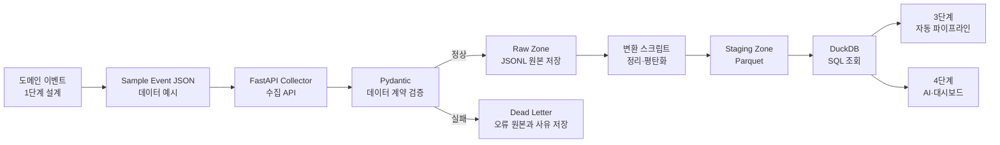

> 과정명: AI 네이티브 데이터 플랫폼 엔지니어 과정  
> 학습 위치: 0단계 기준선 → 1단계 아키텍처·도메인 설계 → **2단계 데이터 수집·레이크하우스 구현** → 3단계 파이프라인 자동화  
> 대표 실습 도메인: 산업안전 관제 플랫폼  
> 범용 적용 도메인: 쇼핑몰, 교육, 제조, 금융, 헬스케어, 공공데이터, AI 서비스  
> 학습 목표: 코드를 복사하는 것이 아니라, 선택한 도메인의 데이터를 직접 정의하고 수집·검증·저장·변환하는 기준을 설명하고 구현한다.

---
# PART A. 2단계의 위치와 전체 연결

---
## 1. 2단계는 무엇을 만드는 단계인가?

0단계에서는 프로젝트가 실행될 수 있는 기준선을 만들었다.
```text
가상환경
→ 프로젝트 기본 폴더
→ Django 화면 구조
→ Git과 GitHub 기준
→ 공통 실행 환경
```

1단계에서는 코드를 작성하기 전에 서비스와 데이터의 설계 기준을 만들었다.
```text
서비스 목적
→ 사용자와 외부 시스템
→ 도메인 요소
→ 도메인 이벤트
→ C4 Context
→ C4 Container
→ 데이터 흐름
→ 기술 선택
→ 최종 시연 시나리오
```

2단계에서는 1단계에서 정의한 이벤트가 실제 데이터가 되어 프로젝트 안으로 들어오게 만든다.
```text
1단계의 도메인 이벤트
→ 2단계의 Sample Event JSON

1단계의 데이터 흐름
→ 2단계의 Collector API

1단계의 데이터 기준
→ 2단계의 Pydantic 데이터 계약

1단계의 Raw / Staging 설계
→ 2단계의 data_lake 폴더와 파일

1단계의 기술 선택
→ 2단계의 FastAPI, JSONL, Parquet, DuckDB
```
---
###### ==`용어설명`==
| 용어                     | 짧은 설명                                    | 2단계에서의 역할                                      |
| ---------------------- | ---------------------------------------- | ---------------------------------------------- |
| **Sample Event JSON**  | 실제로 들어올 데이터를 미리 작성한 예제 JSON 파일           | API 테스트와 데이터 구조 확인에 사용한다.                      |
| **Collector API**      | 외부 시스템의 데이터를 받아들이는 수집용 API               | 센서, 로그, 사용자 피드백 등의 데이터를 받는다.                   |
| **Pydantic 데이터 계약**    | 들어오는 데이터의 필드, 타입, 필수값을 검사하는 Python 기반 규칙 | 잘못된 데이터가 저장되지 않도록 검증한다.                        |
| **`data_lake` 폴더와 파일** | 수집한 데이터를 처리 단계별로 보관하는 저장 구조              | Raw, Staging, Mart, Dead Letter 데이터를 구분해 저장한다. |
| **FastAPI**            | Python으로 데이터 수집 API를 만드는 웹 프레임워크         | Collector API를 구현한다.                           |
| **JSONL**              | JSON 객체를 한 줄에 하나씩 저장하는 파일 형식             | 계속 들어오는 원본 이벤트를 Raw에 쌓는다.                      |
| **Parquet**            | 컬럼 단위로 저장하는 분석용 파일 형식                    | 검증하고 정리한 Staging 데이터를 효율적으로 저장한다.              |
| **DuckDB**             | CSV나 Parquet 파일을 SQL로 조회하는 가벼운 분석 도구     | Staging 데이터가 정상적으로 만들어졌는지 확인한다.                |

```
Sample Event JSON
→ 실제로 들어올 데이터의 예시

Collector API
→ 외부 데이터를 받는 입구

Pydantic 데이터 계약
→ 들어온 데이터가 약속된 구조인지 검사하는 기준

data_lake 폴더와 파일
→ 데이터를 Raw, Staging, Mart 등 처리 단계별로 저장하는 공간

FastAPI
→ Collector API를 만드는 도구

JSONL
→ Raw 원본 이벤트를 한 줄씩 저장하는 형식

Parquet
→ Staging 데이터를 분석하기 좋게 저장하는 형식

DuckDB
→ Parquet 데이터를 SQL로 조회하고 확인하는 도구
```

---
따라서 2단계는 새로운 내용을 따로 만드는 단계가 아니다.  
1단계에서 문서와 그림으로 설계한 내용을 **실행 가능한 데이터 구조와 코드로 옮기는 첫 단계**다.

2단계의 핵심 질문은 다음과 같다.
```text
AI가 사용할 데이터를
어떻게 일관된 형식으로 받고,
어떻게 검증하며,
어떻게 원본으로 보존하고,
어떻게 분석 가능한 데이터로 바꿀 것인가?
```
---
## 2. 2단계가 끝나면 설명할 수 있어야 하는 것

2단계를 마친 뒤에는 다음 질문에 자신의 말로 답할 수 있어야 한다.
```
1. 우리 도메인에서 어떤 데이터가 발생하는가?
2. 그 데이터는 어떤 업무 사건을 의미하는가?
3. 모든 이벤트에 공통으로 필요한 필드는 무엇인가?
4. 도메인별 상세 데이터는 왜 `payload`에 넣는가?
5. 데이터 계약은 왜 필요하며 Pydantic은 무엇을 검사하는가?
6. 정상 데이터와 오류 데이터는 어디로 가는가?
7. Raw는 왜 보존하며 JSONL을 사용하는 이유는 무엇인가?
8. Staging은 Raw와 무엇이 다르며 Parquet를 사용하는 이유는 무엇인가?
9. DuckDB는 어떤 역할을 하는가?
10. 이 구조가 3단계 자동화, 4단계 AI, 6단계 RAG, 7단계 DataOps와 어떻게 연결되는가?
```

---
## 3. 2단계 전체 흐름

```text
데이터 발생
→ Sample Event JSON으로 먼저 표현
→ FastAPI Collector API로 전송
→ Pydantic 데이터 계약 검증
→ 정상 데이터: Raw JSONL 저장
→ 오류 데이터: Dead Letter JSONL 저장
→ Raw JSONL 읽기
→ 구조 정리와 평탄화
→ Staging Parquet 생성
→ DuckDB SQL 조회
→ 이후 Mart, AI 학습 데이터셋, 대시보드로 확장
```

```
flowchart LR
    A[도메인 이벤트<br/>1단계 설계] --> B[Sample Event JSON<br/>데이터 예시]
    B --> C[FastAPI Collector<br/>수집 API]
    C --> D[Pydantic<br/>데이터 계약 검증]

    D -->|정상| E[Raw Zone<br/>JSONL 원본 저장]
    D -->|실패| F[Dead Letter<br/>오류 원본과 사유 저장]

    E --> G[변환 스크립트<br/>정리·평탄화]
    G --> H[Staging Zone<br/>Parquet]
    H --> I[DuckDB<br/>SQL 조회]

    I --> J[3단계<br/>자동 파이프라인]
    I --> K[4단계<br/>AI·대시보드]
```


![[Pasted image 20260710113659.png]]

---
# PART B. 범용 도메인으로 먼저 이해하기

---
## 4. 도메인이 달라도 데이터 처리 원리는 같다

산업안전 관제 플랫폼의 가스 센서 데이터만 외우면 다른 프로젝트에서 다시 설계하기 어렵다.  
중요한 것은 특정 필드가 아니라 공통 설계 원리다.

| 도메인 | 발생 이벤트 | Raw에 보존할 원본 | Staging에서 확인·정리할 것 | 이후 활용 데이터 |
|---|---|---|---|---|
| 쇼핑몰 | 상품 조회, 주문 생성, 결제 완료 | 주문·행동 원본 JSON | 금액 타입, 주문 ID, 시간, 상태 | 일별 매출, 추천 Feature |
| 교육 | 강의 시청, 퀴즈 제출 | 학습 활동 로그 | 학생 ID, 점수 범위, 제출 시간 | 학습 참여도, 학습 부진 후보 |
| 제조 | 온도 측정, 진동 측정 | 설비 센서 원본 | 단위, 범위, 센서 ID, 지연 | 이상탐지 Feature, 정비 우선순위 |
| 금융 | 거래 승인, 인증 실패 | 거래·인증 원본 | 금액, 계정 ID, 시간, 중복 | 이상거래 후보, 위험 점수 |
| 헬스케어 활동 | 심박수 측정, 운동 완료 | 웨어러블 원본 | 단위, 측정 시간, 기기 ID | 활동 요약, 이상 패턴 후보 |
| 산업안전 | 가스 측정, 전력 측정, 위치 갱신 | 센서·위치 원본 | 필수값, 타입, 단위, 시간 | 위험도, 알람, AI 학습 후보 |
| AI 서비스 | 추론 완료, RAG 답변 생성 | 요청·응답·지연 로그 | 모델 버전, 상태, 지연시간 | 품질 지표, 비용·성능 분석 |

공통 흐름은 다음과 같다.
```text
업무 사건
→ 이벤트 데이터
→ 데이터 계약
→ 수집
→ 원본 보존
→ 검증·표준화
→ 목적별 활용
→ 피드백과 품질 개선
```

---
## 5. 하나의 예시를 여러 도메인으로 바꾸는 방법

산업안전의 `gas_sensor_measured`를 그대로 외우지 않는다.  
이벤트 설계 패턴을 이해한다.

| 설계 항목 | 산업안전 | 쇼핑몰 | 교육 |
|---|---|---|---|
| 업무 사건 | 가스가 측정되었다 | 주문이 생성되었다 | 퀴즈가 제출되었다 |
| `event_type` | `gas_sensor_measured` | `order_created` | `quiz_submitted` |
| 식별자 | `sensor_id` | `order_id` | `submission_id` |
| 주체 | 센서 | 고객 | 수강생 |
| 주요 값 | CO, H2S, O2 | 금액, 상품 수 | 점수, 제출 답 |
| 발생 시간 | 측정 시간 | 주문 시간 | 제출 시간 |
| 이후 활용 | 위험 판단 | 매출·추천 | 학습 분석 |

도메인이 정해지면 먼저 다음 문장을 작성한다.
```text
누가 또는 무엇이
언제
어떤 사건을 발생시켰고
어떤 값이 함께 기록되며
이 데이터는 나중에 어디에 사용되는가?
```

이 문장에 답할 수 있으면 이벤트 JSON의 뼈대를 만들 수 있다.

### 🔗 [[2단계_미니프로젝트_Raw 원본 저장까지]] 상세설명클릭

---
## 확인 문제 1

문제
1. 1단계의 `domain-event-map.md`와 2단계의 `sample_events/*.json`은 어떤 관계인가?
2. 쇼핑몰에서 고객이 상품을 장바구니에 담았다. 적절한 이벤트명과 `payload` 필드 3개를 작성하라.
3. “데이터가 들어오면 바로 대시보드 DB에 저장하면 되므로 Raw는 필요 없다”라는 의견의 문제점을 2가지 작성하라.

<details>
<summary>정답과 해설 보기</summary>

1. `domain-event-map.md`는 업무 사건과 이벤트 이름을 정의한 설계 문서이고, `sample_events/*.json`은 그 설계를 실제 데이터 예시로 표현한 결과물이다.<br>
2. 예: `cart_item_added`, `user_id`, `product_id`, `quantity`.<br>
3. 원본이 없으면 오류 발생 시 재검증하기 어렵고, 스키마나 변환 로직이 바뀌었을 때 과거 데이터를 다시 처리하기 어렵다. AI 학습 데이터의 출처와 변경 이력도 추적하기 어려워진다.

</details>

---
# PART C. 반드시 알아야 하는 핵심 용어

---
## 6. 데이터 소스, 이벤트, 레코드

==`데이터 소스`==
데이터가 처음 발생하거나 전달되는 곳이다.
```text
센서
웹 화면
모바일 앱
외부 API
업무 시스템
AI 모델
RAG 서비스
사용자 피드백 화면
```

==`이벤트`==
업무에서 이미 발생한 중요한 사건이다.

좋은 이벤트명은 기술 동작보다 업무 사건을 표현한다.
```text
좋은 예
order_created
payment_completed
quiz_submitted
machine_temperature_measured
gas_sensor_measured

피해야 할 예
save_data
send_json
api_called
button_clicked
```

`api_called`도 운영 로그 이벤트로는 사용할 수 있지만, 주문 생성이라는 업무 사건을 표현할 때는 `order_created`가 더 명확하다.

==`레코드`==
저장된 데이터 한 건이다.
```text
이벤트 = 발생한 사건
레코드 = 그 사건을 저장한 데이터 한 건
```

---
## 7. JSON과 JSONL

==`JSON`==

JSON은 시스템 사이에서 데이터를 주고받을 때 많이 사용하는 텍스트 형식이다.
```json
{
  "event_id": "order-001",
  "event_type": "order_created",
  "event_time": "2026-07-21T09:00:00+09:00",
  "payload": {
    "order_id": "ORD-001",
    "user_id": "USER-101",
    "total_amount": 58000
  }
}
```

==`JSONL`==

JSONL은 JSON Lines의 줄임말이다.  
한 줄에 JSON 객체 하나를 저장한다.
```json
{"event_id":"order-001","event_type":"order_created"}
{"event_id":"order-002","event_type":"order_created"}
{"event_id":"order-003","event_type":"order_created"}
```

수집 데이터는 계속 들어오므로 파일 끝에 한 줄씩 추가하기 쉬운 JSONL이 Raw 저장에 적합하다.
```text
이벤트 1건 수신 → JSON 1줄 추가
이벤트 1건 수신 → JSON 1줄 추가
이벤트 1건 수신 → JSON 1줄 추가
```

---
## 8. Schema와 데이터 계약

Schema는 데이터의 구조와 타입을 정의한 설계도다.
```text
어떤 필드가 필요한가?
어떤 필드가 필수인가?
문자열인가 숫자인가?
허용되는 값은 무엇인가?
중첩 구조는 어떻게 되는가?
```

데이터 계약은 단순한 파일 형식보다 넓은 개념이다.
```text
Schema
+ 필드 의미
+ 단위
+ 필수 여부
+ 품질 기준
+ 버전 정책
+ 생산자와 소비자의 약속
= 데이터 계약
```

예를 들어 `temperature: 30`만 있으면 섭씨인지 화씨인지 알 수 없다.  
데이터 계약에는 타입뿐 아니라 의미와 단위도 포함해야 한다.

---
## 9. Pydantic

Pydantic은 Python 타입을 이용해 입력 데이터를 검증하는 도구다.
```python
class OrderPayload(BaseModel):
    order_id: str
    user_id: str
    total_amount: float
```

이 모델은 다음 기준을 표현한다.
```text
order_id는 문자열이어야 한다.
user_id는 문자열이어야 한다.
total_amount는 숫자여야 한다.
```

Pydantic은 데이터 계약을 실행 가능한 코드로 만든다.
```text
문서의 계약
→ 사람이 읽는 기준

Pydantic 모델
→ 프로그램이 실제로 검사하는 기준
```

---
## 10. 공통 필드와 payload

이벤트는 공통 정보와 도메인별 상세 정보로 나눈다.
```json
{
  "event_id": "gas-001",
  "event_type": "gas_sensor_measured",
  "schema_version": "1.0.0",
  "source_system": "sensor_simulator",
  "event_time": "2026-07-21T09:00:00+09:00",
  "trace_id": "trace-001",
  "correlation_id": "corr-001",
  "zone_id": "ZONE-A",
  "quality_status": "raw",
  "payload": {
    "sensor_id": "GAS-001",
    "unit": "ppm",
    "co": 23.5,
    "h2s": 3.1
  }
}
```

| 필드 | 역할 |
|---|---|
| `event_id` | 이벤트 한 건을 고유하게 구분 |
| `event_type` | 어떤 업무 사건인지 구분 |
| `schema_version` | 데이터 구조의 버전 |
| `source_system` | 데이터가 발생한 시스템 |
| `event_time` | 실제 사건이 발생한 시간 |
| `trace_id` | 하나의 요청 흐름 추적 |
| `correlation_id` | 서로 관련된 여러 이벤트 연결 |
| `zone_id` | 현장·지역·조직 등 범위 식별 |
| `quality_status` | 데이터 품질 상태 |
| `payload` | 이벤트 종류별 상세 데이터 |

모든 프로젝트가 위 필드를 무조건 전부 사용해야 하는 것은 아니다.  
필드는 서비스 목적과 추적 요구사항에 따라 선택한다. 다만 식별자, 이벤트 유형, 발생 시간, 출처, 상세 데이터는 대부분의 이벤트 플랫폼에서 중요한 기준이다.

---
## 11. Validation과 Dead Letter

Validation은 데이터가 계약을 지키는지 검사하는 과정이다.

검사 예시는 다음과 같다.
```text
필수 필드가 있는가?
타입이 맞는가?
날짜 형식이 맞는가?
허용된 단위인가?
값의 범위가 타당한가?
지원하는 schema_version인가?
```

검증 실패 데이터를 바로 버리면 원인을 조사할 수 없다.  
그래서 실패한 원본과 오류 사유를 Dead Letter에 저장한다.
```text
정상
→ Raw Zone

검증 실패
→ Dead Letter
→ 원본 요청 + 실패 시각 + 실패 이유 + 발생 위치
```

Dead Letter는 쓰레기통이 아니다.  
데이터 품질 문제를 추적하고 재처리하기 위한 실패 보관 영역이다.

---
## 12. Data Lake와 Lakehouse

==`Data Lake`==
정형·반정형·비정형 데이터를 원본에 가깝게 대량 저장하는 구조다.

==`Data Warehouse`==
정리된 데이터를 분석과 보고에 사용하기 좋은 테이블 구조로 관리한다.

==`Lakehouse`==
Data Lake의 유연한 원본 저장과 Data Warehouse의 분석 편의성을 함께 추구한다.

2단계에서는 클라우드 저장소 대신 로컬 폴더로 개념을 실습한다.
```text
data_lake/
├── raw/
├── staging/
├── mart/
├── dead_letter/
└── _metadata/
```

| 영역 | 목적 | 대표 형식 |
|---|---|---|
| `raw/` | 원본 보존과 재처리 | JSONL |
| `staging/` | 검증·표준화·평탄화 | Parquet |
| `mart/` | 대시보드·AI·리포트 목적별 데이터 | Parquet 또는 테이블 |
| `dead_letter/` | 실패 데이터와 오류 사유 | JSONL |
| `_metadata/` | 처리 이력, 마커, 품질 정보 | JSON 등 |

---
## 13. Raw, Staging, Mart

==`Raw`==
들어온 데이터를 원본에 가깝게 보존하는 영역이다.
Raw의 목적은 “바로 사용”이 아니라 “원본 보존과 재처리 가능성”이다.

==`Staging`==
Raw를 읽어 분석 가능한 공통 구조로 정리하는 중간 영역이다.
```text
중첩 payload 평탄화
타입 정리
컬럼명 표준화
시간 형식 통일
필요한 품질 검사
Parquet 저장
```

==`Mart`==
특정 사용자와 목적에 맞게 만든 활용 데이터셋이다.
```text
일별 매출 Mart
고객별 구매 요약 Mart
설비 위험 상태 Mart
학습 참여도 Mart
알람 요약 Mart
AI 학습 후보 Dataset
```

2단계의 중심은 Raw와 Staging이다.  
Mart 폴더와 개념은 준비하지만, 목적별 Mart의 본격 생성과 자동화는 이후 단계에서 확장한다.

---
## 14. Parquet와 DuckDB

Parquet는 컬럼 기반 분석용 파일 형식이다.
```text
JSONL
→ 계속 들어오는 이벤트를 원본으로 쌓기 편함

Parquet
→ 필요한 컬럼을 빠르게 읽고 분석하기 편함
```

DuckDB는 CSV·JSON·Parquet 같은 파일을 SQL로 조회할 수 있는 가벼운 분석 엔진이다.
```sql
SELECT *
FROM read_parquet('data_lake/staging/gas_events/gas_events.parquet')
LIMIT 10;
```

DuckDB로 조회한다는 것은 Staging 결과가 실제 분석 가능한 구조인지 확인한다는 의미다.

---
#### 확인 문제 2

문제
```
1. Schema와 데이터 계약의 차이를 설명하라.
2. 검증 실패 데이터를 바로 삭제하지 않고 Dead Letter에 저장하는 이유를 3가지 작성하라.
3. Raw JSONL과 Staging Parquet의 목적 차이를 설명하라.
```

<details>
<summary>정답과 해설 보기</summary>

1. Schema는 필드, 타입, 필수 여부 같은 데이터 구조를 정의한다. 데이터 계약은 Schema에 필드 의미, 단위, 품질 기준, 버전 정책, 생산자·소비자의 책임까지 포함한 더 넓은 약속이다.<br>
2. 실패 원인 분석, 외부 시스템 오류 추적, 데이터 계약 문제 확인, 수정 후 재처리, 품질 지표 산출 등에 필요하다.<br>
3. Raw JSONL은 들어온 원본을 지속적으로 보존하고 재처리하기 위한 형식이다. Staging Parquet는 타입·컬럼·구조를 정리하여 분석과 AI 활용에 적합하게 만든 형식이다.

</details>

---
# PART D. 8개 질문으로 직접 설계하기

---

## 15. 8개 질문과 실제 산출물의 연결

2단계에서 사용하는 8개 질문은 단순히 생각을 정리하기 위한 질문이 아니다.  
각 질문에 대한 답은 실제 JSON 파일, Python 코드, 저장 폴더, 문서로 구현된다.
```text
설계 질문
→ 결정 기준
→ 실제 파일과 코드
→ 실행 결과
```

| 설계 질문 | 결정하는 내용 | 실제 산출물 |
|---|---|---|
| 1. 어떤 데이터가 들어오는가? | 수집할 데이터의 종류와 데이터 소스 | `sample_events/*.sample.json` |
| 2. 그 데이터는 어떤 사건을 의미하는가? | 업무 사건과 `event_type` | `domain-event-map.md`, `event_type` |
| 3. 반드시 있어야 하는 필드는 무엇인가? | 필수값, 타입, 형식, 범위 | `collector/schemas/events.py`, JSON Schema |
| 4. 상세 값은 어디에 넣을 것인가? | 공통 필드와 `payload`의 구분 | Sample Event JSON, Pydantic 모델 |
| 5. 정상과 오류를 어떻게 구분할 것인가? | 검증 규칙과 실패 처리 기준 | Pydantic Validation, Raw, Dead Letter |
| 6. 원본은 어디에 저장할 것인가? | 데이터셋명, 저장 경로, 파티션 기준 | `data_lake/raw/`, JSONL |
| 7. 분석하기 좋은 형식으로 어떻게 바꿀 것인가? | 평탄화, 타입 정리, Parquet 변환 | `scripts/raw_to_staging_parquet.py`, Staging Parquet |
| 8. 다른 사람이 이해하도록 어디에 문서화할 것인가? | 데이터 계약과 저장 구조의 공유 기준 | `docs/*.md` |

질문별 연결 관계를 간단히 정리하면 다음과 같다.
```text
어떤 데이터가 들어오는가?
→ sample_events/*.json

그 데이터는 어떤 사건인가?
→ event_type

필수 필드는 무엇인가?
→ Pydantic Schema

상세 값은 어디에 넣는가?
→ payload

정상과 오류를 어떻게 구분하는가?
→ Validation / Raw / Dead Letter

원본은 어디에 저장하는가?
→ data_lake/raw/

분석용으로 어떻게 바꾸는가?
→ Staging Parquet

어디에 설명하는가?
→ docs/*.md
```

> 8개 질문은 설계 순서이고, JSON·Python 코드·폴더·문서는 그 질문에 답한 결과물이다.

---
## 16. 질문 1. 어떤 데이터가 들어오는가?

먼저 데이터 소스와 수집 대상을 정한다.

| 데이터 소스 | 발생 데이터 | 발생 주기 | 데이터 소비자 |
|---|---|---|---|
| 센서 | 가스 농도 | 1초 | 위험 판단 AI |
| 쇼핑몰 화면 | 상품 조회 | 사용자 행동 시 | 추천 모델 |
| LMS | 퀴즈 제출 | 제출 시 | 학습 분석 |
| AI API | 추론 로그 | 요청 시 | 운영 모니터링 |

결과 산출물:
```text
sample_events/*.sample.json
```

---
## 17. 질문 2. 그 데이터는 어떤 사건을 의미하는가?

값의 이름보다 업무 사건을 먼저 정의한다.
```text
가스 센서값이 측정되었다.
→ gas_sensor_measured

주문이 생성되었다.
→ order_created

퀴즈가 제출되었다.
→ quiz_submitted
```

결과 산출물:
```text
event_type
docs/data-contract.md
collector/schemas/events.py
```

---
## 18. 질문 3. 반드시 있어야 하는 필드는 무엇인가?

필수 필드는 데이터가 없어서는 안 되는 최소 조건이다.

다음 질문으로 판단한다.
```text
이 필드가 없으면 이벤트 한 건을 구분할 수 있는가?
언제 발생했는지 알 수 있는가?
어디서 왔는지 알 수 있는가?
어떤 사건인지 알 수 있는가?
분석과 추적이 가능한가?
```

결과 산출물:
```text
Pydantic BaseModel
JSON Schema
데이터 계약 문서
```

---
## 19. 질문 4. 상세 값은 어디에 넣을 것인가?

공통 메타데이터는 바깥에 두고, 이벤트별 상세 값은 `payload`에 둔다.
```text
공통
→ event_id, event_type, event_time, source_system

가스 payload
→ sensor_id, co, h2s, o2

주문 payload
→ order_id, user_id, total_amount

퀴즈 payload
→ student_id, quiz_id, score
```

결과 산출물:
```text
sample_events/*.json
collector/schemas/events.py
```

---
## 20. 질문 5. 정상과 오류를 어떻게 구분할 것인가?

검증 규칙을 정한다.

| 검증 종류 | 예시 |
|---|---|
| 필수값 | `event_id`가 있는가? |
| 타입 | 금액이 숫자인가? |
| 형식 | 시간이 ISO 8601 형식인가? |
| 허용값 | 단위가 `ppm`, `%`, `ppb` 중 하나인가? |
| 범위 | 퀴즈 점수가 0~100인가? |
| 버전 | 지원하는 `schema_version`인가? |

결과 산출물:
```text
Pydantic Validation
정상 → Raw
실패 → Dead Letter
```

---
## 21. 질문 6. 원본은 어디에 저장할 것인가?

데이터셋과 시간 기준으로 경로를 설계한다.
```text
data_lake/raw/
└── gas_events/
    └── date=2026-07-21/
        └── hour=09/
            └── gas_events.jsonl
```

날짜와 시간으로 나누는 것을 파티셔닝이라고 한다.

장점:
```text
특정 기간만 읽을 수 있다.
파일이 지나치게 커지는 것을 줄인다.
장애 구간을 찾기 쉽다.
이후 Airflow·Spark가 기간별로 처리하기 쉽다.
```

---
## 22. 질문 7. 분석하기 좋은 형식으로 어떻게 바꿀 것인가?

Raw의 중첩 JSON을 평평한 테이블 구조로 정리한다.

Raw:
```json
{
  "event_id": "gas-001",
  "payload": {
    "sensor_id": "GAS-001",
    "co": 23.5
  }
}
```

Staging:
```text
event_id | sensor_id | co
gas-001  | GAS-001   | 23.5
```

결과 산출물:
```text
scripts/raw_to_staging_parquet.py
data_lake/staging/<dataset>/<dataset>.parquet
```

---
## 24. 질문 8. 다른 사람이 이해하도록 어디에 문서화할 것인가?

코드만으로는 필드 의미와 설계 이유를 모두 전달하기 어렵다.

| 문서 | 설명 |
|---|---|
| `docs/data-contract.md` | 이벤트, 필드, 타입, 단위, 필수 여부 |
| `docs/lakehouse-layout.md` | Raw·Staging·Mart·Dead Letter 구조 |
| `docs/collector-api.md` | API 경로, 요청·응답, 오류 |
| `docs/schema-version-policy.md` | 스키마 변경과 호환 기준 |
| `docs/raw-staging-mart.md` | 각 계층의 목적과 책임 |

한 줄로 정리하면 다음과 같다.
```text
질문은 설계 기준이고,
파일·폴더·코드는 그 기준을 구현한 결과물이다.
```

---
# PART E. 2단계 프로젝트 구조와 코드의 책임

---

## 23. 전체 폴더 구조

```text
project-root/
├── config/                         # 0단계 Django 설정
├── pages/                          # 0단계 Django 앱
├── templates/                      # 사람이 보는 화면
├── static/                         # CSS, JavaScript, 이미지
│
├── collector/                      # 2단계 FastAPI 수집 서버
│   ├── __init__.py
│   ├── __main__.py
│   ├── main.py
│   ├── core/
│   │   ├── config.py
│   │   └── lakehouse.py
│   ├── schemas/
│   │   └── events.py
│   ├── routes/
│   │   ├── collect.py
│   │   └── schema.py
│   └── services/
│       └── ingest.py
│
├── schemas/                        # 외부 공유용 JSON Schema
├── sample_events/                  # API 테스트용 JSON
├── scripts/                        # 생성·변환·조회 스크립트
├── data_lake/
│   ├── raw/
│   ├── staging/
│   ├── mart/
│   ├── dead_letter/
│   └── _metadata/
├── docs/                           # 설계 문서
├── seed/                           # 임계치 등 초기 기준 데이터
├── requirements.txt                # 기존 프로젝트 의존성
└── requirements-stage2.txt         # 2단계 의존성
```

---

## 25. Django와 FastAPI의 역할

| 구분 | Django | FastAPI Collector |
|---|---|---|
| 주요 사용자 | 운영자, 관리자 | 센서, 앱, 외부 시스템 |
| 주요 역할 | 화면, 관리자, 백오피스 | JSON 수집, 검증, 저장 |
| 기본 포트 | 8000 | 8001 |
| 2단계 상태 | 기존 기준선 유지 | 새 데이터 입구 추가 |

```text
Django
→ 사람이 보는 서비스

FastAPI Collector
→ 기계와 시스템이 보내는 데이터를 받는 입구
```

두 프레임워크를 무조건 함께 사용해야 하는 것은 아니다.  
이번 실습에서는 기존 Django 화면 구조를 유지하면서 데이터 수집 책임을 분리하고 Pydantic 기반 검증을 명확히 경험하기 위해 FastAPI Collector를 추가한다.

---

## 26. collector 내부 책임

| 경로 | 책임 | 질문 |
|---|---|---|
| `main.py` | 앱 생성, 라우터 등록, 예외 처리 | 서버는 어디서 시작하는가? |
| `routes/collect.py` | 수집 API 주소 | 어느 URL로 받는가? |
| `schemas/events.py` | Pydantic 데이터 계약 | 어떤 데이터만 허용하는가? |
| `services/ingest.py` | 수집 처리 흐름 | 검증된 데이터를 어떻게 처리하는가? |
| `core/lakehouse.py` | 경로 생성과 JSONL 저장 | 실제 파일은 어디에 쓰는가? |
| `core/config.py` | 공통 경로와 설정 | 환경별 설정을 어디서 관리하는가? |

처리 순서:
```text
HTTP 요청
→ routes
→ schemas 검증
→ services 처리
→ core 저장
→ Raw JSONL
```

한 파일에 모든 코드를 넣지 않는 이유는 역할을 분리하여 수정, 테스트, 확장을 쉽게 하기 위해서다.

---

## 27. Pydantic 모델과 JSON Schema

```text
collector/schemas/events.py
→ Python 프로그램이 실행 중 검증하는 계약

schemas/*.schema.json
→ 외부 개발자, 테스트 도구, 문서에서 공유하는 계약
```

둘을 따로 수동 작성하면 내용이 달라질 수 있다.  
가능하면 Pydantic 모델을 기준으로 JSON Schema를 자동 생성하여 하나의 기준을 유지한다.

```text
Pydantic Model
→ generate_json_schemas.py
→ JSON Schema
```

---

## 28. sample_events의 역할

샘플 이벤트는 단순 예시 파일이 아니다.
```text
데이터 계약의 사용 예
API 테스트 입력
수업 실습 데이터
오류 재현 자료
문서 예시
자동 테스트의 기초
```

정상 샘플과 오류 샘플을 함께 만든다.
```text
stage2_gas_sensor_event.sample.json
stage2_invalid_gas_sensor_event.sample.json
```

오류 샘플은 Validation과 Dead Letter 흐름을 확인하기 위해 필요하다.

---

## 29. scripts의 역할

| 스크립트 | 입력 | 처리 | 출력 |
|---|---|---|---|
| `generate_json_schemas.py` | Pydantic 모델 | JSON Schema 생성 | `schemas/*.schema.json` |
| `raw_to_staging_parquet.py` | Raw JSONL | 읽기·평탄화·타입 정리 | Staging Parquet |
| `query_lakehouse_duckdb.py` | Staging Parquet | SQL 조회 | 조회 결과 |

2단계에서는 수동으로 실행하여 흐름을 이해한다.  
3단계에서는 이 작업을 파이프라인과 스케줄러로 자동화한다.

---

## 30. requirements 파일

`requirements.txt`는 프로젝트 실행에 필요한 Python 패키지 목록이다.
```text
requirements.txt
→ 기존 Django 기준선

requirements-stage2.txt
→ FastAPI, Pydantic, Pandas, PyArrow, DuckDB 등 2단계 패키지
```

예:
```text
fastapi
uvicorn[standard]
pydantic
python-dotenv
pandas
pyarrow
duckdb
```

패키지 버전은 실습 환경과 호환성을 확인한 뒤 고정하거나 범위를 지정한다.

---

## 31. `.gitignore`와 `.gitkeep`

실행할 때 생성되는 Raw·Parquet 데이터는 Git에 계속 올리지 않는다.
```gitignore
data_lake/raw/**
data_lake/staging/**
data_lake/mart/**
data_lake/dead_letter/**
data_lake/_metadata/**
```

Git은 빈 폴더를 추적하지 않으므로 폴더 구조를 저장하기 위해 `.gitkeep` 같은 빈 파일을 둘 수 있다.
```gitignore
data_lake/raw/**
!data_lake/raw/.gitkeep
```

`.gitkeep`은 Git의 공식 기능이 아니라 빈 폴더를 저장소에 남기기 위해 관례적으로 사용하는 파일명이다.

---
#### 확인 문제 3

문제
```
1. `routes`, `schemas`, `services`, `core`를 나누는 이유를 설명하라.
2. Pydantic 모델과 JSON Schema의 관계를 설명하라.
3. Raw 데이터 파일은 `.gitignore`로 제외하면서 `.gitkeep`은 남기는 이유를 설명하라.
```

<details>
<summary>정답과 해설 보기</summary>

1. API 주소, 데이터 검증, 처리 로직, 저장·설정 책임을 분리하여 코드 변경의 영향을 줄이고 테스트와 확장을 쉽게 하기 위해서다.<br>
2. Pydantic 모델은 Python 실행 중 데이터를 검증하는 코드 기반 계약이고, JSON Schema는 같은 계약을 외부 시스템·문서·테스트 도구와 공유하는 표준 형식이다. Pydantic을 기준으로 자동 생성하면 두 기준의 불일치를 줄일 수 있다.<br>
3. 실행 데이터는 크고 계속 변경되므로 Git에서 제외한다. 그러나 빈 폴더는 Git이 추적하지 않으므로 프로젝트의 Lakehouse 구조를 유지하기 위해 `.gitkeep`을 예외로 포함한다.

</details>

---
# PART F. 실습 전에 코드가 왜 필요한지 이해하기

---
## 32. API 요청 한 건의 여행

가스 샘플 이벤트를 전송한다고 가정한다.
```bash
curl -X POST http://127.0.0.1:8001/api/collect/gas \
  -H "Content-Type: application/json" \
  -d @sample_events/stage2_gas_sensor_event.sample.json
```

처리 흐름:
```text
1. curl이 JSON 파일을 읽는다.
2. POST 요청으로 Collector API에 보낸다.
3. FastAPI route가 요청을 받는다.
4. Pydantic이 필수값과 타입을 검증한다.
5. service가 저장할 레코드를 준비한다.
6. lakehouse 저장 코드가 날짜·시간 파티션을 만든다.
7. 정상 데이터는 Raw JSONL에 한 줄 추가된다.
8. 실패 데이터는 오류 사유와 함께 Dead Letter에 저장된다.
9. Raw 변환 스크립트가 JSONL을 읽는다.
10. payload를 평탄화하고 Parquet로 저장한다.
11. DuckDB가 Parquet를 SQL로 조회한다.
```

---

## 33. 코드와 산출물 연결표

| 설계 질문 | 코드·파일 | 실행 결과 |
|---|---|---|
| 어떤 데이터인가? | `sample_events/*.json` | 테스트 요청 |
| 어떤 사건인가? | `event_type` | 이벤트 구분 |
| 구조는 무엇인가? | `collector/schemas/events.py` | Pydantic 검증 |
| 외부 공유 기준은? | `schemas/*.schema.json` | JSON Schema |
| 어디로 받는가? | `collector/routes/collect.py` | API endpoint |
| 어떻게 처리하는가? | `collector/services/ingest.py` | 수집 처리 |
| 어디에 저장하는가? | `collector/core/lakehouse.py` | Raw JSONL |
| 실패하면? | 예외 처리·Dead Letter 저장 | 오류 JSONL |
| 분석용으로 어떻게 바꾸는가? | `raw_to_staging_parquet.py` | Parquet |
| 결과를 어떻게 확인하는가? | `query_lakehouse_duckdb.py` | SQL 조회 |
| 기준을 어디에 설명하는가? | `docs/*.md` | 설계 문서 |

---

## 34. 실무에서 추가로 고려할 것

수업에서는 핵심 흐름을 작게 구현하지만, 현업에서는 다음도 고려한다.
```text
인증과 권한
전송 암호화
개인정보 비식별화
중복 이벤트와 멱등성
지연 도착 데이터
이벤트 순서
재시도
대량 트래픽
스키마 호환성
데이터 보존 기간
접근 권한
품질 지표
관측 가능성
비용
```

2단계에서 모든 문제를 한 번에 구현하지 않는다.  
다만 현재 코드가 실무의 어떤 문제를 단순화한 것인지 알고 있어야 한다.

---
# PART G. 이후 단계와 연결

---
## 35. 3단계 연결

2단계에서는 수동으로 실행한다.
```text
Raw 생성
→ 변환 스크립트 실행
→ Staging 생성
→ DuckDB 조회
```

3단계에서는 이 흐름을 자동화한다.
```text
Raw 감지
→ 검증
→ Staging
→ Mart
→ Report
→ Backfill
→ Airflow 실행
```

---
## 36. AI와 대시보드 연결

Staging 데이터는 이후 Feature Dataset과 Mart의 재료가 된다.
```text
Staging
→ Feature Dataset
→ AI 추론
→ AI Result
→ 대시보드

Staging
→ Mart
→ 대시보드·리포트
```

---
## 37. RAG 연결

RAG 문서 데이터는 센서 이벤트와 처리 방식이 다르다.
```text
문서
→ 정리
→ Chunking
→ Metadata
→ Embedding
→ Vector DB
→ 검색과 답변
```

하지만 데이터 계약, 메타데이터, 품질, 피드백, 추적이라는 원리는 동일하다.

---
## 38. DataOps 연결

2단계의 실패 데이터와 수집 기록은 이후 운영 지표가 된다.
```text
수집 성공 건수
검증 실패 건수
데이터셋별 지연
스키마 버전 분포
Dead Letter 비율
Staging 생성 시간
```

피드백은 AI 결과 개선과 재학습 후보 데이터로 연결된다.

---
# PART H. 수업 실습 순서

---
## 39. 권장 학습 순서

```text
1. 0단계 기준선 확인
2. 1단계 도메인 이벤트와 데이터 흐름 다시 확인
3. 2단계 전체 흐름도 설명
4. 핵심 용어 학습
5. 범용 도메인 비교
6. 8개 설계 질문 작성
7. 폴더 구조 생성
8. Pydantic 데이터 계약 작성
9. JSON Schema 생성
10. Sample Event 작성
11. Collector API 구현
12. 정상 데이터 Raw 저장 확인
13. 오류 데이터 Dead Letter 저장 확인
14. Raw → Staging Parquet 변환
15. DuckDB 조회
16. docs 설계 문서 작성
17. 전체 흐름을 자신의 말로 발표
```

---
## 40. 실습 완료 기준

코드가 한 번 실행되는 것만으로 완료하지 않는다.

- [ ] 선택한 도메인의 데이터 소스를 설명할 수 있다.
- [ ] 업무 사건과 `event_type`을 연결할 수 있다.
- [ ] 공통 필드와 `payload`를 구분할 수 있다.
- [ ] Pydantic 검증 기준을 설명할 수 있다.
- [ ] 정상 데이터가 Raw에 저장되는 것을 확인했다.
- [ ] 오류 데이터가 Dead Letter에 저장되는 것을 확인했다.
- [ ] Raw JSONL과 Staging Parquet의 차이를 설명할 수 있다.
- [ ] Parquet를 DuckDB로 조회했다.
- [ ] 코드 파일별 책임을 설명할 수 있다.
- [ ] 1단계 설계가 2단계 파일과 코드로 연결되는 것을 설명할 수 있다.
- [ ] 2단계 결과가 3단계 자동화와 어떻게 연결되는지 설명할 수 있다.
- [ ] 데이터 계약과 Lakehouse 구조를 문서로 남겼다.

---
# PART I. 최종 종합 문제

---
## 41. 도메인 설계 과제

다음 중 하나를 선택한다.
```text
쇼핑몰 주문·추천
교육 학습 분석
제조 설비 이상탐지
헬스케어 활동 기록
공공 민원 분석
산업안전 관제
직접 선택한 도메인
```

다음 항목을 작성한다.

1. 서비스 목적
2. 사용자
3. 데이터 소스 3개
4. 도메인 이벤트 5개
5. 이벤트 하나의 Sample JSON
6. 공통 필드와 payload 구분
7. 필수 필드와 검증 규칙
8. Raw 저장 경로
9. Staging 컬럼 구조
10. 이후 만들 Mart 또는 Feature Dataset
11. 오류 데이터 예시와 Dead Letter 저장 이유
12. 3단계 이후 확장 계획

---
## 42. 최종 한 문장

```text
2단계는 1단계에서 정의한 도메인 이벤트와 데이터 흐름을
실제 JSON, 데이터 계약, 수집 API, Raw JSONL, Dead Letter,
Staging Parquet, DuckDB 조회 구조로 구현하여
AI와 대시보드가 신뢰할 수 있는 데이터를 사용할 수 있게 만드는 단계다.
```
