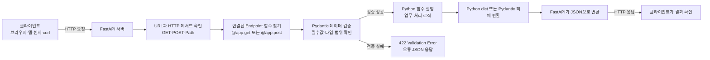

> 목표: FastAPI 전체가 아니라 이벤트 JSON을 받아 Pydantic으로 검증하는 Collector API 구현에 필요한 최소 기능을 학습한다.

## 1. 학습 범위

|  순서 | 학습 내용                  | 학습 깊이   . | 2단계에서 필요한 이유                            |
| --: | ---------------------- | --------- | --------------------------------------- |
|   1 | API와 FastAPI의 역할       | 개념 이해     | Collector가 왜 필요한지 이해                    |
|   2 | FastAPI 설치와 서버 실행      | 직접 실습     | Collector 서버 실행                         |
|   3 | `app = FastAPI()`      | 코드 해석     | FastAPI 애플리케이션 시작점 이해                   |
|   4 | URL·Path·Endpoint      | 기초 개념     | `/api/collect/gas` 주소 이해                |
|   5 | GET과 POST              | 차이 이해     | 데이터 수집에 POST를 사용하는 이유 이해                |
|   6 | 데코레이터                  | 코드 해석     | `@app.post()`가 URL과 함수를 연결한다는 것 이해      |
|   7 | Request와 Response      | 흐름 이해     | JSON이 들어오고 결과가 JSON으로 반환되는 과정 이해        |
|   8 | Request Body           | 직접 실습     | 이벤트 JSON을 API로 전송                       |
|   9 | Pydantic `BaseModel`   | 핵심 학습     | 데이터 계약 작성                               |
|  10 | 타입·필수값 검증              | 핵심 학습     | 잘못된 데이터 차단                              |
|  11 | 중첩 `payload` 모델        | 핵심 학습     | 공통 이벤트와 도메인 데이터를 구분                     |
|  12 | Swagger `/docs`        | 직접 실습     | Collector API 테스트                       |
|  13 | `APIRouter`            | 구조 이해     | `routes/collect.py` 코드 이해               |
|  14 | HTTP 상태 코드             | 최소 이해     | 성공·검증 실패 구분                             |
|  15 | Collector 프로젝트 구조    . | 핵심 학습     | `routes → schemas → services → core` 연결 |

이번 시간에는 DB·CRUD·인증·Cookie·WebSocket·CORS·Background Task를 구현하지 않는다.

---
# 2. API와 Collector

API는 서로 다른 프로그램이 정해진 규칙으로 요청과 응답을 주고받는 통로다.
```text
센서·앱·외부 시스템
→ JSON Request
→ Collector API
→ 데이터 검증
→ JSON Response
→ 본 실습에서 Raw JSONL 저장
```

Collector는 데이터를 수집하는 입구다. 외부 JSON을 받고, 계약에 맞는지 검사하고, 정상 데이터는 다음 단계로 전달한다.

---
# 3. FastAPI란?

> FastAPI = `Python + 타입힌트 + Starlette + Pydantic` 기반의 초고속 API 전용 백엔드 프레임워크  

- **Django**: 웹사이트 전체(템플릿, Admin, ORM, 인증 등)를 다 갖춘 풀스택 웹 프레임워크
- **Django REST Framework(DRF)**: Django 위에서 돌아가는 API 프레임워크
- **FastAPI**: 처음부터 **API 서버**만을 잘 만들도록 설계된 경량·고성능 백엔드 프레임워크

FastAPI는 사실 하나의 거대한 프레임워크가 아니라 
```
웹 처리 엔진 + 데이터 검증 엔진
```
을 합쳐서 만든 프레임워크이다

```
FastAPI
 = Starlette (웹 요청 처리)
 + Pydantic (데이터 검증)
```
그리고 이걸 실행하는 서버가 Uvicorn (웹 서버) 이다.

DRF는 `Model → Serializer → View → URL` 이런 흐름이다.
즉, 먼저 DB 모델이 있고, 그 모델을 시리얼라이저로 검증/변환하고, 그걸 뷰에서 CRUD로 다루는 방식이다.

FastAPI는 
- `/users` 요청이 오면?
- 요청 body는 어떤 형태인가?
- 응답 JSON은 어떤 구조인가?
- 이 요청을 처리할 함수는 무엇인가?

즉, 먼저 URL과 요청/응답 구조를 설계하고, 그 다음 필요하면 DB를 붙이는 방식이다.
`요청 → Pydantic 검증 → 함수 실행 → JSON 응답` 즉, API 자체가 중심이다

### FastAPI가 HTTP 요청을 받아 입력을 검증하고 Python 함수를 실행한 뒤 JSON으로 응답하는 기본 처리 흐름


### 🔗 [[FastAPI Collector의 이벤트 데이터 처리 흐름]] 상세설명클릭

---
# 4. FastAPI 설치와 첫 실행

`가상환경 활성화`

프로젝트 루트에서 실행한다.
```bash
source .venv/bin/activate
```

설치
```bash
uv pip install fastapi "uvicorn[standard]"
```

| 패키지 | 역할 |
|---|---|
| `fastapi` | API 작성 |
| `uvicorn` | FastAPI 앱 실행 |

미니 실습 폴더
```bash
mkdir -p fastapi_collector_basic
cd fastapi_collector_basic
touch main.py
```

`main.py`
```python
from fastapi import FastAPI

app = FastAPI()


@app.get("/")
def read_root():
    return {"message": "FastAPI Collector 준비 완료"}
```

실행:
```bash
uvicorn main:app --reload --port 8001
```

브라우저:
```text
http://127.0.0.1:8001/
```

예상 응답:
```json
{"message": "FastAPI Collector 준비 완료"}
```

명령어 해석:

| 부분 | 의미 |
|---|---|
| `main` | `main.py` |
| `app` | `app = FastAPI()` 객체 |
| `--reload` | 코드 수정 시 자동 재실행 |
| `--port 8001` | 8001 포트 사용 |

---
# 5. URL·Endpoint·GET·POST

```text
http://127.0.0.1:8001/api/collect/gas
```

| 부분 | 의미 |
|---|---|
| `http://` | 통신 방식 |
| `127.0.0.1` | 현재 컴퓨터 |
| `8001` | FastAPI 포트 |
| `/api/collect/gas` | Path |

Endpoint는 HTTP 메서드 + Path다.
```text
GET  /health
POST /api/collect/gas
```

| GET | POST |
|---|---|
| 주로 조회 | 주로 데이터 전송·생성 |
| 상태 확인 | 이벤트 JSON 수집 |
Collector는 이벤트 JSON을 Request Body로 보내므로 POST를 사용한다.

`main.py`에 추가:
```python
@app.get("/health")
def health_check():
    return {
        "status": "ok",
        "service": "collector"
    }
```

출력 예상 결과를 작성해본다
```json
직접 결과값을 만들어본다.
```

<details>
<summary>정답과 해설 보기</summary>

<pre><code class="language-python">from fastapi import FastAPI

app = FastAPI()


@app.get("/health")
def health_check():
    return {
        "status": "ok",
        "service": "collector"
    }
</code></pre><br>

<p>서버 실행:</p>

<pre><code class="language-bash">uvicorn main:app --reload --port 8001
</code></pre><br>

<p>예상 응답:</p>

<pre><code class="language-json">{
  "status": "ok",
  "service": "collector"
}
</code></pre>

</details>

---
# 6. Request와 Response

API는 클라이언트가 서버에 요청을 보내고, 서버가 처리 결과를 응답하는 방식으로 동작한다.
```text
Client
→ Request
→ FastAPI
→ Python 함수
→ Response
```

==`Client`==
Client는 서버에 요청을 보내는 프로그램이나 장치다.
```
브라우저
모바일 앱
센서
외부 시스템
Swagger
curl
```
단계에서는 가스 센서나 Swagger가 Client 역할을 한다.

==`Request`==
Request는 Client가 서버에 보내는 요청이다.
Request에는 보통 다음 정보가 포함된다.
```
어떤 주소로 보낼 것인가?
GET 또는 POST 중 어떤 방식인가?
어떤 데이터를 보낼 것인가?
데이터 형식은 무엇인가?
```
예를 들어 다음은 가스 이벤트를 보내는 요청이다.
```
POST /api/collect/gas
```
Request Body에는 JSON 데이터가 들어간다.
```json
{
  "event_id": "evt-gas-001",
  "event_type": "gas_sensor_measured"
}
```

==`FastAPI`==
FastAPI는 들어온 Request를 확인하고, 요청에 연결된 Python 함수를 찾는다.
```
POST /api/collect/gas 요청
→ collect_gas_event() 함수 찾기
```
그다음 Pydantic을 사용해 입력 데이터가 약속한 구조와 타입에 맞는지 검사한다.

==`Python 함수`==
Pydantic 검증을 통과하면 연결된 Python 함수가 실행된다.
```python
def collect_gas_event(event: GasSensorEvent):
    return {
        "message": "가스 이벤트 수집 성공"
    }
```
이 함수에서는 데이터 저장, 계산, 조회 같은 실제 처리 작업을 수행한다.

==`Response`==
Response는 서버가 Client에게 돌려주는 처리 결과다.
FastAPI에서는 Python 딕셔너리를 반환하면 자동으로 JSON 응답으로 변환된다.
```json
{
  "message": "가스 이벤트 수집 성공"
}
```
전체 흐름은 다음과 같다.
```
센서 또는 Swagger가 JSON 요청 전송
→ FastAPI가 요청 확인
→ Pydantic 검증
→ Python 함수 실행
→ 처리 결과를 JSON으로 응답
```

| 용어        | 의미                                     |
| --------- | -------------------------------------- |
| Client    | 요청을 보내는 센서, 앱, 브라우저, Swagger, curl     |
| Request   | Client가 서버에 보내는 URL, HTTP 방식, JSON 데이터 |
| FastAPI   | 요청을 받고 검증한 뒤 연결된 함수를 실행하는 서버           |
| Python 함수 | 저장, 조회, 계산 등 실제 처리 작업 수행               |
| Response  | 서버가 Client에게 반환하는 처리 결과                |

---
# 7. JSON Request Body와 Pydantic

`main.py`
```python
from fastapi import FastAPI
from pydantic import BaseModel

app = FastAPI()

# Pydantic 데이터 계약 정의
class GasMeasurement(BaseModel):
    sensor_id: str
    gas_type: str
    value: float
    unit: str

# JSON Request Body를 받는 POST Endpoint 정의
@app.post("/measurements")
def collect_measurement(measurement: GasMeasurement):
    return {
        "message": "가스 측정 데이터 검증 성공",
        "data": measurement
    }
```

```
# Pydantic 검증에 성공하면 
# collect_measurement() 함수가 실행된다. 
# 
# 검증에 실패하면 이 함수는 실행되지 않고 
# FastAPI가 자동으로 422 오류를 반환한다.
```

`GasMeasurement`는 실행 가능한 데이터 계약이다.
```text
sensor_id → 필수 문자열
gas_type  → 필수 문자열
value     → 필수 숫자
unit      → 필수 문자열
```

Swagger 접속:
```text
http://127.0.0.1:8001/docs
```

정상 요청:
```json
{
  "sensor_id": "GAS-001",
  "gas_type": "co",
  "value": 23.5,
  "unit": "ppm"
}
```

오류 요청:
```json
{
  "sensor_id": "GAS-001",
  "gas_type": "co",
  "value": "높음",
  "unit": "ppm"
}
```

잘못된 타입은 함수 실행 전에 Pydantic이 차단하고 FastAPI가 `422` 응답을 반환한다.

---
### 확인 문제 1

```
1. FastAPI와 Uvicorn은 각각 어떤 역할을 하는가?
2. Collector가 POST를 사용하는 이유는 무엇인가?
3. `@app.post("/measurements")`는 무엇을 연결하는가?
```

<details><summary>정답</summary>

1. FastAPI는 API 작성 프레임워크이고 Uvicorn은 앱을 실행하는 서버다.<br>
2. 이벤트 JSON을 Request Body에 담아 서버로 보내기 때문이다.<br>
3. `POST /measurements` 요청과 바로 아래 Python 함수를 연결한다.<br>

</details>

---
# 8. 타입·필수값·범위 검증
Pydantic은 단순히 데이터가 있는지만 확인하는 것이 아니라, **데이터 타입과 값의 조건까지 검사**할 수 있다.

예를 들어 가스 측정 데이터는 다음 조건을 지켜야 한다.
```
sensor_id는 문자열이어야 한다.
sensor_id는 비어 있으면 안 된다.

gas_type은 문자열이어야 한다.
gas_type은 비어 있으면 안 된다.

value는 숫자여야 한다.
value는 0 이상이어야 한다.

unit은 문자열이어야 한다.
unit은 비어 있으면 안 된다.
```

이 조건을 코드로 작성하면 다음과 같다.
```python
from pydantic import BaseModel, Field


class GasMeasurement(BaseModel):
    # 센서 ID
    # 문자열이며 최소 한 글자 이상이어야 한다.
    sensor_id: str = Field(
        min_length=1,
        description="가스 센서 ID"
    )

    # 측정한 가스 종류
    # 문자열이며 최소 한 글자 이상이어야 한다.
    gas_type: str = Field(
        min_length=1,
        description="가스 종류"
    )

    # 가스 측정값
    # 숫자이며 0 이상이어야 한다.
    value: float = Field(
        ge=0,
        description="측정값"
    )

    # 측정 단위
    # 문자열이며 최소 한 글자 이상이어야 한다.
    unit: str = Field(
        min_length=1,
        description="측정 단위"
    )
```

`Field`는 무엇인가?
`Field`는 Pydantic 모델의 각 필드에 **추가 검증 조건과 설명을 붙이는 기능**이다.
```
타입 정의
→ str, int, float

추가 조건
→ 최소 길이, 최솟값, 최댓값, 설명
```

예를 들어 다음 코드는:
```python
sensor_id: str = Field(min_length=1)
```
다음 의미다.
```
sensor_id는 문자열이어야 한다.
그리고 최소 한 글자 이상이어야 한다.
```

| 조건              | 의미                   | 예시        |
| --------------- | -------------------- | --------- |
| `min_length=1`  | 문자열이 최소 한 글자 이상이어야 함 | `""`는 실패  |
| `max_length=20` | 문자열 길이가 최대 20글자까지 가능 | 21글자는 실패  |
| `ge=0`          | 값이 0 이상이어야 함         | `-1`은 실패  |
| `gt=0`          | 값이 0보다 커야 함          | `0`은 실패   |
| `le=100`        | 값이 100 이하여야 함        | `101`은 실패 |
| `lt=100`        | 값이 100보다 작아야 함       | `100`은 실패 |
| `description=`  | Swagger에 필드 설명 표시    | API 문서용   |
여기서 약어는 다음 의미다.
```
ge = greater than or equal
→ 크거나 같다

gt = greater than
→ 크다

le = less than or equal
→ 작거나 같다

lt = less than
→ 작다
```

정상 데이터 예시
```json
{
  "sensor_id": "GAS-001",
  "gas_type": "co",
  "value": 23.5,
  "unit": "ppm"
}
```

검증 결과:
```
sensor_id → 문자열, 한 글자 이상
gas_type → 문자열, 한 글자 이상
value → 숫자, 0 이상
unit → 문자열, 한 글자 이상
```
모든 조건을 통과하므로 정상 데이터다.

오류 데이터 예시 1: 빈 문자열
```json
{
  "sensor_id": "",
  "gas_type": "co",
  "value": 23.5,
  "unit": "ppm"
}
```
오류 이유:
```
sensor_id가 빈 문자열이다.
min_length=1 조건을 지키지 않았다.
```

오류 데이터 예시 2: 음수
```json
{
  "sensor_id": "GAS-001",
  "gas_type": "co",
  "value": -10,
  "unit": "ppm"
}
```
오류 이유:
```
value는 0 이상이어야 한다.
ge=0 조건을 지키지 않았다.
```
검증에 실패하면 Collector 함수는 실행되지 않고 FastAPI가 `422` 오류를 반환한다.

---
==`선택값은 어떻게 작성하는가?`==

선택값은 값이 없어도 되는 필드다.
```python
note: str | None = None
```

###### 각 부분의 의미는 다음과 같다.
| 코드       | 의미                 |
| -------- | ------------------ |
| `str`    | 문자열 가능             |
| `None`   | 값이 없어도 됨           |
| `= None` | 생략했을 때 기본값은 `None` |
따라서 다음 두 요청은 모두 정상이다.

`note`가 있는 경우:
```json
{
  "sensor_id": "GAS-001",
  "gas_type": "co",
  "value": 23.5,
  "unit": "ppm",
  "note": "정상 측정"
}
```

`note`가 없는 경우:
```json
{
  "sensor_id": "GAS-001",
  "gas_type": "co",
  "value": 23.5,
  "unit": "ppm"
}
```

---
전체 코드 예시
```python
from pydantic import BaseModel, Field


class GasMeasurement(BaseModel):
    # 필수 문자열, 최소 한 글자
    sensor_id: str = Field(
        min_length=1,
        description="가스 센서 ID"
    )

    # 필수 문자열, 최소 한 글자
    gas_type: str = Field(
        min_length=1,
        description="가스 종류"
    )

    # 필수 숫자, 0 이상
    value: float = Field(
        ge=0,
        description="측정값"
    )

    # 필수 문자열, 최소 한 글자
    unit: str = Field(
        min_length=1,
        description="측정 단위"
    )

    # 선택 문자열
    # 생략하면 None이 들어간다.
    note: str | None = None
```

한 줄로 정리하면 다음과 같다.

> Pydantic의 `Field`는 필드의 타입뿐 아니라 문자열 길이, 숫자 범위, 설명 같은 추가 조건을 정의하여 잘못된 데이터가 API 내부로 들어오는 것을 막는다.

---
# 9. 실제 이벤트처럼 중첩 `payload` 만들기

==`payload`==란?
이벤트마다 달라지는 상세 데이터를 담는 공간이다.

예를 들어 모든 센서 이벤트에 공통으로 필요한 정보는 바깥에 둔다.
```
event_id
event_type
schema_version
source_system
event_time
```

그리고 센서 종류에 따라 달라지는 값은 `payload` 안에 둔다.
```
가스 센서 payload
→ sensor_id, co, h2s, unit

전력 센서 payload
→ device_id, voltage, current, power_kw

위치 센서 payload
→ worker_id, latitude, longitude
```

즉, **공통요소가 매번 바뀌는 것이 아니라, 공통요소는 그대로 유지하고 이벤트별로 달라지는 상세값만 `payload`에 분리하는 것**이다.

앞에서는 다음처럼 모든 필드를 한 단계에 놓은 간단한 구조를 사용했다.
```json
{
  "sensor_id": "GAS-001",
  "gas_type": "co",
  "value": 23.5,
  "unit": "ppm"
}
```

하지만 실제 데이터 플랫폼의 이벤트에는 모든 데이터가 같은 성격을 가지지 않는다.
```
모든 이벤트에 공통으로 필요한 정보
→ event_id, event_type, schema_version, source_system, event_time

가스 센서 이벤트에만 필요한 상세 정보
→ sensor_id, co, h2s, unit
```

그래서 실제 이벤트는 **공통 정보와 상세 정보를 분리**한다.
```
이벤트 전체 정보
└── payload
    └── 이벤트별 상세 정보
```

여기서 `payload`는 **이벤트 종류에 따라 달라지는 상세 데이터를 담는 공간**이다.

---
==`요청 JSON 구조`==
```json
{
  "event_id": "evt-gas-001",
  "event_type": "gas_sensor_measured",
  "schema_version": "1.0.0",
  "source_system": "sensor_simulator",
  "event_time": "2026-07-21T09:00:00+09:00",
  "payload": {
    "sensor_id": "GAS-001",
    "co": 23.5,
    "h2s": 3.1,
    "unit": "ppm"
  }
}
```

이 JSON은 크게 두 부분으로 나뉜다.

| 구분        | 필드                  | 의미                  |
| --------- | ------------------- | ------------------- |
| 공통 이벤트 정보 | `event_id`          | 이벤트 한 건을 구분하는 고유 ID |
| 공통 이벤트 정보 | `event_type`        | 어떤 사건인지 나타내는 이름     |
| 공통 이벤트 정보 | `schema_version`    | 데이터 구조 버전           |
| 공통 이벤트 정보 | `source_system`     | 데이터를 생성한 시스템        |
| 공통 이벤트 정보 | `event_time`        | 실제 사건이 발생한 시간       |
| 상세 데이터    | `payload.sensor_id` | 가스 센서 ID            |
| 상세 데이터    | `payload.co`        | 일산화탄소 측정값           |
| 상세 데이터    | `payload.h2s`       | 황화수소 측정값            |
| 상세 데이터    | `payload.unit`      | 측정 단위               |

---
==`왜 payload로 나누는가?`==
이벤트마다 공통 정보는 비슷하지만 상세 데이터는 다르다.

예를 들어 가스 센서 이벤트는 다음 값을 가진다.
```
sensor_id
co
h2s
unit
```

전력 이벤트는 다음 값을 가질 수 있다.
```
device_id
voltage
current
power_kw
```

작업자 위치 이벤트는 다음 값을 가질 수 있다.
```
worker_id
latitude
longitude
```

따라서 공통 정보는 바깥에 두고, 이벤트마다 달라지는 값은 `payload` 안에 넣는다.
```
공통 이벤트 구조는 유지
+
payload만 이벤트 종류에 따라 변경
```

1단계에서는 이벤트 구조와 Sample JSON 초안을 설계하고, 2단계에서 이를 Pydantic 데이터 계약과 Collector API로 구현한다. 
```
1단계
→ 도메인 이벤트 이름 정의
→ 공통 필드와 payload 구조 설계
→ 데이터 계약 초안 작성
→ Sample Event JSON 초안 작성

2단계
→ Pydantic 모델로 계약 구현
→ Collector API로 JSON 수신
→ 검증
→ Raw JSONL 저장
```

---
==`main.py`==
```python
# 날짜와 시간 형식을 검증하기 위해 datetime 가져오기
from datetime import datetime

# FastAPI 애플리케이션과 HTTP 상태 코드 가져오기
from fastapi import FastAPI, status

# Pydantic 데이터 계약과 추가 검증 조건 가져오기
from pydantic import BaseModel, Field


# FastAPI 애플리케이션 생성
# title, description, version은 Swagger 문서에 표시된다.
app = FastAPI(
    title="AI Data Collector",
    description="2단계 이벤트 수집 미니 실습",
    version="1.0.0"
)


# ============================================================
# 1. payload 내부의 가스 센서 상세 데이터 계약
# ============================================================

class GasPayload(BaseModel):

    # 센서 ID
    # 문자열이며 최소 한 글자 이상이어야 한다.
    sensor_id: str = Field(min_length=1)

    # 일산화탄소 측정값
    # 숫자이며 0 이상이어야 한다.
    co: float = Field(ge=0)

    # 황화수소 측정값
    # 숫자이며 0 이상이어야 한다.
    h2s: float = Field(ge=0)

    # 측정 단위
    # 문자열이며 최소 한 글자 이상이어야 한다.
    unit: str = Field(min_length=1)


# ============================================================
# 2. 가스 센서 이벤트 전체 데이터 계약
# ============================================================

class GasSensorEvent(BaseModel):

    # 이벤트 한 건의 고유 ID
    event_id: str = Field(min_length=1)

    # 이벤트 종류
    # 예: gas_sensor_measured
    event_type: str = Field(min_length=1)

    # 데이터 구조 버전
    # 예: 1.0.0
    schema_version: str

    # 데이터를 생성한 시스템
    # 예: sensor_simulator
    source_system: str

    # 실제 사건이 발생한 시간
    # 올바른 날짜·시간 형식인지 검증한다.
    event_time: datetime

    # 가스 센서 상세 데이터
    # payload는 GasPayload 구조를 따라야 한다.
    payload: GasPayload


# ============================================================
# 3. Collector 서버 상태 확인 Endpoint
# ============================================================

@app.get("/health")
def health_check():
    return {
        "status": "ok",
        "service": "ai-data-collector"
    }


# ============================================================
# 4. 가스 센서 이벤트 수집 Endpoint
# ============================================================

@app.post(
    "/api/collect/gas",
    status_code=status.HTTP_201_CREATED
)
def collect_gas_event(event: GasSensorEvent):

    # FastAPI가 이 함수를 실행하기 전에
    # 요청 JSON 전체를 GasSensorEvent로 검증한다.
    #
    # event의 공통 필드뿐 아니라
    # payload 내부도 GasPayload 기준으로 자동 검증된다.

    return {
        "message": "가스 이벤트 검증 성공",

        # 이벤트 공통 정보 접근
        "event_id": event.event_id,
        "event_type": event.event_type,

        # payload 내부 값 접근
        "sensor_id": event.payload.sensor_id,

        # 검증이 완료된 전체 이벤트
        "validated_data": event
    }
```

---
==`두 개의 Pydantic 모델이 연결되는 구조`==
```
GasSensorEvent
├── event_id
├── event_type
├── schema_version
├── source_system
├── event_time
└── payload
    └── GasPayload
        ├── sensor_id
        ├── co
        ├── h2s
        └── unit
```

다음 코드가 두 모델을 연결한다.
```
payload: GasPayload
```

이 뜻은 다음과 같다.
```
payload는 아무 JSON이나 들어올 수 있는 공간이 아니다.
payload는 반드시 GasPayload 구조를 따라야 한다.
```

---
#### ==`Pydantic은 어디까지 검증하는가?`==

Pydantic은 바깥쪽 필드와 `payload` 안쪽 필드를 모두 검사한다.
```
event_id가 있는가?
event_type이 문자열인가?
event_time이 날짜·시간 형식인가?
payload가 있는가?
payload.sensor_id가 문자열인가?
payload.co가 숫자인가?
payload.co가 0 이상인가?
payload.h2s가 숫자인가?
payload.unit이 문자열인가?
```

---
`정상 raw 데이터 예시`
```json
{
  "event_id": "evt-gas-001",
  "event_type": "gas_sensor_measured",
  "schema_version": "1.0.0",
  "source_system": "sensor_simulator",
  "event_time": "2026-07-21T09:00:00+09:00",
  "payload": {
    "sensor_id": "GAS-001",
    "co": 23.5,
    "h2s": 3.1,
    "unit": "ppm"
  }
}
```

`검증 결과:`
```
공통 이벤트 정보 정상
payload 구조 정상
payload 내부 타입과 범위 정상
→ collect_gas_event() 실행
→ 201 응답 반환
```

---
`오류 데이터 예시 1: payload 누락`
```json
{
  "event_id": "evt-gas-001",
  "event_type": "gas_sensor_measured",
  "schema_version": "1.0.0",
  "source_system": "sensor_simulator",
  "event_time": "2026-07-21T09:00:00+09:00"
}
```

`오류 이유:`
```
필수 필드인 payload가 없다.
```

---
`오류 데이터 예시 2: payload.co 타입 오류`
```json
{
  "event_id": "evt-gas-001",
  "event_type": "gas_sensor_measured",
  "schema_version": "1.0.0",
  "source_system": "sensor_simulator",
  "event_time": "2026-07-21T09:00:00+09:00",
  "payload": {
    "sensor_id": "GAS-001",
    "co": "높음",
    "h2s": 3.1,
    "unit": "ppm"
  }
}
```

오류 이유:
```
payload.co는 숫자여야 하지만 문자열이 들어왔다.
```

검증에 실패하면 다음과 같이 처리된다.
```
Pydantic 검증 실패
→ collect_gas_event() 실행 안 됨
→ FastAPI가 422 오류 JSON 반환
```

---
2단계에서 데이터 저장은 원본데이터 그대로인 jsonl 즉 Raw에서는 json으로 그대로 저장된다.

`gas_events.jsonl`
```json
1번째 줄 
  ↓ 
{"event_id":"evt-gas-001","event_type":"gas_sensor_measured","schema_version":"1.0.0","source_system":"sensor_simulator","event_time":"2026-07-21T09:00:00+09:00","payload":{"sensor_id":"GAS-001","co":23.5,"h2s":3.1,"unit":"ppm"}}
```

==`그러면 왜 payload로 나눴는가?`==
저장 위치를 나누려고 만든 것이 아니고, **데이터를 논리적으로 구분하기 위해서**다.
```
이벤트

├── 공통 정보
│    event_id
│    event_time
│    event_type
│
└── payload
      센서마다 달라지는 값
```

==`그럼 나눈 데이터는 언제 분리되는가?`==
**3단계 Staging**에서다.

Raw
```json
{
  "event_id":"evt-001",
  "payload":{
      "sensor_id":"GAS-001",
      "co":23.5,
      "h2s":3.1
  }
}
```
여기서는 payload를 펼쳐(flatten) 저장한다. 그건 3단계에서 진행한다.

쉽게 설명하면
```
2단계 Raw는 "택배 상자째 보관"하는 단계다.상자 안(payload)을 뜯지 않고 그대로 보관한다.

3단계 Staging은 상자를 열어서 물건을 종류별로 정리하는 단계다.
```
---
==`코드에서 값을 가져오는 방법`==

공통 필드는 다음처럼 접근한다.
```python
event.event_id
event.event_type
event.event_time
```

`payload` 내부 값은 다음처럼 접근한다.
```python
event.payload.sensor_id
event.payload.co
event.payload.h2s
event.payload.unit
```

즉, 점 `.`을 사용해 안쪽 객체로 들어간다.
```
event
→ payload
→ sensor_id
```

```python
event.payload.sensor_id
```
---
==`전체 처리 흐름`==

```
POST /api/collect/gas
        ↓
요청 JSON 수신
        ↓
GasSensorEvent로 공통 필드 검증
        ↓
GasPayload로 payload 내부 검증
        ↓
검증 성공
        ↓
collect_gas_event() 실행
        ↓
201 Created + JSON 응답
```

한 줄로 정리하면 다음과 같다.

> `GasSensorEvent`는 이벤트 전체의 공통 구조를 검증하고, `GasPayload`는 `payload` 내부의 가스 센서 상세 데이터를 검증하며, Pydantic은 두 구조를 연결하여 전체 JSON을 한 번에 검사한다.
---
# 10. Sample Event JSON과 curl로 데이터 전송하기

이 실습은 **가스 센서 이벤트 예시 파일을 만든 뒤, 그 JSON 파일을 FastAPI Collector API로 전송하는 과정**이다.

전체 흐름은 다음과 같다.
```
Sample Event JSON 파일 생성
→ curl이 파일을 읽음
→ POST /api/collect/gas로 전송
→ FastAPI가 요청 수신
→ Pydantic 검증
→ 정상 데이터 처리
```

---
==`sample_events 폴더 만들기`==
```bash
mkdir -p sample_events
```

이 명령어는 API 테스트에 사용할 JSON 예시 파일을 저장하는 `sample_events` 폴더를 만든다.
```
sample_events/
```

`-p` 옵션은 폴더가 이미 있어도 오류를 발생시키지 않고, 필요한 상위 폴더까지 함께 만들어준다.

---
==`Sample Event JSON 파일 만들기`==
```bash
cat > sample_events/gas_sensor_event.sample.json <<'EOF'
{
  "event_id": "evt-gas-001",
  "event_type": "gas_sensor_measured",
  "schema_version": "1.0.0",
  "source_system": "sensor_simulator",
  "event_time": "2026-07-21T09:00:00+09:00",
  "payload": {
    "sensor_id": "GAS-001",
    "co": 23.5,
    "h2s": 3.1,
    "unit": "ppm"
  }
}
EOF
```

이 명령어는 다음 파일을 만든다.
```
sample_events/
└── gas_sensor_event.sample.json
```

각 부분의 의미는 다음과 같다.

|명령어|의미|
|---|---|
|`cat > 파일명`|입력한 내용을 새 파일에 저장|
|`<<'EOF'`|`EOF`가 나올 때까지 여러 줄 입력 시작|
|마지막 `EOF`|파일 입력 종료|

생성된 파일은 실제 센서 대신 API 테스트에 사용하는 가짜 이벤트 데이터다.
```
실제 센서 데이터
→ 운영 환경에서 자동 전송

Sample Event JSON
→ 개발자가 테스트할 때 수동 전송
```

---
==`curl로 Collector API에 전송하기`==
```bash
curl -X POST "http://127.0.0.1:8001/api/collect/gas" \
  -H "Content-Type: application/json" \
  -d @sample_events/gas_sensor_event.sample.json
```

`curl`은 터미널에서 HTTP 요청을 보내는 도구다.

이 명령은 다음 의미다.
```
gas_sensor_event.sample.json 파일의 내용을 읽어서
POST /api/collect/gas Endpoint로 JSON 요청을 보내라.
```

각 옵션의 의미는 다음과 같다.

|명령어|의미|
|---|---|
|`curl`|터미널에서 HTTP 요청 전송|
|`-X POST`|POST 방식으로 요청|
|URL|요청을 보낼 Collector Endpoint|
|`-H`|HTTP Header 설정|
|`Content-Type: application/json`|보내는 데이터가 JSON임을 알림|
|`-d`|Request Body에 데이터 포함|
|`@파일명`|해당 파일 내용을 읽어 전송|

---
==`실제 처리 흐름`==
```
curl 실행
→ Sample Event JSON 파일 읽기
→ POST /api/collect/gas 요청 전송
→ FastAPI가 Endpoint 확인
→ GasSensorEvent로 Pydantic 검증
→ 검증 성공 시 Collector 함수 실행
→ 성공 JSON 응답 반환
```

Raw 저장 코드가 연결되어 있다면 다음 단계까지 실행된다.
```
Pydantic 검증 성공
→ save_raw_event() 호출
→ gas_events.jsonl에 한 줄 저장
→ 201 Created 응답
```

---
==`예상 응답`==
```
{
  "message": "가스 이벤트 저장 성공",
  "event_id": "evt-gas-001",
  "saved_path": "data_lake/raw/gas_events/gas_events.jsonl"
}
```

---
==`Swagger와 curl의 차이`==

|방식|특징|
|---|---|
|Swagger|브라우저 화면에서 JSON을 직접 입력하고 테스트|
|`curl`|터미널에서 명령어로 JSON 파일을 전송|
|Sample Event JSON|반복 테스트를 위해 미리 저장한 요청 데이터|

정리하면 다음과 같다.
```
Swagger
→ 사람이 화면에서 직접 입력

curl
→ 저장된 JSON 파일을 터미널에서 전송

실제 센서
→ 프로그램이나 장비가 자동 전송
```

> 이 실습은 실제 센서가 데이터를 보내는 상황을 대신하여, Sample Event JSON 파일을 `curl`로 Collector API에 전송해보는 연습이다.

---
#### 확인 문제 2
```
1. 공통 이벤트 필드와 `payload`를 나누는 이유는 무엇인가?
2. `event_time: datetime`에 잘못된 날짜를 보내면 어떻게 되는가?
3. `event.payload.sensor_id`는 무엇을 가져오는가?
```

<details><summary>정답</summary>

1. 모든 이벤트의 공통 추적 정보와 도메인별 상세 데이터를 분리하기 위해서다.<br>
2. Pydantic 검증에 실패하고 422 응답을 받는다.<br>
3. 중첩된 `payload`의 `sensor_id` 값을 가져온다.<br>

</details>

---
# 11. HTTP 상태 코드
HTTP 상태 코드는 **서버가 요청을 처리한 결과를 숫자로 알려주는 값**이다.

클라이언트는 상태 코드를 보고 다음을 판단할 수 있다.
```
요청이 성공했는가?
새 데이터가 정상적으로 저장되었는가?
입력 데이터가 잘못되었는가?
요청한 주소가 없는가?
서버 내부에서 오류가 발생했는가?
```

예를 들어 Collector API에 가스 이벤트를 전송하면 FastAPI는 처리 결과와 함께 상태 코드를 반환한다.
```
POST /api/collect/gas
→ Pydantic 검증
→ Raw 저장
→ HTTP 상태 코드와 JSON 응답 반환
```

|코드|이름|초보자용 의미|Collector 예시|
|---|---|---|---|
|`200`|OK|요청을 정상적으로 처리했다.|`/health` 상태 조회 성공|
|`201`|Created|새로운 데이터가 정상적으로 생성되거나 저장되었다.|가스 이벤트를 Raw JSONL에 저장|
|`400`|Bad Request|요청 형식은 받았지만 업무 규칙에 맞지 않는다.|지원하지 않는 `event_type` 전송|
|`404`|Not Found|요청한 주소나 대상을 찾을 수 없다.|존재하지 않는 API 주소 요청|
|`422`|Unprocessable Entity|JSON의 필수값, 타입 또는 범위가 데이터 계약과 맞지 않는다.|`co`에 문자열 입력, `event_id` 누락|
|`500`|Internal Server Error|서버 내부 코드나 저장 과정에서 문제가 발생했다.|파일 저장 권한 오류, 예상하지 못한 예외|

---
==`200 OK`==
요청을 정상적으로 처리했다는 의미다.

예를 들어 Collector 서버가 실행 중인지 확인한다.
```
GET /health
```

응답:
```
{
  "status": "ok",
  "service": "collector"
}
```

상태 코드:
```
200 OK
```

---
==`201 Created`==
새로운 데이터를 정상적으로 생성하거나 저장했다는 의미다.

가스 이벤트가 검증을 통과하고 Raw JSONL에 저장되면 `201`을 반환할 수 있다.
```python
@app.post(
    "/api/collect/gas",
    status_code=status.HTTP_201_CREATED
)
```

처리 흐름:
```
이벤트 JSON 수신
→ Pydantic 검증 성공
→ Raw JSONL 저장 성공
→ 201 Created 반환
```

---
==`400 Bad Request`==
서버가 요청을 이해했지만 프로젝트의 업무 규칙에 맞지 않을 때 사용할 수 있다.

예를 들어 현재 API는 가스 측정 이벤트만 허용하는데 다음 값이 들어왔다고 가정한다.
```json
{
  "event_type": "unknown_event"
}
```

데이터 타입은 문자열이므로 Pydantic 타입 검증은 통과할 수 있지만, 시스템이 지원하지 않는 이벤트라면 별도 코드에서 `400`으로 처리할 수 있다.

---
==`404 Not Found`==
요청한 API 주소나 데이터가 존재하지 않을 때 반환한다.

예를 들어 다음 주소는 만들어져 있지 않다.
```
GET /api/collect/unknown
```

FastAPI는 연결된 Endpoint를 찾지 못하고 `404`를 반환한다.
```
요청한 주소를 찾을 수 없음
→ 404 Not Found
```

---
==`422 Unprocessable Entity`==
요청 JSON이 Pydantic 데이터 계약을 지키지 않았을 때 FastAPI가 자동으로 반환하는 검증 오류다.

오류 예시:
```json
{
  "event_id": "evt-gas-001",
  "payload": {
    "sensor_id": "GAS-001",
    "co": "높음",
    "h2s": 3.1,
    "unit": "ppm"
  }
}
```

오류 이유:
```
필수 필드가 빠져 있음
co는 숫자여야 하지만 문자열이 들어옴
```

처리 흐름:
```
Pydantic 검증 실패
→ Collector 함수 실행 안 됨
→ Raw 저장 안 됨
→ FastAPI가 422 오류 JSON 자동 반환
```

---
==`500 Internal Server Error`==
요청 데이터에는 문제가 없지만 서버 내부 처리 중 오류가 발생했다는 의미다.

예시는 다음과 같다.
```
Raw 저장 폴더에 쓰기 권한이 없음
파일 저장 중 디스크 오류 발생
코드에서 예상하지 못한 예외 발생
```

처리 흐름:
```
Pydantic 검증 성공
→ Collector 함수 실행
→ 파일 저장 중 오류
→ 500 Internal Server Error
```

---
==`상태 코드의 큰 분류`==

|범위|의미|
|---|---|
|`200~299`|요청 성공|
|`400~499`|클라이언트가 보낸 요청에 문제|
|`500~599`|서버 내부에 문제|

초보자는 먼저 다음 세 가지를 기억하면 된다.
```
2xx
→ 성공

4xx
→ 요청 데이터나 주소에 문제

5xx
→ 서버 코드나 저장 처리에 문제
```

`한 줄로 정리하면 다음과 같다.`

> HTTP 상태 코드는 API 요청이 성공했는지, 입력 데이터가 잘못되었는지, 서버 내부에서 오류가 발생했는지를 클라이언트에게 알려주는 숫자 결과다.

---
# 12. APIRouter로 파일 분리

연습용 코드는 `main.py` 하나로 시작했지만 실제 Collector는 역할별로 나눈다.
연습 단계에서는 전체 흐름을 한눈에 보기 위해 `main.py` 하나에 작성하지만, 실제 Collector에서는 **기능별 책임을 분리해 코드가 섞이지 않도록** 파일과 폴더를 나눈다.
```text
mini_collector/
├── __init__.py
├── main.py
├── schemas/
│   ├── __init__.py
│   └── events.py
└── routes/
    ├── __init__.py
    └── collect.py
```

```
main.py
→ 앱 실행과 라우터 등록

routes/
→ API 주소 정의

schemas/
→ Pydantic 데이터 계약

services/
→ 수집 처리 로직

core/
→ 설정과 파일 저장
```

생성:
```bash
mkdir -p mini_collector/schemas mini_collector/routes
touch mini_collector/__init__.py
touch mini_collector/main.py
touch mini_collector/schemas/__init__.py
touch mini_collector/schemas/events.py
touch mini_collector/routes/__init__.py
touch mini_collector/routes/collect.py
```

`schemas/events.py`
```python
from datetime import datetime
from pydantic import BaseModel, Field


class GasPayload(BaseModel):
    sensor_id: str = Field(min_length=1)
    co: float = Field(ge=0)
    h2s: float = Field(ge=0)
    unit: str = Field(min_length=1)


class GasSensorEvent(BaseModel):
    event_id: str
    event_type: str
    schema_version: str
    source_system: str
    event_time: datetime
    payload: GasPayload
```

`routes/collect.py`
```python
from fastapi import APIRouter, status
from mini_collector.schemas.events import GasSensorEvent


router = APIRouter(
    prefix="/api/collect",
    tags=["collect"]
)


@router.post(
    "/gas",
    status_code=status.HTTP_201_CREATED
)
def collect_gas_event(event: GasSensorEvent):
    return {
        "message": "가스 이벤트 검증 성공",
        "event_id": event.event_id,
        "sensor_id": event.payload.sensor_id
    }
```

`main.py`
```python
from fastapi import FastAPI
from mini_collector.routes.collect import router as collect_router


app = FastAPI(
    title="Mini AI Data Collector",
    version="1.0.0"
)

app.include_router(collect_router)


@app.get("/health")
def health_check():
    return {
        "status": "ok",
        "service": "mini-ai-data-collector"
    }
```

프로젝트 루트에서 실행:
```bash
uvicorn mini_collector.main:app --reload --port 8001
```

---
#  `2단계 미니 실습 → Raw JSONL 저장`

`실습 목표`
이번 실습에서는 FastAPI가 받은 가스 센서 이벤트를 Pydantic으로 검증한 뒤, 정상 데이터만 Raw Zone에 JSONL 형식으로 저장한다.
```
가스 이벤트 JSON 전송
→ Pydantic 검증
→ Collector 함수 실행
→ Raw JSONL 파일에 한 줄 저장
→ 저장 성공 응답 반환
```

실습이 끝나면 다음 결과를 확인할 수 있어야 한다.
```
data_lake/
└── raw/
    └── gas_events/
        └── gas_events.jsonl
```
---
실습에서 만들 파일
```
fastapi_collector_basic/
├── main.py
└── data_lake/
    └── raw/
        └── gas_events/
```

---
==`정상데이터`==
저장할 이벤트 구조 : 다음 JSON을 Collector API로 전송한다. (스웨거를 통해 저장할 샘플)
`gas_events.jsonl`
```json
{
  "event_id": "evt-gas-001",
  "event_type": "gas_sensor_measured",
  "schema_version": "1.0.0",
  "source_system": "sensor_simulator",
  "event_time": "2026-07-21T09:00:00+09:00",
  "payload": {
    "sensor_id": "GAS-001",
    "co": 23.5,
    "h2s": 3.1,
    "unit": "ppm"
  }
}
```
이 데이터가 Pydantic 검증을 통과하면 다음 파일에 저장한다.
```
data_lake/raw/gas_events/gas_events.jsonl
```

---
아래 main.py 코드는 서버를 실행하면 FastAPI는 요청을 기다리고, 외부에서 `POST /api/collect/gas` 요청이 들어오면 함수 호출 순서에 따라 검증과 JSONL 저장이 실행된다.

`main.py` 작성
```python
# ============================================================
# 1. 필요한 Python 모듈과 라이브러리 가져오기
# ============================================================

# Python 데이터를 JSON 문자열로 변환하기 위해 사용
import json

# 이벤트 발생 시간을 날짜·시간 형식으로 검증하기 위해 사용
from datetime import datetime

# 운영체제와 관계없이 파일과 폴더 경로를 쉽게 다루기 위해 사용
from pathlib import Path

# FastAPI: API 애플리케이션을 생성하는 클래스
# status: 200, 201, 404 등의 HTTP 상태 코드를 사용하기 위한 기능
from fastapi import FastAPI, status

# BaseModel: 입력 데이터의 구조와 타입을 정의하는 Pydantic 기본 클래스
# Field: 필수값, 최소 길이, 숫자 범위 등의 검증 조건을 설정하는 기능
from pydantic import BaseModel, Field


# ============================================================
# 2. FastAPI 애플리케이션 생성
# ============================================================

# FastAPI API 서버의 중심 객체를 생성한다.
# title과 version은 Swagger API 문서에 표시된다.
app = FastAPI(
    title="Gas Event Collector",
    version="1.0.0"
)


# ============================================================
# 3. 가스 센서의 상세 데이터인 payload 계약 정의(규칙)
# ============================================================

# BaseModel을 상속하여
# payload 안에 들어갈 필드와 데이터 타입을 정의한다.
class GasPayload(BaseModel):

    # 센서 ID
    # 문자열이어야 하며 최소 한 글자 이상 입력해야 한다.
    sensor_id: str = Field(min_length=1)

    # 일산화탄소 농도
    # 실수형 숫자이며 0 이상이어야 한다.
    co: float = Field(ge=0)

    # 황화수소 농도
    # 실수형 숫자이며 0 이상이어야 한다.
    h2s: float = Field(ge=0)

    # 측정 단위
    # 문자열이어야 하며 최소 한 글자 이상 입력해야 한다.
    unit: str = Field(min_length=1)


# ============================================================
# 4. 가스 센서 이벤트 전체 데이터 계약 정의
# ============================================================

# 이벤트의 공통 정보와
# 가스 센서 상세 정보인 payload의 구조를 정의한다.
class GasSensorEvent(BaseModel):

    # 이벤트 한 건을 고유하게 구분하는 ID
    # 문자열이며 최소 한 글자 이상이어야 한다.
    event_id: str = Field(min_length=1)

    # 발생한 이벤트의 종류
    # 예: gas_sensor_measured
    event_type: str

    # 현재 이벤트 데이터 구조의 버전
    # 예: 1.0.0
    schema_version: str

    # 이벤트 데이터를 생성한 시스템
    # 예: sensor_simulator
    source_system: str

    # 실제 이벤트가 발생한 날짜와 시간
    # Pydantic이 입력 문자열을 datetime 형식으로 검증한다.
    event_time: datetime

    # 가스 센서의 상세 측정 데이터
    # 위에서 정의한 GasPayload 데이터 계약을 사용한다.
    payload: GasPayload


# ============================================================
# 5. Raw JSONL 파일의 저장 경로 설정
# ============================================================

# 검증에 성공한 가스 이벤트를 저장할 파일 경로다.
#
# 최종 저장 위치:
# data_lake/
# └── raw/
#     └── gas_events/
#         └── gas_events.jsonl
RAW_FILE = Path(
    "data_lake/raw/gas_events/gas_events.jsonl"
)


# ============================================================
# 6. 검증된 이벤트를 Raw JSONL에 저장하는 함수
# ============================================================

# event에는 Pydantic 검증을 통과한
# GasSensorEvent 객체만 전달된다.
#
# -> None은 이 함수가 값을 반환하지 않고
# 파일 저장 작업만 수행한다는 의미다.
def save_raw_event(
    event: GasSensorEvent
) -> None:

    # --------------------------------------------------------
    # 6-1. Raw 저장 폴더 생성
    # --------------------------------------------------------

    # RAW_FILE.parent는 파일을 제외한 상위 폴더를 의미한다.
    #
    # data_lake/raw/gas_events/
    #
    # parents=True
    # → 중간 폴더가 없어도 모두 생성한다.
    #
    # exist_ok=True
    # → 폴더가 이미 있어도 오류를 발생시키지 않는다.
    RAW_FILE.parent.mkdir(
        parents=True,
        exist_ok=True
    )


    # --------------------------------------------------------
    # 6-2. Pydantic 객체를 Python 딕셔너리로 변환
    # --------------------------------------------------------

    # event는 현재 GasSensorEvent 객체다.
    #
    # model_dump()를 사용하여
    # Python 딕셔너리 형태로 변환한다.
    #
    # mode="json"을 사용하면 datetime 같은 값도
    # JSON에 저장할 수 있는 문자열 형식으로 변환된다.
    record = event.model_dump(
        mode="json"
    )


    # --------------------------------------------------------
    # 6-3. 이벤트를 Raw JSONL 파일에 저장
    # --------------------------------------------------------

    # RAW_FILE을 추가 모드인 "a"로 연다.
    #
    # "a"
    # → 기존 데이터를 삭제하지 않고
    #   파일의 마지막에 새로운 데이터를 추가한다.
    #
    # encoding="utf-8"
    # → 한글을 포함한 문자를 올바르게 저장한다.
    with RAW_FILE.open(
        "a",
        encoding="utf-8"
    ) as file:

        # json.dumps()
        # → Python 딕셔너리를 JSON 문자열로 변환한다.
        #
        # ensure_ascii=False
        # → 한글을 유니코드 코드가 아닌
        #   읽을 수 있는 한글 그대로 저장한다.
        #
        # "\n"
        # → 이벤트 한 건을 저장한 뒤 줄을 바꾼다.
        #
        # 따라서 JSONL 파일에는
        # 이벤트 한 건이 한 줄씩 저장된다.
        file.write(
            json.dumps(
                record,
                ensure_ascii=False
            )
            + "\n"
        )


# ============================================================
# 7. 가스 이벤트를 수집하는 Collector API 정의
# ============================================================

# POST /api/collect/gas 요청을
# 아래 collect_gas_event() 함수와 연결한다.
#
# 데이터 저장에 성공하면
# HTTP 상태 코드 201 Created를 반환한다.
@app.post(
    "/api/collect/gas",
    status_code=status.HTTP_201_CREATED
)
def collect_gas_event(
    event: GasSensorEvent
):

    # --------------------------------------------------------
    # FastAPI가 이 함수를 실행하기 전에
    # Pydantic이 GasSensorEvent 데이터 계약을 검증한다.
    #
    # 검증 성공
    # → 이 함수 실행
    #
    # 검증 실패
    # → 이 함수는 실행되지 않음
    # → FastAPI가 자동으로 422 오류 반환
    # --------------------------------------------------------


    # Pydantic 검증을 통과한 이벤트를
    # Raw JSONL 파일에 저장한다.
    save_raw_event(event)


    # Raw 저장이 완료되면
    # 처리 결과를 Python 딕셔너리로 반환한다.
    #
    # FastAPI는 이 딕셔너리를
    # 자동으로 JSON 응답으로 변환한다.
    return {
        "message": "가스 이벤트 저장 성공",

        # 저장한 이벤트의 고유 ID
        "event_id": event.event_id,

        # 실제 Raw JSONL 저장 경로
        "saved_path": str(RAW_FILE)
    }
```

코드 흐름
```
POST /api/collect/gas
        ↓
GasSensorEvent로 Pydantic 검증
        ↓
save_raw_event() 호출
        ↓
이벤트를 Python dict로 변환
        ↓
JSON 문자열로 변환
        ↓
gas_events.jsonl 파일 끝에 한 줄 추가
        ↓
저장 성공 JSON 응답
```

핵심 코드
```python
with RAW_FILE.open("a", encoding="utf-8") as file:
    file.write(json.dumps(record, ensure_ascii=False) + "\n")
```

| 코드                   | 의미                        |
| -------------------- | ------------------------- |
| `"a"`                | 기존 파일 뒤에 내용을 추가한다         |
| `json.dumps()`       | Python 데이터를 JSON 문자열로 바꾼다 |
| `ensure_ascii=False` | 한글을 그대로 저장한다              |
| `"\n"`               | 이벤트 한 건을 저장한 뒤 줄을 바꾼다     |

Uvicorn 서버를 실행한 뒤 Swagger에서 직접 POST 요청을 보낸다
```
1. Uvicorn 서버 실행
2. 브라우저에서 /docs 접속
3. POST /api/collect/gas 펼치기
4. Try it out 클릭
5. 이벤트 JSON 입력
6. Execute 클릭
7. Pydantic 검증
8. Raw JSONL 저장
9. 성공 JSON 응답 확인
```
---
==`코드분리`==
연습용으로는 `main.py` 하나가 이해하기 쉽지만, 실제 Collector에서는 기능별 책임을 분리해야 코드가 많아져도 찾기 쉽고 수정·테스트·확장이 편하다.
```
한 파일에 모두 작성
→ 처음에는 이해하기 쉬움

기능별 파일 분리
→ 실제 프로젝트에서 유지보수하기 쉬움
```

디렉터리 구조
```
project-root/
├── collector/
│   ├── __init__.py
│   ├── __main__.py
│   ├── main.py
│   │
│   ├── core/
│   │   ├── __init__.py
│   │   ├── config.py
│   │   └── lakehouse.py
│   │
│   ├── schemas/
│   │   ├── __init__.py
│   │   └── events.py
│   │
│   ├── routes/
│   │   ├── __init__.py
│   │   └── collect.py
│   │
│   └── services/
│       ├── __init__.py
│       └── ingest.py
│
├── data_lake/
│   └── raw/
│       └── gas_events/
│
└── sample_events/
    └── gas_sensor_event.sample.json
```

###### 각 파일의 역할은 다음과 같다.
|경로|역할|
|---|---|
|`collector/main.py`|FastAPI 앱 생성과 Router 등록|
|`collector/__main__.py`|`python -m collector` 실행|
|`collector/core/config.py`|Raw 저장 경로 같은 공통 설정|
|`collector/core/lakehouse.py`|JSONL 파일에 실제 저장|
|`collector/schemas/events.py`|Pydantic 데이터 계약|
|`collector/routes/collect.py`|API Endpoint 정의|
|`collector/services/ingest.py`|검증된 이벤트의 처리 흐름|

폴더와 파일 생성
```bash
mkdir -p collector/core
mkdir -p collector/schemas
mkdir -p collector/routes
mkdir -p collector/services

touch collector/__init__.py
touch collector/__main__.py
touch collector/main.py

touch collector/core/__init__.py
touch collector/core/config.py
touch collector/core/lakehouse.py

touch collector/schemas/__init__.py
touch collector/schemas/events.py

touch collector/routes/__init__.py
touch collector/routes/collect.py

touch collector/services/__init__.py
touch collector/services/ingest.py
```

---
`collector/core/config.py`
Raw 데이터의 저장 경로를 관리한다.
```python
from pathlib import Path


# 프로젝트 루트 경로
PROJECT_ROOT = Path(__file__).resolve().parents[2]


# data_lake 경로
DATA_LAKE_ROOT = PROJECT_ROOT / "data_lake"


# Raw Zone 경로
RAW_ZONE = DATA_LAKE_ROOT / "raw"


# 가스 이벤트 JSONL 저장 파일
GAS_EVENTS_RAW_FILE = (
    RAW_ZONE
    / "gas_events"
    / "gas_events.jsonl"
)
```

역할
```
저장 경로를 한곳에서 관리한다.
```

다른 파일에서 경로를 직접 반복 작성하지 않고 다음처럼 가져다 쓴다.
```python
from collector.core.config import GAS_EVENTS_RAW_FILE
```
---
`collector/schemas/events.py`
가스 센서 이벤트의 Pydantic 데이터 계약을 정의한다.
```python
from datetime import datetime

from pydantic import BaseModel, Field


# payload 내부의 가스 센서 상세 데이터 계약
class GasPayload(BaseModel):

    # 센서 ID
    # 문자열이며 최소 한 글자 이상이어야 한다.
    sensor_id: str = Field(
        min_length=1,
        description="가스 센서 ID"
    )

    # 일산화탄소 농도
    # 숫자이며 0 이상이어야 한다.
    co: float = Field(
        ge=0,
        description="일산화탄소 농도"
    )

    # 황화수소 농도
    # 숫자이며 0 이상이어야 한다.
    h2s: float = Field(
        ge=0,
        description="황화수소 농도"
    )

    # 측정 단위
    # 문자열이며 최소 한 글자 이상이어야 한다.
    unit: str = Field(
        min_length=1,
        description="측정 단위"
    )


# 가스 센서 이벤트 전체 데이터 계약
class GasSensorEvent(BaseModel):

    # 이벤트 한 건의 고유 ID
    event_id: str = Field(
        min_length=1,
        description="이벤트 고유 ID"
    )

    # 이벤트 종류
    event_type: str = Field(
        min_length=1,
        description="이벤트 유형"
    )

    # 데이터 구조 버전
    schema_version: str = Field(
        min_length=1,
        description="스키마 버전"
    )

    # 데이터를 생성한 시스템
    source_system: str = Field(
        min_length=1,
        description="데이터 발생 시스템"
    )

    # 실제 이벤트 발생 시간
    event_time: datetime

    # 가스 센서 상세 데이터
    payload: GasPayload
```

역할
```
어떤 JSON만 정상 데이터로 인정할 것인가?
```
---
`collector/core/lakehouse.py`
검증된 이벤트를 Raw JSONL 파일에 저장한다.
```python
import json
from pathlib import Path
from typing import Any


def append_jsonl(
    file_path: Path,
    record: dict[str, Any]
) -> None:
    """
    Python 딕셔너리 한 건을
    JSONL 파일의 마지막 줄에 추가한다.
    """

    # 저장 폴더가 없으면 자동으로 생성한다.
    file_path.parent.mkdir(
        parents=True,
        exist_ok=True
    )

    # 기존 데이터 뒤에 추가하기 위해 "a" 모드로 연다.
    with file_path.open(
        "a",
        encoding="utf-8"
    ) as file:

        # Python 딕셔너리를 JSON 문자열로 바꾸고
        # 한 건을 저장한 뒤 줄을 바꾼다.
        file.write(
            json.dumps(
                record,
                ensure_ascii=False
            )
            + "\n"
        )
```

역할
```
어떤 이벤트인지는 판단하지 않고,
전달받은 데이터를 JSONL에 저장하는 공통 기능을 담당한다.
```

이 함수는 나중에 가스뿐 아니라 전력·위치·주문 이벤트에도 재사용할 수 있다.

---
`collector/services/ingest.py`

검증된 가스 이벤트를 저장 가능한 형태로 바꾸고 Raw에 저장한다.
```python
from collector.core.config import GAS_EVENTS_RAW_FILE
from collector.core.lakehouse import append_jsonl
from collector.schemas.events import GasSensorEvent


def ingest_gas_event(
    event: GasSensorEvent
) -> str:
    """
    검증된 가스 이벤트를
    Raw JSONL 파일에 저장한다.

    반환값:
        실제 저장된 파일 경로
    """

    # Pydantic 객체를 JSON 저장 가능한
    # Python 딕셔너리로 변환한다.
    record = event.model_dump(
        mode="json"
    )

    # 공통 JSONL 저장 함수를 호출한다.
    append_jsonl(
        file_path=GAS_EVENTS_RAW_FILE,
        record=record
    )

    # API 응답에서 사용할 수 있도록
    # 저장 경로를 문자열로 반환한다.
    return str(GAS_EVENTS_RAW_FILE)
```

역할
```
Pydantic 검증이 끝난 이벤트를
어떤 파일에 어떤 방식으로 저장할지 연결한다.
```
---
`collector/routes/collect.py`

가스 이벤트를 받을 API Endpoint를 정의한다.
```python
from fastapi import APIRouter, status

from collector.schemas.events import GasSensorEvent
from collector.services.ingest import ingest_gas_event


router = APIRouter(
    prefix="/api/collect",
    tags=["collect"]
)


@router.post(
    "/gas",
    status_code=status.HTTP_201_CREATED
)
def collect_gas_event(
    event: GasSensorEvent
):
    """
    가스 센서 이벤트 수집 Endpoint

    처리 흐름:
    1. Request Body 수신
    2. GasSensorEvent로 Pydantic 검증
    3. ingest_gas_event() 호출
    4. Raw JSONL 저장
    5. 성공 응답 반환
    """

    # 검증된 이벤트를 수집 서비스에 전달한다.
    saved_path = ingest_gas_event(event)

    # 저장 성공 결과를 JSON으로 반환한다.
    return {
        "message": "가스 이벤트 저장 성공",
        "event_id": event.event_id,
        "saved_path": saved_path
    }
```

역할
```
어느 주소로 요청을 받을 것인가?
요청을 어떤 함수와 연결할 것인가?
```
---
`collector/main.py`

FastAPI 애플리케이션을 만들고 Router를 등록한다.
```python
from fastapi import FastAPI

from collector.routes.collect import router as collect_router


# FastAPI 애플리케이션 생성
app = FastAPI(
    title="Gas Event Collector",
    description="가스 센서 이벤트 수집 Collector",
    version="1.0.0"
)


# collect Router 등록
app.include_router(collect_router)


# Collector 서버 상태 확인 Endpoint
@app.get("/health")
def health_check():
    return {
        "status": "ok",
        "service": "gas-event-collector"
    }
```

역할
```
FastAPI 앱 생성
→ Router 등록
→ 서버의 시작점 제공
```
---
`collector/__main__.py`

`python -m collector` 명령으로 서버를 실행할 수 있게 한다.
```python
import uvicorn


if __name__ == "__main__":
    uvicorn.run(
        "collector.main:app",
        host="127.0.0.1",
        port=8001,
        reload=True
    )
```

---
서버 실행
```bash
uvicorn main:app --reload --port 8001
```
또는 Python 모듈로 실행
```bash
python -m collector
```

Swagger에 접속
```
http://127.0.0.1:8001/docs
```

스웨거에 다음과 같이 json 데이터를 입력한다.
```json
{
  "event_id": "evt-gas-001",
  "event_type": "gas_sensor_measured",
  "schema_version": "1.0.0",
  "source_system": "sensor_simulator",
  "event_time": "2026-07-21T09:00:00+09:00",
  "payload": {
    "sensor_id": "GAS-001",
    "co": 23.5,
    "h2s": 3.1,
    "unit": "ppm"
  }
}
```
`Execute`를 누르면 다음이 실행된다.

또는 curl 테스트
```bash
curl -X POST "http://127.0.0.1:8001/api/collect/gas" \
  -H "Content-Type: application/json" \
  -d @sample_events/gas_sensor_event.sample.json
```

==`용어설명`==

- curl이란 터미널에서 URL로 HTTP 요청을 보내 API에 데이터를 전송하거나 응답을 확인하는 명령어 도구다.

---
`예상 응답`

정상 데이터라면 다음과 비슷한 응답이 반환된다.
```json
{
  "message": "가스 이벤트 저장 성공",
  "event_id": "evt-gas-001",
  "saved_path": "data_lake/raw/gas_events/gas_events.jsonl"
}
```

HTTP 상태 코드는 다음이다.
```
201 Created
```

```
POST /api/collect/gas
→ Pydantic 검증
→ collect_gas_event()
→ save_raw_event()
→ gas_events.jsonl 저장
→ 201 성공 응답
```
---
Pydantic은 입력된 JSON을 **미리 정의해 둔 데이터 계약**과 비교한다.
```python
class GasPayload(BaseModel):
    sensor_id: str = Field(min_length=1)
    co: float = Field(ge=0)
    h2s: float = Field(ge=0)
    unit: str = Field(min_length=1)
```

```
sensor_id가 있는가?
sensor_id가 문자열인가?
co가 숫자인가?
co가 0 이상인가?
h2s가 숫자인가?
unit이 문자열인가?
```

| 필드          | 계약 조건                 | 상세 의미                                                      |
| ----------- | --------------------- | ---------------------------------------------------------- |
| `sensor_id` | `str`, `min_length=1` | `sensor_id`가 반드시 있어야 하며 문자열이어야 합니다. 빈 문자열 `""`은 허용하지 않습니다. |
| `co`        | `float`, `ge=0`       | `co`가 반드시 있어야 하며 숫자로 변환 가능한 값이어야 합니다. 값은 0 이상이어야 합니다.      |
| `h2s`       | `float`, `ge=0`       | `h2s`가 반드시 있어야 하며 숫자로 변환 가능한 값이어야 합니다. 값은 0 이상이어야 합니다.     |
| `unit`      | `str`, `min_length=1` | `unit`이 반드시 있어야 하며 문자열이어야 합니다. 빈 문자열 `""`은 허용하지 않습니다.      |

---
저장 결과 확인

터미널에서 파일 내용을 확인한다.
```
cat data_lake/raw/gas_events/gas_events.jsonl
```

예상 결과:
```json
{"event_id":"evt-gas-001","event_type":"gas_sensor_measured","schema_version":"1.0.0","source_system":"sensor_simulator","event_time":"2026-07-21T09:00:00+09:00","payload":{"sensor_id":"GAS-001","co":23.5,"h2s":3.1,"unit":"ppm"}}
```

같은 API를 여러 번 호출하면 한 줄씩 계속 추가된다.
```
{"event_id":"evt-gas-001", ...}
{"event_id":"evt-gas-002", ...}
{"event_id":"evt-gas-003", ...}
```

이것이 JSONL 형식이다.

---
==`오류 데이터 테스트`==

이번에는 `co`에 문자열을 넣는다.
```json
{
  "event_id": "evt-gas-002",
  "event_type": "gas_sensor_measured",
  "schema_version": "1.0.0",
  "source_system": "sensor_simulator",
  "event_time": "2026-07-21T09:01:00+09:00",
  "payload": {
    "sensor_id": "GAS-001",
    "co": "높음",
    "h2s": 3.1,
    "unit": "ppm"
  }
}
```

예상 결과:
```
Pydantic 검증 실패
→ Collector 함수 실행 안 됨
→ save_raw_event() 실행 안 됨
→ Raw JSONL에 저장되지 않음
→ FastAPI가 422 오류 반환
```

즉, 잘못된 데이터는 Raw에 저장되지 않는다.

---
### `전체 흐름 정리`

```
1단계
→ gas_sensor_measured라는 도메인 이벤트를 정의

2단계
→ 그 이벤트 구조를 Sample Event JSON으로 작성(Swagger 또는 curl)
→ Collector API로 전송
→ Pydantic이 데이터 계약 검증
→ 정상 데이터이면 data_lake/raw에 저장
```

![[Group 85.png]]
지금까지 진행한 FastAPI 미니 실습은 그림에서 빨간 화살표로 표시한 범위까지다.

---
### 확인 문제

문제 1
`save_raw_event()` 함수는 어떤 역할을 하는가?

<details> <summary>정답</summary>

Pydantic 검증을 통과한 이벤트를 JSON 문자열로 바꾸고 Raw JSONL 파일에 한 줄씩 저장한다.

</details>

문제 2
파일을 열 때 `"w"`가 아니라 `"a"`를 사용하는 이유는 무엇인가?

<details> <summary>정답</summary>

`"w"`는 기존 파일 내용을 덮어쓰지만, `"a"`는 기존 데이터 뒤에 새 이벤트를 추가하기 때문이다.

</details>

문제 3
`co` 값에 `"높음"`이라는 문자열을 보내면 Raw 파일에 저장되는가?

<details> <summary>정답</summary>

저장되지 않는다. Pydantic 검증에 실패하므로 Collector 함수와 저장 함수가 실행되지 않고 FastAPI가 422 오류를 반환한다.

</details>

---
### 위의 미니 실습 완료 기준

- [ ]  FastAPI 서버를 실행했다.
- [ ]  Swagger에서 정상 이벤트를 전송했다.
- [ ]  `201 Created` 응답을 확인했다.
- [ ]  `gas_events.jsonl` 파일이 생성된 것을 확인했다.
- [ ]  이벤트가 한 줄씩 저장되는 것을 확인했다.
- [ ]  오류 데이터를 전송해 `422` 응답을 확인했다.
- [ ]  오류 데이터가 Raw에 저장되지 않는 것을 확인했다.

---
### 한 줄 정리
```
이번 실습은 Pydantic 검증을 통과한 이벤트만 Raw JSONL 파일에 한 줄씩 저장하는 Collector의 가장 기본적인 동작을 구현하는 실습이다.
```
