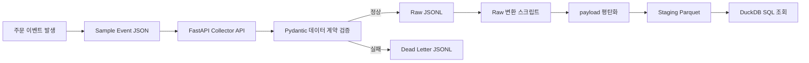

==`주문 이벤트 수집부터 Raw·Dead Letter·Staging·DuckDB 조회까지`==
> 과정명: AI 네이티브 데이터 플랫폼 엔지니어 과정  
> 학습 위치: 2단계 AI 데이터 수집과 레이크하우스 설계  
> 권장 시간: 3~4시간  
> 대표 도메인: 온라인 쇼핑몰 주문 데이터  
> 최종 목표: 주문 이벤트를 Collector API로 수집하고, Pydantic 검증을 거쳐 Raw 또는 Dead Letter에 저장한 뒤, Raw 데이터를 Staging Parquet으로 변환하고 DuckDB로 조회한다.

---
```

```


# 0. 이 프로젝트에서 완성할 전체 흐름

이번 프로젝트는 2단계 전체 흐름을 한 번에 연결하는 종합 실습이다.
```text
1단계에서 정의한 도메인 이벤트
→ Sample Event JSON 작성
→ FastAPI Collector API 구현
→ Pydantic 데이터 계약 검증
→ 정상 데이터는 Raw JSONL 저장
→ 오류 데이터는 Dead Letter JSONL 저장
→ Raw JSONL 읽기
→ payload 평탄화
→ Staging Parquet 생성
→ DuckDB SQL 조회
```

```
flowchart LR
    A[주문 이벤트 발생] --> B[Sample Event JSON]
    B --> C[FastAPI Collector API]
    C --> D[Pydantic 데이터 계약 검증]

    D -->|정상| E[Raw JSONL]
    D -->|실패| F[Dead Letter JSONL]

    E --> G[Raw 변환 스크립트]
    G --> H[payload 평탄화]
    H --> I[Staging Parquet]
    I --> J[DuckDB SQL 조회]
```

![[Group 87.png]]

---
# 1. 새로운 도메인으로 실습

이번 종합 실습에서는 온라인 쇼핑몰의 `order_created` 이벤트를 사용한다.

도메인을 바꾸는 이유는 특정 센서 필드만 외우지 않고, 다음 공통 원리를 익히기 위해서다.
```text
업무 사건 정의
→ 이벤트 이름 작성
→ 공통 필드와 payload 구분
→ 데이터 계약 작성
→ API 수집
→ Raw 보존
→ 분석 가능한 Staging 생성
```

산업안전, 쇼핑몰, 교육, 제조, 금융처럼 도메인이 달라도 데이터 플랫폼의 기본 구조는 같다.

---
# 2. 프로젝트 시나리오

온라인 쇼핑몰에서 고객이 주문을 완료하면 `order_created` 이벤트가 발생한다.

이 이벤트에는 다음 정보가 포함된다.
```text
공통 이벤트 정보
→ event_id
→ event_type
→ schema_version
→ source_system
→ event_time

주문 상세 정보
→ order_id
→ customer_id
→ total_amount
→ currency
→ item_count
```

정상 이벤트는 Raw Zone에 저장한다.
잘못된 이벤트는 Dead Letter에 저장한다.

그다음 Raw JSONL을 읽어 중첩된 `payload`를 평평한 컬럼 구조로 바꾸고 Parquet 파일로 저장한다.

마지막으로 DuckDB를 사용하여 SQL로 조회한다.

---

# 3. 학습 완료 기준

- [ ] 주문 이벤트의 공통 필드와 `payload`를 구분할 수 있다.
- [ ] Pydantic 데이터 계약을 작성할 수 있다.
- [ ] FastAPI Collector Endpoint를 구현할 수 있다.
- [ ] 정상 데이터를 Raw JSONL에 저장할 수 있다.
- [ ] 검증 실패 데이터를 Dead Letter JSONL에 저장할 수 있다.
- [ ] Raw JSONL을 읽을 수 있다.
- [ ] 중첩된 `payload`를 평탄화할 수 있다.
- [ ] Staging Parquet 파일을 생성할 수 있다.
- [ ] DuckDB로 Parquet 파일을 SQL 조회할 수 있다.
- [ ] 3단계에서 무엇을 자동화하게 되는지 설명할 수 있다.

---
# 4. 최종 디렉터리 구조

```text
project-root/
├── collector/
│   ├── __init__.py
│   ├── __main__.py
│   ├── main.py
│   ├── core/
│   │   ├── __init__.py
│   │   ├── config.py
│   │   └── lakehouse.py
│   ├── schemas/
│   │   ├── __init__.py
│   │   └── events.py
│   ├── routes/
│   │   ├── __init__.py
│   │   └── collect.py
│   └── services/
│       ├── __init__.py
│       └── ingest.py
├── sample_events/
│   ├── order_created.sample.json
│   └── order_created.invalid.sample.json
├── scripts/
│   ├── raw_to_staging_parquet.py
│   └── query_staging_duckdb.py
├── data_lake/
│   ├── raw/order_events/
│   ├── staging/order_events/
│   ├── dead_letter/order_events/
│   └── mart/
└── requirements-stage2.txt
```

---
# 5. 개발 환경 준비

가상환경 활성화
```bash
uv venv
source .venv/bin/activate
```

필요한 패키지 설치
```bash
uv pip install fastapi "uvicorn[standard]" pydantic pandas pyarrow duckdb
```

의존성 파일 생성
```bash
uv pip freeze > requirements-stage2.txt
```

| 패키지 | 역할 |
|---|---|
| `fastapi` | Collector API 구현 |
| `uvicorn` | FastAPI 서버 실행 |
| `pydantic` | 데이터 계약과 입력 검증 |
| `pandas` | Raw 데이터를 표 구조로 변환 |
| `pyarrow` | Parquet 파일 저장 |
| `duckdb` | Parquet SQL 조회 |

---
# 6. 폴더와 파일 생성

```bash
mkdir -p collector/core collector/schemas collector/routes collector/services
mkdir -p sample_events scripts
mkdir -p data_lake/raw/order_events
mkdir -p data_lake/staging/order_events
mkdir -p data_lake/dead_letter/order_events
mkdir -p data_lake/mart

touch collector/__init__.py collector/__main__.py collector/main.py
touch collector/core/__init__.py collector/core/config.py collector/core/lakehouse.py
touch collector/schemas/__init__.py collector/schemas/events.py
touch collector/routes/__init__.py collector/routes/collect.py
touch collector/services/__init__.py collector/services/ingest.py
touch scripts/raw_to_staging_parquet.py scripts/query_staging_duckdb.py
```

---
# 7. Sample Event JSON 작성

## 7.1 정상 주문 이벤트

`sample_events/order_created.sample.json`
```json
{
  "event_id": "evt-order-001",
  "event_type": "order_created",
  "schema_version": "1.0.0",
  "source_system": "shopping_mall",
  "event_time": "2026-07-21T13:00:00+09:00",
  "payload": {
    "order_id": "ORDER-1001",
    "customer_id": "USER-001",
    "total_amount": 89000,
    "currency": "KRW",
    "item_count": 3
  }
}
```

## 7.2 오류 주문 이벤트

`sample_events/order_created.invalid.sample.json`
```json
{
  "event_id": "evt-order-002",
  "event_type": "order_created",
  "schema_version": "1.0.0",
  "source_system": "shopping_mall",
  "event_time": "2026-07-21T13:05:00+09:00",
  "payload": {
    "order_id": "",
    "customer_id": "USER-002",
    "total_amount": -5000,
    "currency": "KRW",
    "item_count": 0
  }
}
```

오류 이유:
```text
order_id가 빈 문자열
total_amount가 0보다 작음
item_count가 1보다 작음
```

---
# 8. Pydantic 데이터 계약 작성

`collector/schemas/events.py`
```python
from datetime import datetime

from pydantic import BaseModel, Field


class OrderPayload(BaseModel):
    """주문 이벤트 payload 데이터 계약"""

    order_id: str = Field(
        min_length=1,
        description="주문 고유 ID"
    )
    customer_id: str = Field(
        min_length=1,
        description="고객 고유 ID"
    )
    total_amount: float = Field(
        ge=0,
        description="총 주문 금액"
    )
    currency: str = Field(
        min_length=3,
        max_length=3,
        description="통화 코드"
    )
    item_count: int = Field(
        ge=1,
        description="주문 상품 개수"
    )


class OrderCreatedEvent(BaseModel):
    """주문 생성 이벤트 전체 데이터 계약"""

    event_id: str = Field(min_length=1)
    event_type: str = Field(min_length=1)
    schema_version: str = Field(min_length=1)
    source_system: str = Field(min_length=1)
    event_time: datetime
    payload: OrderPayload
```

==`코드 설명`==

이 코드는 주문 이벤트 JSON이 약속한 구조와 규칙을 지키는지 검사하기 위한 Pydantic 데이터 계약이다.
```
요청 JSON
→ OrderCreatedEvent로 전체 구조 검증
→ payload는 OrderPayload로 상세 검증
→ 정상일 때만 Collector 함수 실행
```

`OrderPayload`는 주문에만 필요한 상세값을 검사한다.
```
order_id
customer_id
total_amount
currency
item_count
```

`OrderCreatedEvent`는 모든 이벤트에 공통으로 필요한 정보를 검사한다.
```
event_id
event_type
schema_version
source_system
event_time
payload
```

특히 다음 코드가 두 모델을 연결한다.
```
payload: OrderPayload
```

이 뜻은 `payload` 안의 데이터가 반드시 `OrderPayload`에 정의된 규칙을 따라야 한다는 의미다.

---
###### ==`주요 속성 설명`==
| 코드             | 의미                          | 실패 예시             |
| -------------- | --------------------------- | ----------------- |
| `BaseModel`    | Pydantic 데이터 계약을 만드는 기본 클래스 | 사용하지 않으면 자동 검증 불가 |
| `Field(...)`   | 필드에 길이, 범위, 설명 같은 추가 규칙 설정  | 조건 위반 시 검증 실패     |
| `min_length=1` | 문자열이 최소 한 글자 이상이어야 함        | `""`              |
| `min_length=3` | 문자열이 최소 3글자 이상이어야 함         | `"KR"`            |
| `max_length=3` | 문자열이 최대 3글자 이하여야 함          | `"KOREA"`         |
| `ge=0`         | 값이 0 이상이어야 함                | `-1000`           |
| `ge=1`         | 값이 1 이상이어야 함                | `0`               |
| `description=` | Swagger 문서에 표시할 필드 설명       | 검증 조건은 아님         |
| `str`          | 문자열이어야 함                    | 숫자나 객체 입력         |
| `float`        | 숫자여야 함                      | `"비쌈"`            |
| `int`          | 정수여야 함                      | `"세 개"`           |
| `datetime`     | 날짜·시간 형식이어야 함               | `"오늘 오후"`         |

---
###### ==`필드별 검증 기준`==
| 필드               | 데이터 타입         | 추가 조건                          | 의미                |
| ---------------- | -------------- | ------------------------------ | ----------------- |
| `order_id`       | `str`          | `min_length=1`                 | 주문 ID는 비어 있으면 안 됨 |
| `customer_id`    | `str`          | `min_length=1`                 | 고객 ID는 비어 있으면 안 됨 |
| `total_amount`   | `float`        | `ge=0`                         | 주문 금액은 0 이상이어야 함  |
| `currency`       | `str`          | `min_length=3`, `max_length=3` | 통화 코드는 정확히 3글자    |
| `item_count`     | `int`          | `ge=1`                         | 주문 상품 수는 최소 1개    |
| `event_id`       | `str`          | `min_length=1`                 | 이벤트 고유 ID 필수      |
| `event_type`     | `str`          | `min_length=1`                 | 이벤트 종류 필수         |
| `schema_version` | `str`          | `min_length=1`                 | 데이터 구조 버전 필수      |
| `source_system`  | `str`          | `min_length=1`                 | 데이터 발생 시스템 필수     |
| `event_time`     | `datetime`     | 날짜·시간 형식                       | 실제 이벤트 발생 시간      |
| `payload`        | `OrderPayload` | 중첩 모델 검증                       | 주문 상세 데이터         |

---
==`정상 데이터 예시`==
```json
{
  "event_id": "evt-order-001",
  "event_type": "order_created",
  "schema_version": "1.0.0",
  "source_system": "shopping_mall",
  "event_time": "2026-07-21T13:00:00+09:00",
  "payload": {
    "order_id": "ORDER-1001",
    "customer_id": "USER-001",
    "total_amount": 89000,
    "currency": "KRW",
    "item_count": 3
  }
}
```

이 데이터는 모든 필드와 조건을 지키므로 검증에 성공한다.

---
==`오류 데이터 예시`==
```json
{
  "event_id": "evt-order-002",
  "event_type": "order_created",
  "schema_version": "1.0.0",
  "source_system": "shopping_mall",
  "event_time": "2026-07-21T13:05:00+09:00",
  "payload": {
    "order_id": "",
    "customer_id": "USER-002",
    "total_amount": -5000,
    "currency": "WON",
    "item_count": 0
  }
}
```

==`검증 결과:`==
```
order_id
→ 빈 문자열이므로 min_length=1 위반

total_amount
→ -5000이므로 ge=0 위반

item_count
→ 0이므로 ge=1 위반
```

`currency`의 `"WON"`은 3글자이므로 현재 규칙에서는 통과한다. 실제로 `KRW`, `USD`, `JPY`처럼 허용된 통화만 받으려면 별도의 허용값 검증을 추가해야 한다.

한 줄로 정리하면 다음과 같다.

> `OrderCreatedEvent`는 주문 이벤트 전체를 검사하고, `OrderPayload`는 `payload` 내부의 주문 상세값을 검사하며, 각 `Field` 조건은 잘못된 값이 Raw 데이터로 저장되는 것을 막는다.

---
# 9. 경로 설정 작성

`collector/core/config.py`는 **Raw, Dead Letter, Staging 파일을 어디에 저장할지 한곳에서 정하는 설정 파일**이다.

이 파일에서 경로를 관리하면 나중에 저장 위치가 바뀌어도 여러 Python 파일을 수정할 필요 없이 `config.py`만 수정하면 된다.

`collector/core/config.py`
```python
from pathlib import Path


PROJECT_ROOT = Path(__file__).resolve().parents[2]
DATA_LAKE_ROOT = PROJECT_ROOT / "data_lake"

RAW_ORDER_FILE = (
    DATA_LAKE_ROOT
    / "raw"
    / "order_events"
    / "order_events.jsonl"
)

DEAD_LETTER_ORDER_FILE = (
    DATA_LAKE_ROOT
    / "dead_letter"
    / "order_events"
    / "order_events_errors.jsonl"
)

STAGING_ORDER_FILE = (
    DATA_LAKE_ROOT
    / "staging"
    / "order_events"
    / "order_events.parquet"
)
```

코드해석
```python
# 운영체제와 관계없이
# 파일과 폴더 경로를 안전하게 다루기 위해 사용한다.
from pathlib import Path


# ============================================================
# 1. 프로젝트 최상위 폴더 경로 구하기
# ============================================================

# 현재 파일 위치:
# project-root/collector/core/config.py
#
# __file__
# → 현재 실행 중인 config.py 파일의 위치
#
# resolve()
# → 절대 경로로 변환
#
# parents[0]
# → core/
#
# parents[1]
# → collector/
#
# parents[2]
# → project-root/
PROJECT_ROOT = Path(__file__).resolve().parents[2]


# ============================================================
# 2. data_lake 기본 경로 설정
# ============================================================

# project-root/data_lake 경로를 만든다.
#
# Path 객체는 / 연산자를 사용해
# 폴더와 파일 경로를 이어 붙일 수 있다.
DATA_LAKE_ROOT = PROJECT_ROOT / "data_lake"


# ============================================================
# 3. 정상 주문 이벤트의 Raw 저장 경로
# ============================================================

# Pydantic 검증을 통과한 주문 이벤트를
# JSONL 형식으로 저장할 파일 경로다.
#
# 최종 경로:
# project-root/
# └── data_lake/
#     └── raw/
#         └── order_events/
#             └── order_events.jsonl
RAW_ORDER_FILE = (
    DATA_LAKE_ROOT
    / "raw"
    / "order_events"
    / "order_events.jsonl"
)


# ============================================================
# 4. 검증 실패 데이터의 Dead Letter 저장 경로
# ============================================================

# Pydantic 검증에 실패한 주문 이벤트의 원본과
# 오류 내용을 저장할 JSONL 파일 경로다.
#
# 최종 경로:
# project-root/
# └── data_lake/
#     └── dead_letter/
#         └── order_events/
#             └── order_events_errors.jsonl
DEAD_LETTER_ORDER_FILE = (
    DATA_LAKE_ROOT
    / "dead_letter"
    / "order_events"
    / "order_events_errors.jsonl"
)


# ============================================================
# 5. Staging Parquet 저장 경로
# ============================================================

# Raw JSONL을 읽어
# payload 평탄화, 타입 정리 등을 수행한 뒤
# 생성되는 Staging Parquet 파일 경로다.
#
# 최종 경로:
# project-root/
# └── data_lake/
#     └── staging/
#         └── order_events/
#             └── order_events.parquet
STAGING_ORDER_FILE = (
    DATA_LAKE_ROOT
    / "staging"
    / "order_events"
    / "order_events.parquet"
)
```

코드 흐름
```
현재 config.py 위치 확인
→ 프로젝트 루트 경로 계산
→ data_lake 기본 경로 설정
→ Raw 저장 경로 설정
→ Dead Letter 저장 경로 설정
→ Staging 저장 경로 설정
```

###### 주요 코드 설명
| 코드                       | 의미                         |
| ------------------------ | -------------------------- |
| `Path`                   | 파일과 폴더 경로를 다루는 Python 도구   |
| `__file__`               | 현재 Python 파일의 위치           |
| `.resolve()`             | 상대 경로를 절대 경로로 변환           |
| `.parents[2]`            | 현재 파일에서 두 단계 위의 프로젝트 루트 선택 |
| `/ "data_lake"`          | 기존 경로 뒤에 폴더명을 연결           |
| `RAW_ORDER_FILE`         | 정상 주문 이벤트 저장 경로            |
| `DEAD_LETTER_ORDER_FILE` | 검증 실패 이벤트 저장 경로            |
| `STAGING_ORDER_FILE`     | 정리된 Parquet 파일 저장 경로       |

==`왜 한곳에서 관리하는가?`==

다른 파일에서 경로를 직접 반복해서 작성하면 저장 위치가 바뀔 때 여러 파일을 수정해야 한다.
```
# 좋지 않은 예
Path("data_lake/raw/order_events/order_events.jsonl")
```
이 경로가 여러 파일에 반복되면 수정 실수가 생기기 쉽다.

대신 `config.py`에 한 번만 정의하고 다른 파일에서는 가져다 쓴다.
```
from collector.core.config import RAW_ORDER_FILE
```

이렇게 하면 저장 위치를 바꿀 때 `config.py` 한 파일만 수정하면 된다.

> `config.py`는 Raw, Dead Letter, Staging 파일의 저장 위치를 한곳에서 관리하여 경로 중복과 수정 실수를 줄이는 설정 파일이다.

---
# 10. JSONL 공통 저장 함수 작성

`collector/core/lakehouse.py`는 Python 딕셔너리 형태의 이벤트 한 건을 JSON 문자열로 바꾸고, 지정된 JSONL 파일의 마지막 줄에 추가하는 공통 저장 기능이다.

Raw 데이터와 Dead Letter 데이터 모두 JSONL 형식으로 저장하므로, 같은 저장 함수를 재사용할 수 있다.

`collector/core/lakehouse.py`
```python
import json
from pathlib import Path
from typing import Any


def append_jsonl(
    file_path: Path,
    record: dict[str, Any]
) -> None:
    """딕셔너리 한 건을 JSONL 파일 끝에 추가한다."""

    file_path.parent.mkdir(
        parents=True,
        exist_ok=True
    )

    with file_path.open(
        "a",
        encoding="utf-8"
    ) as file:
        file.write(
            json.dumps(
                record,
                ensure_ascii=False
            )
            + "\n"
        )
```

코드 해석
```python
# Python 딕셔너리를 JSON 문자열로 변환하기 위해 사용한다.
import json

# 파일과 폴더 경로를 안전하게 다루기 위해 사용한다.
from pathlib import Path

# 어떤 형태의 값도 딕셔너리에 들어갈 수 있음을 표현하기 위해 사용한다.
from typing import Any


def append_jsonl(
    # 데이터를 저장할 JSONL 파일 경로
    file_path: Path,

    # JSONL에 저장할 이벤트 한 건
    # 문자열 키와 여러 타입의 값을 가진 Python 딕셔너리
    record: dict[str, Any]
) -> None:
    """
    Python 딕셔너리 한 건을
    JSONL 파일의 마지막 줄에 추가한다.
    """

    # ========================================================
    # 1. 저장할 폴더가 없으면 생성
    # ========================================================

    # file_path가 다음과 같다고 가정한다.
    #
    # data_lake/raw/order_events/order_events.jsonl
    #
    # file_path.parent는 파일명을 제외한
    # 상위 폴더 경로를 의미한다.
    #
    # data_lake/raw/order_events/
    file_path.parent.mkdir(
        # 중간 폴더가 없어도 모두 생성한다.
        parents=True,

        # 폴더가 이미 존재해도 오류를 발생시키지 않는다.
        exist_ok=True
    )


    # ========================================================
    # 2. JSONL 파일을 추가 모드로 열기
    # ========================================================

    # "a"는 append의 약자로,
    # 기존 내용을 지우지 않고 파일 끝에 새 내용을 추가한다.
    #
    # encoding="utf-8"은 한글을 올바르게 저장하기 위해 사용한다.
    with file_path.open(
        "a",
        encoding="utf-8"
    ) as file:

        # ====================================================
        # 3. 딕셔너리를 JSON 문자열로 변환하여 한 줄 저장
        # ====================================================

        # json.dumps(record)
        # → Python 딕셔너리를 JSON 문자열로 변환한다.
        #
        # ensure_ascii=False
        # → 한글을 유니코드 코드가 아니라
        #   읽을 수 있는 한글 그대로 저장한다.
        #
        # "\n"
        # → 이벤트 한 건을 저장한 뒤 줄을 바꾼다.
        #
        # 따라서 JSONL 파일에는
        # 이벤트 한 건이 한 줄씩 계속 추가된다.
        file.write(
            json.dumps(
                record,
                ensure_ascii=False
            )
            + "\n"
        )
```


==`함수의 입력과 결과`==

이 함수를 호출할 때는 두 가지 값을 전달한다.
```python
append_jsonl(
    file_path=RAW_ORDER_FILE,
    record=record
)
```

|전달값|의미|
|---|---|
|`file_path`|어느 JSONL 파일에 저장할지 지정|
|`record`|저장할 이벤트 한 건의 Python 딕셔너리|

함수는 데이터를 파일에 저장하기만 하고 별도의 값을 반환하지 않는다.
```
-> None
```

---
==`실행 흐름`==
```
append_jsonl() 호출
        ↓
저장할 파일의 상위 폴더 확인
        ↓
폴더가 없으면 자동 생성
        ↓
JSONL 파일을 "a" 모드로 열기
        ↓
Python dict를 JSON 문자열로 변환
        ↓
파일 끝에 한 줄 추가
        ↓
저장 완료
```

---
==`저장 예시`==

다음 딕셔너리를 전달한다고 가정한다.
```json
record = {
    "event_id": "evt-order-001",
    "event_type": "order_created",
    "payload": {
        "order_id": "ORDER-1001",
        "total_amount": 89000
    }
}
```

호출:
```python
append_jsonl(
    file_path=RAW_ORDER_FILE,
    record=record
)
```

JSONL에는 다음처럼 한 줄로 저장된다.
```json
{"event_id":"evt-order-001","event_type":"order_created","payload":{"order_id":"ORDER-1001","total_amount":89000}}
```

다른 이벤트가 추가되면 기존 내용을 덮어쓰지 않고 다음 줄에 저장한다.
```
{"event_id":"evt-order-001","event_type":"order_created","payload":{"order_id":"ORDER-1001","total_amount":89000}}
{"event_id":"evt-order-002","event_type":"order_created","payload":{"order_id":"ORDER-1002","total_amount":45000}}
```

---
###### ==`주요 코드 설명`==

|코드|의미|
|---|---|
|`Path`|파일과 폴더 경로를 다루는 도구|
|`Any`|여러 데이터 타입을 허용한다는 뜻|
|`dict[str, Any]`|문자열 키와 다양한 값으로 이루어진 딕셔너리|
|`-> None`|반환값 없이 저장 작업만 수행|
|`file_path.parent`|파일을 제외한 상위 폴더 경로|
|`mkdir()`|폴더 생성|
|`parents=True`|필요한 중간 폴더까지 모두 생성|
|`exist_ok=True`|폴더가 이미 있어도 오류 없음|
|`"a"`|기존 내용 뒤에 새 데이터 추가|
|`json.dumps()`|Python 데이터를 JSON 문자열로 변환|
|`ensure_ascii=False`|한글을 그대로 저장|
|`"\n"`|이벤트 한 건을 저장한 뒤 줄바꿈|

==`왜 공통 함수로 만드는가?`==

Raw와 Dead Letter는 저장 내용은 다르지만 저장 방식은 같다.
```
Python 딕셔너리
→ JSON 문자열 변환
→ JSONL 파일에 한 줄 추가
```

따라서 저장 코드를 각각 반복하지 않고 `append_jsonl()` 하나로 공통화한다.
```
Raw 저장
→ append_jsonl()

Dead Letter 저장
→ append_jsonl()
```

> `append_jsonl()`은 전달받은 이벤트 딕셔너리를 JSON 문자열로 바꾸고, 지정된 JSONL 파일 끝에 한 줄씩 추가하는 공통 저장 함수다.

---
# 11. 수집 서비스 작성

`collector/services/ingest.py`는 Pydantic 검증이 끝난 주문 이벤트를 Raw에 저장하거나, 검증에 실패한 원본과 오류 내용을 Dead Letter에 저장하는 서비스 코드다.

즉, 이 파일은 다음 두 가지 역할을 담당한다.
```
정상 주문 이벤트
→ Raw JSONL 저장

검증 실패 주문 이벤트
→ Dead Letter JSONL 저장
```

---
`collector/services/ingest.py`
```python
from datetime import datetime, timezone
from typing import Any

from collector.core.config import (
    DEAD_LETTER_ORDER_FILE,
    RAW_ORDER_FILE,
)
from collector.core.lakehouse import append_jsonl
from collector.schemas.events import OrderCreatedEvent


def ingest_order_event(
    event: OrderCreatedEvent
) -> str:
    """검증된 주문 이벤트를 Raw JSONL에 저장한다."""

    record = event.model_dump(mode="json")

    append_jsonl(
        file_path=RAW_ORDER_FILE,
        record=record
    )

    return str(RAW_ORDER_FILE)


def save_order_dead_letter(
    raw_body: dict[str, Any],
    errors: list[dict[str, Any]]
) -> str:
    """검증 실패 원본과 오류 내용을 Dead Letter에 저장한다."""

    dead_letter_record = {
        "failed_at": datetime.now(
            timezone.utc
        ).isoformat(),
        "dataset": "order_events",
        "raw_body": raw_body,
        "errors": errors
    }

    append_jsonl(
        file_path=DEAD_LETTER_ORDER_FILE,
        record=dead_letter_record
    )

    return str(DEAD_LETTER_ORDER_FILE)
```

`코드해석`
```python
# 검증 실패 시각을 기록하기 위해 사용한다.
from datetime import datetime, timezone

# 딕셔너리 안에 여러 타입의 값이 들어갈 수 있음을 표현한다.
from typing import Any


# Raw와 Dead Letter 저장 파일 경로를 가져온다.
from collector.core.config import (
    DEAD_LETTER_ORDER_FILE,
    RAW_ORDER_FILE,
)

# Python 딕셔너리를 JSONL 파일에 한 줄씩 저장하는 공통 함수
from collector.core.lakehouse import append_jsonl

# Pydantic 검증이 완료된 주문 이벤트 객체
from collector.schemas.events import OrderCreatedEvent


# ============================================================
# 1. 정상 주문 이벤트를 Raw JSONL에 저장
# ============================================================

def ingest_order_event(
    # Pydantic 검증을 통과한 주문 이벤트 객체
    event: OrderCreatedEvent
) -> str:
    """
    검증된 주문 이벤트를 Raw JSONL에 저장하고,
    저장된 파일 경로를 문자열로 반환한다.
    """

    # Pydantic 객체를
    # JSON으로 저장 가능한 Python 딕셔너리로 변환한다.
    #
    # mode="json"을 사용하면
    # datetime 같은 값도 JSON 문자열 형식으로 변환된다.
    record = event.model_dump(
        mode="json"
    )

    # 공통 JSONL 저장 함수를 호출한다.
    #
    # 저장 위치:
    # data_lake/raw/order_events/order_events.jsonl
    append_jsonl(
        file_path=RAW_ORDER_FILE,
        record=record
    )

    # API 응답에서 저장 위치를 보여줄 수 있도록
    # Path 객체를 문자열로 바꾸어 반환한다.
    return str(
        RAW_ORDER_FILE
    )


# ============================================================
# 2. 검증 실패 이벤트를 Dead Letter에 저장
# ============================================================

def save_order_dead_letter(
    # FastAPI로 들어온 검증 전 원본 JSON
    raw_body: dict[str, Any],

    # Pydantic이 반환한 검증 오류 목록
    errors: list[dict[str, Any]]
) -> str:
    """
    검증에 실패한 원본 JSON과 오류 내용을
    Dead Letter JSONL에 저장하고,
    저장된 파일 경로를 문자열로 반환한다.
    """

    # Dead Letter에 저장할 레코드를 만든다.
    #
    # 실패한 원본만 저장하는 것이 아니라
    # 실패 시각, 데이터셋 이름, 오류 이유를 함께 저장한다.
    dead_letter_record = {

        # 검증 실패가 발생한 현재 시각
        #
        # timezone.utc를 사용해 UTC 기준으로 기록한다.
        # isoformat()은 날짜와 시간을 문자열로 변환한다.
        "failed_at": datetime.now(
            timezone.utc
        ).isoformat(),

        # 어떤 데이터셋에서 오류가 발생했는지 표시
        "dataset": "order_events",

        # 검증에 실패한 원본 요청 JSON
        "raw_body": raw_body,

        # Pydantic이 알려준 오류 내용
        "errors": errors
    }

    # Dead Letter JSONL에 한 줄 저장한다.
    #
    # 저장 위치:
    # data_lake/dead_letter/order_events/
    # order_events_errors.jsonl
    append_jsonl(
        file_path=DEAD_LETTER_ORDER_FILE,
        record=dead_letter_record
    )

    # 저장 위치를 문자열로 반환한다.
    return str(
        DEAD_LETTER_ORDER_FILE
    )
```


==`파일의 역할`==
이 파일은 저장 방법 자체를 직접 구현하지 않는다.

실제 JSONL 저장은 다음 함수가 담당한다.
```
append_jsonl()
```

`ingest.py`는 대신 다음을 결정한다.
```
어떤 데이터를 저장할 것인가?
어느 경로에 저장할 것인가?
정상 데이터인가?
오류 데이터인가?
```

즉, 역할은 다음과 같이 나뉜다.

|파일|역할|
|---|---|
|`schemas/events.py`|데이터가 정상인지 검증|
|`services/ingest.py`|정상·오류 데이터의 저장 흐름 결정|
|`core/lakehouse.py`|실제 JSONL 파일 저장|
|`core/config.py`|저장 경로 관리|

---
`ingest_order_event()` 해석

이 함수는 이미 Pydantic 검증을 통과한 주문 이벤트만 받는다.
```python
def ingest_order_event(
    event: OrderCreatedEvent
) -> str:
```

의미:
```
입력
→ OrderCreatedEvent 객체

처리
→ Python dict로 변환
→ Raw JSONL 저장

반환
→ 저장된 Raw 파일 경로
```

처리 흐름:
```
검증된 event 객체
→ model_dump(mode="json")
→ Python dict
→ append_jsonl()
→ Raw JSONL 저장
→ 저장 경로 반환
```

---
`model_dump(mode="json")`는 무엇인가?
Pydantic 객체는 그대로 JSON 파일에 저장하기 어려울 수 있다.

예를 들어 `event_time`은 `datetime` 객체다.
```python
event.event_time
```

그래서 다음 코드로 JSON 저장 가능한 딕셔너리로 변환한다.
```python
record = event.model_dump(
    mode="json"
)
```

변환 전:
```python
OrderCreatedEvent 객체
```

변환 후:
```json
{
    "event_id": "evt-order-001",
    "event_time": "2026-07-21T13:00:00+09:00",
    "payload": {
        "order_id": "ORDER-1001"
    }
}
```

---
`save_order_dead_letter()` 해석

이 함수는 검증에 실패한 원본과 오류 내용을 저장한다.
```python
def save_order_dead_letter(
    raw_body: dict[str, Any],
    errors: list[dict[str, Any]]
) -> str:
```

두 입력값의 의미는 다음과 같다.

|입력값|의미|
|---|---|
|`raw_body`|API로 들어온 원본 JSON|
|`errors`|Pydantic이 찾아낸 오류 목록|

예를 들어 다음 원본이 들어왔다.
```json
{
  "payload": {
    "order_id": "",
    "total_amount": -5000,
    "item_count": 0
  }
}
```

Pydantic은 다음과 같은 오류를 만들 수 있다.
```
order_id가 너무 짧음
total_amount가 0보다 작음
item_count가 1보다 작음
```

이 두 정보를 하나의 Dead Letter 레코드로 합친다.
```json
dead_letter_record = {
    "failed_at": "...",
    "dataset": "order_events",
    "raw_body": raw_body,
    "errors": errors
}
```

---
==`Dead Letter에 저장되는 구조`==
```json
{
  "failed_at": "2026-07-21T04:05:00+00:00",
  "dataset": "order_events",
  "raw_body": {
    "event_id": "evt-order-002",
    "payload": {
      "order_id": "",
      "total_amount": -5000,
      "item_count": 0
    }
  },
  "errors": [
    {
      "loc": ["payload", "order_id"],
      "msg": "String should have at least 1 character"
    }
  ]
}
```

Dead Letter에는 원본만 저장하는 것이 아니라 다음 정보를 함께 저장한다.
```
언제 실패했는가?
어떤 데이터셋인가?
원본 요청은 무엇인가?
왜 실패했는가?
```

---
###### ==`주요 코드 설명`==
| 코드                              | 의미                                |
| ------------------------------- | --------------------------------- |
| `datetime.now(timezone.utc)`    | 현재 UTC 시각 가져오기                    |
| `.isoformat()`                  | 날짜·시간을 문자열로 변환                    |
| `dict[str, Any]`                | 문자열 키와 다양한 타입의 값을 가진 딕셔너리         |
| `list[dict[str, Any]]`          | 여러 개의 오류 딕셔너리 목록                  |
| `event.model_dump(mode="json")` | Pydantic 객체를 JSON 저장 가능한 dict로 변환 |
| `append_jsonl()`                | 딕셔너리를 JSONL 파일 끝에 저장              |
| `return str(...)`               | 저장 경로를 문자열로 반환                    |

---
==`정상과 오류 처리 흐름`==
```
[정상]

Pydantic 검증 성공
→ ingest_order_event()
→ event를 dict로 변환
→ RAW_ORDER_FILE에 저장
→ Raw 경로 반환
```

```
[오류]

Pydantic 검증 실패
→ save_order_dead_letter()
→ 원본 + 오류 + 실패 시각 구성
→ DEAD_LETTER_ORDER_FILE에 저장
→ Dead Letter 경로 반환
```

---
==`왜 services 폴더에 작성하는가?`==

이 코드는 단순한 파일 저장 기능이 아니라, **정상 데이터와 오류 데이터를 어떤 흐름으로 처리할지 결정하는 업무 로직**이다.
```
정상 데이터는 Raw로
오류 데이터는 Dead Letter로
```
이 판단과 연결은 `services`가 담당한다.

반면 실제 파일 열기와 쓰기는 `core/lakehouse.py`가 담당한다.
> `ingest.py`는 검증 결과에 따라 정상 이벤트는 Raw에, 실패 이벤트는 오류 정보와 함께 Dead Letter에 저장하도록 연결하는 수집 처리 서비스다.

---
# 12. Collector API 작성

`collector/routes/collect.py`는 외부 시스템에서 주문 이벤트 JSON을 받아 다음 작업을 수행하는 API 코드다.
```
JSON 요청 수신
→ Pydantic 직접 검증
→ 정상: Raw 저장
→ 오류: Dead Letter 저장
→ 결과 응답
```

이번 코드에서는 요청을 바로 `OrderCreatedEvent`로 받지 않고 먼저 `dict`로 받는다.
```
raw_body: dict[str, Any]
```
이유는 검증에 실패하더라도 **원본 JSON을 확보하여 Dead Letter에 저장하기 위해서**다.

---
`collector/routes/collect.py`
```python
from typing import Any

from fastapi import APIRouter, HTTPException, status
from pydantic import ValidationError

from collector.schemas.events import OrderCreatedEvent
from collector.services.ingest import (
    ingest_order_event,
    save_order_dead_letter,
)


router = APIRouter(
    prefix="/api/collect",
    tags=["collect"]
)


@router.post(
    "/order",
    status_code=status.HTTP_201_CREATED
)
def collect_order_event(
    raw_body: dict[str, Any]
):
    """주문 이벤트 수집 Endpoint"""

    try:
        event = OrderCreatedEvent.model_validate(
            raw_body
        )

    except ValidationError as error:
        dead_letter_path = save_order_dead_letter(
            raw_body=raw_body,
            errors=error.errors()
        )

        raise HTTPException(
            status_code=status.HTTP_422_UNPROCESSABLE_ENTITY,
            detail={
                "message": "주문 이벤트 검증 실패",
                "dead_letter_path": dead_letter_path,
                "errors": error.errors()
            }
        ) from error

    saved_path = ingest_order_event(event)

    return {
        "message": "주문 이벤트 저장 성공",
        "event_id": event.event_id,
        "order_id": event.payload.order_id,
        "saved_path": saved_path
    }
```

==`코드해석`==
```python
# 여러 종류의 값을 가진 딕셔너리 타입을 표현하기 위해 사용한다.
from typing import Any

# APIRouter:
# API 주소를 역할별 파일로 분리하여 관리하기 위해 사용한다.
#
# HTTPException:
# API 오류 응답을 직접 발생시키기 위해 사용한다.
#
# status:
# 201, 422 같은 HTTP 상태 코드를 읽기 쉬운 이름으로 사용한다.
from fastapi import APIRouter, HTTPException, status

# Pydantic 검증 실패 예외를 처리하기 위해 사용한다.
from pydantic import ValidationError

# 주문 이벤트 전체 데이터 계약
from collector.schemas.events import OrderCreatedEvent

# 정상 이벤트와 오류 이벤트의 저장 서비스를 가져온다.
from collector.services.ingest import (
    ingest_order_event,
    save_order_dead_letter,
)


# ============================================================
# 1. 주문 수집용 Router 생성
# ============================================================

# 이 파일에 작성되는 모든 API 주소 앞에
# /api/collect가 공통으로 붙는다.
#
# tags는 Swagger에서 API를 collect 그룹으로 묶어 보여준다.
router = APIRouter(
    prefix="/api/collect",
    tags=["collect"]
)


# ============================================================
# 2. 주문 이벤트 수집 Endpoint 정의
# ============================================================

# 최종 Endpoint:
# POST /api/collect/order
#
# 저장에 성공하면 201 Created를 반환한다.
@router.post(
    "/order",
    status_code=status.HTTP_201_CREATED
)
def collect_order_event(
    # 요청 JSON을 검증 전 원본 딕셔너리로 받는다.
    #
    # 바로 OrderCreatedEvent로 받지 않는 이유는
    # 검증 실패 시에도 원본 JSON을 Dead Letter에
    # 저장하기 위해서다.
    raw_body: dict[str, Any]
):
    """
    주문 이벤트 수집 Endpoint

    처리 흐름:
    1. JSON 원본 수신
    2. Pydantic 직접 검증
    3. 성공하면 Raw 저장
    4. 실패하면 Dead Letter 저장
    5. 결과를 JSON으로 응답
    """

    # ========================================================
    # 3. Pydantic 데이터 계약 검증 시도
    # ========================================================

    try:
        # raw_body를 OrderCreatedEvent 데이터 계약으로 검증한다.
        #
        # 검증 성공:
        # → OrderCreatedEvent 객체가 event에 저장된다.
        #
        # 검증 실패:
        # → ValidationError가 발생하여 except로 이동한다.
        event = OrderCreatedEvent.model_validate(
            raw_body
        )

    # ========================================================
    # 4. 검증 실패 처리
    # ========================================================

    except ValidationError as error:
        # 검증에 실패한 원본 JSON과 오류 내용을
        # Dead Letter JSONL에 저장한다.
        dead_letter_path = save_order_dead_letter(
            raw_body=raw_body,

            # error.errors()는 어떤 필드가
            # 어떤 이유로 실패했는지 목록으로 반환한다.
            errors=error.errors()
        )

        # 클라이언트에게 422 오류 응답을 반환한다.
        #
        # raise를 사용했으므로 이 아래의
        # 정상 저장 코드는 실행되지 않는다.
        raise HTTPException(
            status_code=(
                status.HTTP_422_UNPROCESSABLE_ENTITY
            ),
            detail={
                "message": "주문 이벤트 검증 실패",

                # 실패 원본이 저장된 Dead Letter 경로
                "dead_letter_path": dead_letter_path,

                # Pydantic 검증 오류 목록
                "errors": error.errors()
            }
        ) from error


    # ========================================================
    # 5. 검증 성공 데이터 Raw 저장
    # ========================================================

    # 여기까지 왔다는 것은 Pydantic 검증을 통과했다는 뜻이다.
    #
    # 검증된 event 객체를 Raw JSONL에 저장한다.
    saved_path = ingest_order_event(
        event
    )


    # ========================================================
    # 6. 저장 성공 응답 반환
    # ========================================================

    # Python 딕셔너리를 반환하면
    # FastAPI가 자동으로 JSON 응답으로 변환한다.
    return {
        "message": "주문 이벤트 저장 성공",

        # 공통 이벤트 필드
        "event_id": event.event_id,

        # payload 내부 주문 ID
        "order_id": event.payload.order_id,

        # 실제 Raw 저장 경로
        "saved_path": saved_path
    }
```

==`코드의 전체 처리 흐름`==
```
POST /api/collect/order 요청
        ↓
raw_body로 원본 JSON 수신
        ↓
OrderCreatedEvent.model_validate()
        ↓
Pydantic 데이터 계약 검증
```

==`검증 성공:`==
```
event 객체 생성
→ ingest_order_event(event)
→ Raw JSONL 저장
→ 201 Created 응답
```

==`검증 실패:`==
```
ValidationError 발생
→ except 실행
→ save_order_dead_letter()
→ 실패 원본과 오류 내용 저장
→ HTTPException 발생
→ 422 오류 응답
```

---
==`try와 except는 무엇인가?`==

`try`와 `except`는 오류가 발생할 수 있는 코드를 안전하게 처리하는 Python 문법이다.
```
try:
    오류가 발생할 수 있는 코드

except 특정오류:
    오류가 발생했을 때 실행할 코드
```

이번 코드에서는 다음과 같다.
```
try
→ Pydantic 검증 시도

except ValidationError
→ 검증 실패 데이터 처리
```

---
==`model_validate()는 무엇인가?`==
```python
event = OrderCreatedEvent.model_validate(
    raw_body
)
```

`model_validate()`는 Python 딕셔너리를 Pydantic 데이터 계약으로 직접 검사한다.
```
raw_body
→ OrderCreatedEvent 규칙과 비교
→ 정상: OrderCreatedEvent 객체 생성
→ 오류: ValidationError 발생
```

정상이라면 `event`는 다음과 같은 Pydantic 객체가 된다.
```
event.event_id
event.event_type
event.payload.order_id
event.payload.total_amount
```

---
==`ValidationError는 무엇인가?`==
Pydantic이 필수값, 타입, 길이, 범위 오류를 발견하면 발생하는 예외다.

예를 들어 다음 데이터가 들어왔다고 가정한다.
```json
{
  "payload": {
    "order_id": "",
    "total_amount": -5000,
    "item_count": 0
  }
}
```

발견할 수 있는 오류:
```
필수 공통 필드 누락
order_id 길이 조건 위반
total_amount 범위 위반
item_count 범위 위반
```

이 오류는 다음 부분에서 처리한다.
```python
except ValidationError as error:
```

---
==`error.errors()는 무엇인가?`==
`error.errors()`는 Pydantic이 발견한 오류를 목록 형태로 반환한다.

예시 구조:
```json
[
  {
    "type": "string_too_short",
    "loc": ["payload", "order_id"],
    "msg": "String should have at least 1 character"
  },
  {
    "type": "greater_than_equal",
    "loc": ["payload", "total_amount"],
    "msg": "Input should be greater than or equal to 0"
  }
]
```

|항목|의미|
|---|---|
|`type`|오류 종류|
|`loc`|오류가 발생한 필드 위치|
|`msg`|오류 설명|

---
==`HTTPException은 무엇인가?`==

`HTTPException`은 FastAPI에서 클라이언트에게 오류 상태 코드와 내용을 반환하기 위한 기능이다.
```python
raise HTTPException(
    status_code=422,
    detail={...}
)
```

이 코드가 실행되면:
```
함수 실행 즉시 중단
→ 422 상태 코드 반환
→ detail 내용을 JSON으로 반환
```

예상 응답:
```json
{
  "detail": {
    "message": "주문 이벤트 검증 실패",
    "dead_letter_path": "data_lake/dead_letter/order_events/order_events_errors.jsonl",
    "errors": [
      {
        "loc": ["payload", "order_id"],
        "msg": "String should have at least 1 character"
      }
    ]
  }
}
```

---
==`raise ... from error는 무엇인가?`==
```
raise HTTPException(...) from error
```
이 코드는 원래 발생한 `ValidationError`가 현재 `HTTPException`의 원인이었다는 관계를 남긴다.

초보자 단계에서는 다음 정도로 이해하면 된다.
```
Pydantic ValidationError 발생
→ 그것을 원인으로 HTTP 422 오류 반환
```

---
==`정상 요청 예시`==
```json
{
  "event_id": "evt-order-001",
  "event_type": "order_created",
  "schema_version": "1.0.0",
  "source_system": "shopping_mall",
  "event_time": "2026-07-21T13:00:00+09:00",
  "payload": {
    "order_id": "ORDER-1001",
    "customer_id": "USER-001",
    "total_amount": 89000,
    "currency": "KRW",
    "item_count": 3
  }
}
```

처리 결과:
```
Pydantic 검증 성공
→ Raw JSONL 저장
→ 201 Created
```

응답:
```
{
  "message": "주문 이벤트 저장 성공",
  "event_id": "evt-order-001",
  "order_id": "ORDER-1001",
  "saved_path": "data_lake/raw/order_events/order_events.jsonl"
}
```

---
==`오류 요청 예시`==
```json
{
  "event_id": "evt-order-002",
  "event_type": "order_created",
  "schema_version": "1.0.0",
  "source_system": "shopping_mall",
  "event_time": "2026-07-21T13:05:00+09:00",
  "payload": {
    "order_id": "",
    "customer_id": "USER-002",
    "total_amount": -5000,
    "currency": "KRW",
    "item_count": 0
  }
}
```

처리 결과:
```
Pydantic 검증 실패
→ Raw 저장 안 됨
→ Dead Letter 저장
→ 422 오류 응답
```

---
###### ==`주요 코드 설명`==
| 코드                         | 의미                                    |
| -------------------------- | ------------------------------------- |
| `APIRouter`                | API 주소를 역할별 파일로 분리해서 관리               |
| `prefix="/api/collect"`    | 모든 Endpoint 앞에 공통 경로 추가               |
| `tags=["collect"]`         | Swagger에서 collect 그룹으로 표시             |
| `@router.post("/order")`   | POST `/api/collect/order` Endpoint 정의 |
| `raw_body: dict[str, Any]` | 검증 전 원본 JSON을 딕셔너리로 받음                |
| `model_validate()`         | 딕셔너리를 Pydantic 계약으로 직접 검증             |
| `try`                      | 검증을 시도하는 영역                           |
| `except ValidationError`   | 검증 실패를 처리하는 영역                        |
| `error.errors()`           | 상세 검증 오류 목록                           |
| `HTTPException`            | FastAPI 오류 응답 발생                      |
| `422`                      | 입력 데이터 검증 실패                          |
| `ingest_order_event()`     | 정상 이벤트를 Raw에 저장                       |
| `save_order_dead_letter()` | 실패 원본과 오류를 Dead Letter에 저장            |
| `201`                      | 새로운 이벤트 저장 성공                         |

---
==`왜 routes 파일에 작성하는가?`==

`routes/collect.py`는 다음 책임만 담당한다.
```
어떤 URL로 요청을 받을 것인가?
어떤 HTTP 방식을 사용할 것인가?
요청을 어떤 서비스로 전달할 것인가?
어떤 응답을 반환할 것인가?
```
실제 파일 저장 코드는 `core/lakehouse.py`, 정상·오류 처리 흐름은 `services/ingest.py`, 데이터 계약은 `schemas/events.py`가 담당한다.

> `collect.py`는 주문 이벤트 요청을 받아 Pydantic으로 검증하고, 정상 데이터는 Raw 저장 서비스로, 오류 데이터는 Dead Letter 저장 서비스로 연결한 뒤 적절한 HTTP 응답을 반환하는 API 경로 파일이다.

---
# 13. FastAPI 앱 작성

이 단계에서는 앞에서 만든 주문 수집 Router를 FastAPI 애플리케이션에 연결하고, Uvicorn으로 서버를 실행할 수 있도록 시작 파일을 작성한다.

전체 흐름은 다음과 같다.
```
collector/__main__.py
→ Uvicorn 실행
→ collector/main.py의 app 불러오기
→ collect_router 등록
→ API 요청 대기
```
---
`collector/main.py`
```python
from fastapi import FastAPI

from collector.routes.collect import (
    router as collect_router,
)


app = FastAPI(
    title="Order Event Collector",
    description=(
        "주문 이벤트를 수집하고 "
        "Raw 또는 Dead Letter에 저장하는 API"
    ),
    version="1.0.0"
)

app.include_router(collect_router)


@app.get("/health")
def health_check():
    return {
        "status": "ok",
        "service": "order-event-collector"
    }
```

`코드해석`
```python
# FastAPI 애플리케이션 객체를 만들기 위해 가져온다.
from fastapi import FastAPI

# collect.py에 정의한 Router를 가져온다.
#
# 원래 이름은 router이지만,
# 이 파일에서는 collect_router라는 이름으로 사용한다.
from collector.routes.collect import (
    router as collect_router,
)


# ============================================================
# 1. FastAPI 애플리케이션 생성
# ============================================================

# app은 Collector API 서버의 중심 객체다.
#
# title, description, version은
# Swagger API 문서에 표시된다.
app = FastAPI(
    title="Order Event Collector",

    description=(
        "주문 이벤트를 수집하고 "
        "Raw 또는 Dead Letter에 저장하는 API"
    ),

    version="1.0.0"
)


# ============================================================
# 2. 주문 수집 Router 등록
# ============================================================

# collect.py에 작성한 Endpoint들을
# 현재 FastAPI 앱에 연결한다.
#
# 이 코드가 있어야 다음 API가 실제로 동작한다.
#
# POST /api/collect/order
app.include_router(
    collect_router
)


# ============================================================
# 3. 서버 상태 확인 Endpoint 작성
# ============================================================

# GET /health 요청을
# health_check() 함수와 연결한다.
@app.get("/health")
def health_check():
    # 서버가 정상 실행 중인지 확인하기 위한 응답
    return {
        "status": "ok",
        "service": "order-event-collector"
    }
```


==`main.py의 역할`==

`collector/main.py`는 다음 세 가지 역할을 담당한다.
```
FastAPI 앱 생성
→ Router 등록
→ 상태 확인 Endpoint 제공
```

|코드|의미|
|---|---|
|`FastAPI()`|API 서버의 중심 객체 생성|
|`app`|Uvicorn이 실행할 FastAPI 애플리케이션|
|`router as collect_router`|주문 수집 Router를 구분하기 쉬운 이름으로 가져옴|
|`app.include_router()`|Router에 작성된 Endpoint를 앱에 등록|
|`@app.get("/health")`|서버 상태 확인용 GET Endpoint|
|`title`|Swagger에 표시되는 API 이름|
|`description`|Swagger에 표시되는 API 설명|
|`version`|API 버전|

---
==`app.include_router()가 필요한 이유`==

주문 수집 Endpoint는 `collector/routes/collect.py`에 작성되어 있다.
```python
@router.post("/order")
```

하지만 Router 파일을 만들었다고 자동으로 FastAPI 앱에 연결되는 것은 아니다.

다음 코드로 등록해야 한다.
```python
app.include_router(collect_router)
```

연결 과정은 다음과 같다.
```
collect.py

prefix="/api/collect"
+
@router.post("/order")

↓

POST /api/collect/order
```

그리고 `main.py`에서 Router를 등록하면 실제 API로 사용할 수 있다.
```
collect_router 작성
→ app.include_router()
→ FastAPI Endpoint 등록 완료
```

`app.include_router()`가 없으면 Swagger에도 주문 API가 나타나지 않고 요청도 처리할 수 없다.

---
==`/health Endpoint는 왜 필요한가?`==

`/health`는 서버가 정상적으로 실행 중인지 빠르게 확인하는 상태 점검용 API다.
```
GET /health
```

예상 응답:
```
{
  "status": "ok",
  "service": "order-event-collector"
}
```

이 Endpoint가 정상 응답하면 다음을 확인할 수 있다.
```
Uvicorn 서버가 실행 중이다.
FastAPI 앱이 정상적으로 불러와졌다.
요청을 받을 준비가 되었다.
```

다만 `/health`가 정상이라고 해서 Raw 저장이나 Dead Letter 저장까지 모두 정상이라는 뜻은 아니다. 서버 자체가 실행 중인지 확인하는 가장 기본적인 상태 점검이다.

---
`collector/__main__.py`
```python
import uvicorn


if __name__ == "__main__":
    uvicorn.run(
        "collector.main:app",
        host="127.0.0.1",
        port=8001,
        reload=True
    )
```

`코드해석`
```python
# FastAPI 앱을 실행할 Uvicorn 서버를 가져온다.
import uvicorn


# ============================================================
# Python 모듈 실행 시에만 서버 시작
# ============================================================

# 다음 명령으로 실행했을 때만 내부 코드가 실행된다.
#
# python -m collector
if __name__ == "__main__":
    uvicorn.run(
        # collector/main.py에 있는 app 객체를 실행한다.
        "collector.main:app",

        # 현재 컴퓨터에서만 접근할 수 있도록 설정한다.
        host="127.0.0.1",

        # FastAPI Collector가 사용할 포트
        port=8001,

        # 코드가 수정되면 서버를 자동으로 다시 실행한다.
        # 개발 환경에서 사용한다.
        reload=True
    )
```

---
==`__main__.py의 역할`==

`collector/__main__.py`는 다음 명령으로 Collector 서버를 실행할 수 있게 해준다.
```
python -m collector
```

처리 흐름:
```
python -m collector
→ collector/__main__.py 실행
→ uvicorn.run() 호출
→ collector.main의 app 불러오기
→ 서버 실행
```

---
==`if __name__ == "__main__"은 무엇인가?`==

Python 파일이 직접 실행되었는지 확인하는 조건문이다.
```
if __name__ == "__main__":
```

이번 구조에서는 다음 명령을 실행했을 때 조건이 참이 된다.
```
python -m collector
```

그러면 `uvicorn.run()`이 실행된다.

반대로 다른 Python 파일에서 이 모듈을 import할 때는 서버가 자동으로 실행되지 않는다.
```
직접 실행
→ 서버 시작

다른 파일에서 import
→ 서버 자동 시작 안 함
```

---
==`"collector.main:app" 해석`==
```
"collector.main:app"
```

각 부분의 의미는 다음과 같다.

|부분|의미|
|---|---|
|`collector`|Python 패키지 폴더|
|`main`|`collector/main.py` 파일|
|`app`|파일 안에 있는 `app = FastAPI()` 객체|
|`:`|모듈과 객체를 구분|

즉, 다음 뜻이다.
```
collector/main.py 파일에 있는
app 객체를 실행하라.
```

---
==`host, port, reload 설명`==

|설정|의미|
|---|---|
|`host="127.0.0.1"`|현재 컴퓨터에서만 접속 가능|
|`port=8001`|서버 주소에 사용할 포트 번호|
|`reload=True`|코드 수정 시 서버 자동 재실행|

실행 주소:
```
http://127.0.0.1:8001
```

Swagger 주소:
```
http://127.0.0.1:8001/docs
```

상태 확인 주소:
```
http://127.0.0.1:8001/health
```

---
==`main.py와 __main__.py의 차이`==

|파일|역할|
|---|---|
|`collector/main.py`|FastAPI 앱을 만들고 Router를 등록|
|`collector/__main__.py`|Uvicorn을 실행하여 앱 서버 시작|

쉽게 구분하면 다음과 같다.
```
main.py
→ 어떤 API 앱을 실행할 것인가?

__main__.py
→ 그 앱을 어떻게 실행할 것인가?
```

---
==`서버 실행 방법`==

방법 1. Python 모듈 실행
```bash
python -m collector
```
이 경우 `collector/__main__.py`가 실행된다.

방법 2. Uvicorn 직접 실행
```bash
uvicorn collector.main:app --reload --port 8001
```
두 방법 모두 최종적으로 같은 FastAPI `app` 객체를 실행한다.

---
==`전체 연결 흐름`==
```
python -m collector
        ↓
collector/__main__.py
        ↓
uvicorn.run("collector.main:app")
        ↓
collector/main.py
        ↓
app = FastAPI()
        ↓
app.include_router(collect_router)
        ↓
POST /api/collect/order 등록
        ↓
GET /health 등록
        ↓
서버가 요청을 기다림
```

> `main.py`는 FastAPI 앱과 Router를 연결하는 중심 파일이고, `__main__.py`는 `python -m collector` 명령으로 Uvicorn 서버를 실행하는 시작 파일이다.

---
# 14. 서버 실행과 수집 테스트

```bash
uvicorn collector.main:app --reload --port 8001
```

Swagger:
```text
http://127.0.0.1:8001/docs
```

정상 데이터 전송:
```bash
curl -X POST "http://127.0.0.1:8001/api/collect/order" \
  -H "Content-Type: application/json" \
  -d @sample_events/order_created.sample.json
```

오류 데이터 전송:
```bash
curl -X POST "http://127.0.0.1:8001/api/collect/order" \
  -H "Content-Type: application/json" \
  -d @sample_events/order_created.invalid.sample.json
```

Raw 확인:
```bash
cat data_lake/raw/order_events/order_events.jsonl
```

Dead Letter 확인:
```bash
cat data_lake/dead_letter/order_events/order_events_errors.jsonl
```

---
### 확인 문제 1

1. 정상 데이터는 왜 Raw에 저장하는가?
2. 검증 실패 데이터를 바로 삭제하지 않고 Dead Letter에 저장하는 이유는 무엇인가?
3. `raw_body: dict[str, Any]`로 먼저 받는 이유는 무엇인가?

<details>
<summary>정답과 해설 보기</summary>

1. 이후 재처리, 품질 확인, Staging 재생성, AI 학습 데이터 출처 추적을 위해 원본에 가깝게 보존한다.<br>
2. 실패 원인 분석, 생산 시스템 오류 추적, 계약 수정 후 재처리를 위해 필요하다.<br>
3. FastAPI 자동 검증 전에 원본 요청을 확보하고, 실패한 원본을 Dead Letter에 저장하기 위해서다.

</details>

---
# 15. Raw 데이터를 Staging Parquet으로 변환

Raw Zone에는 **Collector가 받은 원본 데이터를 가능한 그대로 저장**한다.
원본 데이터는 나중에 문제가 발생했을 때 다시 확인하거나 재처리할 수 있도록 보존하는 것이 목적이다.

하지만 Raw 데이터는 사람이 분석하거나 SQL로 조회하기에는 불편하다.
그 이유는 `payload` 안에 상세 데이터가 중첩되어 있기 때문이다.

예를 들어 Raw 데이터는 다음과 같은 구조를 가진다.
```json
{
  "event_id": "evt-order-001",
  "event_type": "order_created",
  "payload": {
    "order_id": "ORDER-1001",
    "total_amount": 89000
  }
}
```
여기서 `order_id`와 `total_amount`는 `payload` 안에 들어 있다.
이 상태에서는 SQL로 조회하거나 데이터를 분석하기가 어렵다.
그래서 데이터를 분석하기 쉬운 형태로 다시 정리한 것이 **Staging**이다.

## Raw와 Staging 비교

### Raw (원본 저장)

```
event_id
payload
 ├── order_id
 └── total_amount
```

원본 구조를 그대로 보존한다.

---

### Staging (분석용 데이터)

```
event_id | order_id | total_amount
-----------------------------------
evt-001  | ORDER-001 | 89000
```

`payload` 안의 데이터를 밖으로 꺼내 하나의 행(Row)으로 정리한다.

이 과정을 **평탄화(Flatten)** 라고 한다.

---

## 왜 Staging으로 변환하는가?

Raw 데이터를 그대로 사용하면

```
payload 안의 값을 계속 찾아야 한다.
```

예를 들어

```
payload["order_id"]
```

처럼 계속 중첩 구조를 따라가야 한다.

하지만 Staging에서는

```
order_id
```

하나의 컬럼으로 바로 사용할 수 있다.

그래서

- SQL 조회
- 데이터 분석
- AI Feature 생성
- Mart 생성

이 훨씬 쉬워진다.

---

## 변환 흐름

```
Raw JSONL
        ↓
payload 평탄화(Flatten)
        ↓
타입 정리
        ↓
Parquet 저장
        ↓
Staging Parquet 생성
```

---

## 쉽게 비유하면

```
Raw
= 택배가 도착한 그대로 창고에 보관한 상태

↓

Staging
= 택배를 열어서 물건을 종류별로 선반에 정리한 상태
```

원본은 그대로 보존하면서, 분석하기 쉬운 형태로 다시 정리하는 것이 **Staging**의 목적이다.

---

## 한 문장 정리

> **Raw는 원본을 보존하기 위한 저장 영역이고, Staging은 Raw 데이터를 분석하기 쉽도록 `payload`를 평탄화하고 타입을 정리하여 Parquet 형식으로 저장한 데이터다.**

---
# 16. 변환 스크립트 작성

`scripts/raw_to_staging_parquet.py`는 **Raw JSONL 파일을 읽고, 중첩된 `payload`를 평탄화한 뒤, 데이터 타입을 정리하여 Staging Parquet 파일로 저장하는 스크립트**다.

전체 흐름은 다음과 같다.
```
Raw JSONL 읽기
→ JSON 한 줄씩 Python dict로 변환
→ payload 평탄화
→ pandas DataFrame 생성
→ 날짜·숫자 타입 정리
→ Staging Parquet 저장
```

---
`scripts/raw_to_staging_parquet.py`
```python
import json
from pathlib import Path
from typing import Any

import pandas as pd


PROJECT_ROOT = Path(__file__).resolve().parents[1]

RAW_FILE = (
    PROJECT_ROOT
    / "data_lake"
    / "raw"
    / "order_events"
    / "order_events.jsonl"
)

STAGING_FILE = (
    PROJECT_ROOT
    / "data_lake"
    / "staging"
    / "order_events"
    / "order_events.parquet"
)


def read_jsonl(
    file_path: Path
) -> list[dict[str, Any]]:
    records: list[dict[str, Any]] = []

    if not file_path.exists():
        raise FileNotFoundError(
            f"Raw 파일을 찾을 수 없습니다: {file_path}"
        )

    with file_path.open(
        "r",
        encoding="utf-8"
    ) as file:
        for line_number, line in enumerate(
            file,
            start=1
        ):
            stripped_line = line.strip()

            if not stripped_line:
                continue

            try:
                records.append(
                    json.loads(stripped_line)
                )

            except json.JSONDecodeError as error:
                raise ValueError(
                    f"{line_number}번째 줄의 JSON 형식이 잘못되었습니다."
                ) from error

    return records


def flatten_order_event(
    record: dict[str, Any]
) -> dict[str, Any]:
    payload = record.get("payload", {})

    return {
        "event_id": record.get("event_id"),
        "event_type": record.get("event_type"),
        "schema_version": record.get("schema_version"),
        "source_system": record.get("source_system"),
        "event_time": record.get("event_time"),
        "order_id": payload.get("order_id"),
        "customer_id": payload.get("customer_id"),
        "total_amount": payload.get("total_amount"),
        "currency": payload.get("currency"),
        "item_count": payload.get("item_count")
    }


def build_staging_parquet() -> None:
    raw_records = read_jsonl(RAW_FILE)

    if not raw_records:
        print("변환할 Raw 데이터가 없습니다.")
        return

    staging_records = [
        flatten_order_event(record)
        for record in raw_records
    ]

    dataframe = pd.DataFrame(staging_records)

    dataframe["event_time"] = pd.to_datetime(
        dataframe["event_time"],
        errors="coerce",
        utc=True
    )

    dataframe["total_amount"] = pd.to_numeric(
        dataframe["total_amount"],
        errors="coerce"
    )

    dataframe["item_count"] = pd.to_numeric(
        dataframe["item_count"],
        errors="coerce"
    ).astype("Int64")

    STAGING_FILE.parent.mkdir(
        parents=True,
        exist_ok=True
    )

    dataframe.to_parquet(
        STAGING_FILE,
        index=False
    )

    print(
        f"Staging Parquet 생성 완료: {STAGING_FILE}"
    )
    print(
        f"변환 건수: {len(dataframe)}"
    )


if __name__ == "__main__":
    build_staging_parquet()
```

==`코드해석`==
```python
# JSON 문자열을 Python 딕셔너리로 변환하기 위해 사용한다.
import json

# 파일과 폴더 경로를 다루기 위해 사용한다.
from pathlib import Path

# 딕셔너리 안에 여러 타입의 값이 들어갈 수 있음을 표현한다.
from typing import Any

# 표 형태의 데이터를 만들고 Parquet로 저장하기 위해 사용한다.
import pandas as pd


# ============================================================
# 1. 프로젝트 루트와 파일 경로 설정
# ============================================================

# 현재 파일 위치:
# project-root/scripts/raw_to_staging_parquet.py
#
# parents[0] → scripts/
# parents[1] → project-root/
PROJECT_ROOT = Path(__file__).resolve().parents[1]


# Raw 주문 이벤트 JSONL 파일 경로
RAW_FILE = (
    PROJECT_ROOT
    / "data_lake"
    / "raw"
    / "order_events"
    / "order_events.jsonl"
)


# 변환 결과를 저장할 Staging Parquet 파일 경로
STAGING_FILE = (
    PROJECT_ROOT
    / "data_lake"
    / "staging"
    / "order_events"
    / "order_events.parquet"
)


# ============================================================
# 2. Raw JSONL 파일 읽기
# ============================================================

def read_jsonl(
    file_path: Path
) -> list[dict[str, Any]]:
    """
    JSONL 파일을 한 줄씩 읽어
    Python 딕셔너리 목록으로 반환한다.
    """

    # JSONL에서 읽은 이벤트들을 저장할 빈 목록
    records: list[dict[str, Any]] = []


    # Raw 파일이 없으면 변환할 수 없으므로 오류 발생
    if not file_path.exists():
        raise FileNotFoundError(
            f"Raw 파일을 찾을 수 없습니다: {file_path}"
        )


    # Raw JSONL 파일을 읽기 모드로 연다.
    with file_path.open(
        "r",
        encoding="utf-8"
    ) as file:

        # 파일을 한 줄씩 읽는다.
        #
        # enumerate(..., start=1)
        # → 줄 번호를 1부터 함께 가져온다.
        for line_number, line in enumerate(
            file,
            start=1
        ):

            # 줄 앞뒤의 공백과 줄바꿈을 제거한다.
            stripped_line = line.strip()


            # 빈 줄이면 건너뛴다.
            if not stripped_line:
                continue


            try:
                # JSON 문자열 한 줄을
                # Python 딕셔너리로 변환한 뒤 목록에 추가한다.
                records.append(
                    json.loads(
                        stripped_line
                    )
                )

            except json.JSONDecodeError as error:
                # JSON 형식이 잘못된 줄이 있으면
                # 몇 번째 줄에서 오류가 발생했는지 알려준다.
                raise ValueError(
                    f"{line_number}번째 줄의 JSON 형식이 잘못되었습니다."
                ) from error


    # 읽은 모든 이벤트 딕셔너리 목록 반환
    return records


# ============================================================
# 3. 중첩된 주문 이벤트를 평탄화
# ============================================================

def flatten_order_event(
    record: dict[str, Any]
) -> dict[str, Any]:
    """
    Raw 이벤트의 payload 내부 값을 꺼내
    Staging용 평평한 한 행으로 변환한다.
    """

    # payload가 있으면 가져오고,
    # 없으면 빈 딕셔너리를 사용한다.
    payload = record.get(
        "payload",
        {}
    )


    # 공통 필드와 payload 내부 필드를
    # 하나의 평평한 딕셔너리로 만든다.
    return {
        # 공통 이벤트 정보
        "event_id": record.get("event_id"),
        "event_type": record.get("event_type"),
        "schema_version": record.get("schema_version"),
        "source_system": record.get("source_system"),
        "event_time": record.get("event_time"),

        # payload 내부 주문 정보
        "order_id": payload.get("order_id"),
        "customer_id": payload.get("customer_id"),
        "total_amount": payload.get("total_amount"),
        "currency": payload.get("currency"),
        "item_count": payload.get("item_count")
    }


# ============================================================
# 4. Raw를 Staging Parquet으로 변환
# ============================================================

def build_staging_parquet() -> None:
    """
    Raw JSONL을 읽고,
    평탄화와 타입 정리를 수행한 뒤,
    Staging Parquet으로 저장한다.
    """

    # Raw JSONL 파일을 읽는다.
    raw_records = read_jsonl(
        RAW_FILE
    )


    # Raw 파일은 있지만 데이터가 한 건도 없으면 종료한다.
    if not raw_records:
        print("변환할 Raw 데이터가 없습니다.")
        return


    # 각 Raw 이벤트를 평탄화한다.
    #
    # 예:
    # payload.order_id
    # → order_id 컬럼
    staging_records = [
        flatten_order_event(record)
        for record in raw_records
    ]


    # 평탄화된 딕셔너리 목록을
    # pandas DataFrame으로 변환한다.
    #
    # DataFrame은 행과 열로 이루어진 표 구조다.
    dataframe = pd.DataFrame(
        staging_records
    )


    # ========================================================
    # 4-1. event_time을 날짜·시간 타입으로 변환
    # ========================================================

    dataframe["event_time"] = pd.to_datetime(
        dataframe["event_time"],

        # 변환할 수 없는 값은 오류 대신 NaT로 처리한다.
        errors="coerce",

        # 모든 시간을 UTC 기준으로 통일한다.
        utc=True
    )


    # ========================================================
    # 4-2. total_amount를 숫자 타입으로 변환
    # ========================================================

    dataframe["total_amount"] = pd.to_numeric(
        dataframe["total_amount"],

        # 숫자로 변환할 수 없는 값은 NaN으로 처리한다.
        errors="coerce"
    )


    # ========================================================
    # 4-3. item_count를 정수 타입으로 변환
    # ========================================================

    dataframe["item_count"] = pd.to_numeric(
        dataframe["item_count"],
        errors="coerce"
    ).astype(
        "Int64"
    )


    # ========================================================
    # 4-4. Staging 저장 폴더 생성
    # ========================================================

    # data_lake/staging/order_events/ 폴더가 없으면 생성한다.
    STAGING_FILE.parent.mkdir(
        parents=True,
        exist_ok=True
    )


    # ========================================================
    # 4-5. DataFrame을 Parquet 파일로 저장
    # ========================================================

    dataframe.to_parquet(
        STAGING_FILE,

        # pandas의 행 번호는 저장하지 않는다.
        index=False
    )


    # 변환 완료 메시지 출력
    print(
        f"Staging Parquet 생성 완료: {STAGING_FILE}"
    )

    # 변환한 데이터 건수 출력
    print(
        f"변환 건수: {len(dataframe)}"
    )


# ============================================================
# 5. 이 파일을 직접 실행했을 때만 변환 함수 실행
# ============================================================

if __name__ == "__main__":
    build_staging_parquet()
```

`코드의 전체 처리 흐름`
```
python scripts/raw_to_staging_parquet.py 실행
        ↓
build_staging_parquet() 호출
        ↓
read_jsonl() 실행
        ↓
Raw JSONL 한 줄씩 읽기
        ↓
json.loads()로 dict 변환
        ↓
flatten_order_event() 실행
        ↓
payload 필드를 밖으로 꺼내 평탄화
        ↓
pandas DataFrame 생성
        ↓
날짜·숫자 타입 정리
        ↓
Parquet 저장
        ↓
완료 메시지 출력
```


==`read_jsonl() 함수는 무엇을 하는가?`==

이 함수는 JSONL 파일을 한 줄씩 읽는다.

Raw JSONL:
```json
{"event_id":"evt-order-001","payload":{"order_id":"ORDER-1001","total_amount":89000}}
{"event_id":"evt-order-002","payload":{"order_id":"ORDER-1002","total_amount":45000}}
```

읽은 뒤 Python에서는 다음과 같은 목록이 된다.
```json
[
    {
        "event_id": "evt-order-001",
        "payload": {
            "order_id": "ORDER-1001",
            "total_amount": 89000
        }
    },
    {
        "event_id": "evt-order-002",
        "payload": {
            "order_id": "ORDER-1002",
            "total_amount": 45000
        }
    }
]
```

즉:
```
JSONL 문자열
→ Python 딕셔너리 목록
```

---
==`flatten_order_event()는 무엇을 하는가?`==

Raw 데이터는 `payload` 안에 주문 상세값이 들어 있다.
```json
{
  "event_id": "evt-order-001",
  "payload": {
    "order_id": "ORDER-1001",
    "total_amount": 89000
  }
}
```

평탄화 후:
```
{
    "event_id": "evt-order-001",
    "order_id": "ORDER-1001",
    "total_amount": 89000
}
```

즉:
```
payload.order_id
→ order_id 컬럼

payload.total_amount
→ total_amount 컬럼
```

이렇게 중첩 구조를 평평하게 바꾸는 과정을 **평탄화(Flatten)**라고 한다.

---
==`DataFrame은 무엇인가?`==

`pandas DataFrame`은 행과 열로 이루어진 표 구조다.

```python
dataframe = pd.DataFrame(
    staging_records
)
```

예상 구조:

|event_id|order_id|customer_id|total_amount|currency|item_count|
|---|---|---|---|---|---|
|evt-order-001|ORDER-1001|USER-001|89000|KRW|3|
|evt-order-002|ORDER-1002|USER-002|45000|KRW|1|

Parquet 파일을 만들기 전에 데이터를 표 구조로 정리하는 역할을 한다.

---
==`왜 타입을 다시 정리하는가?`==
Raw JSON에서는 값이 문자열이나 숫자로 섞여 들어올 수 있다.

Staging에서는 분석에 사용하기 쉽도록 타입을 명확히 정리한다.

|컬럼|변환 전 가능 형태|Staging 타입|
|---|---|---|
|`event_time`|문자열|날짜·시간|
|`total_amount`|숫자 또는 숫자 문자열|숫자|
|`item_count`|숫자 또는 숫자 문자열|정수|

예:
```
pd.to_datetime(...)
```

```
"2026-07-21T13:00:00+09:00"
→ 날짜·시간 타입
```

```
pd.to_numeric(...)
```

```
"89000"
→ 89000
```

---
==`errors="coerce"는 무엇인가?`==
변환할 수 없는 값이 들어와도 프로그램을 즉시 중단하지 않고 결측값으로 바꾼다.

`예:`
```
total_amount = "비쌈"
```

`변환 결과:`
```
NaN
```

`날짜 변환 실패:`
```
event_time = "오늘 오후"
→ NaT
```

|값|의미|
|---|---|
|`NaN`|숫자 데이터의 결측값|
|`NaT`|날짜·시간 데이터의 결측값|

다만 이 실습에서는 Raw에 들어오기 전에 Pydantic 검증을 수행하므로 실제로는 잘못된 타입이 거의 없어야 한다. 이 코드는 변환 단계에서도 한 번 더 안전하게 타입을 정리하기 위한 것이다.

---
==`왜 Int64를 사용하는가?`==
일반적인 Python 정수형 `int`는 결측값을 포함하기 어렵다.

Pandas의 `"Int64"` 타입은 정수와 결측값을 함께 다룰 수 있다.
```
3
1
결측값
```

따라서 다음처럼 사용한다.
```
.astype("Int64")
```

---
==`왜 index=False를 사용하는가?`==

Pandas DataFrame에는 자동으로 행 번호가 붙는다.
```
0
1
2
```

이 번호는 실제 주문 데이터가 아니므로 Parquet에 저장하지 않는다.
```python
dataframe.to_parquet(
    STAGING_FILE,
    index=False
)
```

---
###### ==`주요 코드 설명`==
| 코드                        | 의미                        |
| ------------------------- | ------------------------- |
| `json.loads()`            | JSON 문자열을 Python dict로 변환 |
| `Path.exists()`           | 파일이 존재하는지 확인              |
| `enumerate(..., start=1)` | 줄 번호를 1부터 함께 가져옴          |
| `line.strip()`            | 공백과 줄바꿈 제거                |
| `record.get()`            | 딕셔너리에서 값을 안전하게 가져옴        |
| `payload.get()`           | payload 내부 값 가져오기         |
| `pd.DataFrame()`          | 딕셔너리 목록을 표 구조로 변환         |
| `pd.to_datetime()`        | 문자열을 날짜·시간 타입으로 변환        |
| `pd.to_numeric()`         | 값을 숫자 타입으로 변환             |
| `errors="coerce"`         | 변환 실패 값을 결측값으로 처리         |
| `.astype("Int64")`        | 결측값을 허용하는 정수 타입으로 변환      |
| `to_parquet()`            | DataFrame을 Parquet 파일로 저장 |
| `index=False`             | 자동 행 번호를 저장하지 않음          |

---
==`실행`==

프로젝트 루트에서 실행한다.
```bash
python scripts/raw_to_staging_parquet.py
```

이 명령은 다음 의미다.
```
Raw 주문 이벤트를 읽고
→ payload를 평탄화하고
→ 타입을 정리하고
→ Staging Parquet을 생성하라.
```

---
==`예상 결과`==
```
Staging Parquet 생성 완료:
data_lake/staging/order_events/order_events.parquet

변환 건수: 1
```

생성 파일:
```
data_lake/
└── staging/
    └── order_events/
        └── order_events.parquet
```

Parquet는 일반 텍스트 파일이 아니므로 다음처럼 `cat`으로 읽지 않는다.
```
cat data_lake/staging/order_events/order_events.parquet
```
대신 다음 단계에서 DuckDB를 사용해 SQL로 조회한다.

---
한 줄 정리

> `raw_to_staging_parquet.py`는 Raw JSONL을 한 줄씩 읽고, `payload`를 평탄화하고, 날짜와 숫자 타입을 정리한 뒤, 분석하기 쉬운 Staging Parquet 파일로 저장하는 변환 스크립트다.

---
실행:
```bash
python scripts/raw_to_staging_parquet.py
```

예상 결과:
```text
Staging Parquet 생성 완료:
data_lake/staging/order_events/order_events.parquet

변환 건수: 1
```
---
# 17. DuckDB 조회 스크립트 작성

지금까지의 과정에서 다음과 같은 흐름으로 데이터를 만들었다.
```
Sample Event JSON
        ↓
Collector API
        ↓
Raw JSONL 저장
        ↓
payload 평탄화
        ↓
Staging Parquet 생성
```

하지만 **Parquet 파일은 사람이 직접 읽을 수 있는 파일이 아니다.**
그래서 **DuckDB**를 사용하여 Parquet 파일을 SQL로 조회한다.

쉽게 말하면 DuckDB는

> **Parquet 파일을 데이터베이스처럼 SQL로 조회할 수 있는 데이터 분석 엔진이다.**

---
==`이번 스크립트의 역할`==

이번 프로그램은 다음 작업을 수행한다.
```
Staging Parquet 확인
        ↓
DuckDB 연결
        ↓
Parquet 파일 SQL 조회
        ↓
전체 주문 출력
        ↓
주문 건수와 매출 집계
```
---
`scripts/query_staging_duckdb.py`
```python
from pathlib import Path

import duckdb


PROJECT_ROOT = Path(__file__).resolve().parents[1]

STAGING_FILE = (
    PROJECT_ROOT
    / "data_lake"
    / "staging"
    / "order_events"
    / "order_events.parquet"
)


def query_staging() -> None:
    if not STAGING_FILE.exists():
        raise FileNotFoundError(
            f"Staging 파일을 찾을 수 없습니다: {STAGING_FILE}"
        )

    connection = duckdb.connect()

    try:
        print("\n[전체 주문 이벤트]")

        result = connection.execute(
            """
            SELECT
                event_id,
                order_id,
                customer_id,
                total_amount,
                currency,
                item_count,
                event_time
            FROM read_parquet(?)
            ORDER BY event_time
            """,
            [str(STAGING_FILE)]
        ).fetchdf()

        print(result)

        print("\n[주문 요약]")

        summary = connection.execute(
            """
            SELECT
                COUNT(*) AS order_count,
                SUM(total_amount) AS total_sales,
                AVG(total_amount) AS average_order_amount,
                SUM(item_count) AS total_item_count
            FROM read_parquet(?)
            """,
            [str(STAGING_FILE)]
        ).fetchdf()

        print(summary)

    finally:
        connection.close()


if __name__ == "__main__":
    query_staging()
```

==`코드해석`==
```python
# 파일과 폴더 경로를 다루기 위해 사용한다.
from pathlib import Path

# Parquet 파일을 SQL로 조회하기 위한 DuckDB 라이브러리
import duckdb


# ============================================================
# 1. 프로젝트와 Staging 파일 경로 설정
# ============================================================

# 현재 파일 위치
#
# project-root/scripts/query_staging_duckdb.py
#
# parents[1]
# → project-root
PROJECT_ROOT = Path(__file__).resolve().parents[1]


# 조회할 Staging Parquet 파일
STAGING_FILE = (
    PROJECT_ROOT
    / "data_lake"
    / "staging"
    / "order_events"
    / "order_events.parquet"
)


# ============================================================
# 2. DuckDB 조회 함수
# ============================================================

def query_staging() -> None:
    """
    Staging Parquet 파일을
    DuckDB SQL로 조회한다.
    """

    # --------------------------------------------------------
    # Staging 파일 존재 여부 확인
    # --------------------------------------------------------

    if not STAGING_FILE.exists():
        raise FileNotFoundError(
            f"Staging 파일을 찾을 수 없습니다: {STAGING_FILE}"
        )


    # --------------------------------------------------------
    # DuckDB 연결 생성
    # --------------------------------------------------------

    # 메모리 기반 DuckDB 연결을 생성한다.
    connection = duckdb.connect()


    try:

        # ====================================================
        # 1. 전체 주문 이벤트 조회
        # ====================================================

        print("\n[전체 주문 이벤트]")

        result = connection.execute(

            """
            SELECT
                event_id,
                order_id,
                customer_id,
                total_amount,
                currency,
                item_count,
                event_time

            FROM read_parquet(?)

            ORDER BY event_time
            """,

            # 조회할 Parquet 파일 경로 전달
            [str(STAGING_FILE)]

        ).fetchdf()

        # DataFrame 출력
        print(result)


        # ====================================================
        # 2. 주문 집계 조회
        # ====================================================

        print("\n[주문 요약]")

        summary = connection.execute(

            """
            SELECT

                COUNT(*) AS order_count,

                SUM(total_amount) AS total_sales,

                AVG(total_amount)
                    AS average_order_amount,

                SUM(item_count)
                    AS total_item_count

            FROM read_parquet(?)
            """,

            [str(STAGING_FILE)]

        ).fetchdf()

        print(summary)


    # --------------------------------------------------------
    # DuckDB 연결 종료
    # --------------------------------------------------------

    finally:
        connection.close()


# ============================================================
# 3. 직접 실행하면 조회 시작
# ============================================================

if __name__ == "__main__":
    query_staging()
```
---
==`코드의 전체 처리 흐름`==
```
python scripts/query_staging_duckdb.py 실행
        ↓
Staging Parquet 존재 확인
        ↓
DuckDB 연결
        ↓
Parquet 파일 읽기
        ↓
전체 주문 SQL 조회
        ↓
DataFrame 출력
        ↓
매출 집계 SQL 조회
        ↓
집계 출력
        ↓
DuckDB 종료
```
---
==`DuckDB는 무엇을 하는가?`==
DuckDB는 Parquet 파일을 SQL로 조회할 수 있도록 도와준다.

예를 들어
```
order_events.parquet
```

파일이 있으면

DuckDB는
```sql
SELECT *
FROM read_parquet(...)
```
처럼 조회할 수 있다.

즉,
```
Parquet 파일
        ↓
DuckDB
        ↓
SQL 실행
        ↓
조회 결과 출력
```
---
==`duckdb.connect()는 무엇인가?`==
```
connection = duckdb.connect()
```
DuckDB와 연결을 만든다.

쉽게 말하면
```
DuckDB 프로그램 실행
        ↓
SQL을 실행할 준비 완료
```
라고 생각하면 된다.

---
==`connection.execute()는 무엇인가?`==
```python
connection.execute(
    SQL문
)
```
SQL을 실행하는 함수다.

예를 들어
```sql
SELECT
    order_id
FROM read_parquet(...)
```
를 실행하면

DuckDB가 Parquet 파일을 읽어서 결과를 반환한다.

---
==`read_parquet(?)는 무엇인가?`==
```sql
FROM read_parquet(?)
```

뜻은
```
Parquet 파일을 테이블처럼 읽어라.
```
이다.

`?`에는 아래 코드가 들어간다.
```python
[str(STAGING_FILE)]
```

즉
```
order_events.parquet
```
파일을 읽으라는 의미다.

---
==`fetchdf()는 무엇인가?`==

SQL 결과를
```
DuckDB 결과
        ↓
pandas DataFrame
```
으로 변환한다.

그래서
```python
print(result)
```
를 하면

표처럼 출력된다.

---
==`첫 번째 SQL은 무엇을 하는가?`==
```sql
SELECT
    event_id,
    order_id,
    customer_id,
    total_amount,
    currency,
    item_count,
    event_time

FROM read_parquet(?)

ORDER BY event_time
```

뜻은
```
주문 이벤트를 모두 조회하고

↓

발생 시간 순으로 정렬한다.
```

예상 결과

|event_id|order_id|total_amount|
|---|---|---|
|evt-001|ORDER-1001|89000|
|evt-002|ORDER-1002|45000|

---
==`두 번째 SQL은 무엇을 하는가?`==
```sql
COUNT(*)
```

↓

주문 건수
```
SUM(total_amount)
```

↓

총 매출
```
AVG(total_amount)
```

↓

평균 주문 금액
```
SUM(item_count)
```

↓

총 판매 상품 개수

---
==`예상 결과`==

|주문건수|총매출|평균주문금액|상품수|
|---|---|---|---|
|2|134000|67000|4|

---
==`finally는 무엇인가?`==
```
finally:
    connection.close()
```
조회가 성공하든

오류가 발생하든

마지막에는 반드시 DuckDB 연결을 종료한다.
```
DuckDB 연결

↓

조회 완료

↓

반드시 종료
```

---
###### ==`주요 코드 설명`==
| 코드                     | 의미                     |
| ---------------------- | ---------------------- |
| `duckdb.connect()`     | DuckDB 연결 생성           |
| `connection.execute()` | SQL 실행                 |
| `read_parquet()`       | Parquet 파일을 테이블처럼 읽기   |
| `fetchdf()`            | SQL 결과를 DataFrame으로 반환 |
| `COUNT(*)`             | 전체 주문 건수               |
| `SUM()`                | 합계 계산                  |
| `AVG()`                | 평균 계산                  |
| `ORDER BY`             | 정렬                     |
| `connection.close()`   | DuckDB 연결 종료           |

---
실행
```
python scripts/query_staging_duckdb.py
```

실행 흐름
```
Staging Parquet 읽기

↓

DuckDB SQL 실행

↓

전체 주문 조회

↓

매출 집계

↓

결과 출력
```

---
예상 결과
```
[전체 주문 이벤트]

event_id     order_id     customer_id ...
----------------------------------------
evt-order-001 ORDER-1001 USER-001 ...


[주문 요약]

order_count      1
total_sales      89000
average_order_amount 89000
total_item_count 3
```
---
한 줄 정리

> **`query_staging_duckdb.py`는 Staging Parquet 파일을 DuckDB로 읽어 SQL을 실행하고, 전체 주문 데이터와 집계 결과를 확인하는 조회 프로그램이다.**

---
실행:
```bash
python scripts/query_staging_duckdb.py
```

---
### 확인 문제 2

1. Raw JSONL과 Staging Parquet의 목적 차이는 무엇인가?
2. `payload`를 평탄화하는 이유는 무엇인가?
3. Parquet 파일을 `cat`으로 확인하지 않는 이유는 무엇인가?
4. DuckDB는 이 실습에서 어떤 역할을 하는가?

<details>
<summary>정답과 해설 보기</summary>

1. Raw는 수집 이벤트를 원본에 가깝게 보존하고, Staging은 분석에 적합하도록 구조와 타입을 정리한다.<br>
2. SQL 조회, 집계, AI Feature 생성에 사용하기 쉬운 컬럼 구조로 만들기 위해서다.<br>
3. Parquet는 텍스트가 아니라 컬럼 기반 바이너리 파일이기 때문이다.<br>
4. Parquet를 SQL로 조회해 Staging 데이터가 올바르게 생성되었는지 확인한다.

</details>

---
# 18. 전체 실행 순서

터미널 1: Collector 실행
```bash
uvicorn collector.main:app --reload --port 8001
```

터미널 2: 정상 이벤트 전송
```bash
curl -X POST "http://127.0.0.1:8001/api/collect/order" \
  -H "Content-Type: application/json" \
  -d @sample_events/order_created.sample.json
```

오류 이벤트 전송
```bash
curl -X POST "http://127.0.0.1:8001/api/collect/order" \
  -H "Content-Type: application/json" \
  -d @sample_events/order_created.invalid.sample.json
```

Raw 확인
```bash
cat data_lake/raw/order_events/order_events.jsonl
```

Dead Letter 확인
```bash
cat data_lake/dead_letter/order_events/order_events_errors.jsonl
```

Staging 생성
```bash
python scripts/raw_to_staging_parquet.py
```

DuckDB 조회
```bash
python scripts/query_staging_duckdb.py
```

---
# 19. 전체 처리 흐름 최종 정리

```text
[수집]

Sample Event JSON
→ POST /api/collect/order
→ Pydantic 검증

정상
→ Raw JSONL

실패
→ Dead Letter JSONL


[변환]

Raw JSONL
→ Python으로 읽기
→ payload 평탄화
→ 타입 정리
→ Staging Parquet


[조회]

Staging Parquet
→ DuckDB
→ SQL 조회
→ 집계 결과 확인
```

---
# 20. 2단계와 3단계의 경계

2단계에서는 다음 작업을 사람이 직접 실행한다.
```text
이벤트 전송
→ Raw 저장
→ 변환 스크립트 실행
→ Staging 생성
→ DuckDB 조회
```

3단계에서는 이 흐름을 자동화한다.
```text
Raw 감지
→ Staging 자동 생성
→ Mart 생성
→ 품질 Report
→ 실패 재처리
→ Backfill
→ Airflow 스케줄 실행
```

> 3단계 자동화란 2단계에서 사람이 직접 실행한 Raw→Staging 처리를 정해진 순서와 시간에 자동 실행하는 것이다.

---
# 21. 그외 도메인

모든 도메인을 같은 방법으로 진행된다.
```text
교육: quiz_submitted
제조: machine_temperature_measured
헬스케어: heart_rate_measured
공공: civil_complaint_received
AI 서비스: inference_completed
```

아래와 같은 방식으로 진행한다.
```
1. `payload` 필드
2. Pydantic 데이터 계약
3. Collector Endpoint
4. Raw 저장 경로
5. Dead Letter 저장 경로
6. Sample Event JSON
7. 오류 Sample JSON
8. 평탄화 컬럼
9. Staging Parquet 경로
10. DuckDB 조회 SQL
```

---
# 22. 최종 완료 체크리스트

- [ ] 정상 Sample Event JSON을 만들었다.
- [ ] 오류 Sample Event JSON을 만들었다.
- [ ] Pydantic 데이터 계약을 작성했다.
- [ ] FastAPI Collector를 실행했다.
- [ ] 정상 데이터가 Raw JSONL에 저장되었다.
- [ ] 오류 데이터가 Dead Letter JSONL에 저장되었다.
- [ ] Raw JSONL을 Python으로 읽었다.
- [ ] `payload`를 평탄화했다.
- [ ] Staging Parquet을 생성했다.
- [ ] DuckDB SQL 조회에 성공했다.
- [ ] Raw와 Staging의 차이를 설명할 수 있다.
- [ ] 3단계 자동화 대상이 무엇인지 설명할 수 있다.

---
# 23. 한 문장 정리

```text
2단계 종합 미니 프로젝트는
도메인 이벤트를 Sample JSON과 Pydantic 데이터 계약으로 구현하고,
Collector API를 통해 정상 데이터는 Raw에,
오류 데이터는 Dead Letter에 저장한 뒤,
Raw를 평탄화하여 Staging Parquet으로 만들고
DuckDB로 조회하는 전체 데이터 수집·레이크하우스 흐름을 완성하는 실습이다.
```
